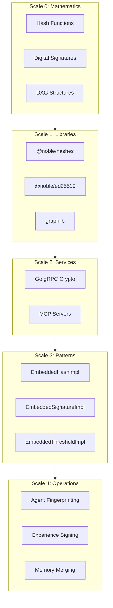
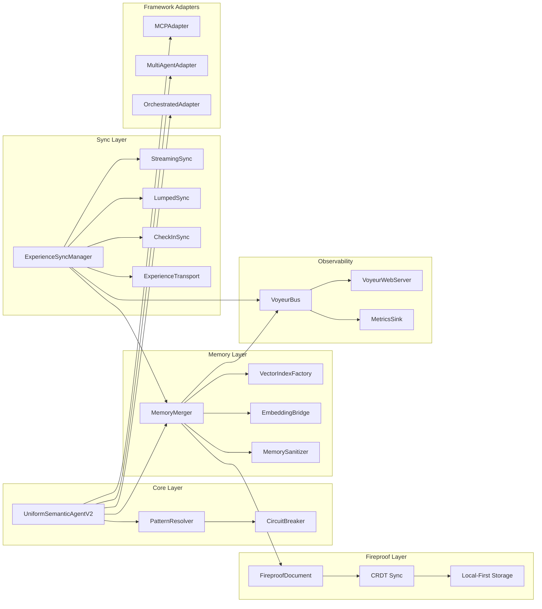
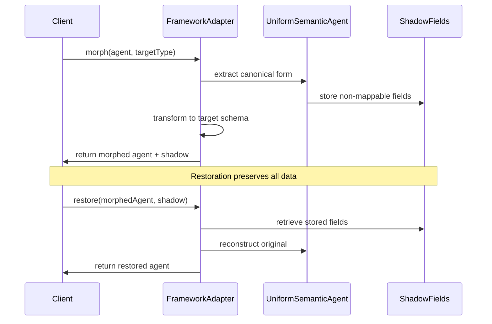
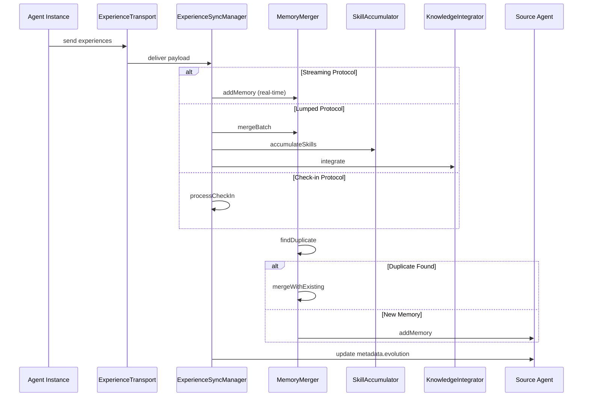
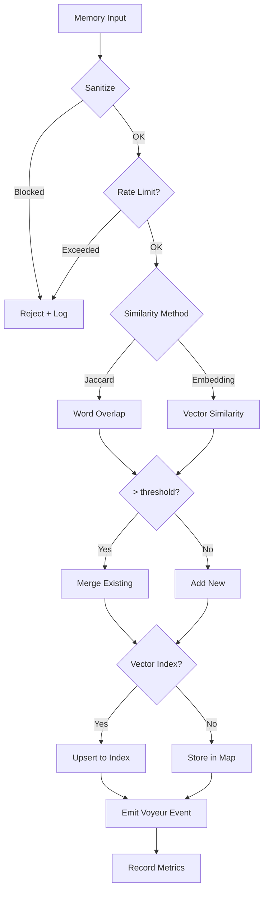
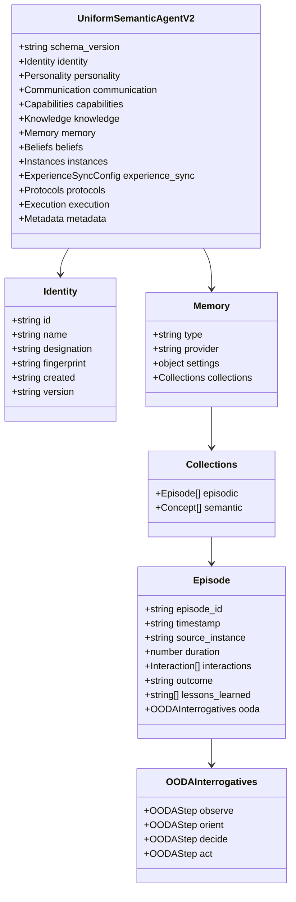
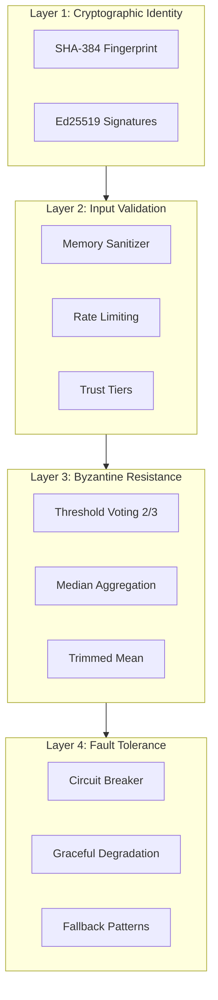
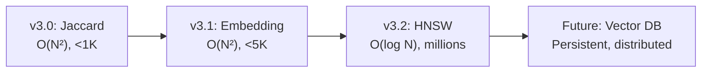

# Chrysalis Architecture Specification

**Version**: 3.1.1
**Last Updated**: January 15, 2026
**Status**: Current

---

## Table of Contents

1. [System Purpose](#system-purpose)
2. [Operating Philosophy](#operating-philosophy)
3. [Component Architecture](#component-architecture)
4. [Runtime Flow](#runtime-flow)
5. [Data Models](#data-models)
6. [API Contracts](#api-contracts)
7. [Configuration](#configuration)
8. [Security Architecture](#security-architecture)
9. [Performance Characteristics](#performance-characteristics)
10. [Deployment Models](#deployment-models)

---

## System Purpose

Chrysalis enables AI agents to operate as **independent, evolving entities** through:

- **Lossless Morphing**: Transform agents between MCP, Multi-Agent, and Orchestrated implementations without information loss
- **Distributed Memory**: Persistent episodic and semantic memory with deduplication and similarity-based merging
- **Experience Synchronization**: Continuous learning from deployed instances via streaming, lumped, or check-in protocols
- **Cryptographic Identity**: SHA-384 fingerprints and Ed25519 signatures for tamper-evident agent identity

### Design Rationale

The system applies **10 universal patterns** from distributed systems research[^1]:

1. **Hash** - Agent fingerprinting (SHA-384)
2. **Signatures** - Authentication (Ed25519)
3. **Random** - Instance placement
4. **Gossip** - Experience propagation
5. **DAG** - Evolution tracking
6. **Convergence** - Skill aggregation
7. **Redundancy** - Multi-instance deployment
8. **Threshold** - Byzantine resistance (2/3 supermajority)
9. **Time** - Causal ordering (Lamport/Vector clocks)
10. **CRDT** - Conflict-free state merge

[^1]: Patterns validated against production systems: Cassandra (gossip), Ethereum (DAG), Git (hash), TLS (signatures). See [`docs/research/universal-patterns/PATTERNS_ANCHORED.md`](https://github.com/chrysalis-ai/agents/blob/main/docs/research/universal-patterns/PATTERNS_ANCHORED.md).

---

## Operating Philosophy

### Fractal Architecture

Patterns recur at multiple scales, from mathematical primitives to application logic:



### Adaptive Resolution

The [`AdaptivePatternResolver`](https://github.com/chrysalis-ai/agents/blob/main/src/fabric/PatternResolver.ts#L300) selects implementations based on deployment context:

| Context | Resolution | Latency |
|---------|------------|---------|
| Distributed + MCP available | Go gRPC / MCP servers | ~5ms |
| Single-node | Embedded patterns | ~0.1ms |
| Performance-critical | Direct library | ~0.05ms |

---

## Component Architecture

### High-Level Component Diagram



### Component Responsibilities

| Component | Responsibility | Source |
|-----------|---------------|--------|
| **UniformSemanticAgentV2** | Agent schema, validation, type definitions | [`src/core/UniformSemanticAgentV2.ts`](https://github.com/chrysalis-ai/agents/blob/main/src/core/UniformSemanticAgentV2.ts) |
| **PatternResolver** | Adaptive pattern implementation selection | [`src/fabric/PatternResolver.ts`](https://github.com/chrysalis-ai/agents/blob/main/src/fabric/PatternResolver.ts) |
| **CircuitBreaker** | Fault tolerance for external service calls | [`src/utils/CircuitBreaker.ts`](https://github.com/chrysalis-ai/agents/blob/main/src/utils/CircuitBreaker.ts) |
| **MemoryMerger** | Memory deduplication and similarity-based merging | [`src/experience/MemoryMerger.ts`](https://github.com/chrysalis-ai/agents/blob/main/src/experience/MemoryMerger.ts) |
| **VectorIndexFactory** | Backend selection (HNSW/LanceDB/brute) | [`src/memory/VectorIndexFactory.ts`](https://github.com/chrysalis-ai/agents/blob/main/src/memory/VectorIndexFactory.ts) |
| **EmbeddingBridge** | Embedding provider abstraction | [`src/memory/EmbeddingBridge.ts`](https://github.com/chrysalis-ai/agents/blob/main/src/memory/EmbeddingBridge.ts) |
| **FireproofDocument** | Local-first CRDT document store | [`src/fireproof/`](https://github.com/chrysalis-ai/agents/blob/main/src/fireproof/) |
| **ExperienceSyncManager** | Sync protocol coordination | [`src/sync/ExperienceSyncManager.ts`](https://github.com/chrysalis-ai/agents/blob/main/src/sync/ExperienceSyncManager.ts) |
| **VoyeurBus** | Observability event bus | [`src/observability/VoyeurEvents.ts`](https://github.com/chrysalis-ai/agents/blob/main/src/observability/VoyeurEvents.ts) |

---

## Runtime Flow

### Agent Morphing Flow



### Experience Sync Flow



### Memory Merge Decision Flow



---

## Data Models

### Uniform Semantic Agent Schema



### Memory Structure

```typescript
interface Memory {
  memory_id: string;
  content: string;
  embedding?: number[];
  confidence: number;
  source_instance: string;
  created: string;
  accessed_count: number;
  last_accessed: string;
  tags: string[];
  related_memories: string[];
  importance: number;
}
```

### Experience Event

```typescript
interface ExperienceEvent {
  event_id: string;
  timestamp: string;
  source_instance: string;
  event_type: 'memory' | 'skill' | 'knowledge' | 'characteristic' | 'interaction';
  priority: number;  // 0.0 - 1.0
  data: Record<string, any>;
  context: {
    task_id?: string;
    conversation_id?: string;
    trigger: string;
    environment: Record<string, any>;
  };
}
```

---

## API Contracts

### Pattern Resolver API

```typescript
// Create resolver for deployment model
function createPatternResolver(
  deploymentModel: 'embedded' | 'distributed' | 'adaptive',
  mcpClient?: MCPPatternClient
): AdaptivePatternResolver;

// Resolve hash implementation
async resolveHash(): Promise<PatternResolution<HashImplementation>>;

// Resolve signature implementation
async resolveSignature(): Promise<PatternResolution<SignatureImplementation>>;

// Get circuit breaker statistics
getCircuitBreakerStats(): {
  hash: CircuitBreakerStats;
  signature: CircuitBreakerStats;
};
```

### Memory Merger API

```typescript
// Initialize merger (required for embedding mode)
async initialize(): Promise<void>;

// Add single memory
async addMemory(
  agent: UniformSemanticAgentV2,
  memoryData: any,
  sourceInstance: string
): Promise<void>;

// Merge batch of memories
async mergeBatch(
  agent: UniformSemanticAgentV2,
  memories: any[],
  sourceInstance: string
): Promise<MemoryMergeResult>;
```

### Experience Sync API

```typescript
// Initialize sync for instance
async initializeSync(
  instanceId: string,
  protocol: SyncProtocol,
  config: ExperienceSyncConfig,
  sourceAgent?: UniformSemanticAgentV2,
  syncEndpoint?: string
): Promise<void>;

// Stream single event (real-time)
async streamEvent(instanceId: string, event: ExperienceEvent): Promise<void>;

// Send batch (lumped sync)
async sendBatch(instanceId: string, batch: ExperienceBatch): Promise<{ batch_id: string; processed: boolean }>;

// Handle check-in
async checkIn(instanceId: string, state: any): Promise<MergeResult>;
```

---

## Configuration

### Environment Variables

| Variable | Purpose | Default | Required |
|----------|---------|---------|----------|
| `VOYAGE_API_KEY` | Voyage AI embeddings | - | For production |
| `OPENAI_API_KEY` | OpenAI embeddings (fallback) | - | For production |
| `ANTHROPIC_API_KEY` | Claude semantic decomposition | - | For LLM analysis |
| `VECTOR_INDEX_TYPE` | Index backend | `brute` | No |
| `VECTOR_INDEX_COLLECTION` | Collection name | `memories` | No |
| `METRICS_PROMETHEUS` | Enable Prometheus | `false` | No |
| `METRICS_PROM_PORT` | Prometheus port | `9464` | No |
| `METRICS_OTEL` | Enable OpenTelemetry | `false` | No |

### Memory Merger Configuration

```typescript
interface MemoryMergerConfig {
  similarity_method: 'jaccard' | 'embedding';  // Default: 'jaccard'
  similarity_threshold: number;                 // Default: 0.9
  embedding_service?: EmbeddingService;
  use_vector_index: boolean;                    // Default: false
  vector_index_type?: 'hnsw' | 'lance' | 'brute';
  voyeur?: VoyeurSink;
  slow_mode_ms?: number;                        // For debugging
  sanitize?: (content: string, source: string) => SanitizeResult;
  rate_limit?: { windowMs: number; max: number };
}
```

### Experience Sync Configuration

```typescript
interface ExperienceSyncConfig {
  enabled: boolean;
  default_protocol: SyncProtocol;
  transport?: ExperienceTransportConfig;

  streaming?: {
    enabled: boolean;
    interval_ms: number;
    batch_size: number;
    priority_threshold: number;
  };

  lumped?: {
    enabled: boolean;
    batch_interval: string;  // e.g., "1h", "6h"
    max_batch_size: number;
    compression: boolean;
  };

  check_in?: {
    enabled: boolean;
    schedule: string;  // cron expression
    include_full_state: boolean;
  };

  merge_strategy: {
    conflict_resolution: 'latest_wins' | 'weighted_merge' | 'manual_review';
    memory_deduplication: boolean;
    skill_aggregation: 'max' | 'average' | 'weighted';
    knowledge_verification_threshold: number;
  };
}
```

---

## Security Architecture

### Multi-Layer Defense



### Threat Model

| Threat | Defense | Implementation |
|--------|---------|----------------|
| Agent impersonation | Cryptographic fingerprint | [`generateAgentFingerprint()`](https://github.com/chrysalis-ai/agents/blob/main/src/core/patterns/Hashing.ts) |
| Malicious instances | Byzantine threshold (2/3) | [`hasSupermajority()`](https://github.com/chrysalis-ai/agents/blob/main/src/core/patterns/ByzantineResistance.ts) |
| Memory poisoning | Sanitizer + rate limits | [`MemorySanitizer`](https://github.com/chrysalis-ai/agents/blob/main/src/experience/MemorySanitizer.ts) |
| Service unavailability | Circuit breaker | [`CircuitBreaker`](https://github.com/chrysalis-ai/agents/blob/main/src/utils/CircuitBreaker.ts) |
| Timing attacks | Logical clocks | [`LamportClock`](https://github.com/chrysalis-ai/agents/blob/main/src/core/patterns/LogicalTime.ts) |

### Trust Tiers

The memory sanitizer implements trust tiers for ingest control:

1. **Trusted**: Internal instances, no filtering
2. **Verified**: Known external sources, basic filtering
3. **Untrusted**: Unknown sources, strict filtering + rate limits

---

## Performance Characteristics

### Complexity Analysis

| Operation | Complexity | Latency | Scale Limit |
|-----------|-----------|---------|-------------|
| Hash (embedded) | O(N) | ~0.1ms | Any |
| Hash (Go gRPC) | O(N) | ~5ms | Any |
| Memory search (Jaccard) | O(N²) | ~10ms | <1K memories |
| Memory search (embedding) | O(N²) | ~50ms | <5K memories |
| Memory search (HNSW) | O(log N) | ~5ms | Millions |
| Experience sync (RPC) | O(N) | ~100ms | <100 instances |

### Memory Evolution Path



---

## Deployment Models

### Model A: Embedded (Monolithic)

```
Single Process:
  ├── Agent
  ├── Embedded Patterns
  └── Direct Library Imports
```

**Use when**: CLI tools, edge deployment, single-user applications
**Latency**: ~0.1ms
**Complexity**: Low

### Model B: Distributed (Microservices)

```
Multiple Processes:
  ├── Agent Process
  ├── Go Crypto gRPC Server
  └── MCP Servers
```

**Use when**: Multi-region, shared infrastructure, high availability
**Latency**: ~5ms
**Complexity**: Medium

### Model C: Adaptive (Hybrid)

```
Agent:
  └── PatternResolver
      ├── Prefer Go gRPC when distributed & available
      ├── Else MCP servers
      └── Else Embedded patterns
```

**Use when**: Gradual migration, uncertain deployment
**Latency**: Adaptive
**Complexity**: Medium-High

### Decision Matrix

| Factor | Embedded | Distributed | Adaptive |
|--------|----------|-------------|----------|
| Latency requirement | <1ms | <10ms | Variable |
| Deployment complexity | Low | High | Medium |
| Shared infrastructure | No | Yes | Optional |
| Fault tolerance | Process-level | Service-level | Both |
| Recommended for | CLI, edge | Production | Migration |

---

## References

### External Standards

- **Ed25519**: [RFC 8032](https://tools.ietf.org/html/rfc8032) - Edwards-Curve Digital Signature Algorithm
- **SHA-384**: [FIPS 180-4](https://csrc.nist.gov/publications/detail/fips/180/4/final) - Secure Hash Standard
- **HNSW**: Malkov & Yashunin (2018) - Efficient and robust approximate nearest neighbor search
- **SSE**: [HTML Living Standard](https://html.spec.whatwg.org/multipage/server-sent-events.html) - Server-Sent Events

### Internal Documentation

- [Implementation Status](docs/STATUS.md)
- [Universal Patterns Research](docs/research/universal-patterns/PATTERNS_ANCHORED.md)
- [Security Analysis](docs/research/deep-research/SECURITY_ATTACKS.md)
- [Memory System](memory_system/README.md)

---

**Document Owner**: Chrysalis Team
**Review Cadence**: Monthly or on major releases
