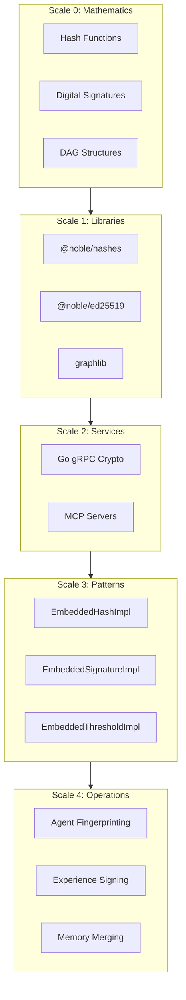
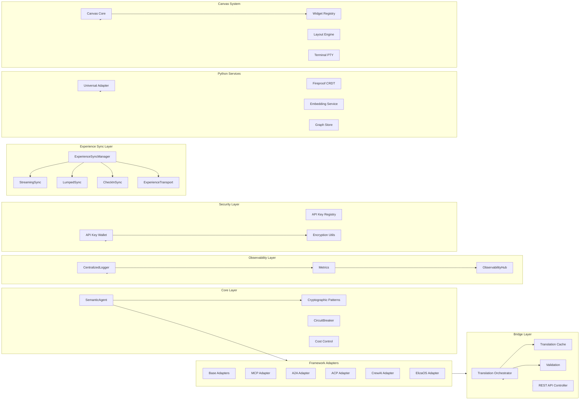
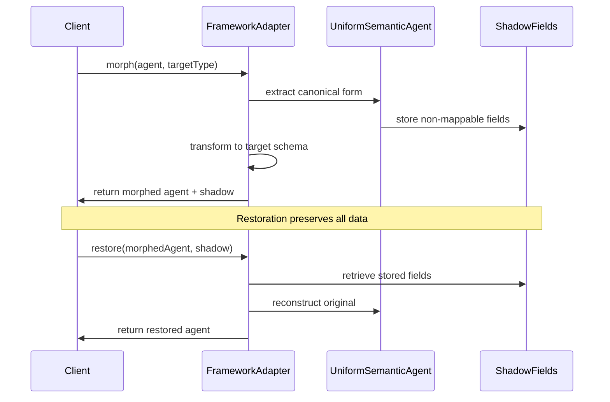
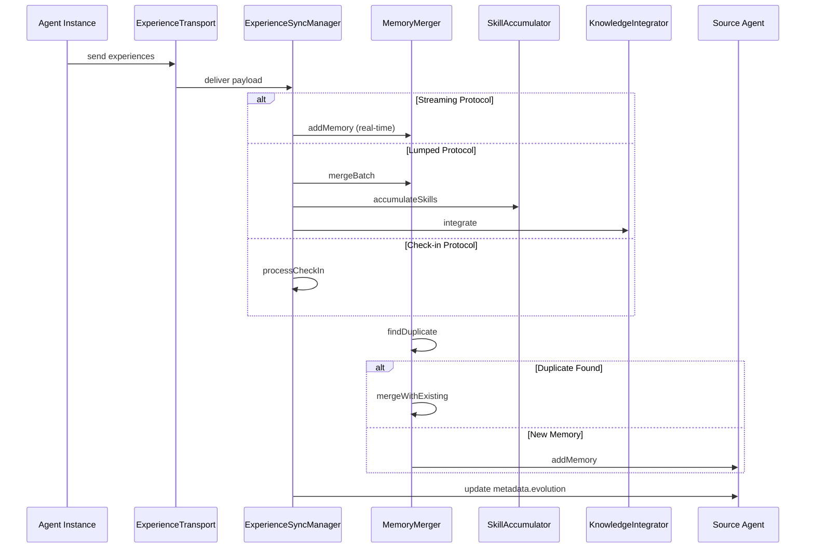
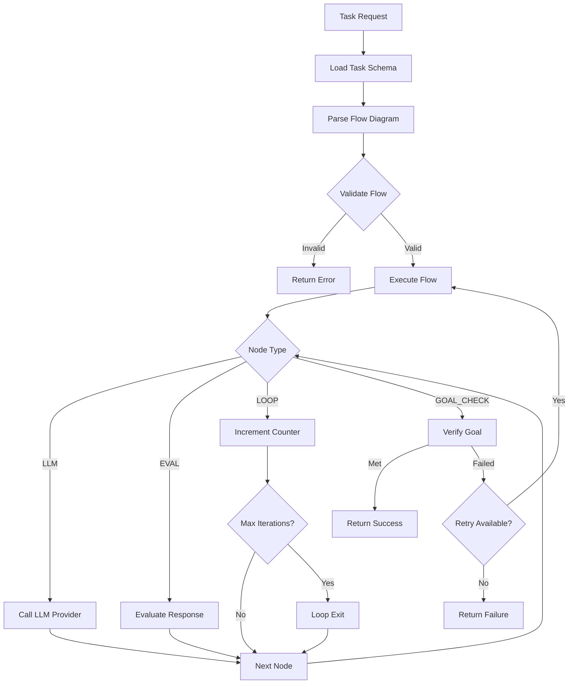
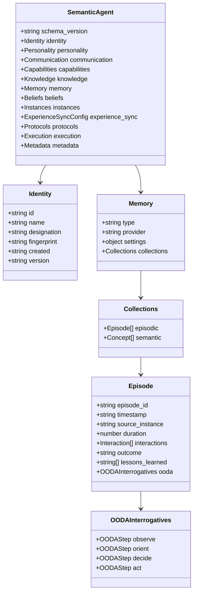
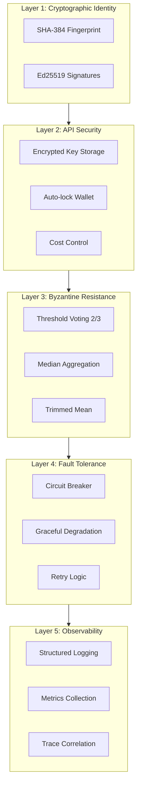

# Chrysalis Architecture Specification

**Version**: 3.2.0
**Last Updated**: January 17, 2026
**Status**: Current (Verified against source code)

---

## Table of Contents

1. [System Purpose](#system-purpose)
2. [Operating Philosophy](#operating-philosophy)
3. [Component Architecture](#component-architecture)
4. [Runtime Flow](#runtime-flow)
5. [Data Models](#data-models)
6. [API Contracts](#api-contracts)
7. [Configuration](#configuration)
8. [Security Architecture](#security-architecture)
9. [Performance Characteristics](#performance-characteristics)
10. [Deployment Models](#deployment-models)

---

## System Purpose

Chrysalis enables AI agents to operate as **independent, evolving entities** through:

- **Lossless Morphing**: Transform agents between MCP, Multi-Agent, and Orchestrated implementations without information loss
- **Distributed Memory**: Persistent episodic and semantic memory with deduplication and similarity-based merging
- **Experience Synchronization**: Continuous learning from deployed instances via streaming, lumped, or check-in protocols
- **Cryptographic Identity**: SHA-384 fingerprints and Ed25519 signatures for tamper-evident agent identity

### Design Rationale

The system applies **10 universal patterns** from distributed systems research[^1]:

1. **Hash** - Agent fingerprinting (SHA-384)
2. **Signatures** - Authentication (Ed25519)
3. **Random** - Instance placement
4. **Gossip** - Experience propagation
5. **DAG** - Evolution tracking
6. **Convergence** - Skill aggregation
7. **Redundancy** - Multi-instance deployment
8. **Threshold** - Byzantine resistance (2/3 supermajority)
9. **Time** - Causal ordering (Lamport/Vector clocks)
10. **CRDT** - Conflict-free state merge

[^1]: Patterns validated against production systems: Cassandra (gossip), Ethereum (DAG), Git (hash), TLS (signatures). See [`docs/research/universal-patterns/PATTERNS_ANCHORED.md`](https://github.com/chrysalis-ai/agents/blob/main/docs/research/universal-patterns/PATTERNS_ANCHORED.md).

---

## Operating Philosophy

### Fractal Architecture

Patterns recur at multiple scales, from mathematical primitives to application logic:



### Adaptive Resolution

The pattern resolver (located in `src/core/patterns/`) selects implementations based on deployment context:

| Context | Resolution | Latency |
|---------|------------|---------|
| Distributed + MCP available | Go gRPC / MCP servers | ~5ms |
| Single-node | Embedded patterns | ~0.1ms |
| Performance-critical | Direct library | ~0.05ms |

---

## Component Architecture

### High-Level Component Diagram



### Component Responsibilities

| Component | Responsibility | Source |
|-----------|---------------|--------|
| **SemanticAgent** | Enhanced agent schema with experience sync, instances, protocols | [`src/core/SemanticAgent.ts`](src/core/SemanticAgent.ts) |
| **Cryptographic Patterns** | Hash, signatures, DAG, CRDT, gossip, Byzantine resistance | [`src/core/patterns/`](src/core/patterns/) |
| **CircuitBreaker** | Fault tolerance for external service calls | [`src/utils/CircuitBreaker.ts`](src/utils/CircuitBreaker.ts) |
| **CostControl** | Token counting, budget limits, rate limiting | [`src/utils/CostControl.ts`](src/utils/CostControl.ts) |
| **Framework Adapters** | Protocol translation (MCP, A2A, ACP, CrewAI, ElizaOS) | [`src/adapters/`](src/adapters/) |
| **Translation Orchestrator** | Agent morphing with shadow data and caching | [`src/bridge/orchestrator.ts`](src/bridge/orchestrator.ts) |
| **Bridge REST API** | HTTP API for agent translation | [`src/api/bridge/controller.ts`](src/api/bridge/controller.ts) |
| **ExperienceSyncManager** | Sync protocol coordination (streaming, lumped, check-in) | [`src/sync/ExperienceSyncManager.ts`](src/sync/ExperienceSyncManager.ts) |
| **CentralizedLogger** | Structured logging with configurable sinks | [`src/observability/CentralizedLogger.ts`](src/observability/CentralizedLogger.ts) |
| **Metrics** | Application metrics collection and export | [`src/observability/Metrics.ts`](src/observability/Metrics.ts) |
| **ObservabilityHub** | Unified logging, tracing, and metrics coordination | [`src/observability/ObservabilityHub.ts`](src/observability/ObservabilityHub.ts) |
| **API Key Wallet** | Encrypted API key storage with auto-lock | [`src/security/ApiKeyWallet.ts`](src/security/ApiKeyWallet.ts) |
| **Universal Adapter** | JSON-driven LLM task orchestration | [`src/universal_adapter/core.py`](src/universal_adapter/core.py) |
| **Fireproof** | Local-first CRDT document store (Python) | [`memory_system/fireproof/`](memory_system/fireproof/) |
| **Canvas System** | Multi-canvas workspace with widget system | [`src/canvas/`](src/canvas/) |
| **Terminal PTY Server** | WebSocket PTY backend | [`src/services/terminal/TerminalPTYServer.ts`](src/services/terminal/TerminalPTYServer.ts) |

---

## Runtime Flow

### Agent Morphing Flow



### Experience Sync Flow



### Universal Adapter Task Execution Flow



---

## Data Models

### Semantic Agent Schema



### Memory Structure

```typescript
interface Memory {
  memory_id: string;
  content: string;
  embedding?: number[];
  confidence: number;
  source_instance: string;
  created: string;
  accessed_count: number;
  last_accessed: string;
  tags: string[];
  related_memories: string[];
  importance: number;
}
```

### Experience Event

```typescript
interface ExperienceEvent {
  event_id: string;
  timestamp: string;
  source_instance: string;
  event_type: 'memory' | 'skill' | 'knowledge' | 'characteristic' | 'interaction';
  priority: number;  // 0.0 - 1.0
  data: Record<string, any>;
  context: {
    task_id?: string;
    conversation_id?: string;
    trigger: string;
    environment: Record<string, any>;
  };
}
```

---

## API Contracts

### Bridge REST API

```typescript
// Agent Translation
POST /api/v1/bridge/translate
Body: { agent: UniformSemanticAgent, targetFramework: string }
Response: { agent: FrameworkAgent, shadow: ShadowFields }

// Batch Translation
POST /api/v1/bridge/translate/batch
Body: { agents: UniformSemanticAgent[], targetFramework: string }
Response: { results: TranslationResult[] }

// Ingest to Canonical
POST /api/v1/bridge/ingest
Body: { agent: FrameworkAgent, sourceFramework: string }
Response: { agent: UniformSemanticAgent }

// Health Check
GET /api/v1/bridge/health
Response: { status: string, adapters: string[] }

// Statistics
GET /api/v1/bridge/stats
Response: { translations: number, cache_hits: number, frameworks: Record<string, number> }
```

### Experience Sync API

```typescript
// Initialize sync for instance
async initializeSync(
  instanceId: string,
  protocol: SyncProtocol,
  config: ExperienceSyncConfig,
  sourceAgent?: SemanticAgent,
  syncEndpoint?: string
): Promise<void>;

// Stream single event (real-time)
async streamEvent(instanceId: string, event: ExperienceEvent): Promise<void>;

// Send batch (lumped sync)
async sendBatch(instanceId: string, batch: ExperienceBatch): Promise<{ batch_id: string; processed: boolean }>;

// Handle check-in
async checkIn(instanceId: string, state: any): Promise<MergeResult>;
```

### Universal Adapter API (Python)

```python
# Execute task by name
adapter.execute_task(
    task_name: str,
    context: dict[str, Any]
) -> TaskResult

# Execute task from file
adapter.execute(
    task_path: str,
    context: dict[str, Any]
) -> TaskResult

# Run task with custom LLM config
adapter.run_task(
    task_name: str,
    llm_provider: str,
    model: str,
    context: dict[str, Any]
) -> TaskResult
```

---

## Configuration

### Environment Variables

| Variable | Purpose | Default | Required |
|----------|---------|---------|----------|
| `VOYAGE_API_KEY` | Voyage AI embeddings | - | For production |
| `OPENAI_API_KEY` | OpenAI embeddings (fallback) | - | For production |
| `ANTHROPIC_API_KEY` | Claude semantic decomposition | - | For LLM analysis |
| `VECTOR_INDEX_TYPE` | Index backend | `brute` | No |
| `VECTOR_INDEX_COLLECTION` | Collection name | `memories` | No |
| `LOG_LEVEL` | Logging verbosity (debug, info, warn, error) | `info` | No |
| `METRICS_PROMETHEUS` | Enable Prometheus | `false` | No |
| `METRICS_PROM_PORT` | Prometheus port | `9464` | No |
| `METRICS_OTEL` | Enable OpenTelemetry | `false` | No |

### Experience Sync Configuration

```typescript
interface ExperienceSyncConfig {
  enabled: boolean;
  default_protocol: SyncProtocol;
  transport?: ExperienceTransportConfig;

  streaming?: {
    enabled: boolean;
    interval_ms: number;
    batch_size: number;
    priority_threshold: number;
  };

  lumped?: {
    enabled: boolean;
    batch_interval: string;  // e.g., "1h", "6h"
    max_batch_size: number;
    compression: boolean;
  };

  check_in?: {
    enabled: boolean;
    schedule: string;  // cron expression
    include_full_state: boolean;
  };

  merge_strategy: {
    conflict_resolution: 'latest_wins' | 'weighted_merge' | 'manual_review';
    memory_deduplication: boolean;
    skill_aggregation: 'max' | 'average' | 'weighted';
    knowledge_verification_threshold: number;
  };
}
```

---

## Security Architecture

### Multi-Layer Defense



### Threat Model

| Threat | Defense | Implementation |
|--------|---------|----------------|
| Agent impersonation | Cryptographic fingerprint | [`src/core/patterns/Hashing.ts`](src/core/patterns/Hashing.ts) |
| Malicious instances | Byzantine threshold (2/3) | [`src/core/patterns/ByzantineResistance.ts`](src/core/patterns/ByzantineResistance.ts) |
| API key exposure | Encrypted wallet with AES-256-GCM | [`src/security/ApiKeyWallet.ts`](src/security/ApiKeyWallet.ts) |
| Cost overruns | Budget limits + rate limiting | [`src/utils/CostControl.ts`](src/utils/CostControl.ts) |
| Service unavailability | Circuit breaker with backoff | [`src/utils/CircuitBreaker.ts`](src/utils/CircuitBreaker.ts) |
| Timing attacks | Logical clocks (Lamport, Vector) | [`src/core/patterns/LogicalTime.ts`](src/core/patterns/LogicalTime.ts) |

### API Key Security

The API Key Wallet implements defense-in-depth:

1. **Encryption at Rest**: AES-256-GCM encryption
2. **Password Protection**: Master password required
3. **Auto-lock**: Configurable timeout (default 30 minutes)
4. **In-memory Cache**: Keys cached for 5 minutes after unlock
5. **Key Rotation**: Support for rotating compromised keys

---

## Performance Characteristics

### Complexity Analysis

| Operation | Complexity | Latency | Scale Limit |
|-----------|-----------|---------|-------------|
| Hash (SHA-384) | O(N) | ~0.1ms | Any |
| Signature (Ed25519) | O(1) | ~0.5ms | Any |
| Agent translation | O(N) | ~10-50ms | Any |
| Bridge API (cached) | O(1) | ~1ms | Any |
| Bridge API (uncached) | O(N) | ~50ms | Any |
| Experience sync (streaming) | O(1) per event | ~100ms | <1000 instances |
| Experience sync (lumped) | O(N) batch | ~500ms | <100 instances |
| Cost tracking | O(1) | <1ms | Any |

### Performance Optimization Strategies

1. **Translation Caching**: LRU cache for agent translations
2. **Connection Pooling**: HTTP client reuses connections
3. **Circuit Breaker**: Fast-fail on unavailable services
4. **Retry with Backoff**: Exponential backoff for transient failures
5. **Cost-aware Routing**: Select cheaper models when possible

---

## Deployment Models

### Model A: Embedded (Monolithic)

```
Single Process:
  ├── Agent
  ├── Embedded Patterns
  └── Direct Library Imports
```

**Use when**: CLI tools, edge deployment, single-user applications
**Latency**: ~0.1ms
**Complexity**: Low

### Model B: Distributed (Microservices)

```
Multiple Processes:
  ├── Agent Process
  ├── Go Crypto gRPC Server
  └── MCP Servers
```

**Use when**: Multi-region, shared infrastructure, high availability
**Latency**: ~5ms
**Complexity**: Medium

### Model C: Adaptive (Hybrid)

```
Agent:
  └── PatternResolver
      ├── Prefer Go gRPC when distributed & available
      ├── Else MCP servers
      └── Else Embedded patterns
```

**Use when**: Gradual migration, uncertain deployment
**Latency**: Adaptive
**Complexity**: Medium-High

### Decision Matrix

| Factor | Embedded | Distributed | Adaptive |
|--------|----------|-------------|----------|
| Latency requirement | <1ms | <10ms | Variable |
| Deployment complexity | Low | High | Medium |
| Shared infrastructure | No | Yes | Optional |
| Fault tolerance | Process-level | Service-level | Both |
| Recommended for | CLI, edge | Production | Migration |

---

## References

### External Standards

- **Ed25519**: [RFC 8032](https://tools.ietf.org/html/rfc8032) - Edwards-Curve Digital Signature Algorithm
- **SHA-384**: [FIPS 180-4](https://csrc.nist.gov/publications/detail/fips/180/4/final) - Secure Hash Standard
- **HNSW**: Malkov & Yashunin (2018) - Efficient and robust approximate nearest neighbor search
- **SSE**: [HTML Living Standard](https://html.spec.whatwg.org/multipage/server-sent-events.html) - Server-Sent Events

### Internal Documentation

- [Implementation Status](docs/STATUS.md) - Authoritative implementation status
- [Documentation Index](docs/README.md) - Navigation hub with role-based entry points
- [Glossary](docs/GLOSSARY.md) - Terminology reference addressing common confusions
- [Universal Patterns Research](docs/research/universal-patterns/PATTERNS_ANCHORED.md) - Pattern foundation
- [Security Analysis](docs/research/deep-research/SECURITY_ATTACKS.md) - Security research
- [Memory System](memory_system/README.md) - Python package documentation
- [Universal Adapter](src/universal_adapter/README.md) - Task orchestration system
- [Observability](src/observability/README.md) - Logging, metrics, and tracing

---

## Architectural Evolution Notes

### Removed Components (2026-01-15/16)

The following components were removed from the codebase and are documented here for historical context:

1. **Voyeur Observability System** - Replaced with standard centralized logging ([`CentralizedLogger.ts`](src/observability/CentralizedLogger.ts)), metrics ([`Metrics.ts`](src/observability/Metrics.ts)), and unified observability hub ([`ObservabilityHub.ts`](src/observability/ObservabilityHub.ts))
   - **Reason**: Entity sovereignty violation - event bus created tight coupling across system boundaries
   - **Migration**: Standard structured logging with configurable sinks, Prometheus/OpenTelemetry metrics export

2. **TypeScript Memory System** (`src/memory/`) - Memory implementation consolidated in Python
   - **Reason**: Python offers superior vector database integrations and semantic processing libraries
   - **Current**: Python memory system at [`memory_system/`](memory_system/) with Fireproof CRDT

3. **Terminal UI (TUI)** (`src/tui/`) - Ink-based terminal interface
   - **Reason**: Canvas system provides richer interaction model
   - **Current**: Web-based canvas system at [`src/canvas/`](src/canvas/) with Terminal PTY integration

---

**Document Owner**: Chrysalis Team
**Review Cadence**: Monthly or on major releases
**Last Major Revision**: January 17, 2026 - Removed Voyeur references, verified against source code, documented architectural evolution
