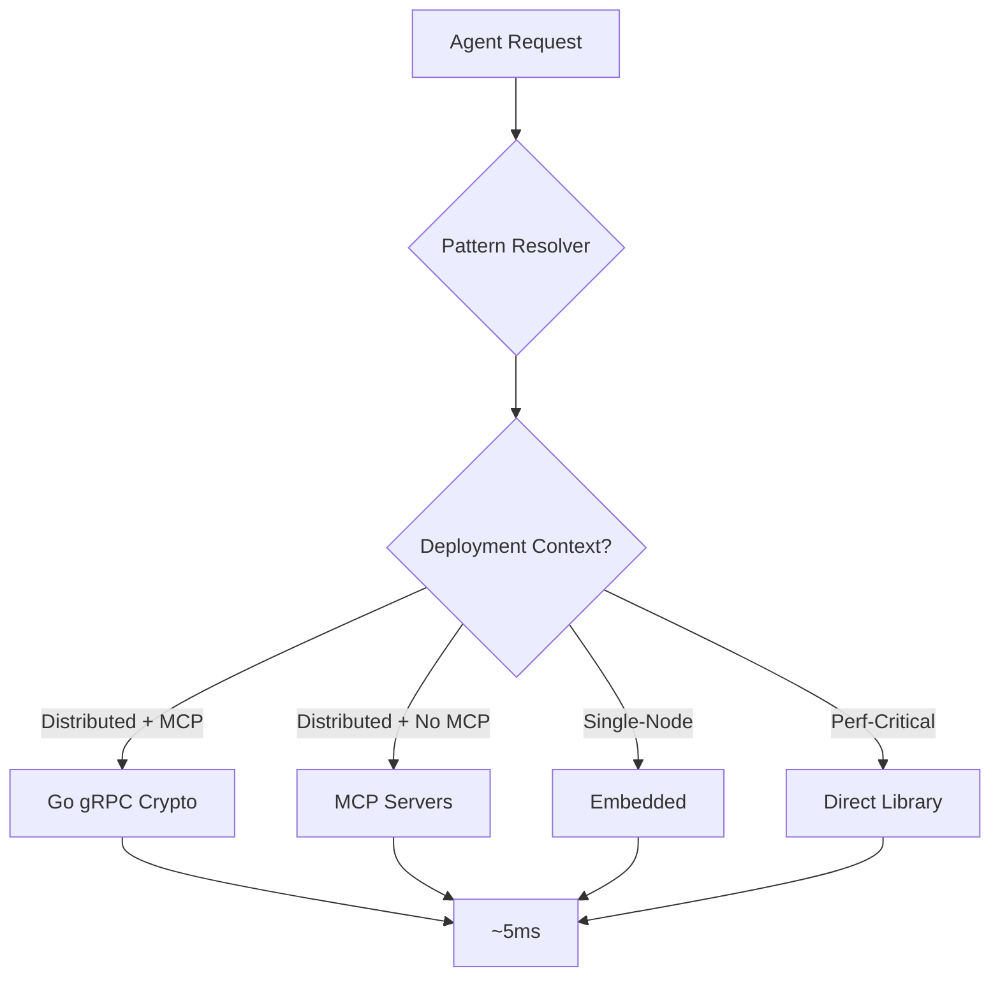
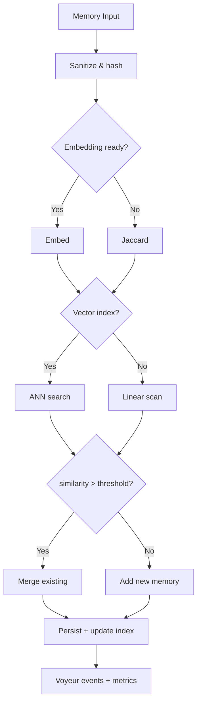
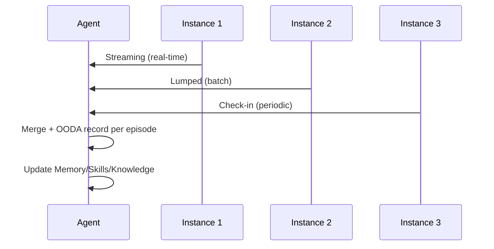
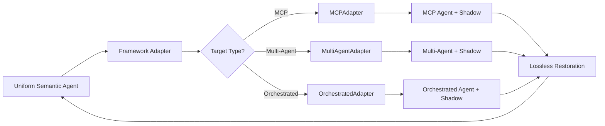
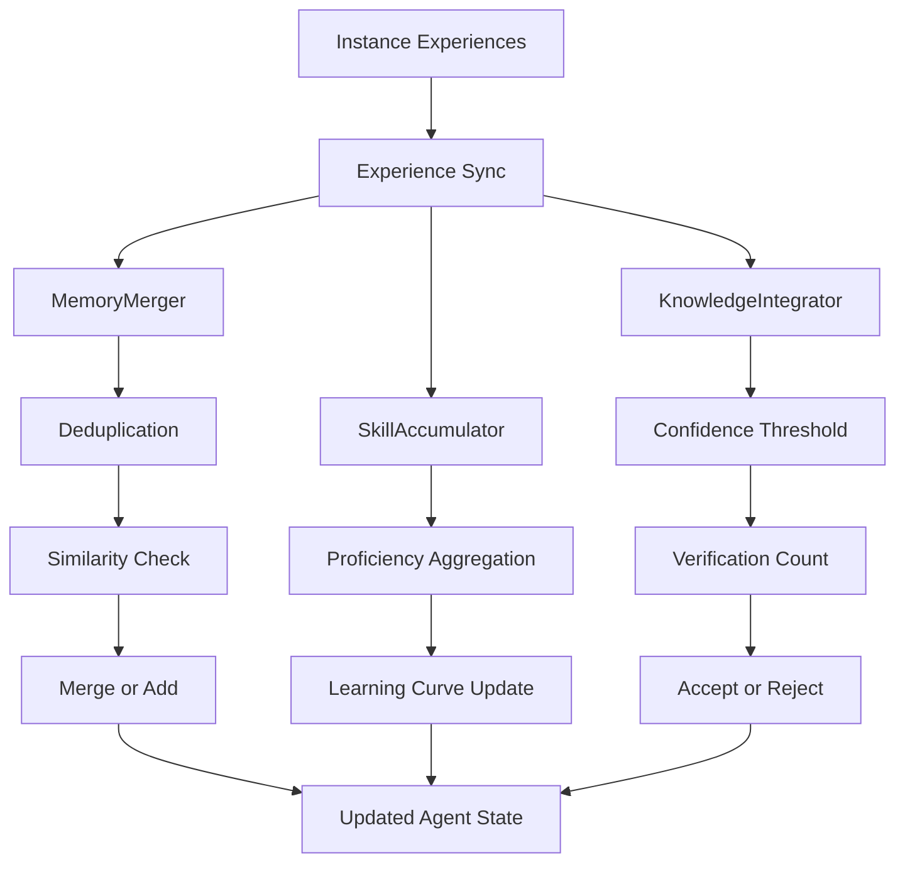
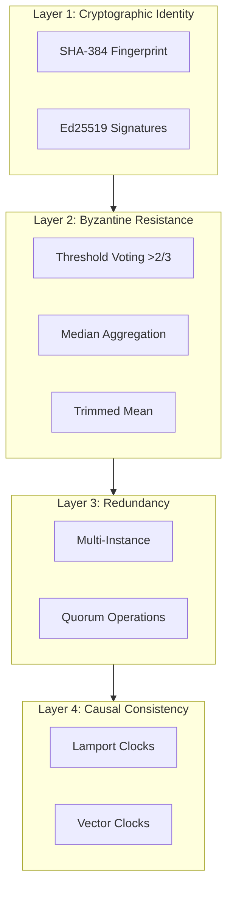

# Chrysalis Architecture Overview

**Version**: 3.1.0  
**Status**: Current  
**Last Updated**: December 28, 2025

---

## Table of Contents

1. [System Overview](#system-overview)
2. [Fractal Architecture](#fractal-architecture)
3. [Core Components](#core-components)
4. [Data Flow](#data-flow)
5. [Deployment Models](#deployment-models)
6. [Security Architecture](#security-architecture)

---

## System Overview

Chrysalis is a **Uniform Semantic Agent transformation system** that enables AI agents to:
- Morph between different implementation types
- Maintain persistent, distributed memory
- Evolve through synchronized experiences
- Preserve cryptographic identity across transformations

### Design Philosophy

**Evidence-Based**: All design decisions rooted in distributed systems research  
**Fractal Composition**: Patterns recur at multiple architectural scales  
**Adaptive Integration**: Context-aware selection of implementation strategies  
**Byzantine Resistant**: Tolerates <1/3 malicious or faulty nodes

---

## Fractal Architecture

### The Five Scales

```mermaid
flowchart LR
    subgraph Scale0[Math]
      Z0[Patterns: hash, signature, gossip, DAG, time, CRDT]
    end
    subgraph Scale1[Libs]
      Z1[@noble/hashes, @noble/ed25519, graphlib]
    end
    subgraph Scale2[MCP Fabric]
      Z2[Go gRPC crypto]
      Z2a[MCP servers (crypto, structures)]
    end
    subgraph Scale3[Embedded]
      Z3[TS patterns]
    end
    subgraph Scale4[Agent Ops]
      Z4[Agent morphing, sync, memory]
    end
    Z0 --> Z1 --> Z2 --> Z3 --> Z4
    Z4 -. observability .-> Z5[Voyeur SSE/metrics]
  ```
  
  **References**: HNSW (Malkov & Yashunin 2018) for ANN; Prometheus/OTel for metrics; SSE spec for voyeur stream; Ed25519 (RFC 8032) for signatures.

**Scale 0: Mathematics**  
Universal patterns with proven properties (hash functions, digital signatures, DAGs, gossip, etc.)

**Scale 1: Validated Libraries**  
Audited implementations (@noble/hashes, @noble/curves, graphlib)

**Scale 2: MCP Fabric**  
Network-accessible services exposing primitives via MCP protocol

**Scale 3: Embedded Patterns**  
Agent-specific implementations wrapping libraries with domain logic

**Scale 4: Agent Operations**  
Application-level operations using patterns (fingerprinting, signing, syncing)

---

## Core Components

### 1. Uniform Semantic Agent Schema

```mermaid
classDiagram
    class UniformSemanticAgentV2 {
        +identity: CryptoIdentity
        +memory: MemorySystem
        +capabilities: Capabilities
        +experiences: Experience[]
        +instances: InstanceMetadata[]
    }
    
    class CryptoIdentity {
        +fingerprint: string
        +publicKey: Uint8Array
        +signatureAlgorithm: string
    }
    
    class MemorySystem {
        +episodic: Episode[]
        +semantic: Concept[]
        +type: "vector" | "graph" | "hybrid"
    }
    
    UniformSemanticAgentV2 --> CryptoIdentity
    UniformSemanticAgentV2 --> MemorySystem
```

**Key Features**:
- SHA-384 fingerprint for tamper-evident identity
- Ed25519 signatures for authentication
- Dual-coded memory (episodic + semantic)
- Experience accumulation from instances
- Evolution tracking via DAG

### 2. Pattern Resolver (Adaptive)



**Decision Factors**:
- distributed & mcp_available → Go gRPC crypto + MCP structures
- prefer_reusability, not perf-critical → Go/MCP
- perf-critical → embedded/local
- fallback → direct library

### 3. Memory System



**Evolution Path**:
- **v3.0**: Jaccard similarity (lexical), O(N²), <1000 memories
- **v3.1**: Embedding similarity (semantic), O(N²), <5000 memories
- **v3.2**: Vector indexing (HNSW), O(log N), millions of memories

### 4. Experience Sync + OODA Capture



**Protocols**: streaming, lumped, check-in. OODA interrogatives stored on episodes for audit and learning.

---

## Data Flow

### Agent Morphing Flow



**Key Property**: **Lossless** - No information lost in transformation

**Shadow Fields**: Encrypted metadata enables perfect restoration

### Experience Accumulation



---

## Deployment Models

### Model A: Embedded (Monolithic)
```
Single Process:
  ├── Agent
  ├── Embedded Patterns
  └── Direct Library Imports
```
Use: CLI, edge, single-user | Latency: ~0.1ms | Complexity: Low

### Model B: Go gRPC + MCP (Distributed)
```
Multiple Processes:
  ├── Agent Process
  ├── Go Crypto gRPC (hash/verify/merkle/Ed25519/BLS/random)
  └── Distributed-Structures MCP
```
Use: Multi-region/shared infra | Latency: ~5ms | Complexity: Medium

### Model C: Adaptive (Hybrid)
```
Agent:
  └── Pattern Resolver
      ├── Prefer Go gRPC when distributed & available
      ├── Else MCP
      └── Else Embedded
```
Use: Gradual migration | Latency: adaptive | Complexity: Medium-High

---

## Security Architecture

### Multi-Layer Defense



**Defends Against**:
- Impersonation (cryptographic identity)
- Malicious instances (<1/3 Byzantine tolerance)
- Single point of failure (redundancy)
- Timing attacks (logical time)

---

## Performance Characteristics

| Operation | Complexity | Latency | Scale |
|-----------|-----------|---------|-------|
| **Hash (embedded)** | O(N) | ~0.1ms | Any |
| **Hash (MCP)** | O(N) | ~5ms | Any |
| **Memory search (Jaccard)** | O(N²) | ~10ms | <1K |
| **Memory search (embedding)** | O(N²) | ~50ms | <5K |
| **Memory search (HNSW)** | O(log N) | ~5ms | Millions |
| **Experience sync (RPC)** | O(N) | ~100ms | <100 instances |
| **Experience sync (gossip)** | O(log N) | ~500ms | Thousands |

---

## Technology Stack

**Language**: TypeScript 5.0+  
**Runtime**: Node.js 18+

**Cryptography**:
- @noble/hashes (hash functions)
- @noble/ed25519 (signatures)
- @noble/curves (BLS)

**Distributed Systems**:
- graphlib (DAG operations)
- simple-statistics (aggregation)

**Future**:
- @xenova/transformers (embeddings)
- hnswlib-node (vector indexing)
- @automerge/automerge (CRDTs)

---

## Related Documentation

- **[Complete Specification](docs/current/UNIFIED_SPEC_V3.1.md)** - Comprehensive technical spec
- **[Implementation Guide](docs/current/IMPLEMENTATION_GUIDE.md)** - How to implement
- **[Research Foundation](docs/research/)** - Deep research and patterns
- **[API Reference](docs/current/API_REFERENCE.md)** - API documentation

---

**Version**: 3.1.0 | **Last Updated**: December 28, 2025

🦋 **Rigorous architecture through evidence-based design** 🦋
