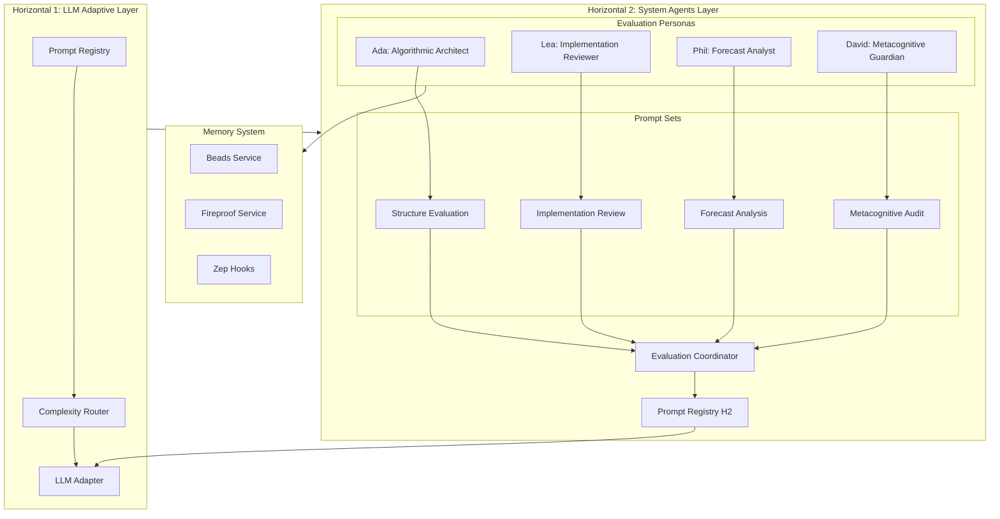
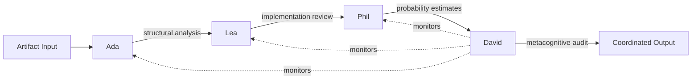
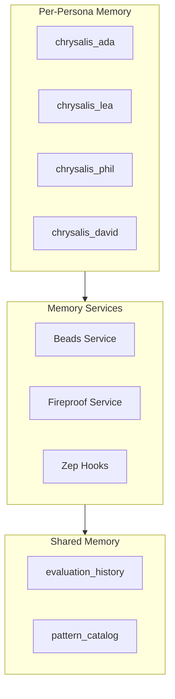

# System Agents Layer (Horizontal 2)

The System Agents Layer provides metacognitive evaluation capabilities through four specialized personas that assess and improve outputs from the LLM Adaptive Layer (Horizontal 1).

## Architecture Overview



## Persona Dependency Flow



## Personas

### Ada (Algorithmic Architect)
- **Role**: Evaluates structural elegance, composability, and pattern usage
- **Model Tier**: Hybrid (local + cloud)
- **Key Prompts**: STRUCTURE_EVALUATION_PROMPT, PATTERN_RECOGNITION_PROMPT
- **Memory**: `chrysalis_ada` database

### Lea (Implementation Reviewer)
- **Role**: Reviews code clarity, documentation quality, and developer ergonomics
- **Model Tier**: Local SLM (Gemma)
- **Depends On**: Ada
- **Key Prompts**: IMPLEMENTATION_REVIEW_PROMPT, ERROR_HANDLING_AUDIT_PROMPT
- **Memory**: `chrysalis_lea` database

### Phil (Forecast Analyst)
- **Role**: Analyzes predictions for calibration and base rate alignment
- **Model Tier**: Hybrid
- **Depends On**: Ada, Lea
- **Key Prompts**: FORECAST_ANALYSIS_PROMPT, CALIBRATION_REPORT_PROMPT
- **Memory**: `chrysalis_phil` database

### David (Metacognitive Guardian)
- **Role**: Detects overconfidence, blind spots, and cognitive biases
- **Model Tier**: Cloud LLM (Claude Opus)
- **Depends On**: Ada, Lea, Phil (monitors all)
- **Key Prompts**: METACOGNITIVE_AUDIT_PROMPT, BIAS_DETECTION_PROMPT
- **Memory**: `chrysalis_david` database

## Directory Structure

```
Agents/system-agents/
├── README.md                          # This file
├── prompt_registry.json               # Central registry for all prompts
├── routing_config.json                # Chat pane and user routing
│
├── ada_config.json                    # Ada persona configuration
├── lea_config.json                    # Lea persona configuration
├── phil_config.json                   # Phil persona configuration
├── david_config.json                  # David persona configuration
│
├── prompts/
│   ├── ada_evaluation_prompts.json    # Ada's prompt templates
│   ├── lea_evaluation_prompts.json    # Lea's prompt templates
│   ├── phil_evaluation_prompts.json   # Phil's prompt templates
│   └── david_evaluation_prompts.json  # David's prompt templates
│
└── schemas/
    ├── system-agent.schema.json       # Persona config schema
    ├── prompt-set.schema.json         # Prompt set schema
    └── prompt-registry.schema.json    # Registry schema
```

## Evaluation Flow

### Standard Evaluation Pipeline

1. **Input**: Artifact (code, prompt, design) submitted for evaluation
2. **Ada** (Stage 1): Structural analysis → scorecard + patterns
3. **Lea** (Stage 2): Implementation review → issues + suggestions
4. **Phil** (Stage 3): Probability calibration → forecasts + tracking
5. **David** (Stage 4): Metacognitive audit → bias check + final verdict
6. **Output**: Aggregated evaluation with recommendations

### Aggregation

```json
{
  "weights": {
    "ada": 0.25,
    "lea": 0.30,
    "phil": 0.20,
    "david": 0.25
  },
  "unanimityBonus": 0.1,
  "unanimityPenalty": -0.05
}
```

### Final Verdicts

| Verdict | Condition |
|---------|-----------|
| `approve` | aggregatedScore >= 8.0, riskScore < 0.2 |
| `approve_with_changes` | aggregatedScore >= 6.0, no critical issues |
| `revise` | aggregatedScore >= 4.0 OR critical issues |
| `reject` | aggregatedScore < 4.0 |
| `escalate_to_human` | riskScore >= 0.7 OR conflicts detected |

## Model Tier Routing

| Tier | Provider | Model | Latency Budget | Use Cases |
|------|----------|-------|----------------|-----------|
| `local_slm` | Ollama | gemma:2b | 2000ms | Quick checks, standard reviews |
| `cloud_llm` | Anthropic | claude-sonnet | 15000ms | Deep analysis, metacognitive audit |
| `hybrid` | Both | Escalating | Variable | Complex evaluations |

### Hybrid Escalation Triggers
- `localConfidence < 0.7`
- `inputTokens >= 2000`
- `complexity = 'high'`
- `novelPattern = true`

## Memory Integration

Each persona maintains isolated memory with shared learning:



### Promotion Hooks
- **Pattern Discovery**: When patterns seen by 2+ personas → shared catalog
- **Recurring Bias**: When bias frequency >= 3 → known biases registry
- **Common Blind Spots**: When occurrences >= 5 → blind spot watchlist

## Integration with Horizontal 1

The System Agents Layer consumes and extends the LLM Adaptive Layer:

### Shared Prompts (from H1)
- `ERROR_CLASSIFICATION_PROMPT` → Used by Lea for error handling audit
- `PERFORMANCE_ANALYSIS_PROMPT` → Used by Phil for success prediction
- `SELF_HEALING_PROMPT` → Used by Ada/Lea for recommendations

### Adapter Contract
```typescript
LLMAdapter.infer(
  taskType: string,           // from prompt category
  promptTemplateId: string,   // from promptIndex
  input: object,              // persona-specific input
  outputSchema: object,       // from prompt outputSchema
  options?: {
    modelHint?: string,       // from complexityRouting
    latencyBudgetMs?: number, // from modelTier
    cachePolicy?: string,     // from cachePolicy
    telemetryContext?: object // auto-generated
  }
)
```

## Telemetry

Per-invocation telemetry fields:
- `promptId`, `personaId`, `modelUsed`, `modelTier`
- `tokensIn`, `tokensOut`, `latencyMs`, `cacheHit`
- `confidence`, `escalated`, `humanReviewRequired`
- `outcomeLabel` (for calibration tracking)

## Human Review Triggers

David recommends human review when:
- `riskScore >= 0.7`
- `overconfidenceRisk >= 8`
- High-severity conflicts detected
- All personas unanimous with confidence > 0.9 (suspicious)

## Usage

### Programmatic Evaluation

```python
from agents.system_agents import EvaluationCoordinator

coordinator = EvaluationCoordinator.from_registry("prompt_registry.json")

result = await coordinator.evaluate(
    artifact="def calculate_total(items): ...",
    artifact_type="code",
    context={"language": "python", "purpose": "Calculate order total"}
)

print(result.final_verdict)  # "approve_with_changes"
print(result.aggregated_score)  # 7.5
print(result.recommendations)  # [...]
```

### Chat Pane Integration

Personas can be accessed via chat panes configured in [`routing_config.json`](./routing_config.json):

- **@ada** - Structural analysis
- **@lea** - Code review
- **@phil** - Probability assessment
- **@david** - Bias check
- **@evaluate** - Full pipeline

## Version History

| Version | Date | Changes |
|---------|------|---------|
| 1.0.0 | 2026-01-13 | Initial release with 4 personas and prompt sets |

## Related Documents

- [LLM Adaptive Layer Spec](../../plans/adaptive-llm-layer-prompts-and-connectors.md)
- [Persona Layer and Linkage](../../plans/persona-layer-and-linkage.md)
- [Memory System README](../../memory_system/README.md)
- [Fireproof Integration](../../docs/FIREPROOF_INTEGRATION_PROPOSAL.md)
