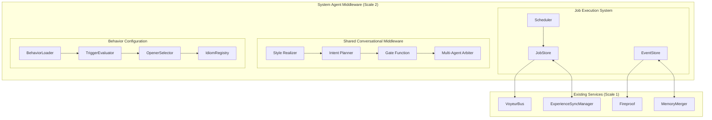
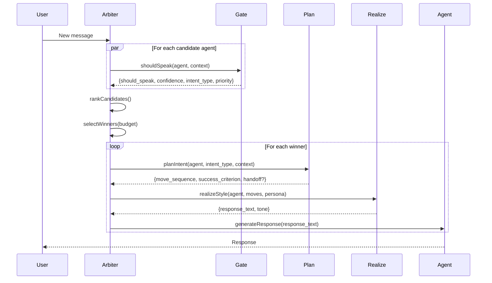
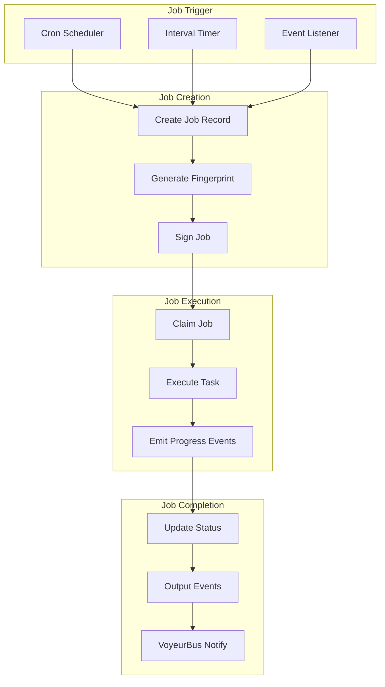
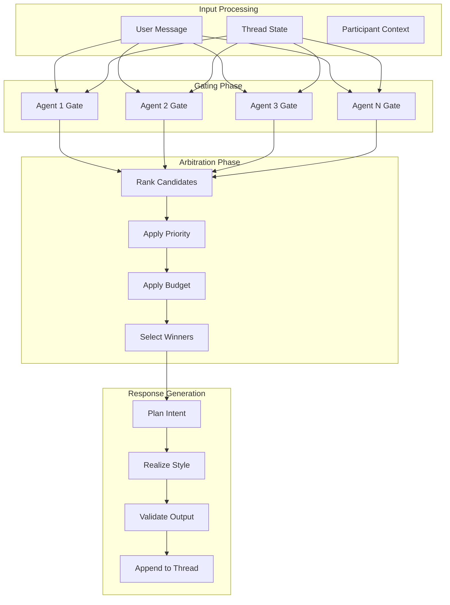
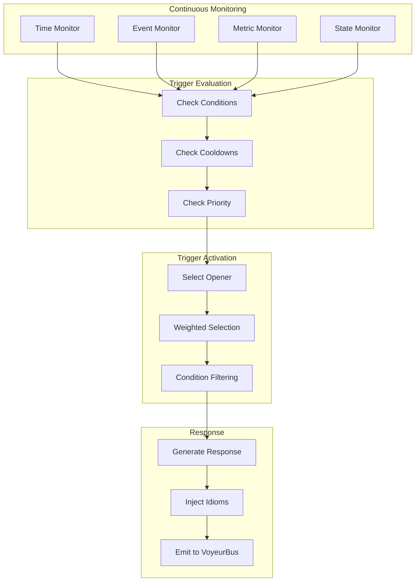

# System Agent Middleware Design Specification

**Version**: 1.0.0
**Date**: January 15, 2026
**Status**: Design Complete - Ready for Implementation
**Dependencies**:
- `Borrowed_Ideas/AGENT_JOBS_AND_CONVERSATIONS.md`
- `Borrowed_Ideas/JOBS_EVENTS_SCHEMA_PROPOSAL.md`
- `Borrowed_Ideas/Shared-Conversational-Middleware-Research.md`
- `plans/CHRYSALIS_COMPREHENSIVE_PATTERN_ANALYSIS.md`

---

## Executive Summary

This document specifies the **System Agent Middleware** layer, which implements a fractal repetition of Chrysalis's 10 universal patterns at the agent governance scale. The middleware provides:

1. **Durable Workflow Execution** — Jobs and Events as System of Record
2. **Shared Conversational Middleware (SCM)** — Multi-agent coordination
3. **Declarative Behavior Configuration** — JSON-driven agent behavior

These capabilities expand the existing pattern architecture while maintaining the core invariants: SSOT principles, cryptographic identity, Byzantine resistance, and local-first operation.

---

## 1. Architectural Context

### 1.1 Fractal Pattern Placement

The System Agent Middleware occupies **Scale 2** in Chrysalis's fractal architecture:

```
Scale 0: Mathematics (Hash, Signatures, DAG, CRDT)
    ↓
Scale 1: Core Services (MemoryMerger, ExperienceSyncManager, VoyeurBus)
    ↓
Scale 2: System Agent Middleware (JobStore, SCM, Arbiter, BehaviorConfig)  ← NEW
    ↓
Scale 3: Agent Operations (Ada, Lea, Phil, David)
    ↓
Scale 4: User Interactions (Chat, Canvas, Terminal)
```

### 1.2 Universal Pattern Application

| Universal Pattern | Scale 1 Implementation | Scale 2 (Middleware) Implementation |
|-------------------|------------------------|-------------------------------------|
| **Hash (SHA-384)** | Agent fingerprinting | Job fingerprinting for provenance |
| **Signatures (Ed25519)** | Experience authentication | Job signature for audit trail |
| **Random** | Instance placement | Weighted opener selection |
| **Gossip** | Memory propagation (O(log N)) | Job state propagation |
| **DAG** | Evolution tracking | Job execution history |
| **Convergence** | Skill aggregation | Multi-agent turn convergence |
| **Redundancy** | Multi-instance deployment | Retry with backoff |
| **Threshold (>2/3)** | Byzantine voting | Arbitration voting |
| **Time (Vector Clocks)** | Causal ordering | Job event ordering |
| **CRDT** | Conflict-free merge | Turn state merge |

---

## 2. Component Design

### 2.1 Component Overview



### 2.2 Job Execution System

#### 2.2.1 JobStore Interface

```typescript
// src/agents/system/JobStore.ts

interface JobRecord {
  job_id: string;                    // UUID
  job_type: JobType;                 // Enum of known job types
  agent_fingerprint: string;         // SHA-384 fingerprint
  signature?: string;                // Ed25519 signature

  schedule: JobSchedule;             // Cron, interval, or event

  status: JobStatus;                 // queued | running | succeeded | failed | canceled
  attempts: number;
  max_attempts: number;
  idempotency_key?: string;

  vector_clock: Record<string, number>;  // For distributed ordering

  created_at: string;                // ISO8601
  updated_at: string;

  // Execution context
  data_sources?: string[];
  outputs?: string[];
  rights_required?: string[];

  // Error tracking
  last_error_code?: string;
  last_error_message?: string;
  last_error_details?: Record<string, unknown>;
}

interface JobStore {
  // CRUD operations
  create(job: Omit<JobRecord, 'job_id' | 'created_at' | 'updated_at'>): Promise<JobRecord>;
  get(job_id: string): Promise<JobRecord | null>;
  list(filters?: JobFilters): Promise<JobRecord[]>;

  // Worker pattern
  claimNext(worker_id: string, job_types: JobType[]): Promise<JobRecord | null>;

  // Status management
  updateStatus(job_id: string, status: JobStatus, error?: JobError): Promise<void>;

  // Fingerprint verification
  verifyFingerprint(job_id: string): Promise<boolean>;
}
```

#### 2.2.2 EventStore Interface

```typescript
// src/agents/system/EventStore.ts

interface JobEvent {
  event_id: string;                  // UUID
  job_id: string;                    // Reference to parent job
  timestamp: number;                 // Unix timestamp
  type: JobEventType;                // JOB_STATE | JOB_PROGRESS | JOB_OUTPUT | ERROR
  level: 'debug' | 'info' | 'warn' | 'error';
  message: string;                   // Human-readable status
  data?: Record<string, unknown>;    // Structured payload

  // Progress-specific fields
  percent?: number;
  phase?: string;
}

type JobEventType =
  | 'JOB_STATE'                      // Status transitions
  | 'JOB_PROGRESS'                   // Percent/phase updates
  | 'JOB_OUTPUT'                     // Artifact references
  | 'USER_ACTION_REQUIRED'           // Needs human input
  | 'ERROR_USER_FACING';             // User-friendly error

interface EventStore {
  // Append-only operations
  append(job_id: string, event: Omit<JobEvent, 'event_id'>): Promise<JobEvent>;

  // Read operations
  tail(job_id: string, since_event_id?: string): Promise<JobEvent[]>;
  replay(job_id: string): Promise<JobEvent[]>;

  // Integration with VoyeurBus
  streamToVoyeur(job_id: string): void;
}
```

#### 2.2.3 Job Schedule Types

```typescript
// Schedule type definitions

interface CronSchedule {
  type: 'cron';
  value: string;                     // Cron expression: "0 4 * * *"
  timezone: string;                  // Default: "UTC"
}

interface IntervalSchedule {
  type: 'interval';
  value: string;                     // Duration: "1h", "30m", "5s"
  start_delay_seconds?: number;
}

interface EventSchedule {
  type: 'event';
  value: string;                     // Event name to trigger on
  filters?: Record<string, unknown>; // Event filtering criteria
}

type JobSchedule = CronSchedule | IntervalSchedule | EventSchedule;
```

### 2.3 Shared Conversational Middleware (SCM)

#### 2.3.1 SCM Core Pipeline



#### 2.3.2 Gate Function Interface

```typescript
// src/agents/system/SharedConversationMiddleware.ts

interface GateInput {
  agent_id: string;
  persona_capsule: PersonaCapsule;
  scm_policy: SCMPolicy;
  thread_state: ThreadState;
  last_turns: Turn[];
  repair_signals: RepairSignal[];
}

interface GateOutput {
  should_speak: boolean;
  confidence: number;                // 0.0 - 1.0
  intent_type: IntentType;
  target_turn_id?: string;
  priority: number;                  // For arbitration ranking
}

type IntentType =
  | 'ask'
  | 'answer'
  | 'clarify'
  | 'reflect'
  | 'coach'
  | 'brainstorm'
  | 'handoff'
  | 'summarize';

interface Gate {
  // Deterministic gate (heuristic-based)
  shouldSpeak(input: GateInput): GateOutput;

  // LLM-enhanced gate (optional upgrade path)
  shouldSpeakWithLLM?(input: GateInput): Promise<GateOutput>;
}
```

#### 2.3.3 SCM Policy Schema

```typescript
// src/agents/system/types.ts

interface SCMPolicy {
  initiative: {
    mode: 'only_when_asked' | 'can_interject' | 'proactive';
    triggers: InitiativeTrigger[];
    cooldown_ms: number;
    max_msgs_per_10min: number;
  };

  turn_taking: {
    interrupt_ok: boolean;
    max_questions_per_reply: number;
    max_lines: number;
    allow_repetition_for_empathy: boolean;
  };

  repair: {
    enabled: boolean;
    signals: RepairSignal[];
    strategy: 'clarify' | 'reflect_then_clarify' | 'summarize_then_ask';
  };

  coaching: {
    style: 'socratic' | 'directive' | 'motivational_interviewing' | 'mixed';
    ask_permission_before_advice: boolean;
    autonomy_language: 'high' | 'medium' | 'low';
    boundaries: string[];
  };

  creativity: {
    mode: 'divergent' | 'convergent' | 'oscillate';
    techniques: CreativityTechnique[];
    n_ideas_default: number;
    anti_takeover: boolean;
    risk_tolerance: 'safe' | 'medium' | 'wild';
  };

  coordination: {
    priority: number;
    complement_tags: CoordinationTag[];
    yield_to: string[];
    speak_probability?: number;
  };
}

type InitiativeTrigger =
  | 'direct_mention'
  | 'question_to_me'
  | 'confusion'
  | 'stuck'
  | 'low_morale'
  | 'risk'
  | 'idea_request';

type CreativityTechnique =
  | 'SCAMPER'
  | 'SixHats'
  | 'analogies'
  | 'constraints'
  | 'random_word'
  | 'bad_ideas_first'
  | 'perspective_rotation';

type CoordinationTag =
  | 'planning'
  | 'ops'
  | 'creative'
  | 'coach'
  | 'critic'
  | 'builder';
```

#### 2.3.4 Multi-Agent Arbiter

```typescript
// src/agents/system/AgentArbiter.ts

interface ArbiterConfig {
  strategy: 'priority_first' | 'priority_then_diversity' | 'round_robin';
  max_agents_per_turn: number;
  diversity_weight: number;          // 0.0 - 1.0
  global_turn_budget: number;        // Max messages per time window
}

interface CandidateRanking {
  agent_id: string;
  score: number;
  gate_output: GateOutput;
  complement_contribution: number;   // Diversity bonus
}

interface AgentArbiter {
  // Rank candidates by score
  rankCandidates(
    candidates: Array<{ agent_id: string; gate_output: GateOutput }>,
    context: ThreadState
  ): CandidateRanking[];

  // Select winners based on budget and diversity
  selectWinners(
    ranked: CandidateRanking[],
    budget: number
  ): string[];

  // Track turn economy
  recordTurn(agent_id: string, timestamp: number): void;

  // Get arbitration metrics for VoyeurBus
  getMetrics(): ArbiterMetrics;
}

interface ArbiterMetrics {
  total_arbitrations: number;
  agents_selected: Record<string, number>;
  pile_on_prevented: number;
  diversity_bonus_applied: number;
  budget_enforcements: number;
}
```

### 2.4 Behavior Configuration

#### 2.4.1 Extended Agent Schema

```json
{
  "$schema": "https://chrysalis.dev/schemas/system-agent.schema.json",
  "id": "ada",
  "profile": {
    "display_name": "Ada",
    "designation": "Evaluation Coordinator"
  },

  "interactionStates": {
    "responsive": { "timeout": null },
    "proactive": { "triggers": ["new_prompt_deployment"] },
    "disengaged": { "dndEnabled": true }
  },

  "behavior": {
    "jobs": [
      {
        "job_id": "evaluation_review",
        "name": "Daily Evaluation Review",
        "description": "Review and aggregate daily evaluation results",
        "schedule": {
          "type": "cron",
          "value": "0 6 * * *",
          "timezone": "UTC"
        },
        "enabled": true,
        "priority": "high",
        "timeout_seconds": 600,
        "data_sources": ["evaluation_logs", "forecast_accuracy"],
        "outputs": ["evaluation_summary"],
        "rights_required": ["read_evaluations"]
      }
    ],

    "conversation_triggers": [
      {
        "trigger_id": "evaluation_anomaly",
        "name": "Trigger on Evaluation Anomaly",
        "condition": {
          "type": "metric",
          "parameters": {
            "metric_name": "evaluation_variance",
            "operator": "gte",
            "threshold": 0.3,
            "duration_seconds": 60
          }
        },
        "cooldown_seconds": 3600,
        "enabled": true,
        "priority": "high",
        "context_required": ["recent_evaluations"]
      }
    ],

    "openers": [
      {
        "opener_id": "anomaly_alert",
        "trigger_id": "evaluation_anomaly",
        "variations": [
          {
            "text": "I've noticed some unusual variance in recent evaluations. Shall we review?",
            "weight": 1.0
          },
          {
            "text": "The evaluation patterns seem off today. Would you like me to dig deeper?",
            "weight": 0.8,
            "conditions": { "time_of_day": "morning" }
          }
        ],
        "follow_up_prompt": "What aspect would you like to focus on?",
        "tone": "concerned"
      }
    ],

    "idioms": [
      {
        "idiom_id": "calibration_reference",
        "category": "metaphor",
        "phrases": [
          {
            "text": "Let's calibrate our understanding.",
            "weight": 1.0,
            "context": ["evaluation", "forecasting"]
          }
        ],
        "frequency": "medium",
        "triggers": ["evaluation_discussion"]
      }
    ]
  },

  "scm_policy": {
    "initiative": {
      "mode": "can_interject",
      "triggers": ["direct_mention", "confusion", "evaluation_question"],
      "cooldown_ms": 10000,
      "max_msgs_per_10min": 8
    },
    "turn_taking": {
      "interrupt_ok": false,
      "max_questions_per_reply": 2,
      "max_lines": 10,
      "allow_repetition_for_empathy": true
    },
    "coaching": {
      "style": "socratic",
      "ask_permission_before_advice": true,
      "autonomy_language": "high",
      "boundaries": ["no_diagnosis", "no_shame"]
    },
    "creativity": {
      "mode": "convergent",
      "techniques": ["constraints", "analogies"],
      "n_ideas_default": 3,
      "anti_takeover": true,
      "risk_tolerance": "safe"
    },
    "coordination": {
      "priority": 0.8,
      "complement_tags": ["planning", "coach"],
      "yield_to": ["phil_for_architecture"]
    }
  }
}
```

#### 2.4.2 Trigger Evaluator

```typescript
// src/agents/system/TriggerEvaluator.ts

interface TriggerCondition {
  type: 'time_since_last' | 'event' | 'metric' | 'user_state';
  parameters: Record<string, unknown>;
}

interface TriggerResult {
  trigger_id: string;
  should_trigger: boolean;
  confidence: number;
  context_available: Record<string, unknown>;
}

interface TriggerEvaluator {
  // Evaluate all triggers for an agent
  evaluateTriggers(
    agent_id: string,
    triggers: ConversationTrigger[],
    context: SystemContext
  ): TriggerResult[];

  // Check cooldown status
  checkCooldown(agent_id: string, trigger_id: string): boolean;

  // Record trigger activation
  recordActivation(agent_id: string, trigger_id: string): void;
}
```

#### 2.4.3 Opener Selector

```typescript
// src/agents/system/OpenerSelector.ts

interface OpenerVariation {
  text: string;
  weight: number;
  conditions?: {
    time_of_day?: 'morning' | 'afternoon' | 'evening';
    user_mood?: 'happy' | 'neutral' | 'tired';
    [key: string]: unknown;
  };
}

interface OpenerSelection {
  opener_id: string;
  selected_text: string;
  follow_up_prompt?: string;
  tone: string;
  selection_reason: string;
}

interface OpenerSelector {
  // Select opener based on trigger and context
  selectOpener(
    trigger_id: string,
    openers: Opener[],
    context: SelectionContext
  ): OpenerSelection | null;

  // Weighted random selection with condition filtering
  weightedSelect(variations: OpenerVariation[], context: SelectionContext): string;
}
```

---

## 3. Data Flow Diagrams

### 3.1 Job Execution Flow



### 3.2 SCM Pipeline Flow



### 3.3 Behavior Trigger Flow



---

## 4. Integration Points

### 4.1 VoyeurBus Event Extensions

```typescript
// Extended VoyeurEvent types for middleware

type MiddlewareEventKind =
  // Job events
  | 'job.created'
  | 'job.state'
  | 'job.progress'
  | 'job.output'
  | 'job.error'
  | 'job.completed'

  // SCM events
  | 'scm.gate.evaluated'
  | 'scm.arbitration.completed'
  | 'scm.response.generated'
  | 'scm.pile_on.prevented'

  // Behavior events
  | 'behavior.trigger.evaluated'
  | 'behavior.trigger.activated'
  | 'behavior.opener.selected'
  | 'behavior.idiom.injected';

interface MiddlewareEvent extends VoyeurEvent {
  kind: MiddlewareEventKind;

  // Job-specific fields
  job_id?: string;
  job_type?: string;
  phase?: string;
  percent?: number;

  // SCM-specific fields
  agent_id?: string;
  gate_decision?: GateOutput;
  arbitration_result?: CandidateRanking[];

  // Behavior-specific fields
  trigger_id?: string;
  opener_id?: string;
  idiom_id?: string;
}
```

### 4.2 ExperienceSync Integration

Job events can be synchronized across instances using the existing ExperienceSync infrastructure:

```typescript
// Job events as ExperienceEvents

interface JobExperienceEvent extends ExperienceEvent {
  event_type: 'job';
  data: {
    job_record: JobRecord;
    events: JobEvent[];
    vector_clock: Record<string, number>;
  };
}

// Add job sync to ExperienceSyncManager
interface ExperienceSyncManagerExtension {
  syncJobState(instanceId: string, job: JobRecord): Promise<void>;
  receiveJobState(job: JobRecord): Promise<MergeResult>;
}
```

### 4.3 Memory System Integration

```python
# memory_system/stores.py - JobStore implementation

from dataclasses import dataclass, field
from typing import List, Dict, Optional
from datetime import datetime
import uuid
import json

@dataclass
class JobRecord:
    job_id: str = field(default_factory=lambda: str(uuid.uuid4()))
    job_type: str = ""
    agent_fingerprint: str = ""
    signature: Optional[str] = None
    schedule: Dict = field(default_factory=dict)
    status: str = "queued"
    attempts: int = 0
    max_attempts: int = 3
    idempotency_key: Optional[str] = None
    vector_clock: Dict[str, int] = field(default_factory=dict)
    created_at: str = field(default_factory=lambda: datetime.utcnow().isoformat())
    updated_at: str = field(default_factory=lambda: datetime.utcnow().isoformat())
    last_error_code: Optional[str] = None
    last_error_message: Optional[str] = None

class JobStore:
    """
    Pattern #11: Durable Workflow
    Jobs as System of Record for workflow execution state.
    """

    def __init__(self, storage_path: str = "data/jobs"):
        self.storage_path = storage_path
        self.jobs: Dict[str, JobRecord] = {}

    async def create(self, job: JobRecord) -> JobRecord:
        """Create a new job with fingerprint verification."""
        job.created_at = datetime.utcnow().isoformat()
        job.updated_at = job.created_at
        self.jobs[job.job_id] = job
        await self._persist(job)
        return job

    async def claim_next(
        self,
        worker_id: str,
        job_types: List[str]
    ) -> Optional[JobRecord]:
        """Claim next available job (worker pattern)."""
        for job in self.jobs.values():
            if (job.status == "queued" and
                job.job_type in job_types and
                job.attempts < job.max_attempts):
                job.status = "running"
                job.attempts += 1
                job.updated_at = datetime.utcnow().isoformat()
                await self._persist(job)
                return job
        return None

    async def update_status(
        self,
        job_id: str,
        status: str,
        error: Optional[Dict] = None
    ) -> None:
        """Update job status with optional error details."""
        if job_id in self.jobs:
            job = self.jobs[job_id]
            job.status = status
            job.updated_at = datetime.utcnow().isoformat()
            if error:
                job.last_error_code = error.get("code")
                job.last_error_message = error.get("message")
            await self._persist(job)

    async def _persist(self, job: JobRecord) -> None:
        """Persist job to storage."""
        # Implementation: JSON file or database
        pass


class EventStore:
    """
    Pattern #11: Durable Workflow
    Events as System of Record for progress/history.
    """

    def __init__(self, storage_path: str = "data/jobs/events"):
        self.storage_path = storage_path

    async def append(self, job_id: str, event: Dict) -> Dict:
        """Append event to job's event log (JSONL)."""
        event["event_id"] = str(uuid.uuid4())
        event["timestamp"] = datetime.utcnow().timestamp()

        event_path = f"{self.storage_path}/{job_id}.jsonl"
        with open(event_path, "a") as f:
            f.write(json.dumps(event) + "\n")

        return event

    async def replay(self, job_id: str) -> List[Dict]:
        """Replay all events for a job."""
        events = []
        event_path = f"{self.storage_path}/{job_id}.jsonl"
        try:
            with open(event_path, "r") as f:
                for line in f:
                    events.append(json.loads(line))
        except FileNotFoundError:
            pass
        return events
```

---

## 5. Testing Strategy

### 5.1 Unit Tests

```typescript
// __tests__/agents/system/SCM.test.ts

describe('SharedConversationMiddleware', () => {
  describe('Gate Function', () => {
    it('should return should_speak=false when cooldown active', () => {
      const gate = new Gate();
      const input = createGateInput({
        lastSpeakTime: Date.now() - 1000,
        cooldown_ms: 5000
      });

      const result = gate.shouldSpeak(input);
      expect(result.should_speak).toBe(false);
    });

    it('should increase priority on repair signals', () => {
      const gate = new Gate();
      const inputWithRepair = createGateInput({
        repair_signals: [{ type: 'confusion', confidence: 0.8 }]
      });
      const inputWithoutRepair = createGateInput({
        repair_signals: []
      });

      const withRepair = gate.shouldSpeak(inputWithRepair);
      const withoutRepair = gate.shouldSpeak(inputWithoutRepair);

      expect(withRepair.priority).toBeGreaterThan(withoutRepair.priority);
    });
  });

  describe('Arbiter', () => {
    it('should prevent pile-on by limiting winners', () => {
      const arbiter = new AgentArbiter({ max_agents_per_turn: 2 });
      const candidates = [
        { agent_id: 'ada', gate_output: { should_speak: true, priority: 0.9 } },
        { agent_id: 'lea', gate_output: { should_speak: true, priority: 0.8 } },
        { agent_id: 'phil', gate_output: { should_speak: true, priority: 0.7 } },
      ];

      const winners = arbiter.selectWinners(
        arbiter.rankCandidates(candidates),
        2
      );

      expect(winners.length).toBe(2);
      expect(winners).toContain('ada');
      expect(winners).toContain('lea');
      expect(winners).not.toContain('phil');
    });
  });
});
```

### 5.2 Integration Tests

```typescript
// __tests__/integration/middleware.test.ts

describe('System Agent Middleware Integration', () => {
  it('should emit job events to VoyeurBus', async () => {
    const voyeur = new VoyeurBus();
    const jobStore = new JobStore({ voyeur });
    const events: VoyeurEvent[] = [];

    voyeur.addSink({ emit: (e) => events.push(e) });

    const job = await jobStore.create({
      job_type: 'TEST_JOB',
      agent_fingerprint: 'test-fingerprint'
    });

    await jobStore.updateStatus(job.job_id, 'running');
    await jobStore.updateStatus(job.job_id, 'succeeded');

    expect(events.map(e => e.kind)).toEqual([
      'job.created',
      'job.state',
      'job.state'
    ]);
  });

  it('should integrate SCM with behavior triggers', async () => {
    const middleware = new SystemAgentMiddleware();
    const agent = loadAgent('ada');

    // Simulate trigger condition
    await middleware.simulateCondition('time_since_last', {
      threshold_seconds: 3600,
      actual_seconds: 4000
    });

    const triggered = await middleware.evaluateTriggers(agent);
    expect(triggered.length).toBeGreaterThan(0);

    const opener = await middleware.selectOpener(triggered[0]);
    expect(opener.text).toBeDefined();
  });
});
```

---

## 6. Risks and Mitigations

| Risk | Likelihood | Impact | Mitigation |
|------|------------|--------|------------|
| Schema migration breaks existing agents | Medium | High | Use defaults; version bump with migration script |
| SCM Gate adds latency | Low | Medium | Gate must complete <10ms; deterministic heuristics first |
| Multi-agent pile-on still occurs | Medium | Low | Strict arbitration with cooldowns and budgets |
| Job retries cause duplicate work | Low | Medium | Idempotency keys + deduplication |
| Event storage grows unbounded | Medium | Medium | TTL + compaction; switch to Fireproof |
| Behavior config complexity | Medium | Medium | Start with minimal required fields; gradual enhancement |

---

## 7. Implementation Checklist

### Phase 1: Schema + Types (Week 1)
- [ ] Add `behavior` section to `Agents/schemas/system-agent.schema.json`
- [ ] Add `scm_policy` section to schema
- [ ] Create TypeScript types in `src/agents/system/types.ts`
- [ ] Add pydantic models in `shared/api_core/schemas.py`
- [ ] Validate schema with existing agent configs

### Phase 2: Job System (Week 2)
- [ ] Implement `JobStore` in `memory_system/stores.py`
- [ ] Implement `EventStore` with JSONL storage
- [ ] Add job event types to `VoyeurEvents.ts`
- [ ] Create job scheduler with cron/interval support
- [ ] Wire one workflow (e.g., embedding upsert) as pilot

### Phase 3: SCM Core (Week 3)
- [ ] Implement Gate function (deterministic)
- [ ] Implement Intent Planner stub
- [ ] Implement Style Realizer stub
- [ ] Implement AgentArbiter with priority
- [ ] Export from `src/agents/system/index.ts`

### Phase 4: Behavior Config (Week 4)
- [ ] Implement TriggerEvaluator
- [ ] Implement OpenerSelector with weighted selection
- [ ] Implement IdiomRegistry
- [ ] Add behavior configs to Ada, Lea, Phil, David
- [ ] Integration tests

### Phase 5: Polish (Week 5)
- [ ] Add VoyeurBus metrics for turn economy
- [ ] Add arbitration success tracking
- [ ] Documentation and examples
- [ ] Performance benchmarks
- [ ] Code review

---

## 8. References

### Internal Documents
- `Borrowed_Ideas/AGENT_JOBS_AND_CONVERSATIONS.md`
- `Borrowed_Ideas/JOBS_EVENTS_SCHEMA_PROPOSAL.md`
- `Borrowed_Ideas/Shared-Conversational-Middleware-Research.md`
- `Borrowed_Ideas/Borrowed_Ideas_Action_Plan.md`
- `plans/CHRYSALIS_COMPREHENSIVE_PATTERN_ANALYSIS.md`

### External References
- Gamma, E., et al. (1994). *Design Patterns*. (GoF)
- Alexander, C. (1977). *A Pattern Language*.
- Sacks, H., et al. (1974). "Turn-taking for conversation."
- Miller, W. R., & Rollnick, S. (2012). *Motivational Interviewing*.

---

**Document Status**: Complete
**Next Action**: Begin Phase 1 implementation
**Owner**: Architecture Team
