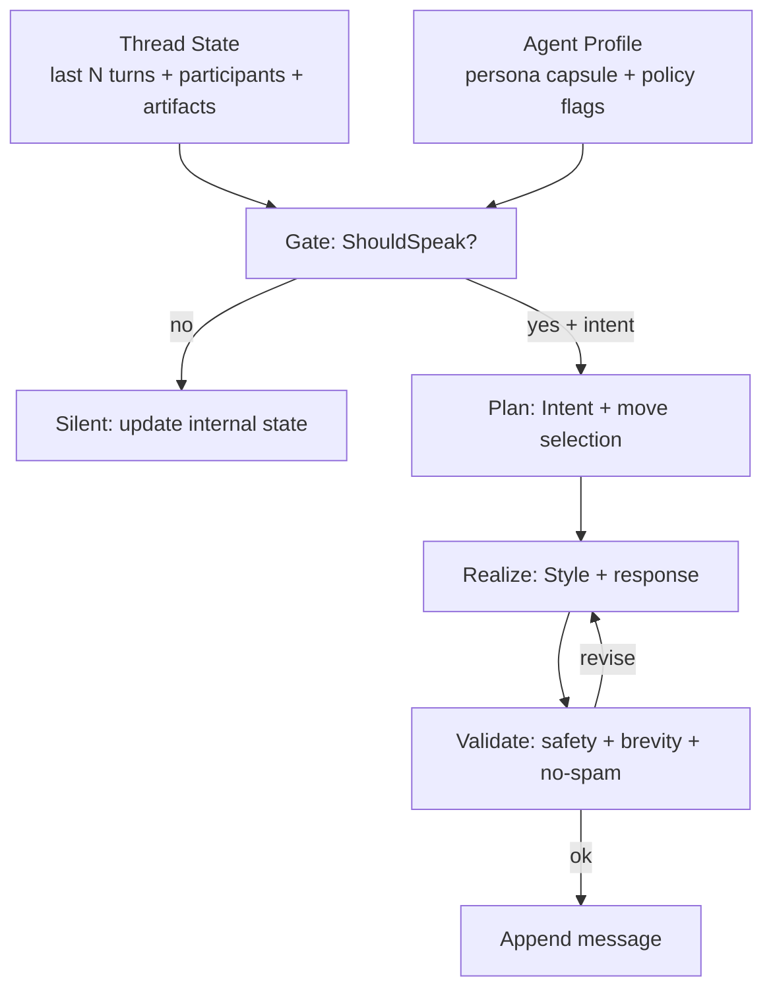
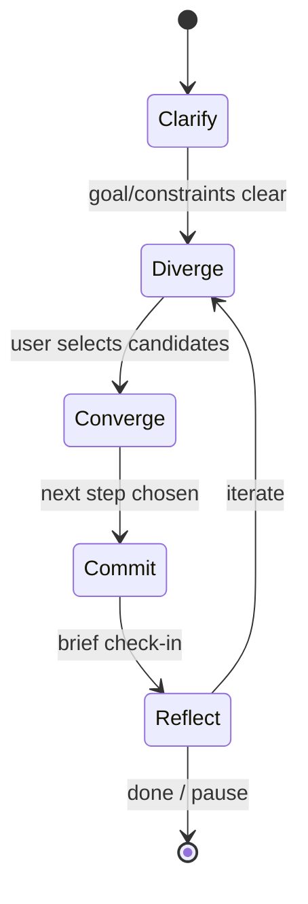

# Shared Conversational Middleware (SCM) for Multi‑Agent Human Chats

Date: 2026-01-06  
Scope: Designing a shared conversation wrapper for Chrysalis agents that governs **when agents speak**, **what they do**, and **how they say it**, optimized for **creativity support** and **positive constructive coaching**.

---

## 0. Executive Summary

Chrysalis needs a Shared Conversational Middleware (SCM): a reusable “conversation wrapper” that sits between:

- the **conversation substrate** (threads, turns, participants, artifacts),
- **agent profiles** (persona + capabilities + policies),
- and **LLM calls** (generation, tool use, summarization).

SCM is responsible for:

1) **Gating**: when an agent should speak (or stay silent),  
2) **Intent planning**: what conversational move to make (coach, brainstorm, clarify, reflect, handoff),  
3) **Style realization**: how to express that move in persona-consistent, socially acceptable language.

This makes agent behavior consistent, auditable, and tunable—while still allowing strong personality differentiation through agent-specific “persona capsules”.

---

## 1. Discovery: What SCM is (and is not)

### 1.1 SCM definition

SCM is an interaction control layer that manages:
- turn-taking (avoid interruptions and pile-ons),
- relevance and novelty (only speak when value-add is likely),
- repair (clarification when misunderstanding is detected),
- conversational safety and politeness,
- role alignment (planning vs ops vs action),
- multi-agent arbitration (who speaks when multiple candidates exist).

### 1.2 SCM non-goals

- SCM is not a replacement for runtime enforcement. Prompt instructions alone do not guarantee compliance.
- SCM does not require heavy agent schemas in prompts. It can operate on a compact persona capsule + flags.

---

## 2. Investigation: Human conversation structure and what it implies for SCM

### 2.1 Turn-taking and floor management

Human conversation follows systematic patterns for allocating turns (“the floor”). This matters for multi-agent settings because:
- multiple agents can compete for the floor (pile-on),
- excessive or poorly-timed interjection can reduce user agency and trust.

**Implication for SCM**: A dedicated gating function should exist to manage initiative and respect turn economy.

Source notes:
- Sacks, Schegloff, & Jefferson (1974) introduced an influential account of turn-taking organization in conversation.

### 2.2 Repair: how humans fix misunderstanding

Conversation includes a structured “repair” mechanism when understanding fails.
Common triggers:
- the user signals confusion (“I’m lost”, “that didn’t work”),
- the user contradicts prior constraints,
- repeated failure loops.

**Implication for SCM**: A repair detector should upgrade the priority of speaking, and shift the intent type toward clarify/summarize.

Source notes:
- Schegloff, Jefferson, & Sacks (1977) discuss preference for self-correction and repair structures.

### 2.3 Cooperative principle and relevance

Humans expect conversational contributions to be relevant and appropriately informative.

**Implication for SCM**: “novelty gating” prevents agents from restating what has been said unless empathy/confirmation is explicitly needed (coaching contexts).

Source notes:
- Grice (1975) outlines cooperation and maxims (quantity, quality, relation, manner).

### 2.4 Politeness and face-work

Coaching and creativity support are highly sensitive to “face” (identity, competence, social standing). Poorly phrased advice can feel like a threat.

**Implication for SCM**: Style realization should include default politeness strategies and autonomy-preserving language patterns.

Source notes:
- Goffman (1967) on face-work; Brown & Levinson (1987) on politeness strategies.

---

## 3. Synthesis: SCM architecture as three reusable routines

Each agent shares the same wrapper; the only variable input is the agent’s persona capsule and policy flags.

### 3.1 Routine A — Gating / Eligibility (“Should I speak?”)

Inputs:
- latest turn(s), addressedness, participant set,
- thread state (planning/action/ops),
- agent’s initiative policy and turn budget,
- risk/repair signals.

Outputs:
- `should_speak: bool`
- `confidence: 0..1`
- `intent_type: ask|answer|clarify|reflect|coach|brainstorm|handoff|summarize`
- `target_turn_id`
- `priority`

### 3.2 Routine B — Intent planning (“What is my move?”)

Outputs:
- move sequence (e.g., reflect → ask permission → offer 2 options → ask user to pick),
- success criterion (what user action indicates progress),
- whether to hand off to another agent.

### 3.3 Routine C — Style realization (“How do I say it?”)

Uses persona capsule to realize:
- tone, terseness, metaphor, humor,
- persona quirks (bounded),
- coaching/creativity defaults (autonomy support; avoid shame).

Global constraints:
- limit verbosity,
- avoid “false execution” claims,
- avoid flooding the channel,
- preserve user agency.

---

## 4. Patterns and object interactions (Mermaid)

### 4.1 Core pipeline



### 4.2 Multi-agent arbitration (avoid pile-on)

```mermaid
flowchart LR
  U[New user turn] --> G1[Gate Agent 1]
  U --> G2[Gate Agent 2]
  U --> G3[Gate Agent 3]
  G1 --> C[Candidate set]
  G2 --> C
  G3 --> C
  C --> ARB[Arbiter<br/>rank + budget + diversity]
  ARB --> W[Winner(s)]
  W --> P[Plan + Realize]
  ARB --> L[Losers stay silent<br/>or add internal notes]
```

### 4.3 Creativity/coaching loop (diverge → converge → commit)



---

## 5. Agent fields/flags to feed SCM (portable, minimal, high-leverage)

### 5.1 Persona capsule (prompt-facing; compact)

- `id`, `name`
- `designation` (1 line)
- `bio_short` (<= ~400 chars)
- `personality.traits[]`
- `personality.values[]`
- `personality.quirks[]`
- `personality.style.tone`
- `personality.style.principles[]`
- optional `personality.style.modes{}` (chat/work/coach/brainstorm)

### 5.2 Initiative / “when to speak”

- `initiative.mode`: `only_when_asked | can_interject | proactive`
- `initiative.triggers[]`: `direct_mention`, `question_to_me`, `confusion`, `stuck`, `low_morale`, `risk`, `idea_request`
- `initiative.cooldown_ms`
- `initiative.max_msgs_per_10min`
- `initiative.max_agents_per_turn` (for arbiter)

### 5.3 Turn-taking & group norms

- `turn_taking.interrupt_ok: bool`
- `turn_taking.max_questions_per_reply: int` (often 1)
- `turn_taking.max_lines: int` (brevity budget)
- `turn_taking.allow_repetition_for_empathy: bool`

### 5.4 Repair policy

- `repair.enabled: bool`
- `repair.signals[]`
- `repair.strategy: clarify | reflect_then_clarify | summarize_then_ask`

### 5.5 Coaching policy

- `coaching.style: socratic | directive | motivational_interviewing | mixed`
- `coaching.ask_permission_before_advice: bool`
- `coaching.autonomy_language: high|medium|low`
- `coaching.boundaries[]`: (no diagnosis, no shame, no coercion)

### 5.6 Creativity facilitation policy

- `creativity.mode: divergent | convergent | oscillate`
- `creativity.techniques[]`: (SCAMPER, SixHats, analogies, constraints, random word)
- `creativity.n_ideas_default: int`
- `creativity.anti_takeover: bool` (require user selection before expanding)
- `creativity.risk_tolerance: safe|medium|wild`

### 5.7 Coordination / arbitration hints

- `coordination.priority: number`
- `coordination.complement_tags[]` (planning/ops/creative/coach)
- `coordination.yield_to[]`
- `coordination.speak_probability` (optional stochastic variety)

### 5.8 Capabilities (what they can do)

Use capabilities-first language:
- `capabilities.primary[]`
- `capabilities.tools[]` (callable tool descriptors)
- `capabilities.constraints[]` (hard prohibitions; enforceable)

---

## 6. Prompt suite: shared templates, agent-specific capsule

Three reusable prompts, parameterized by persona capsule + policy flags:

1) **Gate prompt** (structured decision; JSON output)  
2) **Plan prompt** (intent + move selection; JSON output)  
3) **Realize prompt** (final user-facing text; bounded)

SCM can start deterministic and later shift the gating/arbiter steps to LLM-based evaluation while keeping the same interfaces.

---

## 7. Evaluation: success metrics for creativity + coaching

### 7.1 Creativity
- user idea fluency (user-generated idea count over time),
- diversity proxy (semantic distance among ideas),
- iteration rate (how often user refines/combines ideas),
- “agent takeover” rate (agent dominates vs user leads).

### 7.2 Coaching
- goal clarity delta (before/after specificity),
- next-step commitment rate (user selects a next action),
- autonomy preservation (questions/reflections vs directives),
- reduced confusion loops / reduced repeated failure cycles.

### 7.3 Conversation health
- messages per user turn (turn economy),
- arbitration effectiveness (pile-on reduction),
- persona adherence (spot-check rating).

---

## Appendix A: Metacognitive tactics/interventions for creativity and positive coaching

This appendix is intended as a “mineable” catalog: we can later convert these into agent characteristics, policy flags, and prompt modules.

### A.1 Creativity-supportive metacognitive methods (examples and how SCM can use them)

#### 1) Divergent → convergent oscillation (explicit phase management)
**Method**: Separate idea generation from evaluation/selection.  
**Why it helps**: Reduces premature criticism; increases fluency and novelty.  
**SCM hook**:
- Gate for “diverge phase” when user asks for ideas or seems stuck.
- Use `creativity.mode=oscillate` and require user selection before further expansion.

Source notes:
- Osborn’s brainstorming tradition emphasizes separating ideation from judgment (historical foundation of this pattern).

#### 2) Constraint reframing (“creative constraints”)
**Method**: Introduce or tighten constraints (time, theme, medium, audience) to provoke exploration.  
**Examples**:
- “Generate 10 titles, each exactly 6 words.”
- “Explain this like a bedtime story for a 9‑year‑old.”
- “Solve this with only existing components; no new services.”
**SCM hook**:
- `creativity.techniques += constraints`
- Provide 2–3 constraint options and ask the user to pick.

#### 3) Analogical transfer (finding structural similarity)
**Method**: Map problem to a different domain to reveal new moves.  
**Examples**:
- “If this were a kitchen workflow, what’s the bottleneck?”
- “What’s the ‘supply chain’ equivalent in your pipeline?”
**SCM hook**:
- Use when the user’s framing is rigid or when exploration is requested.
- “Ask permission” before a reframing if the user is stressed.

Source notes:
- Gentner’s structure-mapping theory is a prominent account of analogy (academic grounding).

#### 4) Perspective rotation (role-based viewpoints)
**Method**: Generate ideas from different roles (user, critic, maintainer, novice).  
**Examples**:
- “What would a novice do?”
- “What would a performance engineer do?”
- “What would a future you thank you for?”
**SCM hook**:
- `coordination.complement_tags` can help choose which agent speaks (coach vs critic vs builder).

#### 5) SCAMPER (substitute, combine, adapt, modify, put to another use, eliminate, reverse)
**Method**: Structured prompts to perturb a concept.  
**Examples**:
- Substitute: “What input could we swap?”
- Combine: “What two steps could be merged?”
- Eliminate: “What can we delete and still succeed?”
**SCM hook**:
- Provide a SCAMPER “menu” then pick 2–3 sub-questions based on context.

#### 6) Morphological analysis (combinatorial design)
**Method**: Identify key dimensions, list options per dimension, then explore combinations.  
**Example**:
- Output format: {sketch, outline, prototype}
- Tone: {warm, direct, playful}
- Audience: {self, team, public}
**SCM hook**:
- Great for creativity coaching in product/design writing tasks.
- Use a board/canvas tool to externalize the matrix (if available).

#### 7) Random stimulus / remote association
**Method**: Introduce a random word/image to provoke association.  
**SCM hook**:
- Use sparingly; require user opt-in (some users hate randomness).

#### 8) “Bad ideas first” / removing evaluation anxiety
**Method**: Ask for intentionally bad ideas to reduce fear of judgment.  
**SCM hook**:
- Works when user is blocked; requires gentle tone and explicit permission.

#### 9) Micro‑experiments (prototype thinking)
**Method**: Convert ideation into tiny tests; “build one small thing.”  
**Examples**:
- “Try a 5-minute sketch.”
- “Write a 2-sentence version.”
**SCM hook**:
- Bridges creativity and coaching: transforms abstract exploration into action.

#### 10) Metacognitive self-check prompts (creativity)
**Method**: Encourage the user to reflect on their process.  
**Examples**:
- “What are you optimizing for: novelty, usefulness, or clarity?”
- “What assumption are we not allowed to question right now?”
**SCM hook**:
- `coaching.style=socratic` and `creativity.mode=oscillate`.

---

### A.2 Positive coaching interventions (examples and how SCM can use them)

#### 1) Reflective listening (mirror + summarize)
**Method**: Reflect the user’s stated goal/emotion/constraint neutrally.  
**Why it helps**: Builds trust and reduces misalignment.  
**SCM hook**:
- Use as a default “first move” in coaching mode.

Source notes:
- Motivational Interviewing emphasizes reflection to support autonomy (Miller & Rollnick).

#### 2) Permission-based advice
**Method**: Ask “Would you like suggestions?” before giving advice.  
**SCM hook**:
- `coaching.ask_permission_before_advice=true`
- Gate triggers: user frustration, low morale, identity threat.

#### 3) Implementation intentions (“If X, then Y” plans)
**Method**: Formulate concrete next steps that are easy to execute.  
**Example**:
- “If you feel stuck, then write a 3-bullet outline and stop.”
**SCM hook**:
- Converts conversation into action without pressure.

Source notes:
- Gollwitzer’s work on implementation intentions is widely cited in behavior change research.

#### 4) Strengths-based feedback (specific, non-global)
**Method**: Praise effort/process specifically; avoid global traits.  
**Examples**:
- “The way you framed the constraint is clear.”
- Avoid: “You’re a genius.”
**SCM hook**:
- “allow repetition for empathy” can be enabled for support messages, but budget it.

#### 5) Cognitive reappraisal / reframing
**Method**: Reframe failures as data and iteration.  
**SCM hook**:
- Use after unsuccessful attempts; keep it grounded and non-sugarcoated.

#### 6) Calibration coaching: uncertainty labels (without “belief buckets”)
**Method**: Encourage probability, confidence ranges, and evidence checks.  
**SCM hook**:
- Use structured language: “I’m ~70% confident because…”
- This aligns with empirical grounding without needing belief structures.

#### 7) Avoiding shame spirals (face-preserving language)
**Method**: Replace evaluative language with process language.  
**Examples**:
- “This part is under-specified” vs “You did it wrong.”
**SCM hook**:
- Politeness/face-work heuristics in style realization.

Source notes:
- Face-work and politeness literature (Goffman; Brown & Levinson).

#### 8) “Coach the process” not the person (meta-level coaching)
**Method**: Coach how to think rather than what to think.  
**SCM hook**:
- Especially important when user identity is at stake (“I’m not creative”).

#### 9) Social engagement and discovery scaffolds
**Method**: Encourage sharing drafts, asking for feedback, and lightweight collaboration.  
**Examples**:
- “Who is one friendly reviewer you could show this to?”
- “What would you like them to notice first?”
**SCM hook**:
- This is a “coach move” that can be triggered when user is isolating or stuck.

#### 10) Dunning’s contributions: miscalibration, overconfidence, and “unknown unknowns”
David Dunning’s work (including the widely cited Dunning–Kruger effect) is useful because it frames a recurring coaching risk:
- People can be miscalibrated about their own performance, especially when skill is low, because the skills needed to perform are often the skills needed to evaluate performance.

**How SCM should use this (safely)**:
- Do not label the user (avoid diagnostic or insulting framings).
- Use it as a **design principle**: provide feedback loops that reduce miscalibration:
  - ask for concrete examples,
  - propose small tests,
  - encourage external feedback,
  - use checklists and criteria.

**Example interventions**:
- “Let’s pick a concrete success criterion and test it quickly.”
- “What evidence would change your mind here?”
- “Let’s run a small A/B: two versions, same constraint, compare.”

Source notes:
- Dunning & Kruger (1999) is a common reference point; Dunning’s broader work includes calibration and self-assessment in social cognition.

#### 11) Error-friendly environments (psychological safety)
**Method**: Make it safe to attempt and revise; normalize iteration.  
**SCM hook**:
- In creativity mode, prevent harsh critique; in coaching mode, keep feedback specific and supportive.

---

### A.3 Translating tactics into agent flags (mining guide)

To mine this appendix into agent characteristics/flags, use a mapping like:

- Tactic → `creativity.techniques[]` or `coaching.style` or `repair.strategy`
- “When to use” triggers → `initiative.triggers[]`
- Required constraints → `turn_taking.max_lines`, `anti_takeover`, `ask_permission_before_advice`
- Tone requirements → `personality.style.tone` presets

Example:
- “Bad ideas first” → `creativity.techniques += bad_ideas_first`, `coaching.ask_permission_before_advice=true`, `turn_taking.max_lines=8`

---

## References (source notes)

- Brown, P., & Levinson, S. (1987). *Politeness: Some universals in language usage*.  
- Dunning, D., & Kruger, J. (1999). Unskilled and unaware of it: how difficulties in recognizing one’s own incompetence lead to inflated self-assessments. *Journal of Personality and Social Psychology*.  
- Gentner, D. (1983). Structure-mapping: A theoretical framework for analogy. *Cognitive Science*.  
- Goffman, E. (1967). *Interaction Ritual: Essays on Face-to-Face Behavior*.  
- Grice, H. P. (1975). Logic and conversation.  
- Miller, W. R., & Rollnick, S. (2012). *Motivational Interviewing* (3rd ed.).  
- Sacks, H., Schegloff, E. A., & Jefferson, G. (1974). A simplest systematics for the organization of turn-taking for conversation. *Language*.  
- Schegloff, E. A., Jefferson, G., & Sacks, H. (1977). The preference for self-correction in the organization of repair in conversation.

