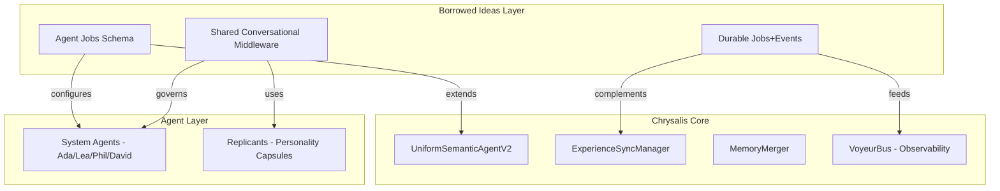
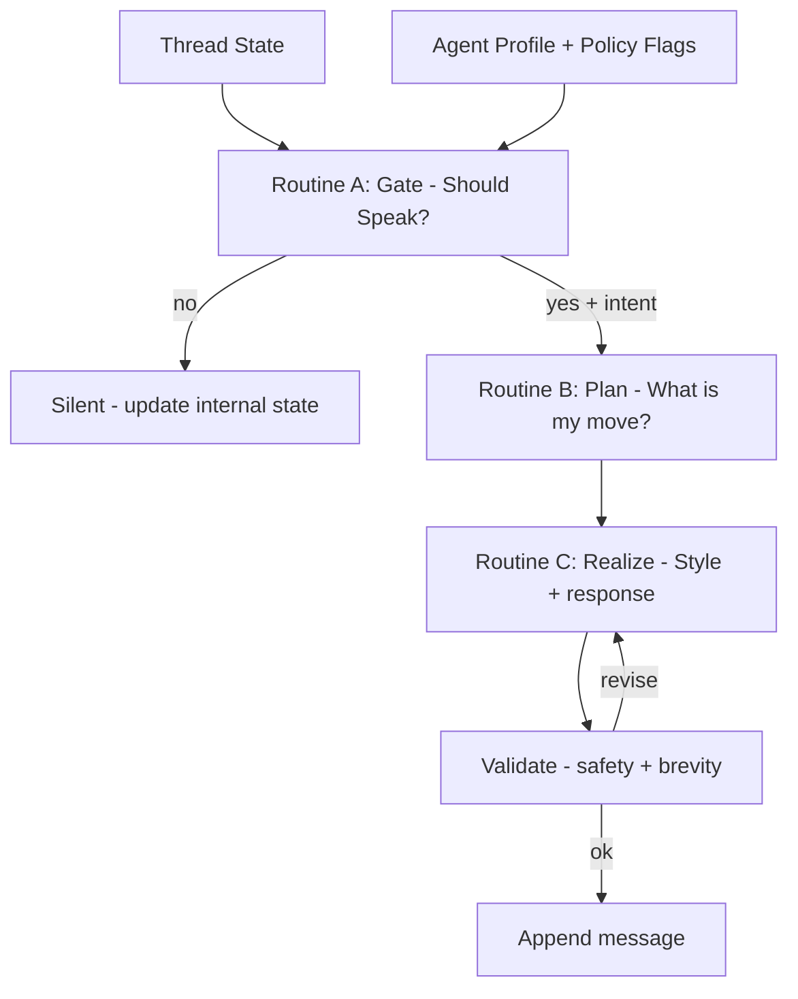
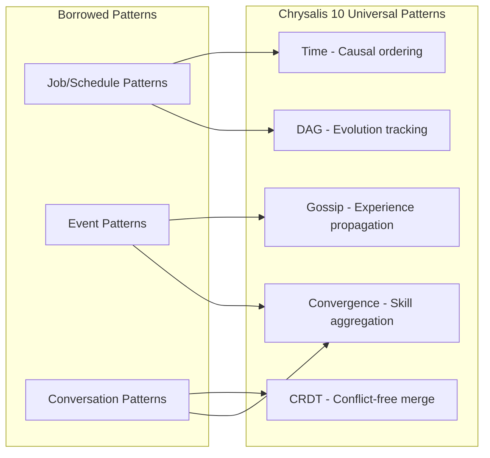
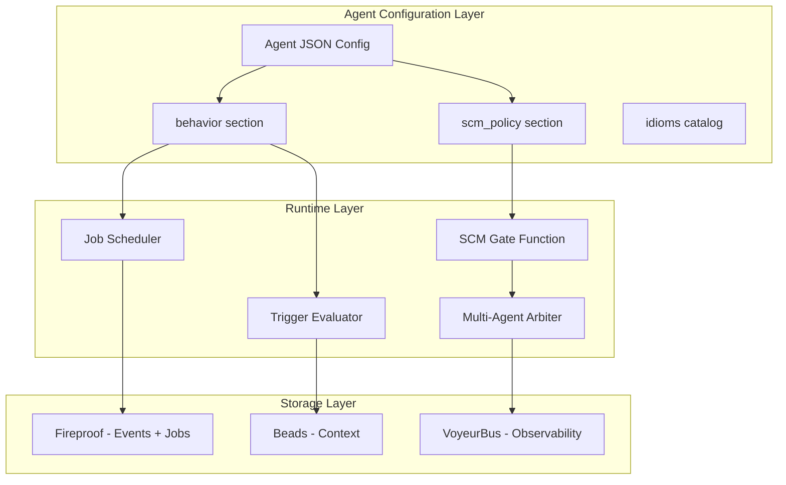
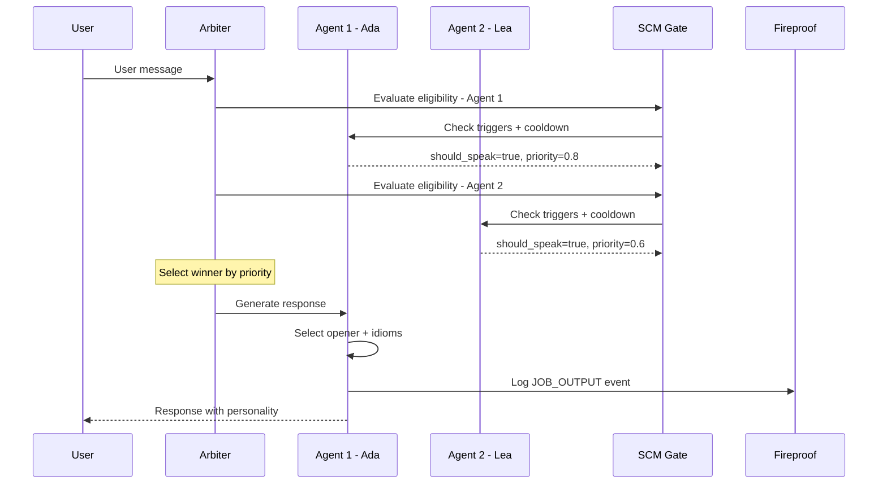

# Borrowed Ideas Technical Analysis for Chrysalis Integration

**Author**: Technical Architecture Review  
**Date**: 2026-01-15  
**Version**: 1.0  
**Status**: Complete Analysis

---

## Executive Summary

This document provides a comprehensive technical review of three external code asset specifications in the [`Borrowed_Ideas/`](.) directory, evaluating their applicability within the Chrysalis project architecture. The analysis identifies **high-value integration opportunities** that align with Chrysalis's core patterns while maintaining architectural coherence.

### Key Findings

| Borrowed Concept | Architectural Fit | Integration Priority | Adoption Recommendation |
|-----------------|-------------------|---------------------|------------------------|
| Agent Jobs & Behavior Schema | **High** | **P1** | Adopt with adaptation |
| Durable Jobs + Events Schema | **High** | **P1** | Adopt with adaptation |
| Shared Conversational Middleware | **Medium-High** | **P2** | Adopt selectively |

**Bottom line**: All three specifications address gaps in the current Chrysalis architecture. The Jobs/Events and Agent Behavior schemas can be integrated as a unified system that extends the existing agent configuration format. The Conversational Middleware patterns should be adopted selectively, focusing on the Gating/Intent/Realization pipeline.

---

## 1. Inventory and Catalog

### 1.1 File Inventory

| File | Type | Size | Purpose |
|------|------|------|---------|
| [`AGENT_JOBS_AND_CONVERSATIONS.md`](AGENT_JOBS_AND_CONVERSATIONS.md) | Specification | 545 lines | Defines JSON schemas for agent job assignments, conversation triggers, openers, and character idioms |
| [`JOBS_EVENTS_SCHEMA_PROPOSAL.md`](JOBS_EVENTS_SCHEMA_PROPOSAL.md) | Specification | 159 lines | Proposes durable job execution system with typed, replayable events |
| [`Shared-Conversational-Middleware-Research.md`](Shared-Conversational-Middleware-Research.md) | Research Document | 492 lines | Research synthesis on multi-agent conversation control, turn-taking, and coaching patterns |

### 1.2 Conceptual Relationships



---

## 2. Pattern Analysis

### 2.1 Agent Jobs and Conversations Schema

**Source**: [`AGENT_JOBS_AND_CONVERSATIONS.md`](AGENT_JOBS_AND_CONVERSATIONS.md)

#### Core Design Patterns Identified

| Pattern | Description | Chrysalis Equivalent |
|---------|-------------|---------------------|
| **Schema Extension** | Adds `behavior` section to existing agent JSON | Extends [`Agents/system-agents/*.json`](../Agents/system-agents/) |
| **Schedule Polymorphism** | `cron`, `interval`, and `event` schedule types | No direct equivalent; new capability |
| **Weighted Variations** | Conversation openers with weights and conditions | No direct equivalent; new capability |
| **Character Idioms** | Categorical phrases with contextual triggers | Similar to `communication_style` in Replicants |

#### Schema Structure

```json
{
  "behavior": {
    "jobs": [/* scheduled/event-driven tasks */],
    "conversation_triggers": [/* proactive initiation conditions */],
    "openers": [/* what to say when initiating */],
    "idioms": [/* character-specific expressions */]
  }
}
```

#### Strengths
- Declarative, JSON-based configuration (aligns with Chrysalis philosophy)
- Clear separation of concerns: scheduling, triggering, content, style
- Extensible schema supporting multiple schedule types
- Built-in retry and timeout handling

#### Gaps
- No integration with Chrysalis's cryptographic identity system
- Missing vector-clock/CRDT awareness for distributed scenarios
- No explicit reference to ExperienceSync protocols

### 2.2 Durable Jobs + Events Schema

**Source**: [`JOBS_EVENTS_SCHEMA_PROPOSAL.md`](JOBS_EVENTS_SCHEMA_PROPOSAL.md)

#### Core Design Patterns Identified

| Pattern | Description | Chrysalis Equivalent |
|---------|-------------|---------------------|
| **SSOT Separation** | Ledger for data, Jobs for execution state, Events for progress | Aligns with Chrysalis's SSOT principles |
| **Event Sourcing** | Typed, replayable events (JOB_STATE, JOB_PROGRESS, JOB_OUTPUT) | [`VoyeurBus`](../src/observability/VoyeurEvents.ts) is similar |
| **Idempotency Keys** | Deduplicate retries | Aligns with memory deduplication patterns |
| **Claim-based Worker** | `claim_next(worker_id, job_types)` pattern | No direct equivalent |

#### Job Types Proposed

```text
PHOTO_ANALYZE        - Caption/tags/detections
PHOTO_EMBED_UPSERT   - Qdrant upsert
VECTORDB_BACKFILL    - Rebuild embeddings
DEDUP_CLASSIFY       - Near-duplicate features
COMPOSITE_BUILD      - Merge decisions
PHOTO_PURGE          - Two-stage deletion
CREATIVE_LOOP        - Long-running creative session
```

#### Event Envelope

```json
{
  "event_id": "uuid",
  "job_id": "uuid",
  "timestamp": 1735940000.0,
  "type": "JOB_PROGRESS",
  "level": "info",
  "message": "Human-readable status",
  "data": { /* structured payload */ }
}
```

#### Strengths
- Robust failure handling with explicit state machine
- JSONL append-only storage (local-first, matches Beads philosophy)
- Clear migration path from in-process to distributed workers

#### Gaps
- No explicit Byzantine resistance for multi-instance scenarios
- JobStore API missing vector-clock support
- No integration with Chrysalis's threshold voting

### 2.3 Shared Conversational Middleware (SCM)

**Source**: [`Shared-Conversational-Middleware-Research.md`](Shared-Conversational-Middleware-Research.md)

#### Core Design Patterns Identified

| Pattern | Description | Chrysalis Equivalent |
|---------|-------------|---------------------|
| **Gating/Eligibility** | "Should I speak?" decision function | No direct equivalent |
| **Intent Planning** | "What is my move?" selection | No direct equivalent |
| **Style Realization** | "How do I say it?" transformation | Replicant `communication_style` |
| **Multi-Agent Arbitration** | Candidate ranking to avoid pile-on | No direct equivalent |
| **Floor Management** | Turn-taking economics | No direct equivalent |

#### SCM Three-Routine Pipeline



#### Agent Policy Flags Proposed

```yaml
initiative:
  mode: only_when_asked | can_interject | proactive
  triggers: [direct_mention, question_to_me, confusion, stuck]
  cooldown_ms: 5000
  max_msgs_per_10min: 5

turn_taking:
  interrupt_ok: false
  max_questions_per_reply: 1
  max_lines: 8
  allow_repetition_for_empathy: true

coaching:
  style: socratic | directive | motivational_interviewing
  ask_permission_before_advice: true
  autonomy_language: high

creativity:
  mode: divergent | convergent | oscillate
  techniques: [SCAMPER, analogies, constraints]
  anti_takeover: true
```

#### Strengths
- Grounded in conversation analysis research (Sacks, Schegloff, Grice)
- Solves real multi-agent problems (pile-on, turn economy)
- Creativity and coaching tactics catalog is immediately usable
- Clear separation of gating, planning, and realization

#### Gaps
- Research-heavy; no concrete implementation
- Arbiter algorithm not specified
- No integration with Chrysalis's observability (VoyeurBus)

---

## 3. Compatibility Assessment

### 3.1 Structural Compatibility Matrix

| Borrowed Component | Chrysalis Component | Compatibility | Notes |
|-------------------|---------------------|---------------|-------|
| Job Schedule Schema | ExperienceSyncConfig | **High** | Both use similar scheduling patterns |
| Event Envelope | VoyeurEvent | **High** | Event structure is nearly identical |
| JobStore API | MemoryMerger API | **Medium** | Different domain, but API patterns align |
| EventStore (JSONL) | Beads (append-only) | **High** | Same storage philosophy |
| Persona Capsule | Replicants JSON | **High** | Direct mapping possible |
| Initiative Policy | interactionStates | **High** | Ada config already has similar structure |
| Conversation Triggers | No equivalent | **N/A** | New capability |
| Idioms Schema | communication_style | **Medium** | Replicants have similar but simpler structure |

### 3.2 Architectural Alignment



**Key Insight**: The borrowed patterns naturally extend Chrysalis's existing architectural principles:
- Jobs integrate with **Gossip** (job state propagation) and **DAG** (job execution history)
- Events integrate with **Time** (causal ordering via vector clocks)
- Conversation control integrates with **CRDT** (turn state) and **Convergence** (multi-agent consensus)

### 3.3 Schema Compatibility Analysis

#### Current Ada System-Agent Schema
```json
{
  "$schema": "../schemas/system-agent.schema.json",
  "id": "ada",
  "interactionStates": {
    "responsive": { "timeout": null },
    "proactive": { "triggers": ["new_prompt_deployment"] },
    "disengaged": { "dndEnabled": true }
  }
}
```

#### Proposed Merged Schema
```json
{
  "id": "ada",
  "interactionStates": { /* existing */ },
  "behavior": {
    "jobs": [ /* from AGENT_JOBS_AND_CONVERSATIONS */ ],
    "conversation_triggers": [ /* from AGENT_JOBS_AND_CONVERSATIONS */ ],
    "openers": [ /* from AGENT_JOBS_AND_CONVERSATIONS */ ],
    "idioms": [ /* from AGENT_JOBS_AND_CONVERSATIONS */ ]
  },
  "scm_policy": {
    "initiative": { /* from SCM research */ },
    "turn_taking": { /* from SCM research */ },
    "coaching": { /* from SCM research */ },
    "creativity": { /* from SCM research */ }
  }
}
```

---

## 4. Dependency and Conflict Analysis

### 4.1 Technical Dependencies

| Borrowed Feature | Required Chrysalis Component | Status |
|-----------------|------------------------------|--------|
| Job Scheduling | Background task runner (Python/TS) | **Needed** |
| Event Storage (JSONL) | Beads-compatible append store | **Exists** |
| Conversation Triggers | State monitoring system | **Partial** (VoyeurBus) |
| Multi-Agent Arbitration | Coordination service | **Needed** |
| Idiom Selection | Weighted random + context matching | **Needed** |

### 4.2 Potential Conflicts

| Conflict Area | Description | Resolution Strategy |
|--------------|-------------|---------------------|
| Event schemas | VoyeurEvent vs JOB_* events | Extend VoyeurEvent to include job types |
| Storage location | Jobs proposes `data/jobs/events/` | Use existing Fireproof/Beads infrastructure |
| Schedule types | Jobs uses cron expressions | Add cron parser to ExperienceSyncConfig |
| Proactive triggers | interactionStates vs conversation_triggers | Merge into unified trigger system |

### 4.3 Technical Debt Implications

| Integration Choice | Debt Introduced | Mitigation |
|-------------------|-----------------|------------|
| Adding `behavior` to agent schema | Schema version bump required | Use schema evolution with defaults |
| Event sourcing for jobs | Additional storage overhead | JSONL with TTL and compaction |
| SCM pipeline | Increased response latency | Gate function must be <10ms |
| Multi-agent arbitration | Coordination complexity | Start with simple priority-based approach |

---

## 5. Adaptation Requirements

### 5.1 Agent Jobs Schema Adaptations

**Required Changes**:

1. **Add fingerprint to job records**
   ```json
   {
     "job_id": "uuid",
     "agent_fingerprint": "sha384-...",  // NEW
     "signature": "ed25519-...",          // NEW
     ...
   }
   ```

2. **Integrate with VoyeurBus**
   ```python
   # Job events should flow through existing observability
   voyeur.emit(VoyeurEvent(
       type="JOB_STATE",
       data={"job_id": job_id, "status": "running"}
   ))
   ```

3. **Add vector clock for distributed jobs**
   ```json
   {
     "job_id": "uuid",
     "vc": {"instance_1": 5, "instance_2": 3},  // NEW
     ...
   }
   ```

### 5.2 Event Schema Adaptations

**Required Changes**:

1. **Align with VoyeurEvent envelope**
   ```typescript
   interface JobEvent extends VoyeurEvent {
     job_id: string;
     phase?: string;
     percent?: number;
   }
   ```

2. **Use Fireproof for event storage** (instead of raw JSONL)
   ```python
   # Store in Fireproof with type="job_event"
   await fireproof.put({
       "type": "job_event",
       "job_id": job_id,
       "event_type": "JOB_PROGRESS",
       ...
   })
   ```

### 5.3 SCM Adaptations

**Required Changes**:

1. **Map persona capsule to Replicant schema**
   ```json
   // SCM persona_capsule fields → Replicant fields
   {
     "bio_short": "→ background (first 400 chars)",
     "personality.traits": "→ philosophy.core_beliefs",
     "personality.style.tone": "→ communication_style.tone",
     "personality.quirks": "→ NEW field to add"
   }
   ```

2. **Integrate gating with existing interactionStates**
   ```json
   {
     "interactionStates": {
       "proactive": {
         "triggers": [...],
         "scm_gating": {  // NEW
           "max_msgs_per_10min": 5,
           "cooldown_ms": 5000
         }
       }
     }
   }
   ```

3. **Add arbitration to multi-agent coordinator**
   ```python
   # In Agents/system-agents/routing_config.json
   {
     "arbitration": {
       "strategy": "priority_then_diversity",
       "max_agents_per_turn": 2
     }
   }
   ```

---

## 6. Prioritized Integration Recommendations

### Priority 1: Unified Job/Event System

**Rationale**: Directly addresses identified gaps in workflow durability and progress tracking.

**Implementation Steps**:

1. Extend [`memory_system/stores.py`](../memory_system/stores.py) with `JobStore` class
2. Add job event types to [`VoyeurBus`](../src/observability/VoyeurEvents.ts)
3. Create job scheduler using `cron` and `interval` patterns
4. Integrate event storage with Fireproof

**Schema Location**: Create `shared/api_core/job_schema.py`

### Priority 2: Agent Behavior Extension

**Rationale**: High-value, low-risk change that enhances agent expressiveness.

**Implementation Steps**:

1. Add `behavior` section to system-agent JSON schema
2. Implement `conversation_triggers` evaluator
3. Implement weighted `openers` selector
4. Port idioms from Replicants to unified format

**Schema Location**: Extend `Agents/schemas/system-agent.schema.json`

### Priority 3: SCM Gating Pipeline

**Rationale**: Solves multi-agent coordination problems but requires more infrastructure.

**Implementation Steps**:

1. Define `scm_policy` schema with initiative/turn_taking/coaching
2. Implement Gate function (deterministic first, LLM-optional later)
3. Add arbitration to existing routing system
4. Integrate with VoyeurBus for turn tracking

**Schema Location**: Create `shared/api_core/scm_policy.py`

### Priority 4: Creativity/Coaching Tactics Catalog

**Rationale**: Valuable for agent personas but can be adopted incrementally.

**Implementation Steps**:

1. Create `creativity_techniques.json` catalog
2. Create `coaching_interventions.json` catalog
3. Link techniques to agent policies
4. Implement technique selection logic

**Schema Location**: Create `Agents/catalogs/` directory

---

## 7. Integration Architecture

### 7.1 Target State Architecture



### 7.2 Data Flow



---

## 8. Risk Assessment

| Risk | Likelihood | Impact | Mitigation |
|------|------------|--------|------------|
| Schema migration breaks existing agents | Medium | High | Use schema defaults; version bump with migration script |
| SCM Gate adds latency | Low | Medium | Gate must complete <10ms; use deterministic heuristics |
| Multi-agent pile-on still occurs | Medium | Low | Strict arbitration with cooldowns |
| Job retries cause duplicate work | Low | Medium | Idempotency keys + deduplication |
| Event storage grows unbounded | Medium | Medium | TTL + compaction policy |

---

## 9. Conclusion

The three borrowed specifications represent **coherent, well-designed systems** that address real gaps in Chrysalis:

1. **Agent Jobs/Events** fills the workflow durability gap
2. **Conversation Triggers/Openers** fills the proactive agent gap
3. **SCM Pipeline** fills the multi-agent coordination gap

**Recommended Adoption Strategy**:

1. **Immediate**: Adopt Job/Event schema with Chrysalis adaptations (fingerprints, VoyeurBus, Fireproof)
2. **Short-term**: Extend agent JSON schema with `behavior` and `scm_policy` sections
3. **Medium-term**: Implement full SCM pipeline with arbitration
4. **Long-term**: Build out creativity/coaching catalogs based on research

The patterns align with Chrysalis's fractal architecture philosophy—they can be implemented incrementally while maintaining the system's core invariants around SSOT, cryptographic identity, and local-first operation.

---

## Appendix A: Schema Quick Reference

### A.1 Job Schema (Adapted)

```json
{
  "job_id": "uuid",
  "job_type": "AGENT_TASK | SYNC_BATCH | BACKGROUND_PROCESS",
  "agent_fingerprint": "sha384-...",
  "signature": "ed25519-...",
  "schedule": {
    "type": "cron | interval | event",
    "value": "string",
    "timezone": "UTC"
  },
  "status": "queued | running | succeeded | failed | canceled",
  "attempts": 0,
  "max_attempts": 3,
  "idempotency_key": "string",
  "vc": {},
  "created_at": "ISO8601",
  "updated_at": "ISO8601"
}
```

### A.2 SCM Policy Schema

```json
{
  "initiative": {
    "mode": "only_when_asked | can_interject | proactive",
    "triggers": ["direct_mention", "confusion", "stuck"],
    "cooldown_ms": 5000,
    "max_msgs_per_10min": 5
  },
  "turn_taking": {
    "interrupt_ok": false,
    "max_questions_per_reply": 1,
    "max_lines": 8
  },
  "coaching": {
    "style": "socratic | directive | motivational_interviewing",
    "ask_permission_before_advice": true
  },
  "creativity": {
    "mode": "divergent | convergent | oscillate",
    "techniques": ["SCAMPER", "analogies", "constraints"],
    "anti_takeover": true
  }
}
```

### A.3 Behavior Schema

```json
{
  "behavior": {
    "jobs": [{
      "job_id": "string",
      "name": "string",
      "schedule": { "type": "cron", "value": "0 4 * * *" },
      "priority": "high | medium | low",
      "timeout_seconds": 300
    }],
    "conversation_triggers": [{
      "trigger_id": "string",
      "condition": { "type": "time_since_last", "parameters": {} },
      "cooldown_seconds": 3600,
      "priority": "high | medium | low"
    }],
    "openers": [{
      "opener_id": "string",
      "trigger_id": "string",
      "variations": [{ "text": "string", "weight": 1.0 }],
      "tone": "warm | curious | concerned"
    }],
    "idioms": [{
      "idiom_id": "string",
      "category": "catchphrase | metaphor | reference",
      "phrases": [{ "text": "string", "context": [] }],
      "frequency": "high | medium | low"
    }]
  }
}
```

---

**Document Status**: Complete  
**Next Steps**: Review with stakeholders, then switch to Code mode for implementation
