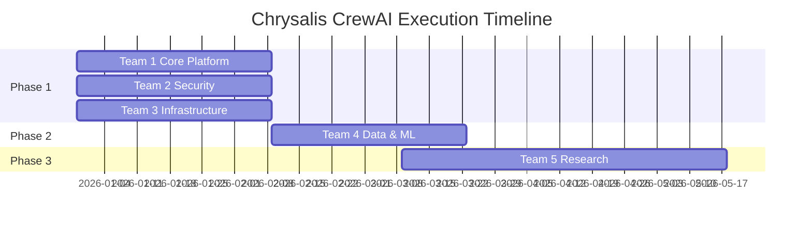
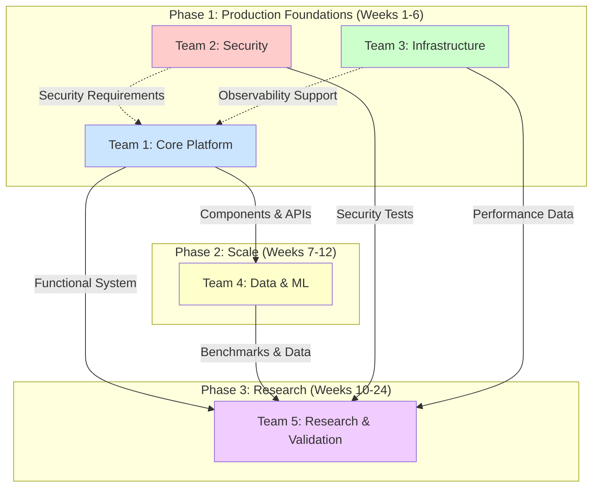

# Chrysalis CrewAI Execution Plan - Master Coordination Document

**Date**: December 28, 2025  
**Source**: Chrysalis v3.1 Specifications → CrewAI Agent Teams  
**Total Teams**: 5 specialized crews  
**Total Timeline**: 24 weeks (6 months)  
**Total Estimated Effort**: ~1,770 hours

---

## Executive Summary

This document coordinates execution across **5 CrewAI agent teams**, each with specialized expertise and clear deliverables. Teams operate in **2 phases** with **carefully managed dependencies**.

**Phase 1** (Weeks 1-6): **Production Foundations**  
→ Teams 1, 2, 3 (parallel execution)  
→ Goal: Production-ready Chrysalis v3.1

**Phase 2** (Weeks 7-12): **Scale & Performance**  
→ Team 4 (depends on Team 1)  
→ Goal: Memory system evolution

**Phase 3** (Weeks 10-24): **Research & Validation**  
→ Team 5 (depends on Teams 1 & 4)  
→ Goal: Academic validation and publication

---

## Team Overview

### Team 1: Core Platform Engineering 🔵
**Mission**: Implement agent morphing, adapters, sync, merging, pattern resolution  
**Agents**: 5 (Architect, Backend, DevEx, Integration, QA)  
**Timeline**: Weeks 1-6  
**Effort**: ~450 hours  
**Status**: ✅ Ready for immediate execution  
**Blocking**: None (starts immediately)

**Key Deliverables**:
- PatternResolver (adaptive pattern selection)
- 3 Framework adapters (lossless morphing)
- 3 Sync protocols (experience synchronization)
- State merging (memory, skills, knowledge)
- CLI interface
- Comprehensive test suite (>85% coverage)

### Team 2: Security & Cryptography 🔴
**Mission**: Harden security, implement threat mitigations, key management  
**Agents**: 4 (Security Architect, Crypto Engineer, Security Tester, Compliance)  
**Timeline**: Weeks 1-6 (parallel with Team 1)  
**Effort**: ~288 hours  
**Status**: ✅ Ready for immediate execution  
**Blocking**: None (provides requirements to Team 1)

**Key Deliverables**:
- Threat model (comprehensive)
- Sybil resistance (instance registry)
- Key rotation protocol
- Security test suite (100+ scenarios)
- Audit logging (all security events)
- Security monitoring dashboards

### Team 3: Infrastructure & Operations 🟢
**Mission**: Build observability, deployment automation, monitoring  
**Agents**: 5 (DevOps Lead, Observability, Container, CI/CD, SRE)  
**Timeline**: Weeks 1-6 (parallel with Teams 1 & 2)  
**Effort**: ~368 hours  
**Status**: ✅ Ready for immediate execution  
**Blocking**: None (infrastructure supports all teams)

**Key Deliverables**:
- OpenTelemetry instrumentation (20+ metrics)
- Prometheus + Grafana (4 dashboards)
- Docker images (3 images, security-scanned)
- Kubernetes deployment (Helm chart)
- CI/CD pipeline (GitHub Actions + Argo CD)
- SLOs and runbooks (operational readiness)

### Team 4: Data & Machine Learning 🟡
**Mission**: Implement embeddings, vector indexing, persistence  
**Agents**: 3 (ML Engineer, Vector DB Engineer, Performance Engineer)  
**Timeline**: Weeks 7-12 (after Team 1)  
**Effort**: ~240 hours  
**Status**: ⏸️ Blocked on Team 1 completion  
**Blocking**: Team 1 must complete MemoryMerger

**Key Deliverables**:
- Semantic embeddings (@xenova/transformers)
- HNSW vector indexing (O(log N) search)
- LanceDB persistence (disk-based memory)
- Performance benchmarks (comprehensive)
- Memory system scales to 100K+ memories

### Team 5: Research & Validation 🟣
**Mission**: Validate claims, comparative evaluation, publications  
**Agents**: 3 (Research Scientist, Verification Engineer, Technical Writer)  
**Timeline**: Weeks 10-24 (overlapping Phase 2-3)  
**Effort**: ~424 hours  
**Status**: ⏸️ Blocked on Teams 1 & 4  
**Blocking**: Needs functional system + benchmarks

**Key Deliverables**:
- Comparative evaluation (vs 3+ frameworks)
- 2 research papers (peer-review ready)
- Formal verification (TLA+ specs)
- Reproducibility package
- Blog posts and conference talks

---

## Execution Timeline



### Week-by-Week Schedule

**Weeks 1-2: Architecture & Design**
- Team 1: Architect designs (PatternResolver, schema, contracts)
- Team 2: Security architect creates threat model and designs
- Team 3: DevOps lead designs observability and deployment
- All teams: Foundational design work

**Weeks 3-4: Core Implementation**
- Team 1: Backend implements PatternResolver, starts adapters
- Team 2: Crypto engineer implements Sybil resistance
- Team 3: Observability engineer instruments code, Container engineer creates images

**Weeks 5-6: Integration & Testing**
- Team 1: Complete adapters, sync, merging. QA testing. DevEx builds CLI.
- Team 2: Complete key rotation, security testing, audit logging
- Team 3: Complete K8s deployment, CI/CD, SRE runbooks

**Phase 1 Milestone** (End of Week 6): **Production-Ready v3.1** ✅

**Weeks 7-9: ML Integration**
- Team 4: ML engineer integrates embeddings, updates MemoryMerger
- Team 4: Vector DB engineer implements HNSW indexing

**Weeks 10-12: Persistence & Performance**
- Team 4: Vector DB engineer integrates LanceDB
- Team 4: Performance engineer benchmarks everything
- Team 5: Research scientist starts comparative evaluation

**Phase 2 Milestone** (End of Week 12): **Scalable Memory System** ✅

**Weeks 13-18: Research & Evaluation**
- Team 5: Comparative evaluation continues
- Team 5: Write fractal composition paper
- Team 5: Create reproducibility package
- Team 5: Write blog posts

**Weeks 19-24: Formal Verification & Publication**
- Team 5: TLA+ specifications and verification
- Team 5: Byzantine agents paper
- Team 5: Conference talk preparation
- Team 5: Paper submissions

**Phase 3 Milestone** (End of Week 24): **Academic Validation Complete** ✅

---

## Critical Path Analysis

**Critical Path** (longest dependent sequence):
```
Team 1 → Team 4 → Team 5 (Research)
6 weeks + 6 weeks + 14 weeks = 26 weeks total
```

**Parallel Execution Opportunities**:
- Weeks 1-6: Teams 1, 2, 3 work simultaneously
- Weeks 7-12: Team 4 works while Team 5 can start evaluation setup
- Weeks 13-24: Team 5 continues (minimal blocking)

**Bottlenecks**:
1. **Week 6**: Team 1 must complete before Team 4 can start
2. **Week 12**: Team 4 must have benchmarks before Team 5 evaluation
3. No other hard blocks (good parallelism)

---

## Resource Requirements

### Human Resources

**Phase 1** (Weeks 1-6):
- Team 1: 5 agents (40h/week each) = 1,200 agent-hours
- Team 2: 4 agents (40h/week each) = 960 agent-hours
- Team 3: 5 agents (40h/week each) = 1,200 agent-hours
- **Total**: 14 agents, 3,360 agent-hours

**Phase 2** (Weeks 7-12):
- Team 4: 3 agents (40h/week each) = 720 agent-hours

**Phase 3** (Weeks 10-24):
- Team 5: 3 agents (~30h/week) = 1,260 agent-hours

**Grand Total**: ~5,340 agent-hours over 24 weeks

**Human Equivalent**: If 1 human = 0.5 agents (accounting for coordination overhead):
- ~10,680 human-hours = ~6.7 FTE over 6 months
- Or ~7 engineers working full-time for 6 months

### Computational Resources

**Phase 1-2**:
- Development machines (local or cloud)
- CI/CD runners (GitHub Actions: free for public repos)
- Test environments (Kubernetes: $0-500/month)

**Phase 2-3** (ML):
- GPU instances for embedding generation (optional, CPU works)
- Storage for vector databases (~100GB)
- Costs: $100-500/month

**Phase 3** (Research):
- Compute for experiments (AWS/GCP: $200-1000/month)
- Storage for datasets and results (~500GB)

**Total Estimated Compute**: $500-2000/month during active phases

---

## Dependencies Graph



**Dependency Rules**:
1. Team 4 **cannot start** until Team 1 completes MemoryMerger (Week 6)
2. Team 5 **cannot complete evaluation** until Team 4 has benchmarks (Week 12)
3. Teams 1, 2, 3 can work **fully in parallel** (minimal blocking)
4. Team 2 provides requirements to Team 1 (Week 1-2, non-blocking)
5. Team 3 provides infrastructure to all (continuous, non-blocking)

---

## Communication & Coordination

### Daily Standups (15 minutes)
**Within each team**:
- What did you complete yesterday?
- What will you do today?
- Any blockers?

**Cross-team**: Not needed (dependencies managed via artifacts)

### Weekly Sync (1 hour)
**All teams** (Fridays):
- Progress updates (what's done, what's next)
- Dependency status (blocking anyone?)
- Risk identification (new risks?)
- Coordination needs (integration points)

**Attendees**: Team leads (Architect, Security Architect, DevOps Lead, ML Engineer, Research Scientist)

### Phase Gates (4 hours)
**End of Week 6** (Phase 1 → Phase 2):
- Demo: Chrysalis core functionality
- Review: Test results, security scan, deployment
- Decision: Go/No-Go for Phase 2
- Retrospective: What worked, what didn't

**End of Week 12** (Phase 2 → Phase 3):
- Demo: Memory system with 100K memories
- Review: Performance benchmarks, scalability
- Decision: Go/No-Go for Phase 3

**End of Week 24** (Project Complete):
- Demo: Full system with all features
- Review: Research results, publications
- Retrospective: Project lessons learned

### Artifact Sharing
**Shared Repository**: GitHub (Replicant-Partners/Chrysalis)

**Branches**:
- `main` - Stable, deployable
- `develop` - Integration branch
- `team1-*`, `team2-*`, etc. - Team branches
- PRs for code review and integration

**Documentation**: `docs/` folder (all teams contribute)

**Communication**: GitHub Issues, Discussions, PR comments

---

## Risk Management

### Technical Risks

**Risk 1**: MCP SDK Insufficient
- **Team**: Team 1 (Integration Engineer)
- **Mitigation**: Test early (Week 3), have embedded-only fallback
- **Impact**: Medium (can still deliver embedded mode)

**Risk 2**: Memory Performance Below Target
- **Team**: Team 4 (Performance Engineer)
- **Mitigation**: Continuous benchmarking, optimize aggressively
- **Impact**: High (blocks scaling claims)

**Risk 3**: Test Coverage Target Missed
- **Team**: Team 1 (QA Engineer)
- **Mitigation**: Start testing early, allocate extra time in Week 6
- **Impact**: Medium (technical debt)

### Security Risks

**Risk 4**: Sybil Resistance Insufficient
- **Team**: Team 2 (Security Architect + Tester)
- **Mitigation**: Security review, red team testing, iterate
- **Impact**: Critical (breaks Byzantine tolerance)

**Risk 5**: Key Rotation Complexity
- **Team**: Team 2 (Crypto Engineer)
- **Mitigation**: Comprehensive testing, phased rollout
- **Impact**: High (security + operations)

### Operational Risks

**Risk 6**: Kubernetes Deployment Complexity
- **Team**: Team 3 (Container Engineer)
- **Mitigation**: Provide Docker Compose alternative, excellent docs
- **Impact**: Medium (adoption barrier)

**Risk 7**: Observability Performance Overhead
- **Team**: Team 3 (Observability Engineer)
- **Mitigation**: Measure continuously, use sampling
- **Impact**: Low (OpenTelemetry is efficient)

### Research Risks

**Risk 8**: Comparative Evaluation Shows Chrysalis Underperforms
- **Team**: Team 5 (Research Scientist)
- **Mitigation**: Honest reporting, focus on unique strengths (security, persistence)
- **Impact**: Medium (marketing challenge)

**Risk 9**: Paper Rejections
- **Team**: Team 5 (Research Scientist)
- **Mitigation**: Target multiple venues, incorporate feedback, resubmit
- **Impact**: Low (research is iterative)

### Mitigation Strategy

**Weekly Risk Review**: During Friday sync, review risk register  
**Risk Owner**: Each risk assigned to specific agent/team  
**Escalation**: High/Critical risks escalated to project leadership  
**Documentation**: All risks tracked in RISKS.md

---

## Quality Gates

### Phase 1 Gate (End of Week 6)

**Technical Quality**:
- [ ] Build passes with 0 TypeScript errors
- [ ] Test coverage >85% (measured)
- [ ] All adapters pass lossless roundtrip tests (100% accuracy)
- [ ] Performance: PatternResolver <0.5ms, Adapter <10ms, Sync <100ms
- [ ] ESLint: 0 errors
- [ ] TypeScript strict mode: passes

**Security Quality**:
- [ ] Threat model documented and reviewed
- [ ] Sybil resistance implemented and tested
- [ ] Key rotation functional
- [ ] Security test suite: 100+ scenarios, all pass
- [ ] Trivy scan: 0 critical/high vulnerabilities
- [ ] Audit logging operational

**Operational Quality**:
- [ ] OpenTelemetry instrumented (20+ metrics)
- [ ] Dashboards deployed and functional (4+)
- [ ] Docker images published and signed
- [ ] Kubernetes deployment successful
- [ ] CI/CD pipeline operational
- [ ] Health checks passing

**Documentation Quality**:
- [ ] API reference complete
- [ ] 3 tutorials written
- [ ] 10 code examples working
- [ ] CLI help comprehensive
- [ ] Runbooks complete (6+)

**Gate Decision**: If <90% of criteria met, extend Phase 1 by 1-2 weeks

### Phase 2 Gate (End of Week 12)

**Functionality**:
- [ ] Semantic embeddings functional
- [ ] HNSW indexing operational
- [ ] LanceDB persistence working
- [ ] Full integration with MemoryMerger

**Performance**:
- [ ] Embedding latency <50ms p99
- [ ] HNSW search <10ms p99 for 100K vectors
- [ ] Memory system handles 100K+ memories
- [ ] Search is O(log N) (empirically verified)

**Accuracy**:
- [ ] Semantic similarity >90% for paraphrases
- [ ] HNSW recall >95% @ top-10
- [ ] 30%+ improvement over Jaccard (measured)

**Gate Decision**: If <90% of criteria met, extend Phase 2 by 1-2 weeks

### Phase 3 Gate (End of Week 24)

**Research**:
- [ ] Comparative evaluation complete (4 frameworks)
- [ ] 2 research papers drafted (ready for submission)
- [ ] Formal verification complete (or in progress)
- [ ] Results reproducible (package tested)

**Communication**:
- [ ] 3 blog posts published
- [ ] Conference talk proposal submitted
- [ ] Community engagement positive

**Gate Decision**: Research is iterative; extend if papers need revision

---

## Integration Points

### Team 1 ↔ Team 2
**Provides**: Security requirements, threat model (Week 1-2)  
**Receives**: Core components to secure (Week 3-6)  
**Integration**: Team 2 provides AuditLogger, InstanceRegistry for Team 1 to use

### Team 1 ↔ Team 3
**Provides**: Infrastructure support (observability, deployment) throughout  
**Receives**: Code to instrument and deploy  
**Integration**: Team 3 instruments Team 1's code via OpenTelemetry

### Team 1 → Team 4
**Critical Handoff** (End of Week 6):
- MemoryMerger implementation (working, tested)
- UniformSemanticAgentV2 schema (finalized)
- Interfaces for integration

**Quality Criteria**:
- MemoryMerger has >90% test coverage
- Configuration interface clear (similarity_method, thresholds)
- Documentation complete

### Team 4 → Team 5
**Handoff** (End of Week 12):
- Functional memory system (embeddings + HNSW + persistence)
- Performance benchmarks (comprehensive)
- Scaling data (latency vs size graphs)

**Quality Criteria**:
- Memory system handles 100K+ memories
- Benchmarks show O(log N) scaling
- Results reproducible

### All Teams → Team 5
**Continuous**:
- Test results
- Performance data
- Security test outcomes
- Deployment metrics

---

## Success Metrics (Quantitative)

### Phase 1 Success Metrics

**Technical**:
- ✅ 100% lossless conversion (roundtrip test)
- ✅ >85% test coverage
- ✅ <0.5ms PatternResolver overhead
- ✅ <100ms p99 for all operations

**Security**:
- ✅ 100+ security test scenarios pass
- ✅ 0 critical Trivy vulnerabilities
- ✅ Sybil attack prevention tested
- ✅ <1% false positive rate

**Operations**:
- ✅ 20+ metrics instrumented
- ✅ 4+ dashboards functional
- ✅ <2% observability overhead
- ✅ <5 min CI pipeline

**Documentation**:
- ✅ 100% public API documented
- ✅ 3 tutorials (tested by external users)
- ✅ 10 examples (all functional)

### Phase 2 Success Metrics

**Functionality**:
- ✅ Embeddings generate in <50ms p99
- ✅ HNSW search in <10ms p99
- ✅ 100K+ memories supported

**Performance**:
- ✅ O(log N) scaling empirically verified
- ✅ >95% HNSW recall
- ✅ 30%+ accuracy improvement (embedding vs Jaccard)

### Phase 3 Success Metrics

**Research**:
- ✅ Comparative evaluation rigorous (4 frameworks, 30+ runs each)
- ✅ Statistical significance achieved (p < 0.05)
- ✅ 2 papers submitted
- ✅ Reproducibility validated (external researcher can reproduce)

**Impact**:
- ✅ GitHub stars >1000
- ✅ Blog views >10K per post
- ✅ Conference talk accepted (1+ venue)

---

## Budget Estimate

### Phase 1 (Weeks 1-6)

**Labor** (if human equivalent):
- 14 agents * 6 weeks * 40h = 3,360 agent-hours
- At 0.5 human equivalent = 6,720 human-hours
- At $150/hour (senior engineer rate) = **$1,008,000**

**Infrastructure**:
- CI/CD: $0 (GitHub Actions free for public)
- Test environments: $0-500/month
- **Total**: $0-3,000

### Phase 2 (Weeks 7-12)

**Labor**:
- 3 agents * 6 weeks * 40h = 720 agent-hours
- At 0.5 human equivalent = 1,440 human-hours
- At $150/hour = **$216,000**

**Infrastructure**:
- ML compute: $200-500/month
- Storage: $50/month
- **Total**: $1,500-3,300

### Phase 3 (Weeks 10-24)

**Labor**:
- 3 agents * 14 weeks * 30h = 1,260 agent-hours
- At 0.5 human equivalent = 2,520 human-hours
- At $150/hour = **$378,000**

**Infrastructure**:
- Experiment compute: $500-1000/month
- Conference registration: $500-1000
- **Total**: $8,000-20,000

### Grand Total Estimate

**Labor**: ~$1.6M (if human-equivalent at senior engineer rates)  
**Infrastructure**: ~$15K-25K  
**Total**: ~$1.6M

**Note**: This assumes CrewAI agents work at 0.5x human productivity. If higher (say 0.8x), costs proportionally less. If fully automated agents, labor cost approaches zero (just compute costs).

---

## Execution Checklist

### Before Starting (Day 0)

**Repository Setup**:
- [ ] GitHub repository ready (Replicant-Partners/Chrysalis)
- [ ] Branch structure created (main, develop, team branches)
- [ ] Issue templates configured
- [ ] PR template configured
- [ ] GitHub Actions enabled

**Team Setup**:
- [ ] All 5 team configurations validated
- [ ] CrewAI agents configured
- [ ] Tools and dependencies available
- [ ] Communication channels established (Discord, Slack, or GitHub Discussions)

**Documentation**:
- [ ] All specification documents accessible
- [ ] Team plans reviewed by project leadership
- [ ] Execution plan approved
- [ ] Resources allocated

### Week 1 Startup

**Team 1**:
- [ ] Platform Architect starts TASK-1.1.1 (PatternResolver design)
- [ ] Platform Architect starts TASK-1.1.2 (schema review)
- [ ] QA Engineer starts TASK-1.5.1 (test infrastructure)

**Team 2**:
- [ ] Security Architect starts TASK-2.1.1 (threat model)

**Team 3**:
- [ ] DevOps Lead starts TASK-3.1.1 (observability architecture)
- [ ] Container Engineer starts TASK-3.3.1 (Docker images)

### Weekly Checkpoints

**Every Friday**:
- [ ] Each team reports progress (completed tasks, in-progress, blocked)
- [ ] Update risk register
- [ ] Review integration points
- [ ] Adjust schedule if needed
- [ ] Document decisions and learnings

### Phase Transitions

**End of Phase 1** (Week 6):
- [ ] Phase 1 quality gate passed
- [ ] Demo recorded
- [ ] Handoff to Team 4 (artifacts ready)
- [ ] Retrospective completed
- [ ] Phase 2 kickoff

**End of Phase 2** (Week 12):
- [ ] Phase 2 quality gate passed
- [ ] Performance report published
- [ ] Handoff to Team 5 (benchmarks ready)
- [ ] Retrospective completed
- [ ] Phase 3 continues

**End of Phase 3** (Week 24):
- [ ] Phase 3 complete (papers drafted, verification done)
- [ ] Final demo
- [ ] Project retrospective
- [ ] Community announcement
- [ ] Celebration 🎉

---

## Contingency Plans

### If Team 1 Falls Behind (Week 6 Deadline at Risk)

**Options**:
1. **Extend Phase 1** by 1-2 weeks (delay Team 4 start)
2. **Reduce scope**: Defer CLI (TASK-1.3.1) to Phase 3
3. **Add resources**: Bring in additional engineer
4. **Parallelize more**: DevEx and Integration work earlier

**Decision Criteria**: If >75% of Team 1 tasks complete by Week 5, extend. If <75%, reduce scope.

### If Team 4 Performance Targets Not Met

**Options**:
1. **Optimize more**: Add 1-2 weeks for optimization (TASK-4.3.2 extended)
2. **Adjust targets**: If performance is 80% of target but usable, accept
3. **Alternative technology**: If @xenova/transformers is bottleneck, consider Python bridge
4. **Defer HNSW**: If HNSW is problematic, use simpler indexing (LSH)

**Decision Criteria**: If performance is >70% of target and functional, proceed. If <70%, investigate alternatives.

### If Team 2 Finds Critical Security Flaw

**Process**:
1. **Immediate halt**: Stop related work
2. **Assess severity**: CVSS score, exploitability
3. **Design fix**: Security team proposes mitigation
4. **Implement ASAP**: Priority override
5. **Re-test**: Full security test suite
6. **Document**: Add to threat model and lessons learned

**Timeline Impact**: Could delay Phase 1 by days to weeks depending on severity.

---

## Deliverables Summary (All Teams)

### Code (Total: ~15,000 lines)
**Team 1**: ~5,000 lines (core platform)  
**Team 2**: ~2,500 lines (security)  
**Team 3**: ~3,000 lines (infrastructure + config)  
**Team 4**: ~4,000 lines (ML + persistence)  
**Team 5**: ~500 lines (experiments)

### Tests (Total: ~10,000 lines)
**Team 1**: ~4,000 lines (unit, integration, property)  
**Team 2**: ~3,000 lines (security, Byzantine, fuzzing)  
**Team 3**: ~500 lines (infrastructure tests)  
**Team 4**: ~2,000 lines (ML, vector, performance)  
**Team 5**: ~500 lines (verification)

### Documentation (Total: ~200 pages)
**Team 1**: ~50 pages (API, tutorials, examples)  
**Team 2**: ~40 pages (security, threat model)  
**Team 3**: ~50 pages (operations, runbooks)  
**Team 4**: ~30 pages (ML, performance)  
**Team 5**: ~30 pages (papers, research)

### Infrastructure Config (Total: ~5,000 lines)
**Team 3**: Docker, Kubernetes, Helm, CI/CD, Observability

---

## Monitoring & Reporting

### Automated Metrics

**GitHub**:
- Commits per day (velocity)
- PRs opened/merged (throughput)
- Issues closed (progress)
- Test coverage (quality)

**CI/CD**:
- Build success rate (stability)
- Test pass rate (quality)
- Build time (efficiency)
- Security scan results (security)

**Project Board**:
- Tasks completed (progress)
- Tasks in progress (WIP)
- Tasks blocked (bottlenecks)
- Burn-down chart (timeline)

### Manual Reports

**Weekly Status Report** (Every Friday):
```markdown
# Chrysalis Week X Status

## Progress
- Team 1: [% complete] - [key accomplishments]
- Team 2: [% complete] - [key accomplishments]
- Team 3: [% complete] - [key accomplishments]
- Team 4: [% complete] - [key accomplishments]
- Team 5: [% complete] - [key accomplishments]

## Highlights
- [Major achievement]
- [Significant milestone]

## Challenges
- [Blocker or risk]
- [Issue needing attention]

## Next Week
- [Key objectives for each team]

## Metrics
- Lines of code: [total]
- Test coverage: [%]
- Issues closed: [count]
- PRs merged: [count]
```

**Phase Reports** (End of Each Phase):
- Comprehensive review (30-50 pages)
- Demo video recording
- Lessons learned
- Recommendations for next phase

---

## Success Criteria (Overall Project)

### Technical Success ✅
- [ ] Chrysalis v3.1 functional and tested
- [ ] Memory system scales to 100K+ memories
- [ ] All security tests pass
- [ ] Deployment automated
- [ ] >85% test coverage

### Research Success ✅
- [ ] 2 papers submitted to peer review
- [ ] Comparative evaluation rigorous and complete
- [ ] Formal verification properties proven
- [ ] Reproducibility package available

### Community Success ✅
- [ ] GitHub stars >1000
- [ ] Contributors >10
- [ ] Blog views >30K total
- [ ] Conference talk accepted

### Operational Success ✅
- [ ] 99.9% uptime (if deployed)
- [ ] <100ms p99 latency
- [ ] SLOs met
- [ ] Incident response <30 min

### Open Source Success ✅
- [ ] All code open source (Apache 2.0)
- [ ] All dependencies open source
- [ ] Active community (Issues, PRs, Discussions)
- [ ] Upstream contributions made

---

## Post-Project Activities

### Knowledge Transfer
- [ ] Final documentation review
- [ ] Video tutorials recorded
- [ ] Architecture decision records (ADR) documented
- [ ] Lessons learned published

### Community Building
- [ ] Announce 1.0 release
- [ ] Write launch blog post
- [ ] Social media campaign
- [ ] Engage with early adopters

### Ongoing Maintenance
- [ ] Assign maintainers (1-2 per team)
- [ ] Set up on-call rotation (if needed)
- [ ] Define maintenance SLA
- [ ] Plan for future features (v3.2, v3.3)

---

## Conclusion

This execution plan coordinates **5 specialized CrewAI agent teams** over **24 weeks** to transform Chrysalis from specifications to production-grade platform with academic validation.

**Critical Success Factors**:
1. ✅ **Clear specifications** (provided)
2. ✅ **Well-defined tasks** (provided in team plans)
3. ✅ **Managed dependencies** (clearly documented)
4. ⏸️ **Committed resources** (needs confirmation)
5. ⏸️ **Strong coordination** (needs execution discipline)

**Ready for Execution**: ✅ All plans complete  
**Next Action**: Review and approve, then create CrewAI agent crews  
**Expected Outcome**: Production-grade Chrysalis in 6 months

🦋 **From specifications to execution to reality** 🦋

---

**Master Plan**: ✅ COMPLETE  
**Team Plans**: ✅ 5 detailed YAML configurations  
**Coordination**: ✅ Dependencies managed  
**Timeline**: ✅ 24 weeks planned  
**Quality Gates**: ✅ Defined  

**Status**: **READY TO EXECUTE**
