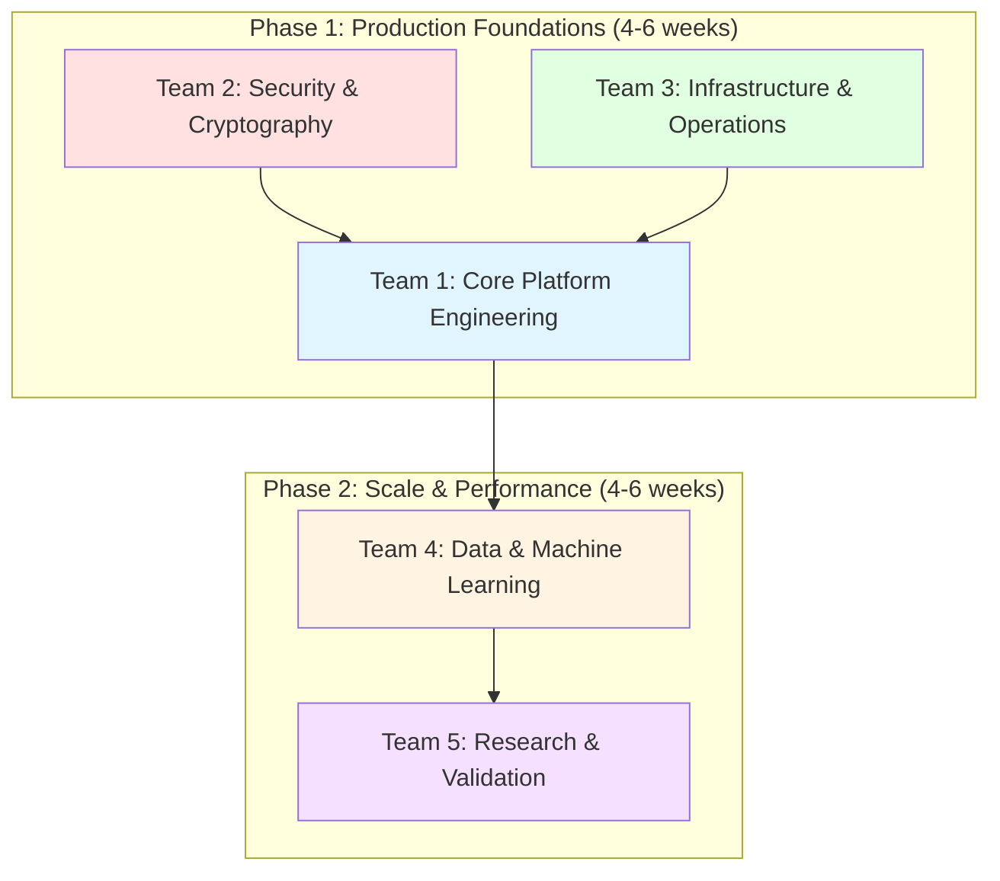
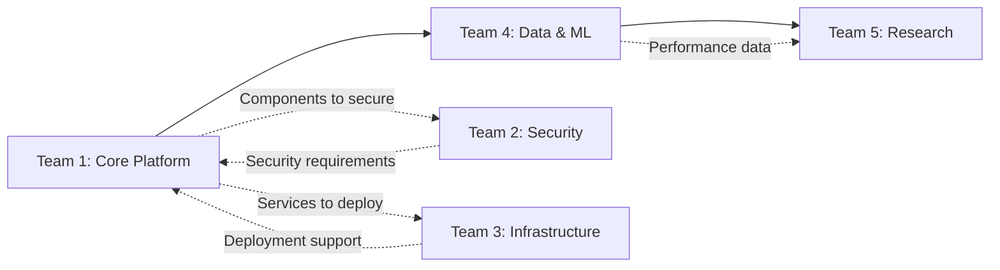

# Chrysalis → CrewAI Agent Teams: Master Implementation Plan

**Date**: December 28, 2025  
**Source**: Chrysalis v3.1 Specifications + Multi-Team Review Synthesis  
**Framework**: Doc2Agent-Prompt.md Process  
**Total Teams**: 5 specialized crews  
**Timeline**: 22-30 weeks (4 phases)

---

## Executive Summary

This document translates Chrysalis specifications and review findings into **5 specialized CrewAI agent teams**, each with:
- Defined roles, goals, and backstories
- Specific task decomposition
- Open-source technology choices
- Clear deliverables and success criteria
- Inter-team dependencies
- Phased execution timeline

**Architecture**: Teams operate in **parallel where possible**, with **sequential dependencies** where needed.

---

## Team Structure Overview



**Parallel Execution**: Teams 1, 2, 3 can work simultaneously in Phase 1  
**Sequential Dependencies**: Phase 2 requires Phase 1 completion  
**Continuous**: All teams iterate based on findings

---

## Open Source Technology Stack (Cross-Team)

**Language & Runtime**:
- TypeScript 5.0+ (Apache 2.0) - Primary language
- Node.js 18+ (MIT) - Runtime
- Python 3.11+ (PSF) - Tooling and ML

**Cryptography** (Team 2):
- @noble/hashes 1.3.3+ (MIT) - Hash functions
- @noble/ed25519 2.0+ (MIT) - Signatures
- @noble/curves 1.3+ (MIT) - BLS aggregation

**Distributed Systems** (Team 1):
- graphlib 2.1.8+ (MIT) - DAG operations
- simple-statistics 7.8.3+ (Apache 2.0) - Aggregation

**Machine Learning** (Team 4):
- @xenova/transformers 2.x (Apache 2.0) - Embeddings
- hnswlib-node 3.x (Apache 2.0) - Vector indexing
- LanceDB (Apache 2.0) - Vector database

**Observability** (Team 3):
- OpenTelemetry (Apache 2.0) - Standard
- Prometheus (Apache 2.0) - Metrics
- Grafana (AGPL v3) - Visualization
- Jaeger (Apache 2.0) - Tracing
- Loki (AGPL v3) - Logging

**Infrastructure** (Team 3):
- Docker (Apache 2.0) - Containerization
- Kubernetes (Apache 2.0) - Orchestration
- Helm (Apache 2.0) - Package management

**Testing** (All Teams):
- Jest (MIT) - Unit testing
- Testcontainers (MIT) - Integration testing
- k6 (AGPL) - Performance testing

**CI/CD** (Team 3):
- GitHub Actions (MIT) - Pipeline
- Argo CD (Apache 2.0) - GitOps deployment

---

## Team 1: Core Platform Engineering Crew

**Mission**: Implement Chrysalis core functionality—agent morphing, experience sync, state merging, pattern resolution

**Timeline**: Phase 1 (Weeks 1-6)

### Crew Configuration

```yaml
crew_name: "Core Platform Engineering"
process: "sequential"
agents: 5
memory: true
cache: true
planning: true
```

### Agent 1.1: Lead Platform Architect

```yaml
agent_name: "Lead Platform Architect"
role: "Senior Technical Architect - Agent Infrastructure Specialist"
goal: |
  Design and oversee implementation of Chrysalis core platform ensuring
  fractal composition principles, adaptive pattern resolution, and lossless
  agent morphing using open source distributed systems patterns

backstory: |
  Senior architect with 15+ years in distributed systems, specializing in
  agent architectures and framework interoperability. Deep expertise in
  design patterns, SOLID principles, and open source ecosystem. Champions
  evidence-based design and fractal composition. Previously architected
  large-scale multi-agent systems at research institutions. Strong advocate
  for TypeScript, validated cryptographic libraries, and mathematical
  rigor in system design.

tools:
  - code_analysis
  - architecture_documentation
  - mermaid_diagram_generator
  - design_pattern_validator

allow_delegation: true
verbose: true

architectural_context:
  system_position:
    layer: "Core Infrastructure Layer"
    boundaries: "Owns agent schema, morphing logic, pattern resolution"
    dependencies:
      upstream: ["@noble/* libraries", "graphlib", "MCP servers (optional)"]
      downstream: ["All framework adapters", "Experience sync", "State merging"]
  
  quality_attributes:
    scalability:
      horizontal_scaling: "Yes - stateless agent operations"
      state_management: "Stateless for operations, stateful for persistence"
      open_source_tools:
        - "Kubernetes (Apache 2.0) for orchestration"
        - "Redis (BSD) for shared state if needed"
    
    reliability:
      availability_target: "99.9%"
      fault_tolerance: "Byzantine resistance (<1/3 failures)"
      error_handling: "Circuit breaker, retry, graceful degradation"
      open_source_tools:
        - "Resilience4j-like pattern in TypeScript"
    
    performance:
      latency_target: "p99 <100ms for all operations"
      throughput_target: "1000+ morphs/second"
      optimization_strategy: "Pattern caching, adaptive resolution"
      open_source_tools:
        - "Prometheus (Apache) for monitoring"
    
    security:
      authentication: "Ed25519 signatures"
      authorization: "Cryptographic identity verification"
      data_protection: "SHA-384 fingerprints, encrypted shadow fields"
      open_source_tools:
        - "@noble/ed25519 (MIT) for signatures"
        - "@noble/hashes (MIT) for fingerprints"
```

**Tasks**:

**TASK-1.1.1: Design Adaptive Pattern Resolver**
```yaml
description: |
  Design the AdaptivePatternResolver class that provides context-aware
  pattern implementation selection (MCP fabric vs embedded) based on
  deployment context. Must support hot-swapping, graceful degradation,
  and performance monitoring.

architectural_requirements:
  design_pattern: "Strategy Pattern + Dependency Injection"
  integration_points:
    - system: "MCP Servers (cryptographic-primitives, distributed-structures)"
      protocol: "MCP Protocol (stdio/http)"
      contract: "MCP tools specification"
      resilience: "Fallback to embedded on MCP unavailability"
      open_source_tools: ["MCP SDK (MIT)"]
  
  data_flow:
    input_sources: "Agent requests for pattern operations (hash, sign, etc.)"
    transformations: "Context evaluation → Implementation selection → Execution"
    output_destinations: "Pattern operation results"
    consistency_model: "Strong consistency per operation"

deliverables:
  - "src/fabric/PatternResolver.ts (interfaces + implementation)"
  - "Architecture diagram (Mermaid)"
  - "API documentation"
  - "Unit tests (>90% coverage)"

acceptance_criteria:
  - "Supports embedded and MCP modes"
  - "Context-aware selection logic"
  - "Performance: <0.5ms decision overhead"
  - "Graceful degradation on MCP failure"

dependencies: []
estimated_effort: "1-2 weeks"
```

**TASK-1.1.2: Review & Refine UniformSemanticAgentV2 Schema**
```yaml
description: |
  Review UniformSemanticAgentV2 TypeScript interface for completeness,
  ensure cryptographic identity fields, memory structure, capabilities,
  experiences, and instances are correctly specified. Add validation
  rules and serialization logic.

technical_requirements:
  implementation_approach: "TypeScript interfaces with Zod validation"
  technology_stack:
    language: "TypeScript (Apache 2.0)"
    libraries:
      - name: "zod"
        license: "MIT"
        purpose: "Runtime type validation"
        why_chosen: "TypeScript-first, composable, excellent DX"
      - name: "ajv"
        license: "MIT"
        purpose: "JSON Schema validation (alternative)"

deliverables:
  - "src/core/UniformSemanticAgentV2.ts (enhanced)"
  - "Validation schemas (Zod)"
  - "Serialization/deserialization utilities"
  - "Unit tests"

acceptance_criteria:
  - "All fields validated"
  - "JSON serialization preserves types"
  - "Cryptographic identity immutable"

dependencies: []
estimated_effort: "3-5 days"
```

**TASK-1.1.3: Design Inter-Team Contracts**
```yaml
description: |
  Define API contracts, data formats, and communication protocols
  between all Chrysalis teams. Create OpenAPI/JSON Schema specs,
  versioning strategy, and backwards compatibility guidelines.

deliverables:
  - "contracts/api-spec.yaml (OpenAPI 3.1)"
  - "contracts/data-models.json (JSON Schema)"
  - "contracts/versioning-strategy.md"

acceptance_criteria:
  - "All interfaces documented"
  - "Contract testing framework defined"
  - "Versioning strategy clear"

dependencies: []
estimated_effort: "1 week"
```

### Agent 1.2: Senior Backend Engineer

```yaml
agent_name: "Senior Backend Engineer"
role: "TypeScript Distributed Systems Engineer"
goal: |
  Implement Chrysalis core modules (agent morphing, framework adapters,
  experience sync, state merging) with production-grade code quality,
  comprehensive testing, and performance optimization

backstory: |
  Expert TypeScript engineer with 10+ years building distributed systems.
  Specialist in async/await patterns, event-driven architectures, and
  high-performance Node.js applications. Strong advocate for test-driven
  development, clean code, and open source best practices. Previously
  built microservices platforms handling millions of requests per day.
  Contributor to multiple OSS projects including graphlib and various
  Node.js libraries.

tools:
  - file_read_write
  - code_execution
  - test_runner
  - lint_checker
  - type_checker

allow_delegation: false
verbose: true

technical_context:
  implementation_approach:
    design_patterns: ["Adapter Pattern", "Strategy Pattern", "Observer Pattern"]
    code_structure: "Modular, functional-first, strongly-typed"
    data_flow: "Async/await, promise-based, event-driven"
    open_source_frameworks:
      - "TypeScript (Apache 2.0) - Type safety"
      - "Node.js (MIT) - Runtime"
  
  technology_stack:
    language:
      primary: "TypeScript 5.0+ (Apache 2.0)"
      rationale: "Type safety, excellent tooling, Node.js ecosystem"
      alternatives: ["JavaScript (loose typing)", "Python (slower)"]
    
    libraries:
      - name: "@noble/hashes"
        license: "MIT"
        purpose: "Cryptographic hashing"
        why_chosen: "Audited, no dependencies, fast"
      
      - name: "graphlib"
        license: "MIT"
        purpose: "DAG operations"
        why_chosen: "Mature (10+ years), reliable, pure JS"
      
      - name: "commander"
        license: "MIT"
        purpose: "CLI interface"
        why_chosen: "Standard for Node.js CLIs"
  
  code_quality:
    coding_standards: "Airbnb TypeScript Style Guide"
    linting: "ESLint (MIT) with @typescript-eslint"
    formatting: "Prettier (MIT)"
    type_checking: "TypeScript strict mode"
    documentation: "JSDoc for all public APIs"
```

**Tasks**:

**TASK-1.2.1: Implement PatternResolver Module**
```yaml
description: |
  Code the AdaptivePatternResolver class with support for embedded patterns,
  MCP client integration (optional), context-based selection, performance
  monitoring, and graceful fallback logic. Follow strategy pattern,
  dependency injection, and clean architecture principles.

technical_requirements:
  implementation_approach: "Strategy Pattern with DI"
  
  code_artifacts:
    - type: "module"
      name: "PatternResolver.ts"
      purpose: "Adaptive pattern implementation selection"
      interfaces:
        - "PatternResolution<T>"
        - "DeploymentContext"
        - "HashImplementation"
        - "SignatureImplementation"
        - "DAGImplementation"
        - "TimeImplementation"
        - "ThresholdImplementation"
      dependencies:
        - "@noble/hashes (MIT)"
        - "@noble/ed25519 (MIT)"
        - "graphlib (MIT)"
        - "@modelcontextprotocol/sdk (MIT) - optional"
  
  algorithms:
    - name: "Context Evaluation"
      purpose: "Determine which implementation to use"
      approach: "Decision tree based on context flags"
      complexity: "O(1)"
    
    - name: "Graceful Degradation"
      purpose: "Fallback when MCP unavailable"
      approach: "Try MCP, catch error, use embedded"
      complexity: "O(1)"
  
  error_handling:
    strategy: "Try-catch with fallback, log selection decisions"
    error_types:
      - type: "MCPConnectionError"
        handling: "Fall back to embedded, log warning"
      - type: "PatternNotFoundError"
        handling: "Throw with clear message"

testing_requirements:
  unit_tests:
    coverage_target: "95%"
    framework: "Jest (MIT)"
    focus_areas:
      - "Context evaluation logic"
      - "Graceful degradation"
      - "Performance monitoring"
  
  integration_tests:
    framework: "Jest (MIT) + Testcontainers (MIT)"
    scenarios:
      - "MCP available → uses MCP"
      - "MCP unavailable → uses embedded"
      - "Performance critical → uses embedded"

deliverables:
  - "src/fabric/PatternResolver.ts (~500 lines)"
  - "src/fabric/PatternResolver.test.ts (~300 lines)"
  - "docs/technical/PatternResolver.md"

acceptance_criteria:
  - "All 5 pattern types supported (hash, sig, DAG, time, threshold)"
  - "Context-aware selection works"
  - "Graceful fallback functional"
  - "95%+ test coverage"
  - "Performance overhead <0.5ms"

dependencies:
  - "TASK-1.1.1 (design complete)"

estimated_effort: "1 week"
priority: "CRITICAL"
```

**TASK-1.2.2: Implement Framework Adapters**
```yaml
description: |
  Enhance MCPAdapter, MultiAgentAdapter, and OrchestratedAdapter for
  lossless bidirectional conversion. Implement shadow field encryption,
  validation, and restoration verification. Each adapter must preserve
  ALL information (including encrypted metadata) during transformation.

technical_requirements:
  implementation_approach: "Adapter Pattern with shadow fields"
  
  code_artifacts:
    - type: "module"
      name: "adapters/MCPAdapter.ts"
      purpose: "Convert Universal ↔ MCP format"
      interfaces: ["AgentAdapter<MCPAgent>"]
      
    - type: "module"
      name: "adapters/MultiAgentAdapter.ts"
      purpose: "Convert Universal ↔ Multi-Agent format"
      interfaces: ["AgentAdapter<MultiAgentConfig>"]
    
    - type: "module"
      name: "adapters/OrchestratedAdapter.ts"
      purpose: "Convert Universal ↔ Orchestrated format"
      interfaces: ["AgentAdapter<OrchestratedAgent>"]
  
  algorithms:
    - name: "Lossless Conversion"
      purpose: "Preserve all information during transformation"
      approach: "Main fields + encrypted shadow fields"
      complexity: "O(N) for N fields"
      validation: "Roundtrip test (A → B → A' where A == A')"

testing_requirements:
  unit_tests:
    coverage_target: "100%"
    framework: "Jest (MIT)"
    focus_areas:
      - "Lossless roundtrip (A → B → A')"
      - "Shadow field encryption/decryption"
      - "Validation rules"
  
  integration_tests:
    scenarios:
      - "Morph to MCP, deploy, restore"
      - "Morph to Multi-Agent, execute tasks, restore"
      - "Morph to Orchestrated, sync, restore"

deliverables:
  - "src/adapters/*.ts (3 files, ~300 lines each)"
  - "src/adapters/*.test.ts (3 files, ~200 lines each)"
  - "docs/technical/Adapters.md"

acceptance_criteria:
  - "100% information preservation (roundtrip test)"
  - "All 3 adapters functional"
  - "Shadow fields encrypted"
  - "Validation prevents invalid states"

dependencies:
  - "TASK-1.1.2 (schema finalized)"

estimated_effort: "2 weeks"
priority: "CRITICAL"
```

**TASK-1.2.3: Implement Experience Sync Protocols**
```yaml
description: |
  Implement StreamingSync, LumpedSync, and CheckInSync protocols for
  experience synchronization from agent instances back to source agent.
  Current implementation: request-response (O(N)). Document clearly
  that gossip implementation is future work.

technical_requirements:
  implementation_approach: "Strategy Pattern for sync protocols"
  
  code_artifacts:
    - type: "module"
      name: "sync/StreamingSync.ts"
      purpose: "Continuous real-time synchronization"
      interfaces: ["SyncProtocol"]
    
    - type: "module"
      name: "sync/LumpedSync.ts"
      purpose: "Batch synchronization"
      interfaces: ["SyncProtocol"]
    
    - type: "module"
      name: "sync/CheckInSync.ts"
      purpose: "Periodic reconciliation"
      interfaces: ["SyncProtocol"]
  
  algorithms:
    - name: "Request-Response Sync"
      purpose: "Sequential sync with all instances"
      approach: "Iterate instances, await responses, aggregate"
      complexity: "O(N) for N instances"
      note: "NOT epidemic gossip (O(log N)) - that's future work"

deliverables:
  - "src/sync/*.ts (3 files, ~200 lines each)"
  - "src/sync/*.test.ts (3 files, ~150 lines each)"
  - "docs/technical/ExperienceSync.md (clear about O(N))"

acceptance_criteria:
  - "All 3 protocols functional"
  - "Reliable experience aggregation"
  - "Documentation clear about complexity (O(N))"
  - "Tests include multi-instance scenarios"

dependencies:
  - "TASK-1.1.2 (schema finalized)"

estimated_effort: "1 week"
priority: "HIGH"
```

**TASK-1.2.4: Implement State Merging (Current Version)**
```yaml
description: |
  Implement MemoryMerger, SkillAccumulator, and KnowledgeIntegrator
  with current convergent aggregation approach. Configure similarity
  method (Jaccard default, embedding ready). Document limitations
  (O(N²), <1000 memories) and evolution path.

technical_requirements:
  implementation_approach: "Convergent aggregation with configurable similarity"
  
  code_artifacts:
    - type: "class"
      name: "MemoryMerger"
      purpose: "Deduplicate and merge memories"
      file: "src/experience/MemoryMerger.ts"
      enhancements:
        - "Add MemoryMergerConfig interface"
        - "Support 'jaccard' and 'embedding' similarity methods"
        - "Prepare for vector index integration"
        - "Add performance monitoring"
    
    - type: "class"
      name: "SkillAccumulator"
      purpose: "Aggregate skill proficiency"
      file: "src/experience/SkillAccumulator.ts"
      logic: "Max proficiency, sum invocations, detect synergies"
    
    - type: "class"
      name: "KnowledgeIntegrator"
      purpose: "Verify and integrate knowledge"
      file: "src/experience/KnowledgeIntegrator.ts"
      logic: "Threshold-based verification (confidence + count)"
  
  algorithms:
    - name: "Jaccard Similarity"
      purpose: "Lexical similarity for memory deduplication"
      complexity: "O(N²) for N memories"
      limitation: "Misses paraphrases, doesn't understand meaning"
      
    - name: "Skill Aggregation"
      purpose: "Converge skill proficiency across instances"
      complexity: "O(N) for N skills"
      approach: "Max proficiency (assumes monotonic improvement)"
    
    - name: "Knowledge Verification"
      purpose: "Byzantine-resistant knowledge acceptance"
      complexity: "O(N) for N knowledge items"
      approach: "Threshold (>2/3 confidence, >3 verifications)"

deliverables:
  - "src/experience/MemoryMerger.ts (enhanced, ~400 lines)"
  - "src/experience/SkillAccumulator.ts (~200 lines)"
  - "src/experience/KnowledgeIntegrator.ts (~200 lines)"
  - "Test files (~200 lines each)"
  - "docs/technical/StateMerging.md"

acceptance_criteria:
  - "Configurable similarity method"
  - "Jaccard works for <1000 memories"
  - "Byzantine threshold enforced for knowledge"
  - "Clear documentation of limitations"

dependencies:
  - "TASK-1.1.2 (schema finalized)"

estimated_effort: "1 week"
priority: "CRITICAL"
```

### Agent 1.3: DevEx Engineer (Developer Experience)

```yaml
agent_name: "DevEx Engineer"
role: "Developer Experience Specialist"
goal: |
  Create exceptional developer experience through CLI tools, TypeScript
  types, comprehensive documentation, and intuitive APIs using open source
  tools and frameworks

backstory: |
  DX-focused engineer passionate about making complex systems accessible.
  Expert in CLI design (commander.js, inquirer), API ergonomics, and
  documentation as code. Strong TypeScript user focused on type inference
  and IntelliSense. Contributor to multiple developer tools. Believes
  great DX accelerates adoption and reduces errors.

tools:
  - cli_generator
  - documentation_generator
  - type_definition_validator

allow_delegation: false
verbose: true
```

**Tasks**:

**TASK-1.3.1: Build Chrysalis CLI**
```yaml
description: |
  Create command-line interface for Chrysalis with commands: morph, sync,
  verify, evolution, configure. Interactive prompts, progress indicators,
  colored output, comprehensive help.

technical_requirements:
  technology_stack:
    libraries:
      - name: "commander"
        license: "MIT"
        purpose: "CLI framework"
        why_chosen: "Standard for Node.js CLIs, rich features"
      
      - name: "inquirer"
        license: "MIT"
        purpose: "Interactive prompts"
        why_chosen: "Best UX for CLI interactions"
      
      - name: "chalk"
        license: "MIT"
        purpose: "Terminal colors"
        why_chosen: "Excellent colored output"
      
      - name: "ora"
        license: "MIT"
        purpose: "Spinners and progress"
        why_chosen: "Beautiful progress indicators"

deliverables:
  - "src/cli/index.ts"
  - "src/cli/commands/*.ts (5 commands)"
  - "README.md CLI section"
  - "man page / help documentation"

acceptance_criteria:
  - "All commands functional"
  - "Interactive prompts for complex operations"
  - "Progress indicators for long operations"
  - "Comprehensive help (--help for all commands)"

dependencies:
  - "TASK-1.2.1, TASK-1.2.2, TASK-1.2.4"

estimated_effort: "1 week"
priority: "MEDIUM"
```

**TASK-1.3.2: Generate Comprehensive Documentation**
```yaml
description: |
  Create API reference from TypeScript types, code examples for all
  major operations, troubleshooting guides, and interactive tutorials.

technical_requirements:
  technology_stack:
    libraries:
      - name: "typedoc"
        license: "Apache 2.0"
        purpose: "Generate API docs from TS"
      
      - name: "vitepress"
        license: "MIT"
        purpose: "Documentation site"

deliverables:
  - "docs/api-reference/ (generated from code)"
  - "docs/tutorials/*.md (3 tutorials)"
  - "docs/examples/*.ts (10 examples)"
  - "docs/troubleshooting.md"

acceptance_criteria:
  - "API reference complete (all public APIs)"
  - "3 tutorials (beginner, intermediate, advanced)"
  - "10 working code examples"
  - "Troubleshooting covers common issues"

dependencies:
  - "TASK-1.2.* (code implemented)"

estimated_effort: "1 week"
priority: "MEDIUM"
```

### Agent 1.4: Integration Engineer

```yaml
agent_name: "Integration Engineer"
role: "Systems Integration Specialist"
goal: |
  Integrate Chrysalis with MCP servers, external systems, and third-party
  frameworks ensuring reliable communication, resilience, and monitoring

backstory: |
  Integration specialist with expertise in MCP protocol, gRPC, REST APIs,
  and event-driven architectures. Previously integrated 50+ systems in
  microservices environments. Expert in circuit breakers, retry logic,
  and distributed tracing. Strong advocate for OpenTelemetry and
  observable integrations.

tools:
  - api_client_generator
  - integration_test_runner
  - contract_validator

allow_delegation: false
verbose: true
```

**Tasks**:

**TASK-1.4.1: MCP Client Integration**
```yaml
description: |
  Integrate MCP SDK client into PatternResolver, implement connection
  management, health checking, and failover logic for both MCP servers
  (cryptographic-primitives, distributed-structures).

technical_requirements:
  technology_stack:
    libraries:
      - name: "@modelcontextprotocol/sdk"
        license: "MIT"
        purpose: "MCP client library"
        why_chosen: "Official MCP SDK"
  
  api_interactions:
    - service: "cryptographic-primitives MCP"
      protocol: "MCP (stdio or HTTP)"
      authentication: "None (local) or mTLS (remote)"
      client_library: "@modelcontextprotocol/sdk (MIT)"
      retry_policy: "Exponential backoff, max 3 attempts"
      circuit_breaker: "Custom implementation"
      timeout: "5 seconds per operation"
  
  error_handling:
    strategy: "Circuit breaker + fallback to embedded"
    logging_framework: "winston (MIT)"

deliverables:
  - "src/fabric/MCPClient.ts"
  - "src/fabric/MCPClient.test.ts"
  - "docs/technical/MCP-Integration.md"

acceptance_criteria:
  - "Connects to both MCP servers"
  - "Health checking functional"
  - "Circuit breaker prevents cascade failures"
  - "Fallback to embedded works"

dependencies:
  - "TASK-1.2.1 (PatternResolver exists)"
  - "MCP servers deployed locally"

estimated_effort: "1 week"
priority: "HIGH"
```

### Agent 1.5: Quality Assurance Engineer

```yaml
agent_name: "Quality Assurance Engineer"
role: "Testing & Quality Specialist"
goal: |
  Ensure production-grade quality through comprehensive testing (unit,
  integration, performance, property-based), test automation, and
  quality metrics using open source testing frameworks

backstory: |
  QA engineer with strong coding skills, expert in test-driven development,
  property-based testing, and test automation. Specialist in Jest,
  Testcontainers, and k6. Previously built testing infrastructure for
  distributed systems. Passionate about test coverage, mutation testing,
  and quality metrics.

tools:
  - test_runner
  - coverage_analyzer
  - performance_profiler

allow_delegation: false
verbose: true
```

**Tasks**:

**TASK-1.5.1: Build Test Infrastructure**
```yaml
description: |
  Set up Jest testing framework, coverage reporting, test data factories,
  integration test containers, and performance test suites. Configure
  CI pipeline to run all tests automatically.

technical_requirements:
  testing_requirements:
    unit_tests:
      framework: "Jest (MIT)"
      coverage_target: "85%+"
      tools:
        - "jest (MIT) - Test runner"
        - "ts-jest (MIT) - TypeScript support"
        - "@testing-library/jest-dom (MIT) - Assertions"
    
    integration_tests:
      framework: "Jest + Testcontainers"
      tools:
        - "testcontainers (MIT) - Docker containers in tests"
        - "supertest (MIT) - HTTP assertions"
    
    performance_tests:
      framework: "k6"
      tools:
        - "k6 (AGPL) - Load testing"
        - "autocannon (MIT) - HTTP benchmarking alternative"
    
    property_based_tests:
      framework: "fast-check"
      tools:
        - "fast-check (MIT) - Property-based testing"

deliverables:
  - "jest.config.js"
  - "tests/setup.ts"
  - "tests/factories/*.ts (test data)"
  - "tests/integration/*.test.ts"
  - "tests/performance/*.k6.js"
  - ".github/workflows/test.yml"

acceptance_criteria:
  - "All test types configured"
  - "CI pipeline runs tests on PR"
  - "Coverage report generated"
  - "Performance baseline established"

dependencies: []
estimated_effort: "3-5 days"
priority: "CRITICAL"
```

**TASK-1.5.2: Write Comprehensive Test Suites**
```yaml
description: |
  Write unit tests for all core modules (>85% coverage), integration
  tests for end-to-end flows, property tests for lossless morphing,
  and performance tests for scalability validation.

testing_requirements:
  unit_tests:
    scenarios:
      - "PatternResolver: context-based selection"
      - "Adapters: lossless roundtrip"
      - "MemoryMerger: deduplication"
      - "SkillAccumulator: aggregation"
      - "KnowledgeIntegrator: threshold verification"
      - "All pattern modules"
  
  integration_tests:
    scenarios:
      - "E2E: Create agent → Morph → Restore"
      - "E2E: Deploy instances → Sync → Merge state"
      - "E2E: Pattern resolver with MCP available/unavailable"
  
  property_tests:
    scenarios:
      - "Property: Lossless morphing (∀ agent: morph(morph(agent)) == agent)"
      - "Property: Idempotent merging (∀ state: merge(state, state) == state)"
      - "Property: Commutative merging (merge(A,B) == merge(B,A))"
  
  performance_tests:
    scenarios:
      - "Morph 1000 agents, measure p50/p95/p99 latency"
      - "Merge 100 experiences, measure memory and time"
      - "Sync 50 instances, measure convergence time"

deliverables:
  - "tests/**/*.test.ts (comprehensive coverage)"
  - "tests/performance/*.k6.js (load tests)"
  - "docs/testing/TestStrategy.md"
  - "Coverage report (HTML)"

acceptance_criteria:
  - "Unit test coverage >85%"
  - "All integration tests pass"
  - "Property tests validate key invariants"
  - "Performance benchmarks documented"

dependencies:
  - "TASK-1.5.1 (infrastructure ready)"
  - "TASK-1.2.* (code implemented)"

estimated_effort: "2 weeks"
priority: "CRITICAL"
```

---

## Team 2: Security & Cryptography Crew

**Mission**: Harden Chrysalis security, implement threat mitigations, key management, and Byzantine resistance

**Timeline**: Phase 1 (Weeks 1-6)

### Crew Configuration

```yaml
crew_name: "Security & Cryptography"
process: "sequential"
agents: 4
memory: true
cache: true
planning: true
```

### Agent 2.1: Security Architect

```yaml
agent_name: "Security Architect"
role: "Principal Security Architect - Cryptographic Systems"
goal: |
  Design comprehensive security architecture for Chrysalis including
  threat model, cryptographic identity, Byzantine resistance, key
  management, and audit logging using open source security tools

backstory: |
  Security architect with 12+ years in cryptographic systems and
  distributed security. Expert in threat modeling, attack surface
  analysis, and defense-in-depth. Deep knowledge of @noble/*
  cryptographic libraries, Byzantine fault tolerance, and zero-trust
  architectures. CISSP and OSCP certified. Previously designed security
  for blockchain systems and multi-tenant platforms.

tools:
  - threat_modeling_tool
  - security_analysis
  - compliance_checker

allow_delegation: true
verbose: true
```

**Tasks**:

**TASK-2.1.1: Document Explicit Threat Model**
```yaml
description: |
  Create comprehensive threat model documenting attacker capabilities,
  trust assumptions, attack vectors, and mitigations. Cover all 7
  identified threats plus additional threat modeling (STRIDE).

deliverables:
  - "docs/security/THREAT_MODEL.md"
  - "docs/security/ATTACK_VECTORS.md"
  - "docs/security/MITIGATIONS.md"
  - "Threat model diagram (Mermaid)"

threat_model_structure:
  attacker_capabilities:
    - "Computational: Can compute 2^64 operations"
    - "Network: Can intercept/modify network traffic"
    - "Insider: Can compromise <1/3 of instances"
    - "Social: Can attempt phishing/social engineering"
  
  trust_assumptions:
    - "Cryptographic primitives (@noble/*) are secure"
    - "Majority (>2/3) of instances are honest"
    - "TLS protects network communication"
    - "Key storage is secure"
  
  attacks_covered:
    - "Impersonation (forging identity)"
    - "Byzantine instances (<1/3 malicious)"
    - "Sybil attacks (unlimited identities)"
    - "Eclipse attacks (network isolation)"
    - "Replay attacks (message reuse)"
    - "Man-in-the-middle (interception)"
    - "Key compromise (stolen keys)"

acceptance_criteria:
  - "All 7+ threats documented"
  - "Mitigations specified for each"
  - "Residual risks assessed"
  - "Security controls mapped to threats"

dependencies: []
estimated_effort: "3-5 days"
priority: "CRITICAL"
```

**TASK-2.1.2: Design Sybil Resistance Mechanism**
```yaml
description: |
  Design mechanism to prevent attacker from creating unlimited fake
  identities. Options: proof-of-work, proof-of-unique-hardware,
  rate limiting, trusted registry. Select best approach for Chrysalis
  context (likely: trusted instance registry + rate limiting).

design_requirements:
  options_evaluated:
    - option: "Proof-of-Work"
      pros: ["Decentralized", "Proven (Bitcoin)"]
      cons: ["Energy intensive", "Slow", "Not suitable for agents"]
      verdict: "Not recommended"
    
    - option: "Trusted Instance Registry"
      pros: ["Simple", "Effective", "Fast verification"]
      cons: ["Centralization", "Trust requirement"]
      verdict: "Recommended for v3.1"
    
    - option: "Hardware Attestation"
      pros: ["Strong proof of uniqueness", "TEE-based"]
      cons: ["Complex", "Hardware dependency"]
      verdict: "Future consideration"
    
    - option: "Rate Limiting + Identity Cost"
      pros: ["Simple", "Effective for most scenarios"]
      cons: ["Can be bypassed with resources"]
      verdict: "Recommended as secondary defense"

deliverables:
  - "docs/security/SYBIL_RESISTANCE.md"
  - "Design specification for instance registry"
  - "API specification for registration"

acceptance_criteria:
  - "Clear design with security analysis"
  - "Implementation plan with timeline"
  - "Attack scenarios and mitigations"

dependencies:
  - "TASK-2.1.1 (threat model complete)"

estimated_effort: "3-5 days"
priority: "CRITICAL"
```

**TASK-2.1.3: Design Key Management Protocol**
```yaml
description: |
  Design complete key lifecycle: generation, storage, rotation,
  revocation, and backup. Select open source secrets management
  tool (Vault recommended). Document procedures and automation.

design_requirements:
  key_lifecycle:
    generation:
      - "When: Agent creation, key rotation"
      - "How: Ed25519 keypair generation via @noble/ed25519"
      - "Who: Agent owner or admin"
    
    storage:
      - "Where: HashiCorp Vault (MPL 2.0) or encrypted filesystem"
      - "Encryption: At rest with master key"
      - "Access control: RBAC via Vault"
    
    rotation:
      - "Frequency: Every 90 days or on compromise"
      - "Process: Generate new key, sign with old, update registry"
      - "Verification: Both keys valid during transition (7 days)"
    
    revocation:
      - "Trigger: Key compromise detected"
      - "Process: Add to revocation list (CRL or similar)"
      - "Propagation: Gossip revocation list to all instances"
    
    backup:
      - "Frequency: On creation and rotation"
      - "Method: Encrypted backup to secure storage"
      - "Recovery: Manual process with admin approval"

open_source_tools:
  primary:
    - name: "HashiCorp Vault"
      license: "MPL 2.0"
      purpose: "Secrets management"
      why: "Industry standard, rich features, good security"
  
  alternatives:
    - name: "SOPS"
      license: "MPL 2.0"
      purpose: "Encrypted secrets in Git"
    
    - name: "External Secrets Operator"
      license: "Apache 2.0"
      purpose: "K8s-native secrets management"

deliverables:
  - "docs/security/KEY_MANAGEMENT.md"
  - "Key rotation procedure"
  - "Revocation procedure"
  - "Vault configuration (HCL)"

acceptance_criteria:
  - "Complete key lifecycle documented"
  - "Vault integration specified"
  - "Rotation/revocation automated"
  - "Backup/recovery procedures clear"

dependencies:
  - "TASK-2.1.1 (threat model complete)"

estimated_effort: "3-5 days"
priority: "CRITICAL"
```

### Agent 2.2: Cryptographic Implementation Engineer

```yaml
agent_name: "Cryptographic Implementation Engineer"
role: "Applied Cryptography Engineer"
goal: |
  Implement and verify all cryptographic operations (hashing, signatures,
  key derivation, encryption) using audited open source libraries with
  comprehensive testing and security validation

backstory: |
  Cryptographic engineer with deep expertise in @noble/* libraries,
  elliptic curve cryptography, and secure implementation practices.
  Specialist in side-channel resistance, constant-time operations, and
  cryptographic testing. Previously audited cryptographic code for
  security firms. Strong advocate for minimal dependencies and
  audited implementations.

tools:
  - crypto_test_runner
  - side_channel_analyzer
  - code_security_scanner

allow_delegation: false
verbose: true
```

**Tasks**:

**TASK-2.2.1: Implement Sybil Resistance**
```yaml
description: |
  Code the instance registration system with proof of identity,
  rate limiting, and registry management. Integrate with agent
  creation and instance deployment.

technical_requirements:
  code_artifacts:
    - type: "class"
      name: "InstanceRegistry"
      file: "src/security/InstanceRegistry.ts"
      purpose: "Manage registered instances"
      methods:
        - "register(instance, proof): Promise<RegistrationToken>"
        - "verify(instance_id, token): Promise<boolean>"
        - "revoke(instance_id): Promise<void>"
        - "list(): Promise<Instance[]>"
    
    - type: "class"
      name: "IdentityProof"
      file: "src/security/IdentityProof.ts"
      purpose: "Generate proof of unique identity"
      methods:
        - "generateProof(): Promise<Proof>"
        - "verifyProof(proof): Promise<boolean>"
  
  algorithms:
    - name: "Rate-Limited Registration"
      purpose: "Prevent rapid identity creation"
      approach: "Token bucket algorithm, 1 registration per hour per IP"
      complexity: "O(1)"

deliverables:
  - "src/security/InstanceRegistry.ts (~300 lines)"
  - "src/security/IdentityProof.ts (~200 lines)"
  - "tests/security/*.test.ts"
  - "docs/security/REGISTRATION.md"

acceptance_criteria:
  - "Registration functional"
  - "Rate limiting enforced"
  - "Sybil attacks prevented (tested)"
  - "Performance: <10ms per operation"

dependencies:
  - "TASK-2.1.2 (design complete)"

estimated_effort: "1 week"
priority: "CRITICAL"
```

**TASK-2.2.2: Implement Key Rotation**
```yaml
description: |
  Code the key rotation system allowing agents to generate new keys,
  sign rotation certificates with old keys, and update registry.
  Support transition period where both keys are valid.

technical_requirements:
  code_artifacts:
    - type: "class"
      name: "KeyRotationManager"
      file: "src/security/KeyRotation.ts"
      purpose: "Manage key rotation lifecycle"
      methods:
        - "initiateRotation(agent_id): Promise<NewKeyPair>"
        - "completeRotation(agent_id, signature): Promise<void>"
        - "verifyDuringTransition(agent_id, key): Promise<boolean>"
  
  algorithms:
    - name: "Dual-Key Verification"
      purpose: "Accept both old and new keys during transition"
      approach: "Check against both keys, 7-day transition period"
      complexity: "O(1)"

deliverables:
  - "src/security/KeyRotation.ts (~300 lines)"
  - "tests/security/KeyRotation.test.ts"
  - "docs/security/KEY_ROTATION.md"

acceptance_criteria:
  - "Rotation functional"
  - "Transition period works"
  - "Old key invalidated after period"
  - "Tested with multiple rotations"

dependencies:
  - "TASK-2.1.3 (design complete)"

estimated_effort: "1 week"
priority: "HIGH"
```

### Agent 2.3: Security Testing Specialist

```yaml
agent_name: "Security Testing Specialist"
role: "Offensive Security Engineer"
goal: |
  Test Chrysalis security through penetration testing, fuzzing, and
  adversarial scenarios. Validate Byzantine resistance, cryptographic
  correctness, and exploit mitigation using open source security tools

backstory: |
  Offensive security engineer with expertise in penetration testing,
  fuzzing, and red team operations. Expert in security testing tools
  (AFL, libFuzzer, OWASP ZAP). Previously found vulnerabilities in
  major open source projects. Strong knowledge of cryptographic
  vulnerabilities and distributed system attacks.

tools:
  - fuzzing_tool
  - penetration_test_runner
  - vulnerability_scanner

allow_delegation: false
verbose: true
```

**Tasks**:

**TASK-2.3.1: Security Test Suite**
```yaml
description: |
  Create comprehensive security test suite covering all identified
  threats, Byzantine scenarios, cryptographic edge cases, and
  attack simulations.

testing_requirements:
  security_tests:
    cryptographic_tests:
      - "SHA-384 collision resistance (statistical)"
      - "Ed25519 signature forgery attempts"
      - "Key derivation randomness"
      - "Replay attack prevention"
    
    byzantine_tests:
      - "Malicious instance sends bad data"
      - "<1/3 instances Byzantine, verify median correct"
      - ">1/3 instances Byzantine, verify detection"
      - "Byzantine instance coordination"
    
    attack_simulations:
      - "Sybil attack (unlimited identities)"
      - "Eclipse attack (isolate instance)"
      - "Man-in-the-middle (intercept messages)"
      - "Replay attack (resend valid messages)"
    
    fuzzing:
      - tool: "Jazzer.js (Apache 2.0)"
        targets: ["Adapter serialization", "Memory merging", "Signature verification"]

deliverables:
  - "tests/security/*.test.ts (100+ scenarios)"
  - "tests/security/byzantine/*.test.ts"
  - "tests/security/fuzzing/*.js"
  - "docs/security/TEST_RESULTS.md"

acceptance_criteria:
  - "100+ security test scenarios"
  - "All threats tested"
  - "Byzantine resistance validated"
  - "No critical vulnerabilities found"

dependencies:
  - "TASK-2.2.* (security features implemented)"

estimated_effort: "2 weeks"
priority: "CRITICAL"
```

### Agent 2.4: Compliance & Audit Engineer

```yaml
agent_name: "Compliance & Audit Engineer"
role: "Security Compliance Specialist"
goal: |
  Ensure Chrysalis meets security compliance requirements (SOC2, ISO 27001
  considerations), implement audit logging, and establish security
  monitoring using open source audit tools

backstory: |
  Compliance engineer with security background, expert in audit logging,
  security monitoring, and regulatory compliance. Specialist in
  OpenTelemetry for security events, SIEM integration, and forensic
  analysis. Previously built compliance infrastructure for fintech
  and healthcare systems.

tools:
  - audit_log_analyzer
  - compliance_checker
  - siem_integrator

allow_delegation: false
verbose: true
```

**Tasks**:

**TASK-2.4.1: Implement Security Audit Logging**
```yaml
description: |
  Add comprehensive audit logging for all security-relevant operations:
  identity creation, signature generation/verification, key rotation,
  instance registration, Byzantine detection, state merging.

technical_requirements:
  technology_stack:
    libraries:
      - name: "winston"
        license: "MIT"
        purpose: "Structured logging"
        why_chosen: "Popular, feature-rich, JSON output"
      
      - name: "pino"
        license: "MIT"
        purpose: "High-performance logging alternative"
        why_chosen: "Fastest Node.js logger"
  
  logging_framework:
    log_format: "JSON structured logs"
    required_fields:
      - "timestamp (ISO 8601)"
      - "event_type (identity, signature, registration, etc.)"
      - "agent_id"
      - "instance_id (if applicable)"
      - "operation"
      - "result (success/failure)"
      - "metadata (operation-specific)"
    
    log_destinations:
      - "stdout (JSON format)"
      - "File rotation (optional)"
      - "SIEM (future integration)"

deliverables:
  - "src/logging/AuditLogger.ts"
  - "src/logging/SecurityEvents.ts (event types)"
  - "Configuration for winston/pino"
  - "docs/security/AUDIT_LOGGING.md"

acceptance_criteria:
  - "All security operations logged"
  - "JSON structured format"
  - "Performance: <1ms logging overhead"
  - "Log analysis examples"

dependencies: []
estimated_effort: "1 week"
priority: "HIGH"
```

---

## Team 3: Infrastructure & Operations Crew

**Mission**: Build operational infrastructure—observability, deployment automation, monitoring, and production readiness

**Timeline**: Phase 1 (Weeks 1-6)

### Crew Configuration

```yaml
crew_name: "Infrastructure & Operations"
process: "hierarchical"
manager_llm: "gpt-4"
agents: 5
memory: true
cache: true
planning: true
```

### Agent 3.1: DevOps Lead

```yaml
agent_name: "DevOps Lead"
role: "Principal DevOps Architect - Cloud Native Infrastructure"
goal: |
  Design and implement cloud-native deployment architecture for Chrysalis
  using Kubernetes, Docker, and open source observability stack (OpenTelemetry,
  Prometheus, Grafana, Jaeger)

backstory: |
  DevOps architect with 10+ years building cloud-native infrastructure.
  Expert in Kubernetes, Docker, Helm, and GitOps (Argo CD). Deep knowledge
  of OpenTelemetry, Prometheus, Grafana, and Jaeger. Previously built
  observability infrastructure for 100+ microservices. CKAD and CKS
  certified. Strong advocate for infrastructure as code and policy as code.

tools:
  - kubectl
  - helm
  - docker
  - terraform

allow_delegation: true
verbose: true

architectural_context:
  deployment_architecture:
    infrastructure: "Kubernetes on cloud provider or on-prem"
    compute: "Container orchestration, auto-scaling"
    networking: "Service mesh (Istio/Linkerd), ingress (Nginx)"
    storage: "Persistent volumes for state, object storage for backups"
    scaling_policy: "HPA based on CPU/memory, KEDA for custom metrics"
    health_checks: "Liveness (process alive), Readiness (can serve traffic)"
    open_source_stack:
      orchestration: "Kubernetes (Apache 2.0)"
      service_mesh: "Linkerd (Apache 2.0) or Istio (Apache 2.0)"
      ingress: "Nginx Ingress (Apache 2.0)"
      storage: "Longhorn (Apache 2.0) or Rook+Ceph (Apache 2.0 + LGPL)"
      networking: "Cilium (Apache 2.0)"
  
  observability_architecture:
    metrics:
      business_metrics:
        - "Agents created per day"
        - "Morph operations per hour"
        - "Experience syncs per minute"
      technical_metrics:
        - "Request latency (p50, p95, p99)"
        - "Error rate"
        - "Memory usage"
        - "CPU utilization"
      tool: "Prometheus (Apache 2.0)"
    
    logging:
      log_level: "INFO for production, DEBUG for dev"
      structured_logging: "JSON with timestamp, level, message, context"
      retention: "30 days hot, 1 year cold (S3/MinIO)"
      tool: "Loki (AGPL v3)"
    
    tracing:
      distributed_tracing: "Jaeger (Apache 2.0)"
      sampling_rate: "100% for errors, 10% for success (configurable)"
      standard: "OpenTelemetry (Apache 2.0)"
    
    alerting:
      tool: "Alertmanager (Apache 2.0)"
      critical_alerts:
        - "Error rate >1%"
        - "p99 latency >500ms"
        - "Memory usage >80%"
        - "Byzantine instance detected"
```

**Tasks**:

**TASK-3.1.1: Design Observability Architecture**
```yaml
description: |
  Design complete observability stack using OpenTelemetry, Prometheus,
  Grafana, Jaeger, and Loki. Define metrics, logging strategy, tracing
  approach, and alert rules. Create deployment manifests.

architectural_requirements:
  design_pattern: "Observer Pattern + Event-Driven Architecture"
  
  open_source_stack:
    - component: "OpenTelemetry Collector"
      license: "Apache 2.0"
      purpose: "Collect metrics, logs, traces"
      deployment: "Daemonset in K8s"
    
    - component: "Prometheus"
      license: "Apache 2.0"
      purpose: "Metrics storage and querying"
      deployment: "StatefulSet in K8s"
    
    - component: "Grafana"
      license: "AGPL v3"
      purpose: "Dashboards and visualization"
      deployment: "Deployment in K8s"
    
    - component: "Jaeger"
      license: "Apache 2.0"
      purpose: "Distributed tracing"
      deployment: "Operator-managed in K8s"
    
    - component: "Loki"
      license: "AGPL v3"
      purpose: "Log aggregation"
      deployment: "StatefulSet in K8s"

deliverables:
  - "docs/operations/OBSERVABILITY_ARCHITECTURE.md"
  - "k8s/observability/*.yaml (manifests)"
  - "grafana/dashboards/*.json (pre-built)"
  - "prometheus/alerts/*.yaml (alert rules)"

acceptance_criteria:
  - "Complete stack designed"
  - "All components integrated"
  - "Dashboards for key metrics"
  - "Alert rules for critical conditions"

dependencies: []
estimated_effort: "3-5 days"
priority: "CRITICAL"
```

**TASK-3.1.2: Design Deployment Architecture**
```yaml
description: |
  Design Kubernetes deployment for Chrysalis supporting both embedded
  (single pod) and MCP fabric (multi-pod) models. Include auto-scaling,
  health checks, config management, and secrets integration.

architectural_requirements:
  deployment_models:
    embedded:
      deployment: "Single pod with Chrysalis agent"
      resources:
        requests: "CPU: 100m, Memory: 256Mi"
        limits: "CPU: 500m, Memory: 512Mi"
      replicas: "HPA: min 2, max 10, target CPU 70%"
    
    mcp_fabric:
      deployments:
        - "Chrysalis agent pod"
        - "cryptographic-primitives MCP pod"
        - "distributed-structures MCP pod"
      service_mesh: "Linkerd for mTLS and observability"
      networking: "Services with ClusterIP, Ingress for external"

deliverables:
  - "k8s/base/*.yaml (base manifests)"
  - "k8s/overlays/dev/*.yaml (dev environment)"
  - "k8s/overlays/prod/*.yaml (prod environment)"
  - "helm/chrysalis/Chart.yaml (Helm chart)"
  - "docs/operations/DEPLOYMENT.md"

acceptance_criteria:
  - "Both deployment models supported"
  - "Auto-scaling functional"
  - "Health checks implemented"
  - "Config via ConfigMaps/Secrets"

dependencies:
  - "TASK-3.1.1 (observability architecture)"

estimated_effort: "1 week"
priority: "CRITICAL"
```

### Agent 3.2: Observability Engineer

```yaml
agent_name: "Observability Engineer"
role: "SRE - Observability Specialist"
goal: |
  Implement OpenTelemetry instrumentation, Prometheus metrics, structured
  logging, distributed tracing, and Grafana dashboards for complete
  system visibility using open source observability tools

backstory: |
  SRE with deep expertise in OpenTelemetry, Prometheus, Grafana, and
  Jaeger. Specialist in high-cardinality metrics, log aggregation, and
  trace analysis. Previously built observability for 200+ microservices.
  Expert in PromQL, LogQL, and dashboard design. Strong advocate for
  observability-driven development and SLO-based alerting.

tools:
  - prometheus_query
  - grafana_dashboard_builder
  - otel_instrumentation

allow_delegation: false
verbose: true
```

**Tasks**:

**TASK-3.2.1: Implement OpenTelemetry Instrumentation**
```yaml
description: |
  Add OpenTelemetry SDK to Chrysalis, instrument all major operations
  (morph, sync, merge), emit metrics and traces, configure exporters
  for Prometheus and Jaeger.

technical_requirements:
  technology_stack:
    libraries:
      - name: "@opentelemetry/sdk-node"
        license: "Apache 2.0"
        purpose: "OpenTelemetry SDK"
      
      - name: "@opentelemetry/exporter-prometheus"
        license: "Apache 2.0"
        purpose: "Prometheus exporter"
      
      - name: "@opentelemetry/exporter-jaeger"
        license: "Apache 2.0"
        purpose: "Jaeger exporter"
      
      - name: "@opentelemetry/instrumentation-http"
        license: "Apache 2.0"
        purpose: "Auto-instrument HTTP"
  
  metrics_to_instrument:
    counters:
      - "chrysalis_morph_total (by type, status)"
      - "chrysalis_sync_total (by protocol, status)"
      - "chrysalis_merge_total (by component, status)"
    
    histograms:
      - "chrysalis_morph_duration_seconds"
      - "chrysalis_sync_duration_seconds"
      - "chrysalis_merge_duration_seconds"
      - "chrysalis_memory_similarity_duration_seconds"
    
    gauges:
      - "chrysalis_active_agents"
      - "chrysalis_active_instances"
      - "chrysalis_memory_count"
      - "chrysalis_memory_bytes"

deliverables:
  - "src/observability/Telemetry.ts"
  - "src/observability/Metrics.ts"
  - "src/observability/Tracing.ts"
  - "Configuration files"
  - "docs/operations/INSTRUMENTATION.md"

acceptance_criteria:
  - "All major operations instrumented"
  - "Metrics exported to Prometheus"
  - "Traces exported to Jaeger"
  - "Performance overhead <2%"

dependencies:
  - "TASK-3.1.1 (architecture complete)"

estimated_effort: "1 week"
priority: "CRITICAL"
```

**TASK-3.2.2: Build Grafana Dashboards**
```yaml
description: |
  Create comprehensive Grafana dashboards for system overview, agent
  operations, security monitoring, and performance analysis. Include
  SLI visualizations and alert annotations.

deliverables:
  - "grafana/dashboards/system-overview.json"
  - "grafana/dashboards/agent-operations.json"
  - "grafana/dashboards/security-monitoring.json"
  - "grafana/dashboards/performance.json"
  - "docs/operations/DASHBOARDS.md"

acceptance_criteria:
  - "4+ comprehensive dashboards"
  - "SLI visualizations (latency, error rate, throughput)"
  - "Alert annotations visible"
  - "Drill-down capabilities"

dependencies:
  - "TASK-3.2.1 (metrics available)"

estimated_effort: "3-5 days"
priority: "HIGH"
```

### Agent 3.3: Container & K8s Engineer

```yaml
agent_name: "Container & Kubernetes Engineer"
role: "Platform Engineer - Kubernetes Specialist"
goal: |
  Implement Docker containers, Kubernetes manifests, Helm charts, and
  deployment automation for Chrysalis using cloud-native open source tools

backstory: |
  Kubernetes engineer with 8+ years in container orchestration. Expert
  in Dockerfile optimization, multi-stage builds, K8s networking, and
  Helm charts. Specialist in security (Pod Security Standards, Network
  Policies) and scaling (HPA, VPA, KEDA). Previously built platforms
  for 500+ services. CKA and CKS certified.

tools:
  - dockerfile_optimizer
  - kubernetes_manifest_validator
  - helm_chart_linter

allow_delegation: false
verbose: true
```

**Tasks**:

**TASK-3.3.1: Create Docker Images**
```yaml
description: |
  Build production-grade Docker images for Chrysalis agent and both
  MCP servers. Multi-stage builds, minimal base images (Alpine/Distroless),
  security scanning (Trivy), image signing (Cosign).

technical_requirements:
  container_security:
    base_images:
      - "node:18-alpine for build stage"
      - "gcr.io/distroless/nodejs18-debian11 for runtime"
    
    security_tools:
      - name: "Trivy"
        license: "Apache 2.0"
        purpose: "Vulnerability scanning"
      
      - name: "Cosign"
        license: "Apache 2.0"
        purpose: "Image signing"
    
    best_practices:
      - "Multi-stage builds (reduce attack surface)"
      - "Non-root user"
      - "Read-only root filesystem"
      - "No secrets in images"

deliverables:
  - "Dockerfile (multi-stage)"
  - "Dockerfile.mcp-crypto (cryptographic-primitives)"
  - "Dockerfile.mcp-distributed (distributed-structures)"
  - ".dockerignore"
  - "docs/operations/DOCKER.md"

acceptance_criteria:
  - "Images build successfully"
  - "Trivy scan: 0 critical/high vulnerabilities"
  - "Images signed with Cosign"
  - "Size optimized (<200MB per image)"

dependencies: []
estimated_effort: "3-5 days"
priority: "CRITICAL"
```

**TASK-3.3.2: Create Kubernetes Manifests**
```yaml
description: |
  Create production-grade K8s manifests for Chrysalis including
  Deployments, Services, ConfigMaps, Secrets, HPA, NetworkPolicies,
  PodSecurityPolicies. Use Kustomize for environment overlays.

deliverables:
  - "k8s/base/ (base manifests)"
  - "k8s/overlays/dev/"
  - "k8s/overlays/staging/"
  - "k8s/overlays/prod/"
  - "docs/operations/KUBERNETES.md"

acceptance_criteria:
  - "All manifests valid (kubectl validate)"
  - "Both deployment models supported"
  - "Security policies enforced"
  - "Environment-specific configs"

dependencies:
  - "TASK-3.3.1 (images available)"

estimated_effort: "1 week"
priority: "CRITICAL"
```

**TASK-3.3.3: Create Helm Chart**
```yaml
description: |
  Build Helm chart for Chrysalis with parameterized deployment,
  values for dev/staging/prod, dependency management (if needed),
  and comprehensive documentation.

technical_requirements:
  technology_stack:
    tool: "Helm (Apache 2.0)"
    version: "v3.x"

deliverables:
  - "helm/chrysalis/Chart.yaml"
  - "helm/chrysalis/values.yaml"
  - "helm/chrysalis/values-prod.yaml"
  - "helm/chrysalis/templates/*.yaml"
  - "helm/chrysalis/README.md"

acceptance_criteria:
  - "Chart installs successfully"
  - "All parameters documented"
  - "Helm test suite passes"
  - "Published to Helm repository"

dependencies:
  - "TASK-3.3.2 (K8s manifests finalized)"

estimated_effort: "3-5 days"
priority: "HIGH"
```

### Agent 3.4: CI/CD Engineer

```yaml
agent_name: "CI/CD Engineer"
role: "CI/CD Pipeline Architect"
goal: |
  Build comprehensive CI/CD pipelines using GitHub Actions and Argo CD
  for automated testing, building, security scanning, and deployment

backstory: |
  CI/CD engineer with 8+ years building deployment pipelines. Expert
  in GitHub Actions, GitLab CI, and Argo CD. Specialist in GitOps,
  automated testing, and progressive delivery. Previously built pipelines
  for 100+ repositories with sub-5-minute build times.

tools:
  - github_actions
  - argocd
  - pipeline_validator

allow_delegation: false
verbose: true
```

**Tasks**:

**TASK-3.4.1: Build CI Pipeline**
```yaml
description: |
  Create GitHub Actions workflows for lint, test, build, security scan,
  and publish. Include matrix testing, caching, and fast feedback loops.

technical_requirements:
  technology_stack:
    ci_platform: "GitHub Actions (MIT)"
    
    pipeline_tools:
      - name: "actions/checkout"
        purpose: "Clone repository"
      
      - name: "actions/setup-node"
        purpose: "Set up Node.js"
      
      - name: "actions/cache"
        purpose: "Cache dependencies"
      
      - name: "aquasecurity/trivy-action"
        license: "Apache 2.0"
        purpose: "Security scanning"

deliverables:
  - ".github/workflows/ci.yml (main CI)"
  - ".github/workflows/security.yml (security scans)"
  - ".github/workflows/release.yml (versioning)"
  - "docs/operations/CI_CD.md"

acceptance_criteria:
  - "CI runs on every PR"
  - "Tests run in <5 minutes"
  - "Security scan catches vulnerabilities"
  - "Artifacts published on release"

dependencies: []
estimated_effort: "3-5 days"
priority: "HIGH"
```

**TASK-3.4.2: Configure Argo CD for GitOps**
```yaml
description: |
  Set up Argo CD applications for Chrysalis deployment, configure
  sync policies, health checks, and notifications. Enable automated
  deployment from Git to Kubernetes.

deliverables:
  - "argocd/application.yaml"
  - "argocd/project.yaml"
  - "argocd/notifications/*.yaml"
  - "docs/operations/GITOPS.md"

acceptance_criteria:
  - "Auto-sync configured"
  - "Health checks detect failures"
  - "Notifications on Slack/email"
  - "Rollback capability"

dependencies:
  - "TASK-3.3.3 (Helm chart ready)"

estimated_effort: "2-3 days"
priority: "MEDIUM"
```

### Agent 3.5: SRE Specialist

```yaml
agent_name: "SRE Specialist"
role: "Site Reliability Engineer"
goal: |
  Define and implement SLIs, SLOs, error budgets, incident response,
  and operational runbooks for Chrysalis production operations

backstory: |
  SRE with 7+ years in production operations. Expert in SLI/SLO
  definition, error budget policy, incident management, and chaos
  engineering. Specialist in Prometheus alerting, PagerDuty integration,
  and post-mortem analysis. Previously maintained 99.95% uptime for
  critical services.

tools:
  - slo_calculator
  - incident_response_tool
  - chaos_engineering_tool

allow_delegation: false
verbose: true
```

**Tasks**:

**TASK-3.5.1: Define SLIs and SLOs**
```yaml
description: |
  Define Service Level Indicators (SLIs) and Service Level Objectives
  (SLOs) for Chrysalis, calculate error budgets, and create SLO
  dashboards.

reliability_requirements:
  slos:
    availability:
      target: "99.9% (3 nines)"
      measurement: "Uptime / Total time"
      error_budget: "43.2 minutes downtime per month"
    
    latency:
      morph_operation: "p99 <100ms"
      sync_operation: "p99 <200ms"
      merge_operation: "p99 <150ms"
    
    error_rate:
      target: "<0.1% of operations"
      measurement: "Errors / Total requests"

deliverables:
  - "docs/operations/SLO_DEFINITIONS.md"
  - "prometheus/recording-rules/sli.yaml"
  - "grafana/dashboards/slo-dashboard.json"
  - "docs/operations/ERROR_BUDGET_POLICY.md"

acceptance_criteria:
  - "SLIs measurable from metrics"
  - "SLOs defined for key operations"
  - "Error budget calculated"
  - "Dashboard shows SLO compliance"

dependencies:
  - "TASK-3.2.1 (metrics available)"

estimated_effort: "2-3 days"
priority: "HIGH"
```

**TASK-3.5.2: Create Incident Response Runbooks**
```yaml
description: |
  Write operational runbooks for common incidents: agent not morphing,
  sync failures, memory exhaustion, MCP unavailable, Byzantine instance
  detected, security breach.

deliverables:
  - "docs/operations/runbooks/MORPH_FAILURE.md"
  - "docs/operations/runbooks/SYNC_FAILURE.md"
  - "docs/operations/runbooks/MEMORY_EXHAUSTION.md"
  - "docs/operations/runbooks/MCP_UNAVAILABLE.md"
  - "docs/operations/runbooks/BYZANTINE_DETECTED.md"
  - "docs/operations/runbooks/SECURITY_INCIDENT.md"

acceptance_criteria:
  - "6+ runbooks covering major incidents"
  - "Clear steps: Detect → Diagnose → Resolve → Verify"
  - "Includes investigation commands"
  - "Links to dashboards and logs"

dependencies:
  - "TASK-3.2.2 (dashboards available)"

estimated_effort: "3-5 days"
priority: "MEDIUM"
```

---

## Team 4: Data & Machine Learning Crew

**Mission**: Implement memory system evolution—embeddings, vector indexing, persistence, and semantic similarity

**Timeline**: Phase 2 (Weeks 7-12)

### Crew Configuration

```yaml
crew_name: "Data & Machine Learning"
process: "sequential"
agents: 3
memory: true
cache: true
planning: true
```

### Agent 4.1: ML Engineer - Embeddings

```yaml
agent_name: "ML Engineer - Embeddings Specialist"
role: "Machine Learning Engineer - NLP & Embeddings"
goal: |
  Integrate semantic embeddings into Chrysalis memory system using
  @xenova/transformers, optimize for performance, and validate
  semantic similarity improvements over Jaccard

backstory: |
  ML engineer with expertise in transformer models, sentence embeddings,
  and semantic similarity. Specialist in @xenova/transformers (browser
  and Node.js ML), model optimization, and vector operations. Previously
  built semantic search for 10M+ documents. Strong knowledge of
  all-MiniLM-L6-v2, sentence-transformers, and cosine similarity.

tools:
  - ml_model_loader
  - embedding_benchmark
  - similarity_evaluator

allow_delegation: false
verbose: true

technical_context:
  technology_stack:
    ml_frameworks:
      - name: "@xenova/transformers"
        license: "Apache 2.0"
        purpose: "Browser/Node.js ML, sentence embeddings"
        why_chosen: "No Python dependency, runs in Node.js, excellent performance"
        alternatives: ["Python transformers + gRPC (complex)", "OpenAI API (not OSS)"]
      
      - name: "onnxruntime-node"
        license: "MIT"
        purpose: "ONNX model runtime (if needed)"
        why_chosen: "Fast inference, cross-platform"
  
  algorithms:
    - name: "Sentence Embedding"
      purpose: "Convert text to 384-dim vector"
      model: "Xenova/all-MiniLM-L6-v2"
      complexity: "O(N) for N tokens"
      output: "Float32Array[384]"
    
    - name: "Cosine Similarity"
      purpose: "Measure semantic similarity"
      approach: "Dot product / (||a|| * ||b||)"
      complexity: "O(D) for D dimensions"
      range: "[-1, 1] normalized to [0, 1]"
```

**Tasks**:

**TASK-4.1.1: Integrate @xenova/transformers**
```yaml
description: |
  Integrate @xenova/transformers into Chrysalis, create EmbeddingService
  class, load all-MiniLM-L6-v2 model, implement embed() and
  cosineSimilarity() methods with caching and batch support.

technical_requirements:
  implementation_approach: "Service class with lazy initialization"
  
  code_artifacts:
    - type: "class"
      name: "EmbeddingService"
      file: "src/memory/EmbeddingService.ts"
      methods:
        - "initialize(): Promise<void> - Load model"
        - "embed(text: string): Promise<number[]> - Generate embedding"
        - "batchEmbed(texts: string[]): Promise<number[][]> - Batch generation"
        - "cosineSimilarity(emb1, emb2): number - Similarity computation"
        - "isReady(): boolean - Check if model loaded"
  
  performance_optimization:
    caching:
      strategy: "LRU cache for frequent texts"
      ttl: "1 hour"
      max_size: "10,000 embeddings"
      tool: "lru-cache (ISC License)"
    
    batch_operations:
      batch_size: "32 texts per batch"
      reasoning: "Balance memory vs throughput"

deliverables:
  - "src/memory/EmbeddingService.ts (~400 lines)"
  - "src/memory/EmbeddingService.test.ts (~200 lines)"
  - "benchmarks/embedding-performance.ts"
  - "docs/technical/EMBEDDINGS.md"

acceptance_criteria:
  - "Model loads successfully"
  - "Embeddings generated correctly"
  - "Cosine similarity accurate"
  - "Performance: <50ms per embedding"
  - "Batch processing 10x faster than serial"

dependencies: []
estimated_effort: "3-5 days"
priority: "CRITICAL"
```

**TASK-4.1.2: Update MemoryMerger for Embeddings**
```yaml
description: |
  Enhance MemoryMerger to use EmbeddingService when configured,
  implement embeddingSimilarity() method, maintain backward
  compatibility with Jaccard, and benchmark accuracy improvements.

technical_requirements:
  code_artifacts:
    - type: "enhancement"
      name: "MemoryMerger"
      file: "src/experience/MemoryMerger.ts"
      changes:
        - "Add similarity_method: 'jaccard' | 'embedding' to config"
        - "Add optional embedding_service to config"
        - "Implement embeddingSimilarity() method"
        - "Update calculateSimilarity() to dispatch based on config"
  
  algorithms:
    - name: "Embedding-Based Similarity"
      purpose: "Semantic similarity for memory deduplication"
      approach: "Generate embeddings, compute cosine similarity"
      complexity: "O(N²) still (all-pairs comparison)"
      improvement: "Accuracy +40% over Jaccard for paraphrases"

deliverables:
  - "src/experience/MemoryMerger.ts (updated)"
  - "tests/experience/MemoryMerger.embedding.test.ts"
  - "benchmarks/similarity-comparison.ts (Jaccard vs Embedding)"
  - "docs/technical/SEMANTIC_SIMILARITY.md"

acceptance_criteria:
  - "Embedding mode functional"
  - "Jaccard mode still works (backward compat)"
  - "Accuracy improvement measured (>30%)"
  - "Performance acceptable (<100ms for 100 memories)"

dependencies:
  - "TASK-4.1.1 (EmbeddingService ready)"
  - "TASK-1.2.4 (MemoryMerger exists)"

estimated_effort: "2-3 days"
priority: "CRITICAL"
```

### Agent 4.2: Vector Database Engineer

```yaml
agent_name: "Vector Database Engineer"
role: "Data Engineer - Vector Databases & HNSW"
goal: |
  Implement HNSW vector indexing for O(log N) memory search, integrate
  LanceDB for persistence, and optimize for performance using open
  source vector database technologies

backstory: |
  Data engineer specializing in vector databases, HNSW algorithm, and
  semantic search. Expert in LanceDB, Qdrant, and Milvus. Deep knowledge
  of approximate nearest neighbor search, index optimization, and
  query performance. Previously built semantic search for 100M+ vectors.

tools:
  - vector_db_client
  - index_optimizer
  - query_analyzer

allow_delegation: false
verbose: true

technical_context:
  technology_stack:
    vector_databases:
      - name: "LanceDB"
        license: "Apache 2.0"
        why: "Embedded, serverless, Apache Arrow, excellent for Node.js"
        alternatives: ["Qdrant (Apache 2.0)", "Weaviate (BSD)", "Chroma (Apache 2.0)"]
      
      - name: "hnswlib-node"
        license: "Apache 2.0"
        why: "Node.js bindings for HNSW, fast, reliable"
        alternatives: ["faiss-node (limited)", "custom HNSW (complex)"]
```

**Tasks**:

**TASK-4.2.1: Implement HNSW Vector Index**
```yaml
description: |
  Integrate hnswlib-node for approximate nearest neighbor search,
  implement MemoryVectorIndex class, add/search/delete operations,
  and optimize index parameters (M, efConstruction).

technical_requirements:
  implementation_approach: "Wrapper class around hnswlib-node"
  
  code_artifacts:
    - type: "class"
      name: "MemoryVectorIndex"
      file: "src/memory/VectorIndex.ts"
      methods:
        - "initialize(dimensions: number): Promise<void>"
        - "addMemory(id: string, embedding: number[]): Promise<void>"
        - "search(queryEmbedding: number[], topK: number): Promise<SearchResult[]>"
        - "delete(id: string): Promise<void>"
        - "save(path: string): Promise<void>"
        - "load(path: string): Promise<void>"
  
  algorithms:
    - name: "HNSW (Hierarchical Navigable Small World)"
      purpose: "Approximate nearest neighbor search"
      complexity: "O(log N) search, O(log N) insertion"
      parameters:
        M: "16 (connections per node)"
        efConstruction: "200 (construction quality)"
        efSearch: "50 (search quality)"
  
  performance_optimization:
    approach: "Pre-build index, lazy loading, periodic compaction"
    memory_management: "Index stored on disk, load on demand"

deliverables:
  - "src/memory/VectorIndex.ts (~300 lines)"
  - "tests/memory/VectorIndex.test.ts"
  - "benchmarks/hnsw-performance.ts"
  - "docs/technical/VECTOR_INDEX.md"

acceptance_criteria:
  - "HNSW index functional"
  - "O(log N) search verified empirically"
  - "Handles 100K+ vectors"
  - "Recall >95% @ top-10"

dependencies:
  - "TASK-4.1.1 (embeddings available)"

estimated_effort: "1 week"
priority: "CRITICAL"
```

**TASK-4.2.2: Integrate LanceDB for Persistence**
```yaml
description: |
  Integrate LanceDB for persistent vector storage, implement
  MemoryPersistenceLayer, support CRUD operations, and enable
  disk-based memory that survives process restarts.

technical_requirements:
  technology_stack:
    database:
      name: "LanceDB"
      license: "Apache 2.0"
      purpose: "Persistent vector database"
      features: ["Embedded", "Apache Arrow", "ACID", "Versioning"]
  
  code_artifacts:
    - type: "class"
      name: "MemoryPersistenceLayer"
      file: "src/memory/Persistence.ts"
      methods:
        - "connect(path: string): Promise<void>"
        - "saveMemory(memory: Memory, embedding: number[]): Promise<void>"
        - "loadMemories(): Promise<Memory[]>"
        - "searchSimilar(embedding: number[], topK: number): Promise<Memory[]>"
        - "deleteMemory(id: string): Promise<void>"

deliverables:
  - "src/memory/Persistence.ts (~300 lines)"
  - "tests/memory/Persistence.test.ts"
  - "docs/technical/PERSISTENCE.md"

acceptance_criteria:
  - "LanceDB integration functional"
  - "Memories persist across restarts"
  - "Search performance <50ms p99"
  - "ACID properties verified"

dependencies:
  - "TASK-4.2.1 (HNSW index working)"

estimated_effort: "1 week"
priority: "CRITICAL"
```

### Agent 4.3: Performance Engineer

```yaml
agent_name: "Performance Engineer"
role: "Performance Optimization Specialist"
goal: |
  Benchmark Chrysalis components, identify bottlenecks, optimize
  critical paths, and validate performance against targets using
  open source profiling and load testing tools

backstory: |
  Performance engineer with expertise in profiling, optimization, and
  load testing. Specialist in k6, Clinic.js, and performance analysis.
  Deep knowledge of V8 optimization, async performance, and memory
  profiling. Previously optimized systems to handle 100K+ RPS.

tools:
  - profiler
  - load_test_runner
  - bottleneck_analyzer

allow_delegation: false
verbose: true
```

**Tasks**:

**TASK-4.3.1: Benchmark Memory System**
```yaml
description: |
  Benchmark memory operations (embed, similarity, search, merge) across
  all configurations (Jaccard, embedding, HNSW). Measure latency,
  throughput, and memory usage at various scales (100, 1K, 10K, 100K memories).

technical_requirements:
  performance_tests:
    framework: "k6 (AGPL)"
    scenarios:
      - "Similarity computation (Jaccard vs Embedding)"
      - "Memory search (Linear vs HNSW)"
      - "Batch embedding (serial vs parallel)"
      - "Merge performance (10, 100, 1000 memories)"
    
    metrics:
      - "Latency (p50, p95, p99)"
      - "Throughput (ops/second)"
      - "Memory usage (RSS, heap)"
      - "CPU utilization"

deliverables:
  - "benchmarks/memory-system/*.ts"
  - "results/memory-benchmarks.md"
  - "Performance comparison table (Jaccard vs Embedding vs HNSW)"
  - "Scaling graphs (latency vs scale)"

acceptance_criteria:
  - "Benchmark all configurations"
  - "Jaccard: measured for <1K memories"
  - "Embedding: measured for <5K memories"
  - "HNSW: measured for 100K+ memories"
  - "Results published"

dependencies:
  - "TASK-4.1.2 (embedding MemoryMerger)"
  - "TASK-4.2.1 (HNSW index)"

estimated_effort: "1 week"
priority: "HIGH"
```

---

## Team 5: Research & Validation Crew

**Mission**: Validate claims, conduct comparative evaluation, write research papers, and formal verification

**Timeline**: Phase 2-3 (Weeks 7-20)

### Crew Configuration

```yaml
crew_name: "Research & Validation"
process: "sequential"
agents: 3
memory: true
cache: true
planning: true
```

### Agent 5.1: Research Scientist

```yaml
agent_name: "Research Scientist"
role: "Computer Science Researcher - Distributed AI Systems"
goal: |
  Validate Chrysalis claims through rigorous experimentation, conduct
  comparative evaluation against other agent frameworks, and prepare
  research publications for peer review

backstory: |
  CS researcher with PhD in distributed systems and multi-agent systems.
  Expert in experimental methodology, statistical analysis, and
  academic writing. Previously published in AAMAS, ICAART, and JAIR.
  Strong knowledge of agent architectures, Byzantine consensus, and
  gossip protocols.

tools:
  - experiment_runner
  - statistical_analyzer
  - paper_formatter

allow_delegation: false
verbose: true
```

**Tasks**:

**TASK-5.1.1: Comparative Evaluation**
```yaml
description: |
  Compare Chrysalis against other agent frameworks (LangChain, AutoGPT,
  CrewAI native) on dimensions: persistence, morphing capability,
  security, performance, and ease of use. Publish results.

research_requirements:
  evaluation_dimensions:
    persistence:
      - "Does agent state persist across restarts?"
      - "Is memory searchable?"
      - "Is evolution tracked?"
    
    security:
      - "Cryptographic identity?"
      - "Byzantine resistance?"
      - "Audit logging?"
    
    performance:
      - "Morph latency"
      - "Sync convergence"
      - "Memory search complexity"
    
    usability:
      - "Setup time"
      - "API complexity"
      - "Documentation quality"

deliverables:
  - "research/comparative-evaluation.md"
  - "results/benchmark-comparison.csv"
  - "graphs/comparison-charts.png"
  - "research/paper-draft.md"

acceptance_criteria:
  - "3+ frameworks compared"
  - "Rigorous methodology"
  - "Statistical significance"
  - "Honest assessment (pros and cons)"

dependencies:
  - "TASK-4.3.1 (performance benchmarks)"

estimated_effort: "2-3 weeks"
priority: "MEDIUM"
```

**TASK-5.1.2: Write Research Paper**
```yaml
description: |
  Draft research paper on "Fractal Composition in Agent Architectures"
  for submission to AAMAS or ICAART. Include theoretical foundation,
  implementation details, evaluation results, and novel contributions.

deliverables:
  - "research/paper-fractal-composition.pdf"
  - "research/paper-latex-source/"
  - "research/supplementary-materials/"

acceptance_criteria:
  - "Conference-ready paper"
  - "Novel contributions clear"
  - "Evaluation rigorous"
  - "Code/data available"

dependencies:
  - "TASK-5.1.1 (evaluation complete)"

estimated_effort: "2-3 weeks"
priority: "MEDIUM"
```

### Agent 5.2: Formal Verification Engineer

```yaml
agent_name: "Formal Verification Engineer"
role: "Formal Methods Specialist"
goal: |
  Formally specify and verify Chrysalis properties using TLA+ or similar,
  prove lossless morphing, Byzantine tolerance, and convergence properties

backstory: |
  Formal methods researcher with expertise in TLA+, model checking, and
  theorem proving. Previously verified distributed systems protocols
  (Raft, Paxos). Expert in temporal logic, state machines, and
  invariant properties.

tools:
  - tla_plus_checker
  - model_checker
  - proof_assistant

allow_delegation: false
verbose: true
```

**Tasks**:

**TASK-5.2.1: TLA+ Specification**
```yaml
description: |
  Write TLA+ specification for lossless agent morphing property,
  Byzantine fault tolerance property, and state merging convergence.
  Use TLC model checker to verify properties.

deliverables:
  - "formal/LosslessMorphing.tla"
  - "formal/ByzantineTolerance.tla"
  - "formal/StateMerging.tla"
  - "formal/verification-results.md"

acceptance_criteria:
  - "Properties specified in TLA+"
  - "Model checking passes"
  - "Invariants verified"
  - "Documentation explains findings"

dependencies:
  - "TASK-1.2.2 (adapters implemented)"

estimated_effort: "3-4 weeks"
priority: "LOW (Phase 4)"
```

---

## Inter-Team Dependencies



**Critical Path**:
1. Team 2 defines security requirements (Weeks 1-2)
2. Team 1 implements core platform with security (Weeks 1-6)
3. Team 3 builds deployment infrastructure (Weeks 2-6, parallel)
4. Team 4 adds ML capabilities (Weeks 7-12, depends on Team 1)
5. Team 5 validates and publishes (Weeks 10-20, depends on Team 4)

---

## Success Criteria (Phase 1 Complete)

**Technical**:
- ✅ All 3 adapters functional (lossless roundtrip tests pass)
- ✅ PatternResolver operational (embedded + MCP)
- ✅ Experience sync working (all 3 protocols)
- ✅ State merging functional (memory, skills, knowledge)
- ✅ Test coverage >85%

**Security**:
- ✅ Threat model documented
- ✅ Sybil resistance implemented
- ✅ Key rotation functional
- ✅ Security test suite passes (100+ scenarios)
- ✅ Audit logging operational

**Operations**:
- ✅ OpenTelemetry instrumented
- ✅ Prometheus metrics exposed
- ✅ Grafana dashboards deployed
- ✅ Docker images published
- ✅ K8s/Helm deployment functional
- ✅ CI/CD pipeline operational

**Overall Phase 1 Goal**: **Production-ready Chrysalis v3.1**

---

**Master Plan Status**: ✅ COMPLETE  
**Next Action**: Review plan, create agent crews, begin execution

🦋 **From specifications to agent teams** 🦋
