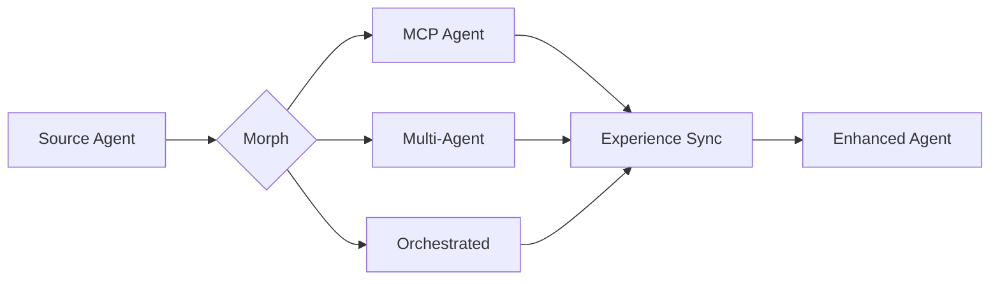
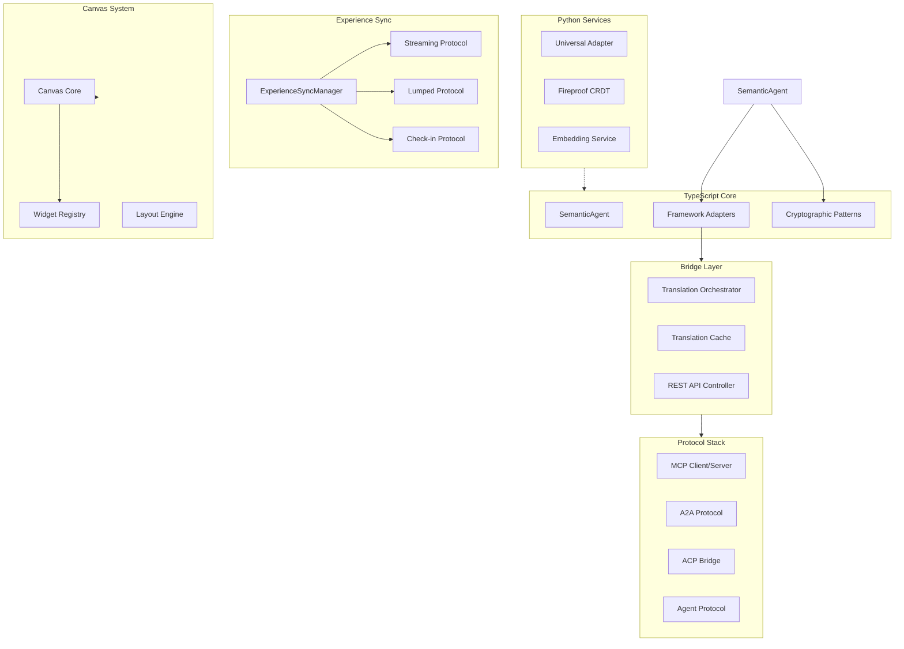

# Chrysalis

**Semantic Agent Transformation System**

*Agents operating agentically in semantic/meaning space*

[](CHANGELOG.md)
[](LICENSE)
[](package.json)
[](docs/STATUS.md)

---

## What is Chrysalis?

Chrysalis enables AI agents to operate as **independent, evolving entities** by providing:

- **Lossless Morphing** — Transform agents between MCP, Multi-Agent, and Orchestrated implementations without information loss
- **Distributed Memory** — Persistent episodic and semantic memory with intelligent deduplication
- **Experience Synchronization** — Continuous learning from deployed instances
- **Cryptographic Identity** — Tamper-evident agent identity using SHA-384 and Ed25519



---

## Current Status

> ✅ **Active Development**: TypeScript, Python, and UI builds all passing.

| Component | Build | Tests |
|-----------|-------|-------|
| TypeScript Core | ✅ Passing | ⚠️ Partial |
| Python Memory System | ✅ Passing | ✅ Passing |
| Canvas System | ✅ Architecture | 🔄 Prototype |

**For detailed status**: See [`docs/STATUS.md`](docs/STATUS.md)

---

## Quick Start

### Prerequisites

- Node.js ≥ 18.0.0
- npm ≥ 9.0
- Python 3.10+ (for memory_system)

### Installation

```bash
# Clone repository
git clone https://github.com/Replicant-Partners/Chrysalis.git
cd Chrysalis

# Install TypeScript dependencies
npm install

# Build core
npm run build

# (Optional) Build UI
cd ui && npm install && npm run build
```

### Local Chat (Ollama)

Requires a local Ollama instance (`ollama serve`) with a model pulled (e.g. `ollama pull gemma:2b`).

```bash
./scripts/run-local-chat.sh
```

### Verify Installation

```bash
# TypeScript build
npm run build

# Python tests
cd memory_system && python3 -m pytest tests/ -v

# UI build
cd ui && npm run build
```

---

## Core Capabilities

### Implemented ✅

| Capability | Description | Source |
|------------|-------------|--------|
| **Semantic Agent V2** | Agents operating in semantic space with experience sync, instances, protocols | [`SemanticAgent.ts`](src/core/SemanticAgent.ts) |
| **Framework Adapters** | Multi-protocol support (MCP, A2A, ACP, Agent Protocol) | [`src/adapters/`](src/adapters/) |
| **Bridge Service** | Agent translation with REST API and caching | [`src/bridge/`](src/bridge/), [`src/api/bridge/`](src/api/bridge/) |
| **Universal Adapter** | JSON-driven LLM task orchestration with flow execution | [`src/universal_adapter/`](src/universal_adapter/) |
| **Experience Sync** | Streaming, lumped, and check-in protocols | [`src/sync/`](src/sync/) |
| **Cryptographic Patterns** | Hash, signatures, DAG, CRDT, gossip, Byzantine resistance | [`src/core/patterns/`](src/core/patterns/) |
| **Circuit Breaker** | Fault tolerance for external service calls | [`src/utils/CircuitBreaker.ts`](src/utils/CircuitBreaker.ts) |
| **Cost Control** | Token counting, budget limits, rate limiting | [`src/utils/CostControl.ts`](src/utils/CostControl.ts) |
| **API Key Wallet** | Encrypted API key storage with auto-lock | [`src/security/ApiKeyWallet.ts`](src/security/ApiKeyWallet.ts) |
| **Canvas Architecture** | Multi-canvas system with widget registry | [`src/canvas/`](src/canvas/) |
| **Terminal PTY Server** | WebSocket PTY backend for terminal widgets | [`src/services/terminal/`](src/services/terminal/) |
| **Python Memory System** | Fireproof CRDT store, embedding services | [`memory_system/`](memory_system/) |
| **Go LLM Gateway** | Multi-provider gateway with circuit breaker | [`go-services/`](go-services/) |

### In Progress 🔄

| Feature | Status |
|---------|--------|
| Canvas React Integration | Prototype implementation, build integration pending |
| Universal Adapter Wiring | Python implementation complete, TypeScript integration pending |
| Test Coverage Expansion | Core tests passing, UI tests needed |

### Planned 📋

- True gossip protocol (epidemic spreading with O(log N) convergence)
- Full CRDT state management (production OR-Set, LWW, G-Set)
- Vector database persistence (LanceDB integration)
- Slash command system (`/invite`, `/agent`, `/canvas`)
- E2E test suite (Playwright integration tests)

---

## Project Structure

```
Chrysalis/
├── src/                      # TypeScript core
│   ├── core/                 # Agent schema V1/V2, cryptographic patterns
│   ├── adapters/             # Framework adapters (MCP, A2A, ACP, multi-agent)
│   ├── bridge/               # Agent translation orchestration
│   ├── api/bridge/           # Bridge REST API controller
│   ├── a2a-client/           # Agent-to-Agent protocol client
│   ├── sync/                 # Experience synchronization protocols
│   ├── agents/               # Agent bridges (Serena, ACP, Agent Registry)
│   ├── canvas/               # Canvas system (core, widgets, layout, execution)
│   ├── services/             # Terminal PTY server, Gateway LLM client
│   ├── voice/                # Voice integration (STT/TTS providers)
│   ├── security/             # API key wallet, encryption, registry
│   ├── utils/                # Circuit breaker, cost control, HTTP client
│   ├── quality/              # Quality system tools and patterns
│   ├── observability/        # Logging and metrics (Voyeur removed)
│   └── universal_adapter/    # Python: JSON-driven task orchestration
├── memory_system/            # Python semantic services
│   ├── fireproof/            # CRDT document store
│   ├── embedding/            # Vector embeddings
│   ├── graph/                # Knowledge graphs
│   └── hooks/                # Zep integration
├── go-services/              # Go LLM gateway (multi-provider)
├── projects/                 # Sub-projects
│   ├── SkillBuilder/         # Skill management and synthesis
│   ├── KnowledgeBuilder/     # Knowledge management
│   └── AgentBuilder/         # Agent construction tools
├── docs/                     # Documentation
│   ├── STATUS.md             # Implementation status (authoritative)
│   ├── INDEX.md              # Navigation hub
│   ├── architecture/         # Architecture deep-dives
│   ├── api/                  # API documentation
│   ├── guides/               # How-to guides
│   └── archive/              # Historical documentation
└── Agents/                   # Agent definitions (system, custom modes, wshobson)
```

---

## Documentation

| Document | Purpose |
|----------|---------|
| [`docs/STATUS.md`](docs/STATUS.md) | **Implementation status** (single source of truth) |
| [`docs/INDEX.md`](docs/README.md) | Navigation hub |
| [`ARCHITECTURE.md`](ARCHITECTURE.md) | System design |
| [`memory_system/README.md`](memory_system/README.md) | Python package |

---

## Configuration

### Environment Variables

| Variable | Purpose | Required |
|----------|---------|----------|
| `VOYAGE_API_KEY` | Voyage AI embeddings | Production |
| `OPENAI_API_KEY` | OpenAI embeddings (fallback) | Production |
| `ANTHROPIC_API_KEY` | Claude semantic decomposition | LLM analysis |
| `FIREPROOF_ENABLED` | Enable Fireproof layer | No |

### npm Scripts

```bash
npm run build           # Compile TypeScript
npm run test:unit       # Run unit tests
npm run dev             # Development mode
```

---

## Architecture Overview



See [`ARCHITECTURE.md`](ARCHITECTURE.md) for complete system design.

---

## Research Foundation

Chrysalis applies **10 universal patterns** validated against production systems:

| Pattern | Application |
|---------|-------------|
| Hash | Agent fingerprinting (SHA-384) |
| Signatures | Authentication (Ed25519) |
| Gossip | Experience propagation |
| DAG | Evolution tracking |
| CRDT | Conflict-free merge |

---

## Contributing

1. Fork the repository
2. Create a feature branch (`git checkout -b feature/amazing-feature`)
3. Make changes with tests
4. Run `npm run build && npm run test:unit`
5. Commit and push
6. Open a Pull Request

See [`CONTRIBUTING.md`](CONTRIBUTING.md) for guidelines.

---

## License

MIT License — see [`LICENSE`](LICENSE) for details.

---

<p align="center">
  <strong>Transform. Learn. Emerge.</strong>
</p>

---

**Version**: 3.1.1
**Last Updated**: January 16, 2026
**Documentation Review**: Aligned with actual implementation
