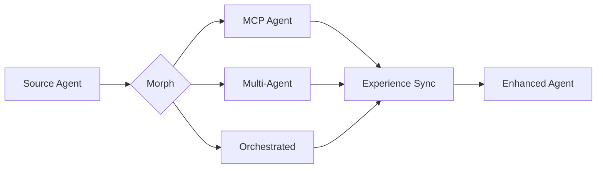
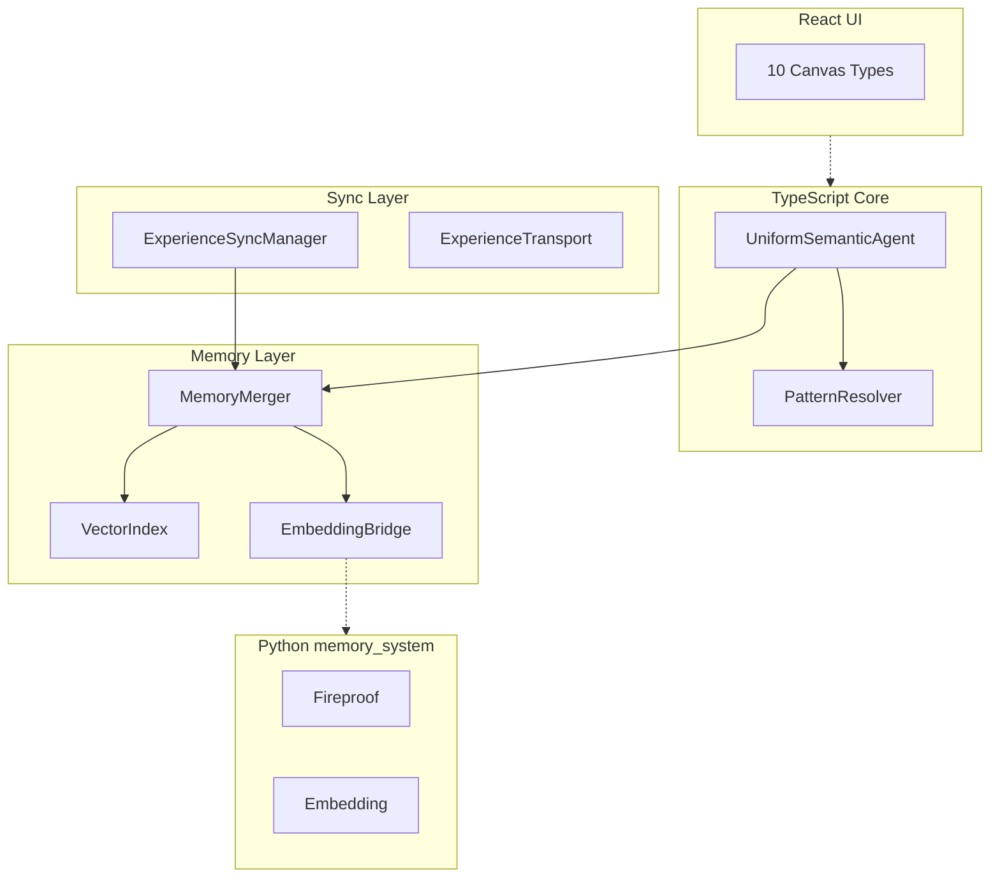

# Chrysalis

**Uniform Semantic Agent Transformation System**

[](CHANGELOG.md)
[](LICENSE)
[](package.json)
[](docs/STATUS.md)

---

## What is Chrysalis?

Chrysalis enables AI agents to operate as **independent, evolving entities** by providing:

- **Lossless Morphing** — Transform agents between MCP, Multi-Agent, and Orchestrated implementations without information loss
- **Distributed Memory** — Persistent episodic and semantic memory with intelligent deduplication
- **Experience Synchronization** — Continuous learning from deployed instances
- **Cryptographic Identity** — Tamper-evident agent identity using SHA-384 and Ed25519



---

## Current Status

> ✅ **Active Development**: TypeScript, Python, and UI builds all passing.

| Component | Build | Tests |
|-----------|-------|-------|
| TypeScript Core | ✅ Passing | ⚠️ Partial |
| Python Memory System | ✅ Passing | ✅ Passing |
| Canvas System | ✅ Architecture | 🔄 Prototype |

**For detailed status**: See [`docs/STATUS.md`](docs/STATUS.md)

---

## Quick Start

### Prerequisites

- Node.js ≥ 18.0.0
- npm ≥ 9.0
- Python 3.10+ (for memory_system)

### Installation

```bash
# Clone repository
git clone https://github.com/Replicant-Partners/Chrysalis.git
cd Chrysalis

# Install TypeScript dependencies
npm install

# Build core
npm run build

# (Optional) Build UI
cd ui && npm install && npm run build
```

### Verify Installation

```bash
# TypeScript build
npm run build

# Python tests
cd memory_system && python3 -m pytest tests/ -v

# UI build
cd ui && npm run build
```

---

## Core Capabilities

### Implemented ✅

| Capability | Description | Source |
|------------|-------------|--------|
| **Agent Schema v2.0** | Three implementation types with OODA interrogatives | [`UniformSemanticAgentV2.ts`](src/core/UniformSemanticAgentV2.ts) |
| **Adaptive Pattern Resolution** | Context-aware MCP/Go/Embedded selection | [`PatternResolver.ts`](src/fabric/PatternResolver.ts) |
| **Memory Merging** | Jaccard + embedding similarity with deduplication | [`MemoryMerger.ts`](src/experience/MemoryMerger.ts) |
| **Experience Sync** | Streaming, lumped, and check-in protocols | [`ExperienceSyncManager.ts`](src/sync/ExperienceSyncManager.ts) |
| **Observability** | Voyeur event bus + SSE viewer + Prometheus metrics | [`src/observability/`](src/observability/) |
| **Circuit Breaker** | Fault tolerance for external service calls | [`CircuitBreaker.ts`](src/utils/CircuitBreaker.ts) |
| **Fireproof Layer** | Local-first CRDT document store | [`memory_system/fireproof/`](memory_system/fireproof/) |
| **Canvas Architecture** | 5 canvas types with widget system | [`src/canvas/`](src/canvas/) |

### In Progress 🔄

| Feature | Status |
|---------|--------|
| Canvas React Integration | Prototype complete, needs Vite integration |
| Terminal PTY Server | WebSocket server implemented |
| System Agent Middleware | SCM routing implemented |

### Planned 📋

- True gossip protocol (epidemic spreading)
- Full CRDT state management
- Vector database persistence (LanceDB)
- VoyeurBus UI client

---

## Project Structure

```
Chrysalis/
├── src/                      # TypeScript core
│   ├── core/                 # Agent schema, patterns
│   ├── fabric/               # Pattern resolution
│   ├── memory/               # Memory adapters, embeddings
│   ├── experience/           # Merging algorithms
│   ├── sync/                 # Experience synchronization
│   ├── agents/system/        # System agent middleware
│   ├── canvas/               # Canvas & widget architecture
│   ├── observability/        # Voyeur, metrics
│   └── services/             # Terminal PTY, gateway
├── memory_system/            # Python semantic services
│   ├── fireproof/            # CRDT document store
│   ├── embedding/            # Vector embeddings
│   ├── graph/                # Knowledge graphs
│   └── hooks/                # Zep integration
├── docs/                     # Documentation
│   ├── STATUS.md             # Implementation status
│   └── INDEX.md              # Navigation hub
└── go-services/              # Go LLM gateway
```

---

## Documentation

| Document | Purpose |
|----------|---------|
| [`docs/STATUS.md`](docs/STATUS.md) | **Implementation status** (single source of truth) |
| [`docs/INDEX.md`](docs/INDEX.md) | Navigation hub |
| [`ARCHITECTURE.md`](ARCHITECTURE.md) | System design |
| [`memory_system/README.md`](memory_system/README.md) | Python package |

---

## Configuration

### Environment Variables

| Variable | Purpose | Required |
|----------|---------|----------|
| `VOYAGE_API_KEY` | Voyage AI embeddings | Production |
| `OPENAI_API_KEY` | OpenAI embeddings (fallback) | Production |
| `ANTHROPIC_API_KEY` | Claude semantic decomposition | LLM analysis |
| `FIREPROOF_ENABLED` | Enable Fireproof layer | No |

### npm Scripts

```bash
npm run build           # Compile TypeScript
npm run test:unit       # Run unit tests
npm run dev             # Development mode
```

---

## Architecture Overview



See [`ARCHITECTURE.md`](ARCHITECTURE.md) for complete system design.

---

## Research Foundation

Chrysalis applies **10 universal patterns** validated against production systems:

| Pattern | Application |
|---------|-------------|
| Hash | Agent fingerprinting (SHA-384) |
| Signatures | Authentication (Ed25519) |
| Gossip | Experience propagation |
| DAG | Evolution tracking |
| CRDT | Conflict-free merge |

---

## Contributing

1. Fork the repository
2. Create a feature branch (`git checkout -b feature/amazing-feature`)
3. Make changes with tests
4. Run `npm run build && npm run test:unit`
5. Commit and push
6. Open a Pull Request

See [`CONTRIBUTING.md`](CONTRIBUTING.md) for guidelines.

---

## License

MIT License — see [`LICENSE`](LICENSE) for details.

---

<p align="center">
  <strong>Transform. Learn. Emerge.</strong>
</p>

---

**Version**: 3.1.1
**Last Updated**: January 15, 2026
