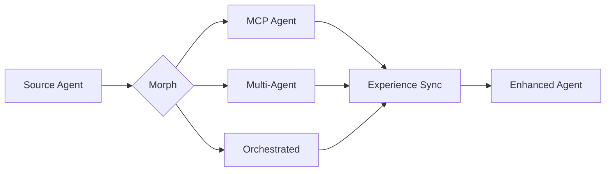
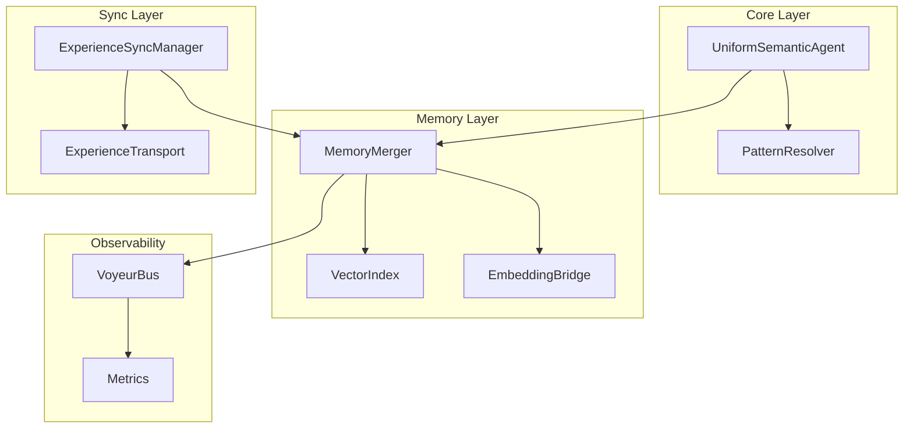

# Chrysalis

**Uniform Semantic Agent Transformation System**

[](CHANGELOG.md)
[](LICENSE)
[](package.json)
[](docs/STATUS.md)

---

## What is Chrysalis?

Chrysalis enables AI agents to operate as **independent, evolving entities** by providing:

- **Lossless Morphing** — Transform agents between MCP, Multi-Agent, and Orchestrated implementations without information loss
- **Distributed Memory** — Persistent episodic and semantic memory with intelligent deduplication
- **Experience Synchronization** — Continuous learning from deployed instances
- **Cryptographic Identity** — Tamper-evident agent identity using SHA-384 and Ed25519



---

## Current Status

> ✅ **Active Development**: Core TypeScript build passing. See [Project Status](docs/STATUS.md) for details.

| Component | Status |
|-----------|--------|
| TypeScript Core | ✅ **Build passing** |
| Python Memory System | ✅ **30/30 tests passing** |
| Core Functionality | ✅ Implemented |

**For authoritative status**: See [docs/STATUS.md](docs/STATUS.md)

---

## Quick Start

### Prerequisites

- Node.js ≥ 18.0.0
- npm ≥ 9.0
- Python 3.10+ (for memory_system)

### Installation

```bash
# Clone repository
git clone https://github.com/Replicant-Partners/Chrysalis.git
cd Chrysalis

# Install TypeScript dependencies
npm install

# Build (see status note above)
npm run build
```

### Verify Installation

```bash
# Check build status
npm run build 2>&1 | tail -5

# Run tests (requires successful build)
npm run test:unit
```

---

## Core Capabilities

### Implemented ✅

| Capability | Description | Source |
|------------|-------------|--------|
| **Agent Schema v2.0** | Three implementation types with OODA interrogatives | [`UniformSemanticAgentV2.ts`](src/core/UniformSemanticAgentV2.ts) |
| **Adaptive Pattern Resolution** | Context-aware MCP/Go/Embedded selection | [`PatternResolver.ts`](src/fabric/PatternResolver.ts) |
| **Memory Merging** | Jaccard + embedding similarity with deduplication | [`MemoryMerger.ts`](src/experience/MemoryMerger.ts) |
| **Experience Sync** | Streaming, lumped, and check-in protocols | [`ExperienceSyncManager.ts`](src/sync/ExperienceSyncManager.ts) |
| **Observability** | Voyeur event bus + SSE viewer + Prometheus metrics | [`src/observability/`](src/observability/) |
| **Circuit Breaker** | Fault tolerance for external service calls | [`CircuitBreaker.ts`](src/utils/CircuitBreaker.ts) |

### In Progress 🔄

| Feature | Description | Blocking Issue |
|---------|-------------|----------------|
| Voice Integration | TTS/STT providers | Build errors in voice module |
| MCP Client Integration | PatternResolver → MCP servers | Implementation incomplete |

### Planned 📋

- True gossip protocol (epidemic spreading)
- CRDT state management
- Vector database persistence

---

## Project Structure

```
Chrysalis/
├── src/                      # TypeScript source
│   ├── core/                 # Agent schema, patterns
│   ├── fabric/               # Pattern resolution
│   ├── memory/               # Memory adapters, embeddings
│   ├── experience/           # Merging algorithms
│   ├── sync/                 # Experience synchronization
│   ├── observability/        # Voyeur, metrics
│   ├── adapters/             # Framework adapters
│   └── services/             # Microservices
├── memory_system/            # Python semantic services
│   ├── semantic/             # Intent detection, triples
│   ├── graph/                # Knowledge graphs
│   ├── converters/           # Document processing
│   ├── embedding/            # Vector embeddings
│   └── analysis/             # Shannon entropy
├── ui/                       # React frontend
├── docs/                     # Documentation
│   ├── STATUS.md             # Current status (authoritative)
│   ├── INDEX.md              # Documentation index
│   └── ...
├── examples/                 # Usage examples
└── tests/                    # Test suites
```

---

## Documentation

| Document | Purpose |
|----------|---------|
| **[Documentation Index](docs/INDEX.md)** | Navigation hub for all docs |
| **[Project Status](docs/STATUS.md)** | Current build state and known issues |
| **[Architecture](ARCHITECTURE.md)** | System design, components, data flow |
| **[Memory System](memory_system/README.md)** | Python package documentation |

### Quick Links

- [Quick Start Guide](docs/guides/QUICK_START.md)
- [Configuration Guide](docs/CONFIGURATION.md)
- [Troubleshooting](docs/guides/TROUBLESHOOTING.md)
- [API Reference](docs/api/API_REFERENCE_INDEX.md)

---

## Configuration

### Environment Variables

| Variable | Purpose | Required |
|----------|---------|----------|
| `VOYAGE_API_KEY` | Voyage AI embeddings | For production |
| `OPENAI_API_KEY` | OpenAI embeddings (fallback) | For production |
| `ANTHROPIC_API_KEY` | Claude semantic decomposition | For LLM analysis |
| `VECTOR_INDEX_TYPE` | Index backend (`hnsw`, `lance`, `brute`) | No |
| `METRICS_PROMETHEUS` | Enable Prometheus metrics | No |

### npm Scripts

```bash
npm run build           # Compile TypeScript
npm run test:unit       # Run unit tests
npm run test:mcp        # Run MCP server tests
npm run dev             # Development mode
npm run service:ledger  # Start ledger service
npm run service:gateway # Start capability gateway
```

---

## Architecture Overview



See [ARCHITECTURE.md](ARCHITECTURE.md) for complete system design.

---

## Research Foundation

Chrysalis applies **10 universal patterns** validated against production systems:

| Pattern | Application | Evidence |
|---------|-------------|----------|
| Hash | Agent fingerprinting | Git, Bitcoin, IPFS |
| Signatures | Authentication | TLS, Ethereum, Signal |
| Gossip | Experience propagation | Cassandra, Ethereum 2.0 |
| DAG | Evolution tracking | Git, IPFS, Hedera |
| CRDT | Conflict-free merge | Automerge, Riak |

See [docs/research/](docs/research/) for deep research and mathematical foundations.

---

## Contributing

We welcome contributions! Please see our development workflow:

1. Fork the repository
2. Create a feature branch (`git checkout -b feature/amazing-feature`)
3. Make changes with tests
4. Run `npm run build && npm run test:unit`
5. Commit (`git commit -m 'Add amazing feature'`)
6. Push (`git push origin feature/amazing-feature`)
7. Open a Pull Request

See [CONTRIBUTING.md](CONTRIBUTING.md) for full guidelines.

---

## License

MIT License — see [LICENSE](LICENSE) for details.

---

<p align="center">
  <strong>Transform. Learn. Emerge.</strong>
</p>

---

**Version**: 3.1.1
**Last Updated**: January 13, 2026
