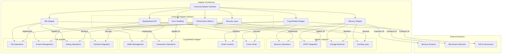

# Adapter Architecture

## Component Diagram

```mermaid
graph TD
    subgraph "Adapter Architecture"
        A[Universal Adapter Interface] --> B[Memory Adapter]
        A --> C[Crypto/Web3 Adapter]
        A --> D[IDE Adapter]
        
        subgraph "Universal Adapter Interface"
            A1[Standardized API]
            A2[Error Handling]
            A3[Performance Metrics]
            A4[Security Layer]
        end
        
        subgraph "Memory Adapter"
            B1[Memory Operations]
            B2[CRDT Integration]
            B3[Storage Backend]
            B4[Caching Layer]
        end
        
        subgraph "Crypto/Web3 Adapter"
            C1[Wallet Management]
            C2[Transaction Operations]
            C3[Smart Contract]
            C4[Cross-Chain]
        end
        
        subgraph "IDE Adapter"
            D1[File Operations]
            D2[Project Management]
            D3[Debug Operations]
            D4[Terminal Integration]
        end
        
        A --> A1
        A --> A2
        A --> A3
        A --> A4
        
        B --> B1
        B --> B2
        B --> B3
        B --> B4
        
        C --> C1
        C --> C2
        C --> C3
        C --> C4
        
        D --> D1
        D --> D2
        D --> D3
        D --> D4
        
        A1 -- "Implements" --> B1
        A1 -- "Implements" --> C1
        A1 -- "Implements" --> D1
        
        A2 -- "Applies To" --> B2
        A2 -- "Applies To" --> C2
        A2 -- "Applies To" --> D2
        
        A3 -- "Monitors" --> B3
        A3 -- "Monitors" --> C3
        A3 -- "Monitors" --> D3
        
        A4 -- "Secures" --> B4
        A4 -- "Secures" --> C4
        A4 -- "Secures" --> D4
    end
    
    subgraph "External Systems"
        E[Memory Systems]
        F[Blockchain Networks]
        G[IDE Environments]
    end
    
    B -- "Connects To" --> E
    C -- "Connects To" --> F
    D -- "Connects To" --> G
```