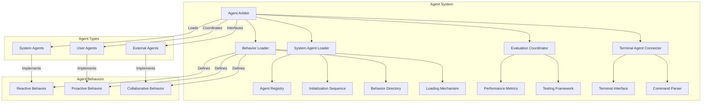

# Agent System Architecture

## Component Diagram

```mermaid
graph TD
    subgraph "Agent System"
        A[Agent Arbiter] --> B[System Agent Loader]
        A --> C[Behavior Loader]
        A --> D[Evaluation Coordinator]
        A --> E[Terminal Agent Connector]
        
        B --> F[Agent Registry]
        B --> G[Initialization Sequence]
        
        C --> H[Behavior Directory]
        C --> I[Loading Mechanism]
        
        D --> J[Performance Metrics]
        D --> K[Testing Framework]
        
        E --> L[Terminal Interface]
        E --> M[Command Parser]
    end
    
    subgraph "Agent Types"
        N[System Agents]
        O[User Agents]
        P[External Agents]
    end
    
    subgraph "Agent Behaviors"
        Q[Reactive Behavior]
        R[Proactive Behavior]
        S[Collaborative Behavior]
    end
    
    A -- "Loads" --> N
    A -- "Coordinates" --> O
    A -- "Interfaces" --> P
    
    C -- "Defines" --> Q
    C -- "Defines" --> R
    C -- "Defines" --> S
    
    N -- "Implements" --> Q
    O -- "Implements" --> R
    P -- "Implements" --> S
```