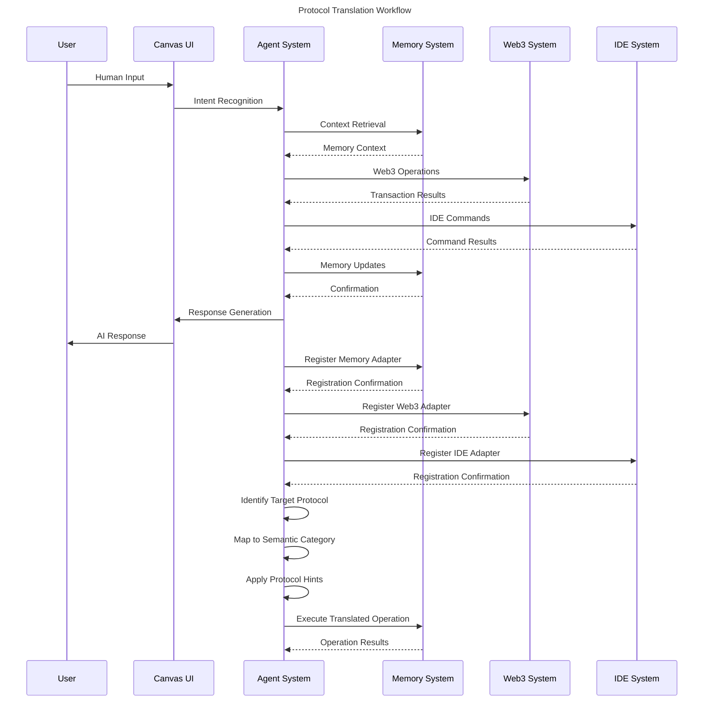

# Key Workflows

## Sequence Diagram

```mermaid
sequenceDiagram
    participant U as User
    participant UI as Canvas UI
    participant A as Agent System
    participant M as Memory System
    participant W as Web3 System
    participant I as IDE System
    
    title Chrysalis Core Interaction Loop
    
    U->>UI: Human Input
    UI->>A: Intent Recognition
    A->>M: Context Retrieval
    M-->>A: Memory Context
    A->>W: Web3 Operations
    W-->>A: Transaction Results
    A->>I: IDE Commands
    I-->>A: Command Results
    A->>M: Memory Updates
    M-->>A: Confirmation
    A->>UI: Response Generation
    UI->>U: AI Response
    
    title Adapter Registration Workflow
    
    A->>M: Register Memory Adapter
    M-->>A: Registration Confirmation
    A->>W: Register Web3 Adapter
    W-->>A: Registration Confirmation
    A->>I: Register IDE Adapter
    I-->>A: Registration Confirmation
    
    title Protocol Translation Workflow
    
    A->>A: Identify Target Protocol
    A->>A: Map to Semantic Category
    A->>A: Apply Protocol Hints
    A->>M: Execute Translated Operation
    M-->>A: Operation Results
```