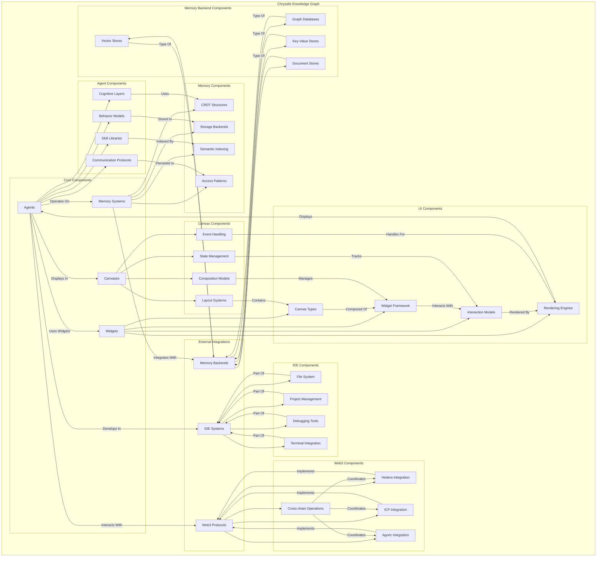

# Knowledge Graph Structure

## Graph Diagram

```mermaid
graph TD
    subgraph "Chrysalis Knowledge Graph"
        subgraph "Core Components"
            A[Agents]
            B[Memory Systems]
            C[Widgets]
            D[Canvases]
        end
        
        subgraph "Agent Components"
            A1[Cognitive Layers]
            A2[Behavior Models]
            A3[Skill Libraries]
            A4[Communication Protocols]
        end
        
        subgraph "Memory Components"
            B1[CRDT Structures]
            B2[Storage Backends]
            B3[Semantic Indexing]
            B4[Access Patterns]
        end
        
        subgraph "UI Components"
            C1[Canvas Types]
            C2[Widget Framework]
            C3[Interaction Models]
            C4[Rendering Engines]
        end
        
        subgraph "Canvas Components"
            D1[Layout Systems]
            D2[Composition Models]
            D3[State Management]
            D4[Event Handling]
        end
        
        subgraph "External Integrations"
            E[Web3 Protocols]
            F[IDE Systems]
            G[Memory Backends]
        end
        
        subgraph "Web3 Components"
            E1[Hedera Integration]
            E2[ICP Integration]
            E3[Agoric Integration]
            E4[Cross-chain Operations]
        end
        
        subgraph "IDE Components"
            F1[File System]
            F2[Project Management]
            F3[Debugging Tools]
            F4[Terminal Integration]
        end
        
        subgraph "Memory Backend Components"
            G1[Vector Stores]
            G2[Graph Databases]
            G3[Key-Value Stores]
            G4[Document Stores]
        end
        
        A --> A1
        A --> A2
        A --> A3
        A --> A4
        
        B --> B1
        B --> B2
        B --> B3
        B --> B4
        
        C --> C1
        C --> C2
        C --> C3
        C --> C4
        
        D --> D1
        D --> D2
        D --> D3
        D --> D4
        
        E --> E1
        E --> E2
        E --> E3
        E --> E4
        
        F --> F1
        F --> F2
        F --> F3
        F --> F4
        
        G --> G1
        G --> G2
        G --> G3
        G --> G4
        
        A1 -- "Uses" --> B1
        A2 -- "Stored In" --> B2
        A3 -- "Indexed By" --> B3
        A4 -- "Persisted In" --> B4
        
        C1 -- "Composed Of" --> C2
        C2 -- "Interacts With" --> C3
        C3 -- "Rendered By" --> C4
        C4 -- "Displays" --> A
        
        D1 -- "Contains" --> C1
        D2 -- "Manages" --> C2
        D3 -- "Tracks" --> C3
        D4 -- "Handles For" --> C4
        
        A -- "Operates On" --> B
        A -- "Displays In" --> D
        A -- "Uses Widgets" --> C
        
        B -- "Integrates With" --> G
        A -- "Interacts With" --> E
        A -- "Develops In" --> F
        
        E1 -- "Implements" --> E
        E2 -- "Implements" --> E
        E3 -- "Implements" --> E
        E4 -- "Coordinates" --> E1
        E4 -- "Coordinates" --> E2
        E4 -- "Coordinates" --> E3
        
        F1 -- "Part Of" --> F
        F2 -- "Part Of" --> F
        F3 -- "Part Of" --> F
        F4 -- "Part Of" --> F
        
        G1 -- "Type Of" --> G
        G2 -- "Type Of" --> G
        G3 -- "Type Of" --> G
        G4 -- "Type Of" --> G
    end
```