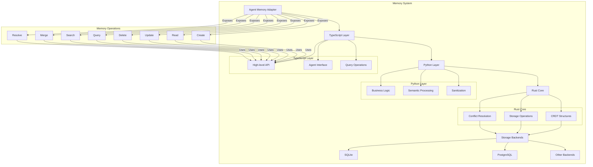

# Memory System Architecture

## Component Diagram

```mermaid
graph TD
    subgraph "Memory System"
        A[Agent Memory Adapter] --> B[TypeScript Layer]
        B --> C[Python Layer]
        C --> D[Rust Core]
        
        subgraph "Rust Core"
            D1[CRDT Structures]
            D2[Storage Operations]
            D3[Conflict Resolution]
        end
        
        subgraph "Python Layer"
            C1[Business Logic]
            C2[Semantic Processing]
            C3[Sanitization]
        end
        
        subgraph "TypeScript Layer"
            B1[High-level API]
            B2[Agent Interface]
            B3[Query Operations]
        end
        
        D --> D1
        D --> D2
        D --> D3
        
        C --> C1
        C --> C2
        C --> C3
        
        B --> B1
        B --> B2
        B --> B3
        
        D1 --> E[Storage Backends]
        D2 --> E
        D3 --> E
        
        E --> F[SQLite]
        E --> G[PostgreSQL]
        E --> H[Other Backends]
    end
    
    subgraph "Memory Operations"
        I[Create]
        J[Read]
        K[Update]
        L[Delete]
        M[Query]
        N[Search]
        O[Merge]
        P[Resolve]
    end
    
    A -- "Exposes" --> I
    A -- "Exposes" --> J
    A -- "Exposes" --> K
    A -- "Exposes" --> L
    A -- "Exposes" --> M
    A -- "Exposes" --> N
    A -- "Exposes" --> O
    A -- "Exposes" --> P
    
    I -- "Uses" --> B1
    J -- "Uses" --> B1
    K -- "Uses" --> B1
    L -- "Uses" --> B1
    M -- "Uses" --> B1
    N -- "Uses" --> B1
    O -- "Uses" --> B1
    P -- "Uses" --> B1
```