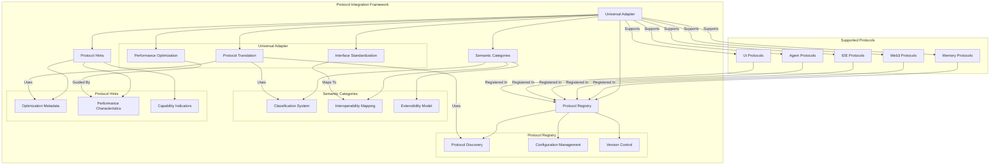

# Protocol Integration Framework

## Component Diagram

```mermaid
graph TD
    subgraph "Protocol Integration Framework"
        A[Universal Adapter] --> B[Protocol Registry]
        A --> C[Semantic Categories]
        A --> D[Protocol Hints]
        
        subgraph "Universal Adapter"
            A1[Protocol Translation]
            A2[Interface Standardization]
            A3[Performance Optimization]
        end
        
        subgraph "Protocol Registry"
            B1[Protocol Discovery]
            B2[Configuration Management]
            B3[Version Control]
        end
        
        subgraph "Semantic Categories"
            C1[Classification System]
            C2[Interoperability Mapping]
            C3[Extensibility Model]
        end
        
        subgraph "Protocol Hints"
            D1[Optimization Metadata]
            D2[Performance Characteristics]
            D3[Capability Indicators]
        end
        
        A --> A1
        A --> A2
        A --> A3
        
        B --> B1
        B --> B2
        B --> B3
        
        C --> C1
        C --> C2
        C --> C3
        
        D --> D1
        D --> D2
        D --> D3
        
        A1 -- "Uses" --> B1
        A1 -- "Uses" --> C1
        A1 -- "Uses" --> D1
        
        A2 -- "Maps To" --> C2
        A3 -- "Guided By" --> D2
    end
    
    subgraph "Supported Protocols"
        E[Memory Protocols]
        F[Web3 Protocols]
        G[IDE Protocols]
        H[Agent Protocols]
        I[UI Protocols]
    end
    
    A -- "Supports" --> E
    A -- "Supports" --> F
    A -- "Supports" --> G
    A -- "Supports" --> H
    A -- "Supports" --> I
    
    E -- "Registered In" --> B
    F -- "Registered In" --> B
    G -- "Registered In" --> B
    H -- "Registered In" --> B
    I -- "Registered In" --> B
```