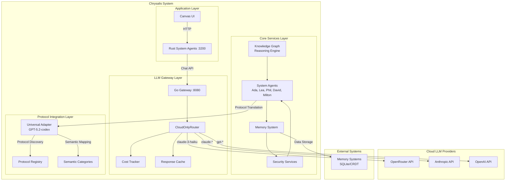
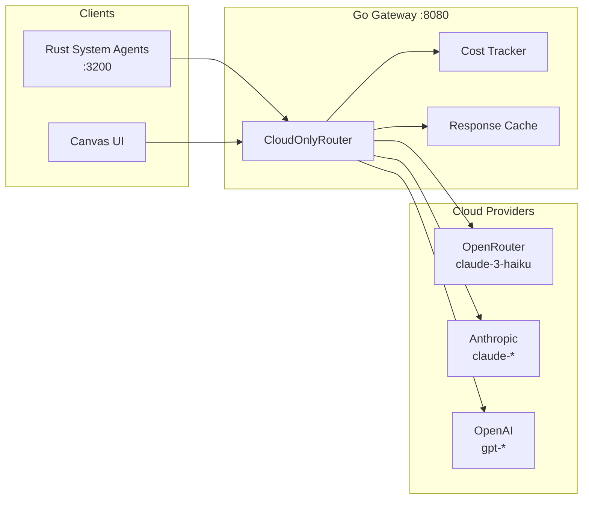
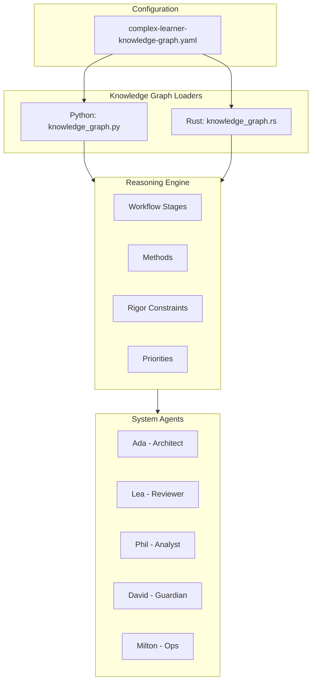

# System Architecture Overview

**Version**: 3.3.0  
**Last Updated**: 2026-01-25

## Component Diagram

```mermaid
graph TD
    subgraph "Chrysalis System"
        subgraph "Core Services Layer"
            A[System Agents<br/>Ada, Lea, Phil, David, Milton] --> B[Memory System]
            B --> C[Security Services]
            C --> A
            KG[Knowledge Graph<br/>Reasoning Engine] --> A
        end
        
        subgraph "LLM Gateway Layer"
            GW[Go Gateway :8080]
            CR[CloudOnlyRouter]
            CT[Cost Tracker]
            RC[Response Cache]
            GW --> CR
            CR --> CT
            CR --> RC
        end
        
        subgraph "Protocol Integration Layer"
            D[Universal Adapter<br/>GPT-5.2-codex]
            E[Protocol Registry]
            F[Semantic Categories]
        end
        
        subgraph "Application Layer"
            RS[Rust System Agents :3200]
            I[Canvas UI]
        end
    end
    
    subgraph "Cloud LLM Providers"
        OR[OpenRouter API]
        AN[Anthropic API]
        OA[OpenAI API]
    end
    
    subgraph "External Systems"
        P[Memory Systems<br/>SQLite/CRDT]
    end
    
    RS -- "Chat API" --> GW
    I -- "HTTP" --> RS
    A -- "Protocol Translation" --> D
    
    CR -- "claude-3-haiku" --> OR
    CR -- "claude-*" --> AN
    CR -- "gpt-*" --> OA
    
    D -- "Protocol Discovery" --> E
    D -- "Semantic Mapping" --> F
    
    B -- "Data Storage" --> P
```

## LLM Provider Architecture

```mermaid
flowchart LR
    subgraph Clients
        RustAgents[Rust System Agents<br/>:3200]
        WebUI[Canvas UI]
    end
    
    subgraph Gateway["Go Gateway :8080"]
        CloudRouter[CloudOnlyRouter]
        CostTracker[Cost Tracker]
        Cache[Response Cache]
    end
    
    subgraph Providers["Cloud Providers"]
        OpenRouter[OpenRouter<br/>claude-3-haiku]
        Anthropic[Anthropic<br/>claude-*]
        OpenAI[OpenAI<br/>gpt-*]
    end
    
    RustAgents --> CloudRouter
    WebUI --> CloudRouter
    CloudRouter --> CostTracker
    CloudRouter --> Cache
    CloudRouter --> OpenRouter
    CloudRouter --> Anthropic
    CloudRouter --> OpenAI
```

## Knowledge Graph Integration

```mermaid
flowchart TB
    subgraph Config["Configuration"]
        YAML[complex-learner-knowledge-graph.yaml]
    end
    
    subgraph Loaders["Knowledge Graph Loaders"]
        PyLoader[Python: knowledge_graph.py]
        RsLoader[Rust: knowledge_graph.rs]
    end
    
    subgraph Engine["Reasoning Engine"]
        Workflow[Workflow Stages]
        Methods[Methods]
        Rigor[Rigor Constraints]
        Priorities[Priorities]
    end
    
    subgraph Agents["System Agents"]
        Ada[Ada - Architect]
        Lea[Lea - Reviewer]
        Phil[Phil - Analyst]
        David[David - Guardian]
        Milton[Milton - Ops]
    end
    
    YAML --> PyLoader
    YAML --> RsLoader
    PyLoader --> Engine
    RsLoader --> Engine
    Engine --> Agents
```