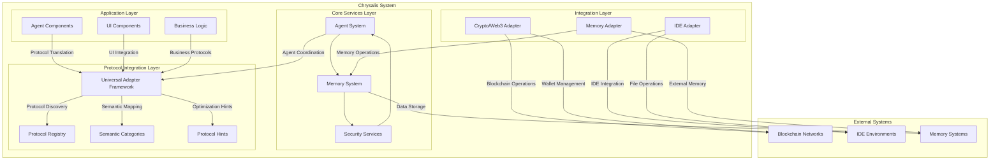

# System Architecture Overview

## Component Diagram

```mermaid
graph TD
    subgraph "Chrysalis System"
        subgraph "Core Services Layer"
            A[Agent System] --> B[Memory System]
            B --> C[Security Services]
            C --> A
        end
        
        subgraph "Protocol Integration Layer"
            D[Universal Adapter Framework]
            E[Protocol Registry]
            F[Semantic Categories]
            G[Protocol Hints]
        end
        
        subgraph "Application Layer"
            H[Agent Components]
            I[UI Components]
            J[Business Logic]
        end
        
        subgraph "Integration Layer"
            K[Memory Adapter]
            L[Crypto/Web3 Adapter]
            M[IDE Adapter]
        end
    end
    
    subgraph "External Systems"
        N[Blockchain Networks]
        O[IDE Environments]
        P[Memory Systems]
    end
    
    A -- "Agent Coordination" --> D
    H -- "Protocol Translation" --> D
    I -- "UI Integration" --> D
    J -- "Business Protocols" --> D
    
    D -- "Protocol Discovery" --> E
    D -- "Semantic Mapping" --> F
    D -- "Optimization Hints" --> G
    
    K -- "Memory Operations" --> B
    K -- "External Memory" --> P
    
    L -- "Blockchain Operations" --> N
    L -- "Wallet Management" --> N
    
    M -- "IDE Integration" --> O
    M -- "File Operations" --> O
    
    B -- "Data Storage" --> P
```