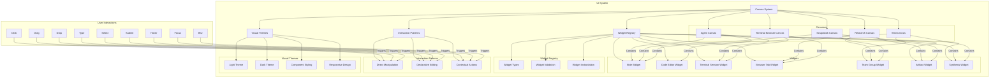

# UI System Architecture

## Component Diagram

```mermaid
graph TD
    subgraph "UI System"
        A[Canvas System] --> B[Widget Registry]
        A --> C[Interaction Patterns]
        A --> D[Visual Themes]
        
        subgraph "Canvases"
            A1[Agent Canvas]
            A2[Research Canvas]
            A3[Scrapbook Canvas]
            A4[Terminal Browser Canvas]
            A5[Wiki Canvas]
        end
        
        subgraph "Widgets"
            B1[Note Widget]
            B2[Code Editor Widget]
            B3[Terminal Session Widget]
            B4[Browser Tab Widget]
            B5[Team Group Widget]
            B6[Artifact Widget]
            B7[Synthesis Widget]
        end
        
        subgraph "Widget Registry"
            B8[Widget Types]
            B9[Widget Validation]
            B10[Widget Instantiation]
        end
        
        subgraph "Interaction Patterns"
            C1[Direct Manipulation]
            C2[Declarative Editing]
            C3[Contextual Actions]
        end
        
        subgraph "Visual Themes"
            D1[Light Theme]
            D2[Dark Theme]
            D3[Component Styling]
            D4[Responsive Design]
        end
        
        A --> A1
        A --> A2
        A --> A3
        A --> A4
        A --> A5
        
        B --> B1
        B --> B2
        B --> B3
        B --> B4
        B --> B5
        B --> B6
        B --> B7
        
        B --> B8
        B --> B9
        B --> B10
        
        C --> C1
        C --> C2
        C --> C3
        
        D --> D1
        D --> D2
        D --> D3
        D --> D4
        
        A1 -- "Contains" --> B1
        A1 -- "Contains" --> B2
        A1 -- "Contains" --> B3
        
        A2 -- "Contains" --> B4
        A2 -- "Contains" --> B5
        A2 -- "Contains" --> B6
        
        A3 -- "Contains" --> B1
        A3 -- "Contains" --> B7
        A3 -- "Contains" --> B5
        
        A4 -- "Contains" --> B3
        A4 -- "Contains" --> B4
        
        A5 -- "Contains" --> B1
        A5 -- "Contains" --> B6
        A5 -- "Contains" --> B7
    end
    
    subgraph "User Interactions"
        E[Click]
        F[Drag]
        G[Drop]
        H[Type]
        I[Select]
        J[Submit]
        K[Hover]
        L[Focus]
        M[Blur]
    end
    
    E -- "Triggers" --> C1
    F -- "Triggers" --> C1
    G -- "Triggers" --> C1
    H -- "Triggers" --> C2
    I -- "Triggers" --> C2
    J -- "Triggers" --> C2
    K -- "Triggers" --> C3
    L -- "Triggers" --> C3
    M -- "Triggers" --> C3
```