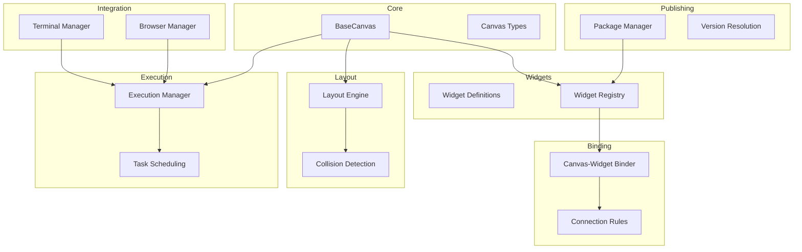
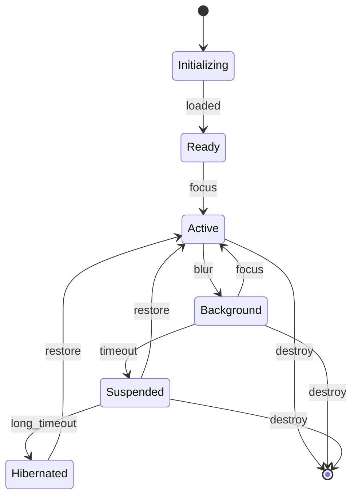
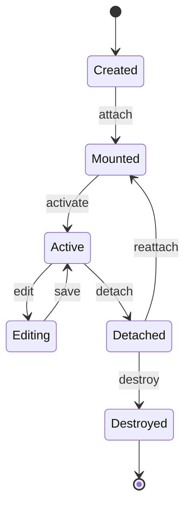
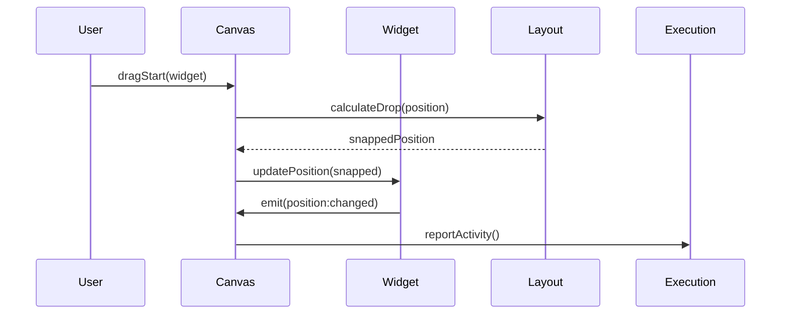

# Canvas Architecture Development Protocol

**Version:** 1.0.0
**Status:** Active
**Last Updated:** January 2026

---

## Purpose

This document establishes the iterative development protocol for the Chrysalis canvas-widget architecture. It ensures explicit user validation at each architectural decision point, interactive prototype review before implementation, and continuous feedback integration.

---

## Core Principles

### 1. No Assumptions About UX Requirements

User experience requirements cannot be assumed by the development process alone. Every user-facing decision requires explicit validation.

### 2. Collaborative Decision Making

Major architectural decisions are made through dialogue, not unilateral implementation. The developer proposes; the user validates.

### 3. Reversibility

Implementations should be designed for easy reversal. Avoid deep coupling that makes changes expensive.

### 4. Incremental Validation

Validate small increments rather than large batches. Catch misalignments early.

---

## Decision Classification

### Tier 1: Major Architectural Decisions
**Requires:** Explicit user approval before implementation

Examples:
- Canvas type definitions
- Widget capability model
- Event propagation patterns
- State management approach
- Security model
- Background execution model

**Process:**
1. Present options with tradeoffs
2. Discuss implications
3. Get explicit "proceed" or "modify"
4. Document decision rationale

### Tier 2: Component Design Decisions
**Requires:** Summary presentation, implicit approval (proceed unless objected)

Examples:
- Individual widget specifications
- Layout algorithm details
- Performance optimizations
- Error handling strategies

**Process:**
1. Summarize design choices
2. Highlight key tradeoffs
3. Proceed unless user objects
4. Note any concerns for follow-up

### Tier 3: Implementation Details
**Requires:** Transparency, post-hoc review available

Examples:
- Internal function design
- Code organization
- Naming conventions
- Test coverage

**Process:**
1. Implement following established patterns
2. Make code available for review
3. Respond to feedback if raised

---

## Validation Checkpoints

### Phase 1: Architecture Foundation
**Checkpoint 1.1:** Core canvas abstraction layer
- [ ] Base canvas object model defined
- [ ] Lifecycle methods validated
- [ ] State management approach approved
- [ ] Event patterns reviewed

**Checkpoint 1.2:** Widget system
- [ ] Widget interface contracts defined
- [ ] Capability model approved
- [ ] Data contract schema validated

### Phase 2: Interaction Model
**Checkpoint 2.1:** Canvas-widget binding
- [ ] Registry pattern approved
- [ ] Connection rules validated
- [ ] Inter-widget communication reviewed

**Checkpoint 2.2:** Spatial layout
- [ ] Grid configuration reviewed
- [ ] Collision detection approach approved
- [ ] Infinite scroll behavior validated

### Phase 3: Execution Model
**Checkpoint 3.1:** Background execution
- [ ] Execution states defined
- [ ] Resource budgets approved
- [ ] State preservation validated

**Checkpoint 3.2:** Terminal-Browser integration
- [ ] Combined terminal-browser canvas reviewed
- [ ] Terminal multiplexing and browser security model approved
- [ ] Tab management and session handling validated

### Phase 4: Ecosystem
**Checkpoint 4.1:** Widget publishing
- [ ] Manifest format approved
- [ ] Version resolution strategy reviewed
- [ ] Capability negotiation validated

**Checkpoint 4.2:** Reference implementations
- [ ] Widget templates reviewed
- [ ] Example coverage validated

---

## Feedback Integration Process

### Immediate Feedback
**Response Time:** Same session
**Applies To:** Clarifications, minor corrections

1. User provides feedback
2. Developer acknowledges
3. Adjustment made immediately
4. Continue with updated direction

### Session Feedback
**Response Time:** End of current task
**Applies To:** Design modifications, priority changes

1. User provides feedback
2. Developer notes for end-of-task review
3. Incorporate into next iteration
4. Summarize changes made

### Retrospective Feedback
**Response Time:** Next session
**Applies To:** Architectural concerns, scope changes

1. User provides feedback
2. Developer creates follow-up item
3. Address at start of next session
4. May require design review

---

## Prototype Review Process

### Interactive Review
Before committing to implementation:

1. **Present Mock/Wireframe**
   - Visual representation of proposed UI
   - Interaction flow diagrams
   - State transition diagrams

2. **Walk Through Scenarios**
   - Happy path
   - Error cases
   - Edge cases

3. **Identify Concerns**
   - Usability questions
   - Performance concerns
   - Accessibility requirements

4. **Iterate or Proceed**
   - Modify design based on feedback
   - Or proceed with explicit approval

### Code Review Checkpoints
After implementation:

1. **Summary Presentation**
   - What was built
   - Key design decisions
   - What it enables

2. **Demo (if applicable)**
   - Working demonstration
   - User tries interaction

3. **Feedback Collection**
   - What works well
   - What needs adjustment
   - What's missing

---

## Documentation Requirements

### Per-Task Documentation
Each completed task should document:

1. **What was built** (files, line counts)
2. **Key design decisions** (with rationale)
3. **Tradeoffs made** (what was not chosen)
4. **Dependencies** (on other components)
5. **Next steps** (what this enables)

### Architecture Documentation
Maintain living documents:

1. **Component diagram** (mermaid)
2. **Data flow diagram** (mermaid)
3. **API surface** (TypeScript types)
4. **Integration points** (how pieces connect)

---

## Current Architecture Summary

### Canvas Types (6 canonical types)

The Chrysalis canvas system implements 6 canvas types:

1. **Settings** - System management: file locations, terminal config, cloud resources, LLM connections
2. **Agent** - Managing internal agents: store, revise, maintain, run teams of agents working on projects
3. **Scrapbook** - Collecting material when organization is still being discovered; gathering, linking, grouping
4. **Research** - Gathering with known domain and sense-making frameworks; structured information synthesis
5. **Wiki** - MediaWiki backend knowledgebase for storing structured explicit knowledge
6. **Terminal-Browser** - Combined canvas for teams coding/working with terminal and browser

### Implementation Status

Foundation infrastructure and all 6 canvas types have been implemented.

**Current state:** 
- [`src/canvas/`](../src/canvas/) contains complete foundation (types, registry, BaseCanvas, DataSource)
- All 6 canvas implementations exist in [`src/canvas/canvases/`](../src/canvas/canvases/)
- 17 widgets implemented in [`src/canvas/widgets/`](../src/canvas/widgets/)
- Infrastructure for interactions, events, and policy enforcement complete

**Implementation Progress:**
- Phase 1 (Foundation): Complete
- Phase 2 (Canvas Types): Complete  
- Phase 3 (Integration): Pending - needs real-time collaboration, xterm.js, MediaWiki, Ada integration
- Phase 4 (Testing & Production): Pending - comprehensive testing, design token migration

**Next Critical Steps:**
1. Integrate with ChrysalisWorkspace three-frame layout
2. Implement real-time collaboration (CRDT/Yjs) for Terminal-Browser canvas
3. Complete xterm.js integration in TerminalSessionWidget
4. Implement Hypercard pattern for Agent Canvas (toggle, chat, editor, memory display)
5. Migrate widgets to design tokens (16 of 17 widgets pending)
6. End-to-end testing and validation
7. Ada system agent integration

### Component Relationships

---

## Validation Status

| Task | Description | Status | User Validated |
|------|-------------|--------|----------------|
| 1 | Define 6 canonical canvas types | ✅ Complete | ✅ |
| 2 | Remove obsolete implementations | ✅ Complete | ✅ |
| 3 | Update architecture documentation | ✅ Complete | ✅ |
| 4 | BaseCanvas architecture design | ⏳ Pending | ⏳ |
| 5 | Widget registry system | ⏳ Pending | ⏳ |
| 6 | Canvas type implementations | ⏳ Pending | ⏳ |

---

## Next Steps

With the core architecture complete, the following paths are available:

### Path A: React Components
Build the actual React components that render canvases and widgets using the defined types and managers.

### Path B: State Management
Integrate with Zustand/Redux for application-wide canvas state.

### Path C: Backend Integration
Connect Terminal-Browser canvas to actual backend services (PTY, sandboxed browser).

### Path D: Testing
Write unit and integration tests for all managers.

### Path E: Prototype
Build a minimal working prototype demonstrating one canvas type.

**Awaiting user direction on priority.**

---

## Appendix: Mermaid Diagrams

### Canvas State Machine

### Widget Lifecycle

### Event Flow

---

*This protocol is a living document. Update as practices evolve.*