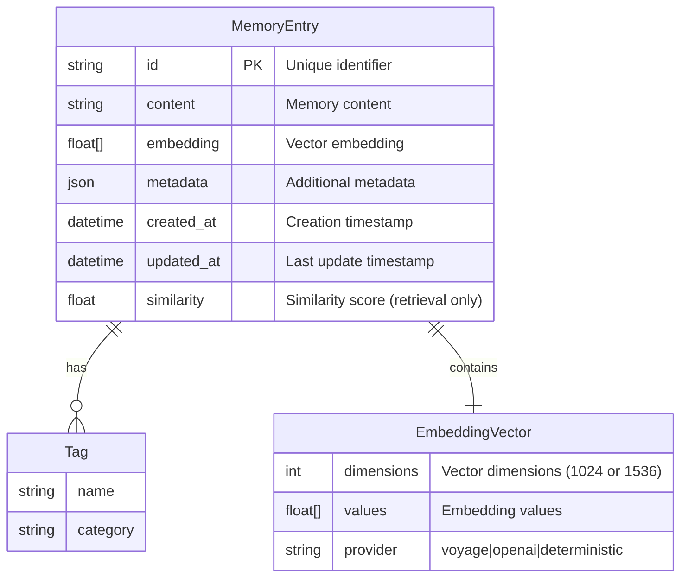
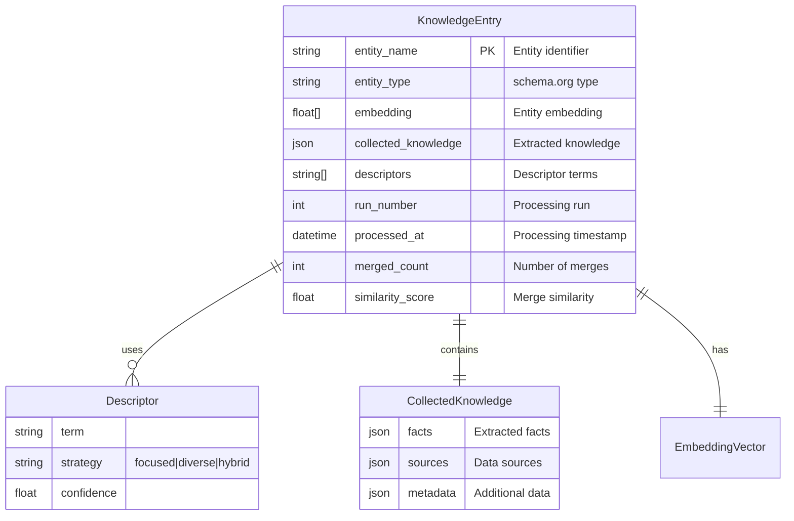
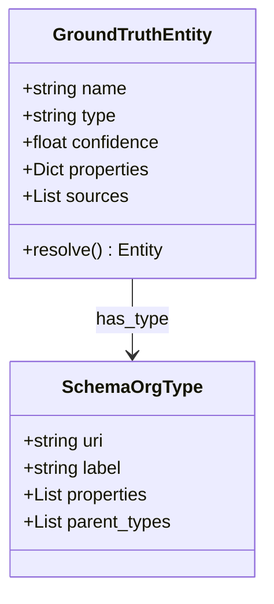
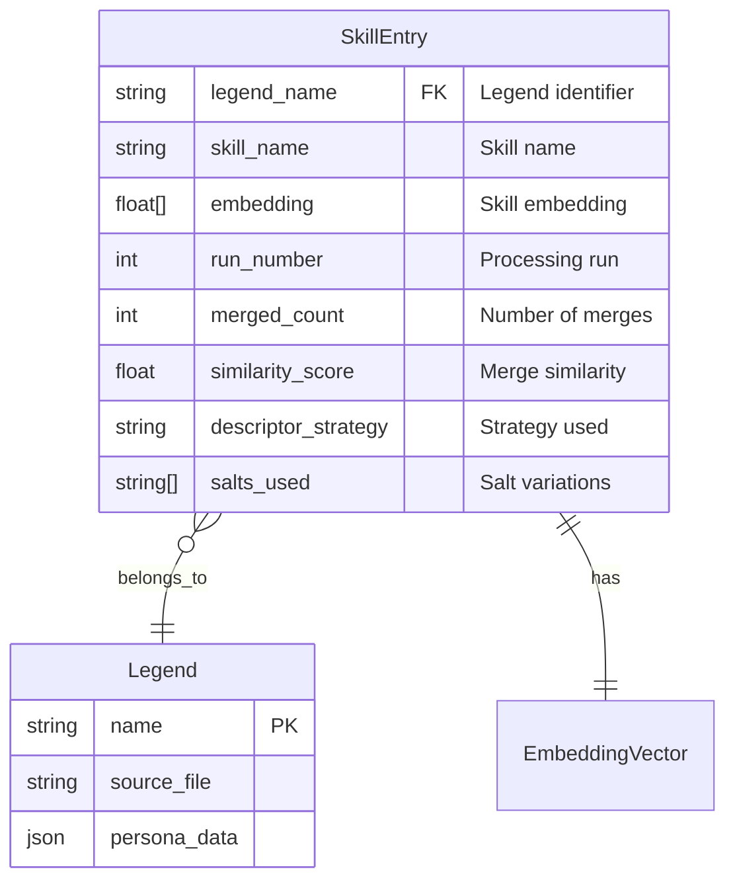
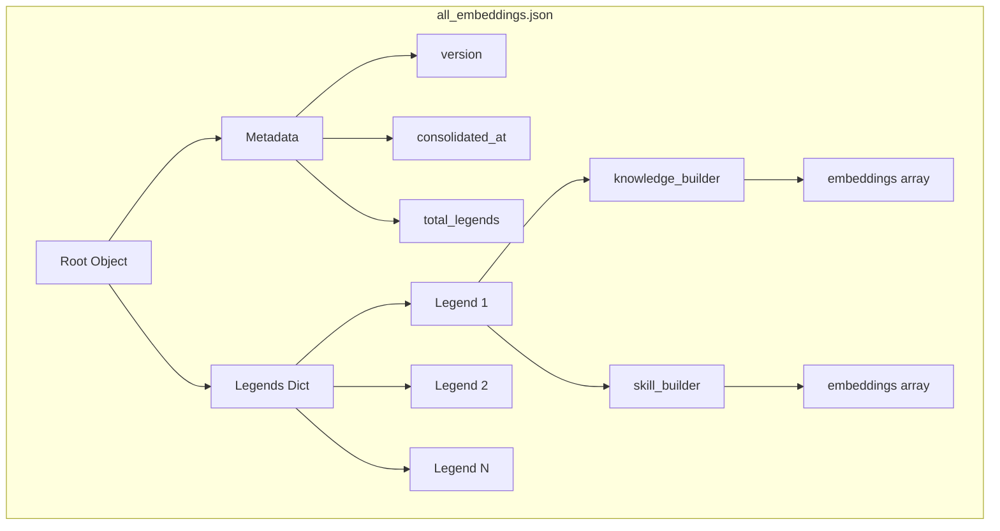
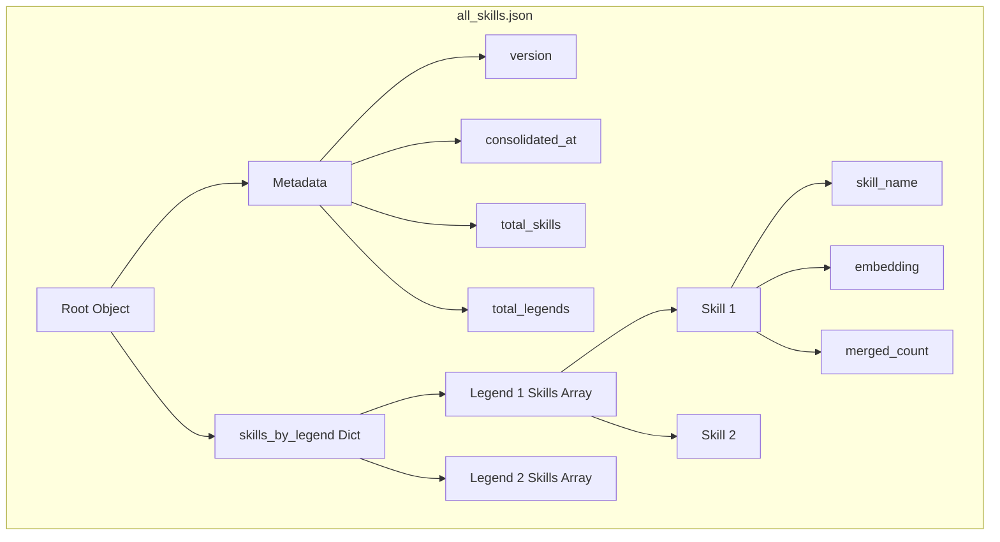
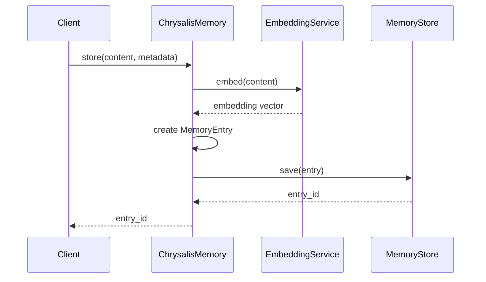
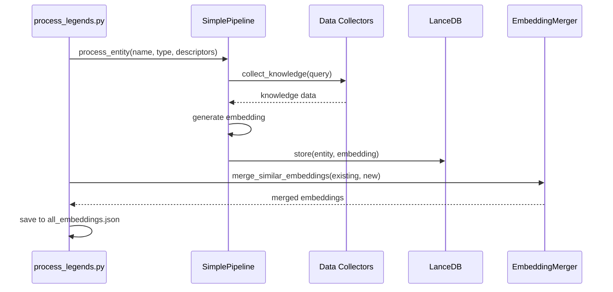
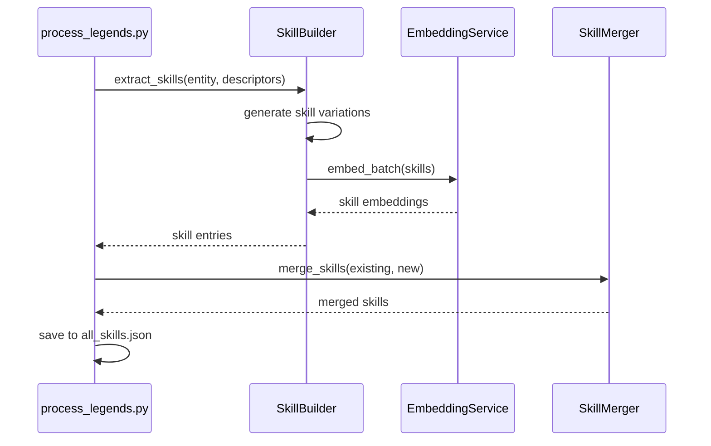

# Chrysalis Data Models

**Version**: 1.0.0  
**Last Updated**: January 9, 2026

## Overview

This document provides comprehensive documentation of all data models, schemas, and data structures used in the Chrysalis system.

## Table of Contents

- [Memory System Models](#memory-system-models)
- [KnowledgeBuilder Models](#knowledgebuilder-models)
- [SkillBuilder Models](#skillbuilder-models)
- [Consolidated File Formats](#consolidated-file-formats)
- [Schema Validation](#schema-validation)

## Memory System Models

### MemoryEntry

**Purpose**: Represents a single memory entry with content and embedding.

**Entity-Relationship Diagram**:


**Python Dataclass**:
```python
from dataclasses import dataclass
from datetime import datetime
from typing import Dict, List, Optional, Any

@dataclass
class MemoryEntry:
    id: str
    content: str
    embedding: List[float]
    metadata: Dict[str, Any]
    created_at: datetime
    updated_at: datetime
    similarity: Optional[float] = None  # Set during retrieval
```

**JSON Schema**:
```json
{
  "$schema": "http://json-schema.org/draft-07/schema#",
  "type": "object",
  "required": ["id", "content", "embedding", "metadata", "created_at", "updated_at"],
  "properties": {
    "id": {
      "type": "string",
      "description": "Unique identifier (UUID)"
    },
    "content": {
      "type": "string",
      "description": "Memory content text"
    },
    "embedding": {
      "type": "array",
      "items": {"type": "number"},
      "minItems": 1024,
      "maxItems": 3072,
      "description": "Vector embedding"
    },
    "metadata": {
      "type": "object",
      "description": "Additional metadata"
    },
    "created_at": {
      "type": "string",
      "format": "date-time"
    },
    "updated_at": {
      "type": "string",
      "format": "date-time"
    },
    "similarity": {
      "type": "number",
      "minimum": -1.0,
      "maximum": 1.0,
      "description": "Cosine similarity score (retrieval only)"
    }
  }
}
```

**Example**:
```json
{
  "id": "550e8400-e29b-41d4-a716-446655440000",
  "content": "Bob Ross was an American painter and television host",
  "embedding": [0.013, -0.024, 0.030, ...],
  "metadata": {
    "source": "biography",
    "entity": "Bob Ross",
    "entity_type": "Person",
    "tags": ["painter", "television", "artist"]
  },
  "created_at": "2026-01-09T10:00:00Z",
  "updated_at": "2026-01-09T10:00:00Z",
  "similarity": 0.95
}
```

**Reference**: [Memory System Documentation](../memory_system/README.md)

## KnowledgeBuilder Models

### KnowledgeEntry

**Purpose**: Represents knowledge extracted about an entity.

**Entity-Relationship Diagram**:


**Python Dataclass**:
```python
@dataclass
class KnowledgeEntry:
    entity_name: str
    entity_type: str
    embedding: List[float]
    collected_knowledge: Dict[str, Any]
    descriptors: List[str]
    run_number: int
    processed_at: datetime
    merged_count: int = 1
    similarity_score: Optional[float] = None
    descriptor_strategy: Optional[str] = None
    duration_sec: Optional[float] = None
```

**JSON Schema**:
```json
{
  "$schema": "http://json-schema.org/draft-07/schema#",
  "type": "object",
  "required": ["entity_name", "entity_type", "embedding", "collected_knowledge", "descriptors", "run_number", "processed_at"],
  "properties": {
    "entity_name": {"type": "string"},
    "entity_type": {"type": "string", "pattern": "^schema:"},
    "embedding": {
      "type": "array",
      "items": {"type": "number"},
      "minItems": 1024,
      "maxItems": 1024
    },
    "collected_knowledge": {"type": "object"},
    "descriptors": {
      "type": "array",
      "items": {"type": "string"}
    },
    "run_number": {"type": "integer", "minimum": 1},
    "processed_at": {"type": "string", "format": "date-time"},
    "merged_count": {"type": "integer", "minimum": 1},
    "similarity_score": {"type": "number", "minimum": 0, "maximum": 1},
    "descriptor_strategy": {"enum": ["focused", "diverse", "hybrid"]},
    "duration_sec": {"type": "number", "minimum": 0}
  }
}
```

**Example**:
```json
{
  "entity_name": "Bob Ross",
  "entity_type": "schema:Person",
  "embedding": [0.013, -0.024, ...],
  "collected_knowledge": {
    "biography": "American painter, art instructor, and television host",
    "birth_date": "1942-10-29",
    "death_date": "1995-07-04",
    "known_for": ["The Joy of Painting", "wet-on-wet technique"],
    "sources": ["wikipedia", "biography.com"]
  },
  "descriptors": ["painter", "television host", "artist", "instructor"],
  "run_number": 1,
  "processed_at": "2026-01-09T10:00:00Z",
  "merged_count": 2,
  "similarity_score": 0.95,
  "descriptor_strategy": "hybrid",
  "duration_sec": 4.5
}
```

### GroundTruthEntity

**Purpose**: Schema.org entity with confidence scoring.

**Data Model**:


**Python Dataclass**:
```python
@dataclass
class GroundTruthEntity:
    name: str
    type: str  # schema.org type URI
    confidence: float  # 0.0 to 1.0
    properties: Dict[str, Any]
    sources: List[str]
    resolved_at: datetime
```

**Reference**: [Schema.org](https://schema.org/) | [KnowledgeBuilder Architecture](../projects/KnowledgeBuilder/ARCHITECTURE.md)

## SkillBuilder Models

### SkillEntry

**Purpose**: Represents an extracted skill with embedding.

**Entity-Relationship Diagram**:


**Python Dataclass**:
```python
@dataclass
class SkillEntry:
    legend_name: str
    skill_name: str
    embedding: List[float]
    run_number: int
    merged_count: int = 1
    similarity_score: Optional[float] = None
    descriptor_strategy: Optional[str] = None
    salts_used: Optional[List[str]] = None
```

**JSON Schema**:
```json
{
  "$schema": "http://json-schema.org/draft-07/schema#",
  "type": "object",
  "required": ["legend_name", "skill_name", "embedding", "run_number"],
  "properties": {
    "legend_name": {"type": "string"},
    "skill_name": {"type": "string"},
    "embedding": {
      "type": "array",
      "items": {"type": "number"},
      "minItems": 1024,
      "maxItems": 1024
    },
    "run_number": {"type": "integer", "minimum": 1},
    "merged_count": {"type": "integer", "minimum": 1},
    "similarity_score": {"type": "number", "minimum": 0, "maximum": 1},
    "descriptor_strategy": {"enum": ["focused", "diverse", "hybrid"]},
    "salts_used": {
      "type": "array",
      "items": {"type": "string"}
    }
  }
}
```

**Example**:
```json
{
  "legend_name": "Bob Ross",
  "skill_name": "painting",
  "embedding": [0.014, -0.008, ...],
  "run_number": 1,
  "merged_count": 2,
  "similarity_score": 0.92,
  "descriptor_strategy": "hybrid",
  "salts_used": ["painter", "artist", "visual_artist"]
}
```

## Consolidated File Formats

### all_embeddings.json

**Purpose**: Consolidated embeddings from all legends.

**Data Model**:


**Structure**:
```json
{
  "version": "1.0.0",
  "consolidated_at": "2026-01-09T10:00:00Z",
  "total_legends": 49,
  "legends": {
    "Bob Ross": {
      "name": "Bob Ross",
      "source_file": "bob_ross.json",
      "processed_at": "2026-01-09T10:00:00Z",
      "run_count": 2,
      "strategy": "hybrid",
      "knowledge_builder": {
        "runs": 2,
        "embeddings": [
          {
            "run": 1,
            "dimensions": 1024,
            "embedding": [0.013, -0.024, ...],
            "has_collected_knowledge": true,
            "collected_knowledge": {...},
            "descriptor_strategy": "hybrid",
            "descriptors": ["painter", "television host"],
            "duration_sec": 4.5,
            "merged_count": 2,
            "similarity_score": 0.95,
            "last_merged_at": "2026-01-09T10:05:00Z"
          }
        ]
      },
      "skill_builder": {
        "runs": 2,
        "embeddings": [
          {
            "run": 1,
            "dimensions": 1024,
            "embedding": [0.014, -0.008, ...],
            "skill_count": 10,
            "salts_used": ["painter", "artist"],
            "descriptor_strategy": "hybrid",
            "descriptors": ["painting", "art"],
            "duration_sec": 0.6,
            "merged_count": 2,
            "similarity_score": 0.92,
            "last_merged_at": "2026-01-09T10:05:00Z"
          }
        ]
      }
    }
  }
}
```

**Schema Validation**:
```python
from jsonschema import validate

schema = {
    "type": "object",
    "required": ["version", "consolidated_at", "total_legends", "legends"],
    "properties": {
        "version": {"type": "string", "pattern": "^\\d+\\.\\d+\\.\\d+$"},
        "consolidated_at": {"type": "string", "format": "date-time"},
        "total_legends": {"type": "integer", "minimum": 0},
        "legends": {
            "type": "object",
            "patternProperties": {
                ".*": {
                    "type": "object",
                    "required": ["name", "source_file", "knowledge_builder", "skill_builder"]
                }
            }
        }
    }
}
```

### all_skills.json

**Purpose**: Consolidated skills from all legends.

**Data Model**:


**Structure**:
```json
{
  "version": "1.0.0",
  "consolidated_at": "2026-01-09T10:00:00Z",
  "total_skills": 346,
  "total_legends": 48,
  "skills_by_legend": {
    "Bob Ross": [
      {
        "legend_name": "Bob Ross",
        "skill_name": "painting",
        "embedding": [0.014, -0.008, ...],
        "run_number": 1,
        "merged_count": 2,
        "similarity_score": 0.92,
        "descriptor_strategy": "hybrid",
        "salts_used": ["painter", "artist"]
      },
      {
        "legend_name": "Bob Ross",
        "skill_name": "teaching",
        "embedding": [0.012, -0.006, ...],
        "run_number": 1,
        "merged_count": 1
      }
    ]
  }
}
```

### all_personas.json

**Purpose**: Consolidated persona data from all legends.

**Structure**:
```json
{
  "version": "1.0.0",
  "consolidated_at": "2026-01-09T10:00:00Z",
  "total_personas": 49,
  "personas": {
    "Bob Ross": {
      "name": "Bob Ross",
      "source_file": "bob_ross.json",
      "persona_data": {
        "full_name": "Robert Norman Ross",
        "birth_date": "1942-10-29",
        "death_date": "1995-07-04",
        "occupation": ["Painter", "Art Instructor", "Television Host"],
        "known_for": ["The Joy of Painting"],
        "style": ["Wet-on-wet", "Alla prima"],
        "philosophy": "We don't make mistakes, just happy accidents"
      },
      "processed_at": "2026-01-09T10:00:00Z"
    }
  }
}
```

## Schema Validation

### Validation Functions

**Python**:
```python
from jsonschema import validate, ValidationError
import json

def validate_memory_entry(entry: dict) -> bool:
    """Validate a memory entry against schema."""
    schema = {
        "type": "object",
        "required": ["id", "content", "embedding", "metadata"],
        "properties": {
            "id": {"type": "string"},
            "content": {"type": "string"},
            "embedding": {
                "type": "array",
                "items": {"type": "number"}
            },
            "metadata": {"type": "object"}
        }
    }
    
    try:
        validate(instance=entry, schema=schema)
        return True
    except ValidationError as e:
        print(f"Validation error: {e.message}")
        return False

def validate_consolidated_embeddings(data: dict) -> bool:
    """Validate consolidated embeddings file."""
    required_fields = ["version", "consolidated_at", "total_legends", "legends"]
    
    for field in required_fields:
        if field not in data:
            print(f"Missing required field: {field}")
            return False
    
    if not isinstance(data["legends"], dict):
        print("legends must be a dictionary")
        return False
    
    return True
```

**Usage**:
```python
# Validate memory entry
entry = {
    "id": "abc123",
    "content": "Bob Ross was a painter",
    "embedding": [0.1, 0.2, 0.3],
    "metadata": {"source": "biography"}
}

if validate_memory_entry(entry):
    print("✓ Valid memory entry")

# Validate consolidated file
with open("all_embeddings.json") as f:
    data = json.load(f)
    
if validate_consolidated_embeddings(data):
    print("✓ Valid consolidated embeddings")
```

### TypeScript Interfaces

```typescript
// Memory Entry
interface MemoryEntry {
  id: string;
  content: string;
  embedding: number[];
  metadata: Record<string, any>;
  created_at: string;
  updated_at: string;
  similarity?: number;
}

// Knowledge Entry
interface KnowledgeEntry {
  entity_name: string;
  entity_type: string;
  embedding: number[];
  collected_knowledge: Record<string, any>;
  descriptors: string[];
  run_number: number;
  processed_at: string;
  merged_count?: number;
  similarity_score?: number;
}

// Skill Entry
interface SkillEntry {
  legend_name: string;
  skill_name: string;
  embedding: number[];
  run_number: number;
  merged_count?: number;
  similarity_score?: number;
}

// Consolidated Embeddings
interface ConsolidatedEmbeddings {
  version: string;
  consolidated_at: string;
  total_legends: number;
  legends: Record<string, LegendEmbeddings>;
}

interface LegendEmbeddings {
  name: string;
  source_file: string;
  processed_at: string;
  run_count: number;
  strategy: string;
  knowledge_builder: {
    runs: number;
    embeddings: KnowledgeEmbedding[];
  };
  skill_builder: {
    runs: number;
    embeddings: SkillEmbedding[];
  };
}
```

## Data Flow Diagrams

### Memory Storage Flow



### Knowledge Building Flow



### Skill Extraction Flow



## References

### Standards
- [JSON Schema](https://json-schema.org/) - JSON validation standard
- [Schema.org](https://schema.org/) - Structured data vocabulary
- [ISO 8601](https://en.wikipedia.org/wiki/ISO_8601) - Date/time format
- [UUID](https://en.wikipedia.org/wiki/Universally_unique_identifier) - Unique identifiers

### Data Modeling
- [Entity-Relationship Model](https://en.wikipedia.org/wiki/Entity%E2%80%93relationship_model) - ER diagrams
- [UML Class Diagrams](https://en.wikipedia.org/wiki/Class_diagram) - Object modeling
- [Data Flow Diagrams](https://en.wikipedia.org/wiki/Data-flow_diagram) - Process modeling

### Vector Embeddings
- [Voyage AI Documentation](https://docs.voyageai.com/) - Embedding provider
- [OpenAI Embeddings](https://platform.openai.com/docs/guides/embeddings) - Embedding provider
- [Vector Databases](https://www.pinecone.io/learn/vector-database/) - Storage concepts

## Related Documentation

- [API Documentation](API.md)
- [Configuration Guide](CONFIGURATION.md)
- [Semantic Merge Feature](features/SEMANTIC_MERGE.md)
- [KnowledgeBuilder Architecture](../projects/KnowledgeBuilder/ARCHITECTURE.md)

---

**Last Updated**: January 9, 2026  
**Version**: 1.0.0  
**Maintainer**: Chrysalis Team
