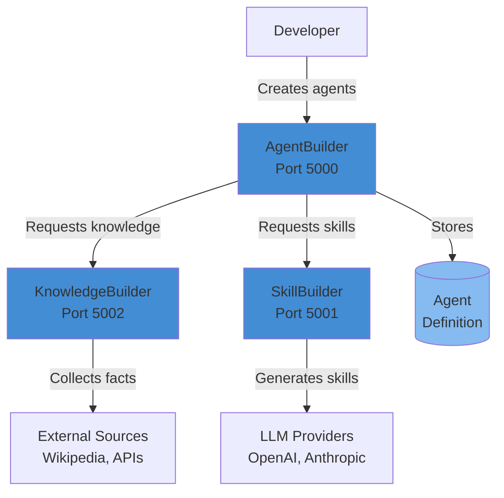

# Chrysalis Developer Onboarding Guide

**Version**: 1.0.0  
**Date**: 2026-01-11  
**Audience**: New developers joining the Chrysalis project

---

## Welcome to Chrysalis! 🎉

This guide will help you get up and running with the Chrysalis platform in under 2 hours. By the end, you'll have:

- ✅ Development environment configured
- ✅ All services running locally
- ✅ Created your first AI agent
- ✅ Understanding of the codebase structure
- ✅ Knowledge of development workflows

---

## Table of Contents

1. [Prerequisites](#prerequisites)
2. [Quick Start (15 minutes)](#quick-start-15-minutes)
3. [Understanding the Architecture](#understanding-the-architecture)
4. [Development Environment Setup](#development-environment-setup)
5. [Your First Agent](#your-first-agent)
6. [Development Workflows](#development-workflows)
7. [Testing](#testing)
8. [Documentation](#documentation)
9. [Common Tasks](#common-tasks)
10. [Troubleshooting](#troubleshooting)
11. [Getting Help](#getting-help)

---

## Prerequisites

### Required Software

| Tool | Version | Purpose | Installation |
|------|---------|---------|--------------|
| **Python** | 3.11+ | Backend services | [python.org](https://python.org) |
| **Node.js** | 18+ | TypeScript runtime, UI | [nodejs.org](https://nodejs.org) |
| **Git** | Latest | Version control | [git-scm.com](https://git-scm.com) |
| **Docker** | Latest | Optional: containerized services | [docker.com](https://docker.com) |

### Recommended Tools

- **VS Code** with extensions:
  - Python
  - TypeScript
  - Mermaid Preview
  - REST Client
- **Postman** or **Insomnia**: API testing
- **Git GUI**: GitKraken, SourceTree, or GitHub Desktop

### Required API Keys

You'll need API keys for:

1. **Voyage AI** (recommended) or **OpenAI**: Embeddings
2. **Anthropic** (optional): Enhanced skill generation
3. **OpenAI** (optional): Knowledge generation

**Get API Keys**:
- Voyage AI: https://www.voyageai.com/
- OpenAI: https://platform.openai.com/api-keys
- Anthropic: https://console.anthropic.com/

---

## Quick Start (15 minutes)

### Step 1: Clone the Repository

```bash
# Clone the repository
git clone https://github.com/your-org/Chrysalis.git
cd Chrysalis

# Verify you're in the right place
ls -la
# Should see: README.md, projects/, shared/, memory_system/, etc.
```

### Step 2: Set Up Python Environment

```bash
# Create virtual environment
python3 -m venv .venv

# Activate virtual environment
# On macOS/Linux:
source .venv/bin/activate
# On Windows:
.venv\Scripts\activate

# Upgrade pip
pip install --upgrade pip

# Install dependencies
pip install -r requirements.txt

# Verify installation
python -c "import flask; print(f'Flask {flask.__version__} installed')"
```

### Step 3: Configure Environment Variables

```bash
# Copy example environment file
cp .env.example .env

# Edit .env with your API keys
nano .env  # or use your preferred editor
```

**Required `.env` configuration**:
```bash
# Embedding Service (choose one)
VOYAGE_API_KEY=your_voyage_key_here
# OR
OPENAI_API_KEY=your_openai_key_here

# Optional: Enhanced features
ANTHROPIC_API_KEY=your_anthropic_key_here

# Service Configuration
AGENTBUILDER_PORT=5000
SKILLBUILDER_PORT=5001
KNOWLEDGEBUILDER_PORT=5002

# Vector Index (optional, defaults to brute force)
VECTOR_INDEX_TYPE=brute  # or 'hnsw', 'lance'
```

### Step 4: Start the Services

Open **three terminal windows** and run one service in each:

**Terminal 1 - AgentBuilder**:
```bash
cd projects/AgentBuilder
python server.py
# Should see: Running on http://localhost:5000
```

**Terminal 2 - SkillBuilder**:
```bash
cd projects/SkillBuilder
python server.py
# Should see: Running on http://localhost:5001
```

**Terminal 3 - KnowledgeBuilder**:
```bash
cd projects/KnowledgeBuilder
python server.py
# Should see: Running on http://localhost:5002
```

### Step 5: Verify Services

```bash
# Check health endpoints
curl http://localhost:5000/health  # AgentBuilder
curl http://localhost:5001/health  # SkillBuilder
curl http://localhost:5002/health  # KnowledgeBuilder

# All should return: {"success": true, "data": {"status": "healthy", ...}}
```

**🎉 Congratulations!** All services are running. You're ready to create your first agent.

---

## Understanding the Architecture

### System Overview

Chrysalis is a platform for creating, managing, and evolving AI agents. It consists of three core services:



### Service Responsibilities

| Service | Port | Purpose | Key Features |
|---------|------|---------|--------------|
| **AgentBuilder** | 5000 | Orchestrates agent creation | Coordinates KB & SB, manages agent lifecycle |
| **SkillBuilder** | 5001 | Generates agent skills | Occupation-based skills, deepening cycles |
| **KnowledgeBuilder** | 5002 | Collects knowledge | Multi-source search, semantic search |

### Project Structure

```
Chrysalis/
├── projects/                    # Core services
│   ├── AgentBuilder/           # Agent orchestration service
│   ├── SkillBuilder/           # Skill generation service
│   └── KnowledgeBuilder/       # Knowledge collection service
│
├── shared/                      # Shared libraries
│   ├── api_core/               # Unified API patterns (Python)
│   ├── api-core/               # Unified API patterns (TypeScript)
│   └── embedding/              # Embedding service abstraction
│
├── memory_system/              # Agent memory system
│   ├── chrysalis_memory.py    # Memory management
│   ├── embeddings.py          # Embedding generation
│   └── stores.py              # Storage backends
│
├── src/                        # TypeScript core
│   ├── core/                  # Agent core logic
│   ├── fabric/                # Pattern resolver
│   └── services/              # Service implementations
│
├── docs/                       # Documentation
│   ├── api/                   # API documentation
│   ├── architecture/          # Architecture diagrams
│   └── guides/                # User guides
│
└── examples/                   # Example code
    ├── basic_memory_example.py
    └── complete_deployment_example.py
```

---

## Development Environment Setup

### IDE Configuration

#### VS Code Setup

1. **Install Extensions**:
```bash
code --install-extension ms-python.python
code --install-extension ms-python.vscode-pylance
code --install-extension dbaeumer.vscode-eslint
code --install-extension esbenp.prettier-vscode
code --install-extension bierner.markdown-mermaid
```

2. **Configure Settings** (`.vscode/settings.json`):
```json
{
  "python.defaultInterpreterPath": "${workspaceFolder}/.venv/bin/python",
  "python.linting.enabled": true,
  "python.linting.pylintEnabled": true,
  "python.formatting.provider": "black",
  "editor.formatOnSave": true,
  "editor.codeActionsOnSave": {
    "source.organizeImports": true
  }
}
```

### Git Configuration

```bash
# Set up your identity
git config user.name "Your Name"
git config user.email "your.email@example.com"

# Set up branch defaults
git config pull.rebase true
git config branch.autoSetupRebase always

# Install pre-commit hooks (if available)
pre-commit install
```

### Database Setup (Optional)

For production-like development with persistent vector storage:

```bash
# Install LanceDB
pip install lancedb

# Configure in .env
VECTOR_INDEX_TYPE=lance
VECTOR_INDEX_COLLECTION=memories
```

---

## Your First Agent

### Step 1: Create an Agent via API

Create a file `create_agent.py`:

```python
import requests
import json

# Configuration
AGENTBUILDER_URL = "http://localhost:5000"
API_KEY = "dev-key-12345"  # Development key

# Agent specification
agent_spec = {
    "agent_id": "agent-bob-ross-001",
    "role_model": {
        "name": "Bob Ross",
        "occupation": "Artist and Art Instructor"
    },
    "deepening_cycles": 3
}

# Create agent
response = requests.post(
    f"{AGENTBUILDER_URL}/api/v1/agents",
    headers={
        "Authorization": f"Bearer {API_KEY}",
        "Content-Type": "application/json"
    },
    json=agent_spec
)

# Check response
if response.status_code == 201:
    agent = response.json()
    print("✅ Agent created successfully!")
    print(f"Agent ID: {agent['data']['agent_id']}")
    print(f"Skills: {len(agent['data'].get('generated_skills', []))}")
    print(f"Knowledge items: {len(agent['data'].get('generated_knowledge', []))}")
else:
    print(f"❌ Error: {response.status_code}")
    print(response.json())
```

Run it:
```bash
python create_agent.py
```

### Step 2: Retrieve Your Agent

```python
# Get agent details
response = requests.get(
    f"{AGENTBUILDER_URL}/api/v1/agents/agent-bob-ross-001",
    headers={"Authorization": f"Bearer {API_KEY}"}
)

agent = response.json()
print(json.dumps(agent, indent=2))
```

### Step 3: Explore Agent Capabilities

```python
# Get agent capabilities
response = requests.get(
    f"{AGENTBUILDER_URL}/api/v1/agents/agent-bob-ross-001/capabilities",
    headers={"Authorization": f"Bearer {API_KEY}"}
)

capabilities = response.json()
print("Skills:", capabilities['data']['skills'])
print("Knowledge:", capabilities['data']['knowledge'])
```

---

## Development Workflows

### Making Code Changes

1. **Create a Feature Branch**:
```bash
git checkout -b feature/your-feature-name
```

2. **Make Changes**: Edit code in your IDE

3. **Test Locally**:
```bash
# Run unit tests
pytest tests/

# Run specific test
pytest tests/test_api.py::test_create_agent

# Run with coverage
pytest --cov=projects --cov-report=html
```

4. **Format Code**:
```bash
# Python
black projects/
isort projects/

# TypeScript
npm run format
```

5. **Commit Changes**:
```bash
git add .
git commit -m "feat: add new feature description"
```

6. **Push and Create PR**:
```bash
git push origin feature/your-feature-name
# Then create PR on GitHub
```

### Code Review Checklist

Before submitting a PR, ensure:

- [ ] All tests pass
- [ ] Code is formatted (black, isort)
- [ ] Type hints added (Python)
- [ ] Docstrings added for public functions
- [ ] API changes documented
- [ ] Examples updated if needed
- [ ] CHANGELOG.md updated

---

## Testing

### Running Tests

```bash
# Run all tests
pytest

# Run specific service tests
pytest projects/AgentBuilder/tests/
pytest projects/SkillBuilder/tests/
pytest projects/KnowledgeBuilder/tests/

# Run with coverage
pytest --cov=projects --cov-report=html
open htmlcov/index.html  # View coverage report
```

### Writing Tests

Example test structure:

```python
# tests/test_agentbuilder.py
import pytest
from projects.AgentBuilder.server import app

@pytest.fixture
def client():
    """Create test client."""
    app.config['TESTING'] = True
    with app.test_client() as client:
        yield client

def test_health_check(client):
    """Test health endpoint."""
    response = client.get('/health')
    assert response.status_code == 200
    data = response.get_json()
    assert data['success'] is True
    assert data['data']['status'] == 'healthy'

def test_create_agent(client):
    """Test agent creation."""
    response = client.post(
        '/api/v1/agents',
        json={
            "agent_id": "test-agent",
            "role_model": {
                "name": "Test Agent",
                "occupation": "Tester"
            }
        },
        headers={"Authorization": "Bearer test-key"}
    )
    assert response.status_code == 201
    data = response.get_json()
    assert data['data']['agent_id'] == 'test-agent'
```

### Integration Testing

```bash
# Start all services
./scripts/start_services.sh

# Run integration tests
pytest tests/integration/

# Stop services
./scripts/stop_services.sh
```

---

## Documentation

### Documentation Structure

| Document | Purpose | Audience |
|----------|---------|----------|
| [README.md](../README.md) | Project overview | All users |
| [ARCHITECTURE.md](../ARCHITECTURE.md) | System architecture | Developers, architects |
| [API Documentation](api/API_REFERENCE_INDEX.md) | API reference | API consumers |
| [C4 Diagrams](architecture/C4_ARCHITECTURE_DIAGRAMS.md) | Architecture diagrams | Architects, developers |
| This guide | Developer onboarding | New developers |

### Updating Documentation

When you make changes:

1. **API Changes**: Update OpenAPI specs in `docs/api/openapi/`
2. **Architecture Changes**: Update `ARCHITECTURE.md` and C4 diagrams
3. **New Features**: Add to `README.md` and relevant guides
4. **Breaking Changes**: Update `CHANGELOG.md` with migration guide

### Viewing Documentation

```bash
# View Mermaid diagrams in VS Code
code --install-extension bierner.markdown-mermaid
# Then open any .md file and press Ctrl+Shift+V

# Generate API documentation
cd docs/api/openapi
swagger-cli bundle agentbuilder-openapi.yaml -o bundle.yaml

# View Swagger UI
docker run -p 8080:8080 \
  -e SWAGGER_JSON=/specs/agentbuilder-openapi.yaml \
  -v $(pwd)/docs/api/openapi:/specs \
  swaggerapi/swagger-ui
# Open http://localhost:8080
```

---

## Common Tasks

### Task 1: Add a New API Endpoint

1. **Define the endpoint** in service (e.g., `projects/AgentBuilder/server.py`):

```python
@app.route('/api/v1/agents/<agent_id>/status', methods=['GET'])
@require_auth
def get_agent_status(agent_id: str):
    """Get agent status."""
    # Implementation
    return json_response({"status": "active"})
```

2. **Add tests**:

```python
def test_get_agent_status(client):
    response = client.get('/api/v1/agents/test-agent/status')
    assert response.status_code == 200
```

3. **Update OpenAPI spec** in `docs/api/openapi/agentbuilder-openapi.yaml`

4. **Update documentation** in `docs/api/services/AGENTBUILDER_COMPLETE_SPEC.md`

### Task 2: Add a New Shared Utility

1. **Create utility** in `shared/api_core/`:

```python
# shared/api_core/new_utility.py
def my_utility_function(param: str) -> str:
    """Utility function description."""
    return f"processed: {param}"
```

2. **Export from `__init__.py`**:

```python
# shared/api_core/__init__.py
from .new_utility import my_utility_function

__all__ = [..., 'my_utility_function']
```

3. **Add tests**:

```python
# shared/api_core/tests/test_new_utility.py
def test_my_utility_function():
    result = my_utility_function("test")
    assert result == "processed: test"
```

4. **Document** in `docs/api/SHARED_API_CORE.md`

### Task 3: Debug a Service

1. **Enable debug mode**:

```python
# In server.py
if __name__ == '__main__':
    app.run(debug=True, port=5000)
```

2. **Add logging**:

```python
import logging
logging.basicConfig(level=logging.DEBUG)
logger = logging.getLogger(__name__)

logger.debug(f"Processing request: {request.json}")
```

3. **Use VS Code debugger**:

Create `.vscode/launch.json`:
```json
{
  "version": "0.2.0",
  "configurations": [
    {
      "name": "Python: AgentBuilder",
      "type": "python",
      "request": "launch",
      "program": "${workspaceFolder}/projects/AgentBuilder/server.py",
      "console": "integratedTerminal",
      "env": {
        "FLASK_ENV": "development"
      }
    }
  ]
}
```

---

## Troubleshooting

### Common Issues

#### Issue: Services won't start

**Symptoms**: `Address already in use` error

**Solution**:
```bash
# Find process using port
lsof -i :5000  # or :5001, :5002

# Kill process
kill -9 <PID>

# Or use different ports
export AGENTBUILDER_PORT=5010
python server.py
```

#### Issue: Import errors

**Symptoms**: `ModuleNotFoundError: No module named 'shared'`

**Solution**:
```bash
# Ensure you're in the project root
cd /path/to/Chrysalis

# Activate virtual environment
source .venv/bin/activate

# Install in development mode
pip install -e .

# Or add to PYTHONPATH
export PYTHONPATH="${PYTHONPATH}:$(pwd)"
```

#### Issue: API key errors

**Symptoms**: `401 Unauthorized` or `Missing API key`

**Solution**:
```bash
# Check .env file exists
ls -la .env

# Verify API keys are set
cat .env | grep API_KEY

# Test API key
curl -H "Authorization: Bearer your-key" http://localhost:5000/health
```

#### Issue: Embedding service fails

**Symptoms**: `EmbeddingServiceError` or timeout

**Solution**:
```bash
# Check API key is valid
echo $VOYAGE_API_KEY

# Test embedding service directly
python -c "
from shared.embedding.service import EmbeddingService
service = EmbeddingService()
result = service.embed('test')
print(f'Embedding dimension: {len(result)}')
"

# Use fallback provider
export OPENAI_API_KEY=your-openai-key
```

### Getting Logs

```bash
# Service logs
tail -f logs/agentbuilder.log
tail -f logs/skillbuilder.log
tail -f logs/knowledgebuilder.log

# Python logging
export PYTHONPATH="${PYTHONPATH}:$(pwd)"
export LOG_LEVEL=DEBUG
python projects/AgentBuilder/server.py
```

---

## Getting Help

### Resources

| Resource | Link | Purpose |
|----------|------|---------|
| **Documentation Hub** | [docs/README.md](../docs/README.md) | Central documentation index |
| **API Reference** | [docs/api/API_REFERENCE_INDEX.md](api/API_REFERENCE_INDEX.md) | Complete API documentation |
| **Architecture** | [ARCHITECTURE.md](../ARCHITECTURE.md) | System architecture |
| **Examples** | [examples/](../examples/) | Code examples |
| **GitHub Issues** | [Issues](https://github.com/your-org/Chrysalis/issues) | Bug reports, feature requests |

### Communication Channels

- **Slack**: #chrysalis-dev (for team members)
- **GitHub Discussions**: For questions and discussions
- **Email**: dev-team@chrysalis.dev

### Code Review Process

1. Create feature branch
2. Make changes and test
3. Push and create PR
4. Request review from 2+ team members
5. Address feedback
6. Merge after approval

### Best Practices

- **Commit Messages**: Follow [Conventional Commits](https://www.conventionalcommits.org/)
  - `feat:` New feature
  - `fix:` Bug fix
  - `docs:` Documentation
  - `test:` Tests
  - `refactor:` Code refactoring

- **Code Style**:
  - Python: Follow PEP 8, use Black formatter
  - TypeScript: Follow project ESLint config
  - Max line length: 100 characters

- **Testing**:
  - Write tests for all new features
  - Maintain >80% code coverage
  - Test edge cases and error conditions

---

## Next Steps

Now that you're set up, here are suggested next steps:

### Week 1: Learn the Basics
- [ ] Read [ARCHITECTURE.md](../ARCHITECTURE.md)
- [ ] Explore [API documentation](api/API_REFERENCE_INDEX.md)
- [ ] Create 3-5 different agents
- [ ] Review [examples/](../examples/)

### Week 2: Make Your First Contribution
- [ ] Pick a "good first issue" from GitHub
- [ ] Set up development environment
- [ ] Make changes and write tests
- [ ] Submit your first PR

### Week 3: Deep Dive
- [ ] Read [C4 Architecture Diagrams](architecture/C4_ARCHITECTURE_DIAGRAMS.md)
- [ ] Understand [Shared API Core](api/SHARED_API_CORE.md)
- [ ] Review memory system in [memory_system/](../memory_system/)
- [ ] Explore TypeScript core in [src/](../src/)

### Ongoing
- [ ] Attend weekly team meetings
- [ ] Review PRs from other developers
- [ ] Contribute to documentation
- [ ] Share knowledge with team

---

## Appendix

### Useful Commands

```bash
# Development
source .venv/bin/activate          # Activate venv
pip install -r requirements.txt    # Install dependencies
python server.py                   # Start service

# Testing
pytest                             # Run all tests
pytest -v                          # Verbose output
pytest --cov                       # With coverage
pytest -k test_name                # Run specific test

# Code Quality
black .                            # Format Python code
isort .                            # Sort imports
pylint projects/                   # Lint Python code
mypy projects/                     # Type checking

# Git
git status                         # Check status
git log --oneline --graph          # View history
git checkout -b feature/name       # New branch
git commit -m "feat: description"  # Commit
git push origin feature/name       # Push branch

# Documentation
swagger-cli validate spec.yaml     # Validate OpenAPI
spectral lint spec.yaml            # Lint OpenAPI
```

### Environment Variables Reference

| Variable | Required | Default | Description |
|----------|----------|---------|-------------|
| `VOYAGE_API_KEY` | Yes* | - | Voyage AI API key |
| `OPENAI_API_KEY` | Yes* | - | OpenAI API key |
| `ANTHROPIC_API_KEY` | No | - | Anthropic API key |
| `AGENTBUILDER_PORT` | No | 5000 | AgentBuilder port |
| `SKILLBUILDER_PORT` | No | 5001 | SkillBuilder port |
| `KNOWLEDGEBUILDER_PORT` | No | 5002 | KnowledgeBuilder port |
| `VECTOR_INDEX_TYPE` | No | brute | Vector index type |
| `LOG_LEVEL` | No | INFO | Logging level |

*At least one embedding provider (Voyage or OpenAI) is required.

---

**Welcome to the team!** 🚀

If you have questions or need help, don't hesitate to reach out on Slack or create a GitHub discussion.

---

**Document Version**: 1.0.0  
**Last Updated**: 2026-01-11  
**Maintained By**: Chrysalis Development Team  
**Next Review**: 2026-02-11
