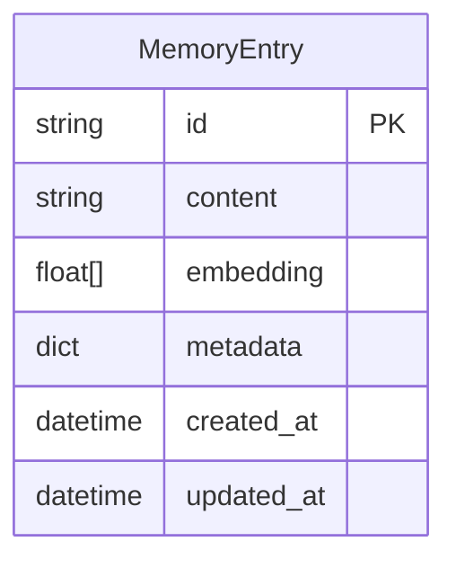
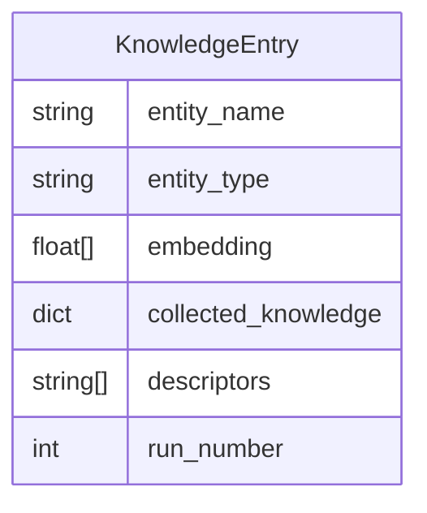
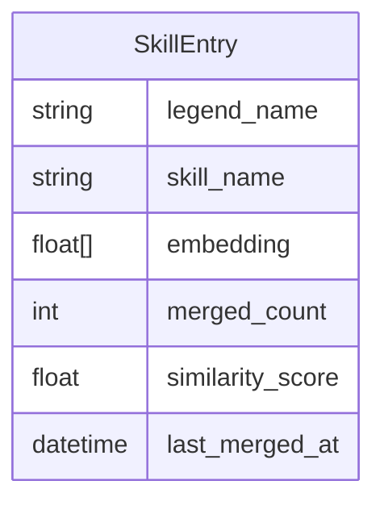
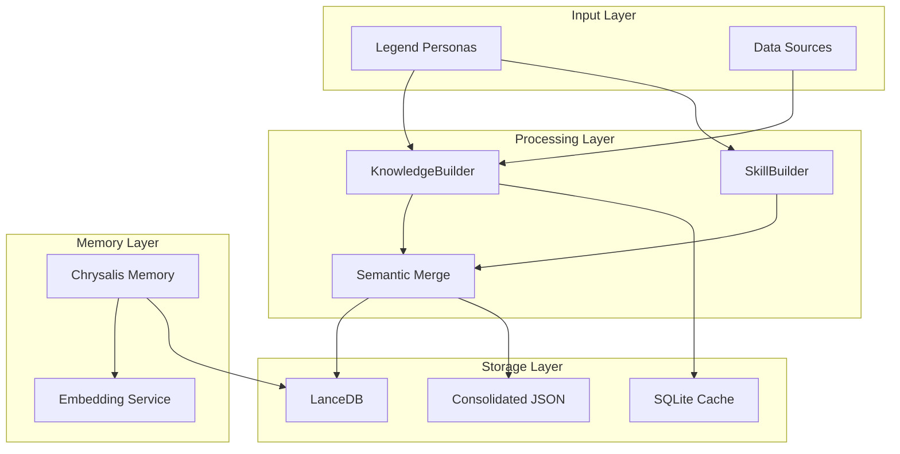

# Documentation Cleanup and Restructuring Plan
**Date**: January 9, 2026  
**Status**: In Progress  
**Based On**: [Documentation Inventory](archive/DOCUMENTATION_INVENTORY_2026-01-09.md)

## Executive Summary

This plan restructures Chrysalis documentation to eliminate duplication, archive historical material, create missing documentation, and establish a clear information architecture. The goal is a maintainable, accurate, and navigable documentation set that serves as the single source of truth.

## Guiding Principles

1. **Code is Ground Truth**: Documentation reflects actual implementation, not aspirations
2. **Diagram Everything**: Use Mermaid for flows, architectures, data models, state machines
3. **Cite Sources**: Link to external standards, papers, vendor docs for design decisions
4. **Forward-Looking**: Keep docs present-tense and enabling; archive historical narratives
5. **Single Source of Truth**: One authoritative document per topic
6. **Clear Separation**: Active docs vs. archived material

## Phase 1: Information Architecture

### Proposed Structure

```
Chrysalis/
├── README.md                          # Project overview, quick start
├── ARCHITECTURE.md                    # System architecture (Mermaid diagrams)
├── CHANGELOG.md                       # Version history (keep as-is)
├── CONTRIBUTING.md                    # Contribution guide (keep as-is)
├── LICENSE                            # License (keep as-is)
│
├── docs/
│   ├── README.md                      # Documentation navigation hub
│   ├── API.md                         # API contracts and interfaces (NEW)
│   ├── CONFIGURATION.md               # Environment vars, config files (NEW)
│   ├── DATA_MODELS.md                 # Schemas, formats, structures (NEW)
│   ├── DEPLOYMENT.md                  # Deployment guide (NEW)
│   ├── DEVELOPMENT.md                 # Development guide (NEW)
│   ├── STANDARDS.md                   # Documentation standards (keep)
│   │
│   ├── features/                      # Feature documentation
│   │   ├── README.md                  # Feature index
│   │   ├── MEMORY_SYSTEM.md           # Memory system (consolidate)
│   │   ├── KNOWLEDGE_BUILDER.md       # KnowledgeBuilder (consolidate)
│   │   ├── SKILL_BUILDER.md           # SkillBuilder (consolidate)
│   │   ├── SEMANTIC_MERGE.md          # Semantic merge (consolidate 5→1)
│   │   └── VECTOR_EMBEDDINGS.md       # Embedding best practices (rename)
│   │
│   ├── guides/                        # User guides
│   │   ├── README.md                  # Guide index
│   │   ├── QUICK_START.md             # Getting started (NEW)
│   │   ├── TROUBLESHOOTING.md         # Common issues (NEW)
│   │   └── PERFORMANCE.md             # Performance tuning (NEW)
│   │
│   ├── processes/                     # Development processes
│   │   ├── README.md                  # Process index
│   │   ├── CODE_REVIEW.md             # Code review process (NEW)
│   │   ├── TESTING.md                 # Testing strategy (NEW)
│   │   └── DEPLOYMENT_CHECKLIST.md    # Deployment steps (NEW)
│   │
│   ├── diagrams/                      # Standalone diagrams (keep)
│   │   └── *.mmd                      # Mermaid source files
│   │
│   ├── research/                      # Research notes (keep)
│   │   └── *.md                       # Research documents
│   │
│   └── archive/                       # Historical documentation
│       ├── README.md                  # Archive index (UPDATE)
│       ├── 2026-01-semantic-merge/    # Semantic merge implementation (NEW)
│       ├── 2025-12-kb-review/         # KnowledgeBuilder review (NEW)
│       └── historical-plans/          # Old plans and reports (NEW)
│
├── projects/
│   ├── README.md                      # Projects overview (keep)
│   │
│   ├── KnowledgeBuilder/
│   │   ├── README.md                  # Project overview (keep)
│   │   ├── ARCHITECTURE.md            # KB architecture (keep)
│   │   ├── IMPLEMENTATION.md          # Implementation guide (keep)
│   │   ├── DATA_SOURCES.md            # Data sources (keep)
│   │   ├── TOOL_ASSESSMENT.md         # Tool evaluation (keep)
│   │   ├── docs/
│   │   │   ├── STANDARDS.md           # KB standards (keep)
│   │   │   ├── NAVIGATION.md          # KB navigation (keep)
│   │   │   └── STATUS_NOTES.md        # Status (UPDATE)
│   │   └── archive/                   # KB historical docs (NEW)
│   │       └── 2025-12-code-review/   # Review artifacts (MOVE)
│   │
│   └── SkillBuilder/
│       ├── README.md                  # Project overview (keep)
│       ├── docs/
│       │   ├── README.md              # SB docs index (keep)
│       │   ├── status.md              # Status (UPDATE)
│       │   ├── audit.md               # Audit (keep)
│       │   ├── architecture/          # Architecture docs (keep)
│       │   ├── guides/                # User guides (keep)
│       │   └── archive/               # SB historical docs (keep)
│       └── standards-mode.md          # Standards mode (keep)
│
├── scripts/
│   ├── README.md                      # Scripts overview (NEW)
│   └── SEMANTIC_MERGE_README.md       # Semantic merge guide (keep)
│
├── memory_system/
│   └── README.md                      # Memory system docs (keep)
│
├── Agents/
│   └── wshobson-agents/
│       ├── README.md                  # Agents overview (keep)
│       └── agents.md                  # Agent catalog (keep)
│
└── plans/
    ├── README.md                      # Plans index (NEW)
    └── *.md                           # Active plans (REVIEW each)
```

## Phase 2: Consolidation Actions

### 2.1 Semantic Merge Documentation (5 files → 1 file)

**Source Files** (to consolidate):
1. `docs/SEMANTIC_MERGE_FIX_PLAN.md` (450 lines)
2. `docs/SEMANTIC_MERGE_IMPLEMENTATION_SUMMARY.md` (300 lines)
3. `docs/SEMANTIC_MERGE_COMPLETE_SUMMARY.md` (400 lines)
4. `docs/CODE_REVIEW_SEMANTIC_MERGE.md` (350 lines)
5. `docs/FINAL_TEST_REPORT.md` (500 lines)

**Target File**:
- `docs/features/SEMANTIC_MERGE.md` (consolidated, ~600 lines)

**Archive**:
- `docs/archive/2026-01-semantic-merge/implementation-notes.md` (historical details)

**Content Structure**:
```markdown
# Semantic Merge Feature

## Overview
- Purpose and motivation
- Key capabilities
- Architecture diagram (Mermaid)

## How It Works
- Cosine similarity algorithm
- Weighted averaging (60/40)
- Merge thresholds (0.85 embeddings, 0.90 skills)
- Sequence diagram (Mermaid)

## Usage
- Command-line interface
- Configuration options
- Examples

## Implementation
- Core classes (EmbeddingMerger, SkillMerger)
- Integration points
- Data flow diagram (Mermaid)

## Testing
- Test coverage summary
- Key test scenarios
- Validation tools

## Performance
- Processing time
- Memory usage
- Merge efficiency metrics

## References
- [Cosine Similarity](https://en.wikipedia.org/wiki/Cosine_similarity)
- [Vector Embeddings](https://www.pinecone.io/learn/vector-embeddings/)
```

### 2.2 KnowledgeBuilder Review Documentation (6 files → archive)

**Files to Archive**:
1. `projects/KnowledgeBuilder/COMPREHENSIVE_CODE_REVIEW.md`
2. `projects/KnowledgeBuilder/CODE_REVIEW_QUICK_REFERENCE.md`
3. `projects/KnowledgeBuilder/REVIEW_SUMMARY.md`
4. `projects/KnowledgeBuilder/IMPLEMENTATION_PLAN.md`
5. `projects/KnowledgeBuilder/DOCUMENTATION_UPDATE_SUMMARY.md`
6. `projects/KnowledgeBuilder/REVIEW_VISUAL_SUMMARY.md`

**Target Location**:
- `projects/KnowledgeBuilder/archive/2025-12-code-review/`

**Create Archive Index**:
- `projects/KnowledgeBuilder/archive/2025-12-code-review/README.md`

**Content**:
```markdown
# KnowledgeBuilder Code Review (December 2025)

**Status**: Completed  
**Date**: December 29, 2025  
**Purpose**: Historical record of comprehensive code review

## Review Outcomes

- All findings addressed
- Documentation updated
- Architecture refined
- Implementation improved

## Files in This Archive

1. `COMPREHENSIVE_CODE_REVIEW.md` - Full review findings
2. `CODE_REVIEW_QUICK_REFERENCE.md` - Quick reference
3. `REVIEW_SUMMARY.md` - Executive summary
4. `IMPLEMENTATION_PLAN.md` - Remediation plan
5. `DOCUMENTATION_UPDATE_SUMMARY.md` - Doc updates
6. `REVIEW_VISUAL_SUMMARY.md` - Visual summary

## Key Lessons Learned

(Extract key insights for future reference)

---
**Note**: This is historical material. For current KnowledgeBuilder documentation, see [README.md](../../README.md)
```

### 2.3 Root-Level Cleanup

**Files to Delete** (completed tasks):
- `JSON-Schema-Update.md` - Task completed
- `builder_pipeline_report.md` - Superseded by implementation

**Files to Archive**:
- `DRP-SemReq.md` → `docs/archive/historical-plans/deep-research-protocol.md`

**Files to Update**:
- `README.md` - Add quick start, current capabilities, clear status
- `ARCHITECTURE.md` - Add Mermaid diagrams, actual components, API surfaces

**Files to Move**:
- `TODO_SEMANTIC_MERGE.md` → `docs/processes/DEPLOYMENT_CHECKLIST.md` (generalize)
- `SEMANTIC_MERGE_FIXES_APPLIED.md` → `docs/archive/2026-01-semantic-merge/fixes-applied.md`
- `CODE_REVIEW_CHECKLIST.md` → `docs/processes/CODE_REVIEW.md`

### 2.4 Plans Directory Cleanup

**Files to Review**:
1. `plans/CHRYSALIS_UI_MEMU_INTEGRATION.md` - Mark as "Planned" (not implemented)
2. `plans/PHASE_12_14_DUAL_CHAT_CANVAS_MEMU_PLAN.md` - Mark as "Planned"
3. `plans/documentation-architecture-plan.md` - Archive (superseded by this plan)
4. `plans/documentation-restructure-completion-report.md` - Archive (historical)
5. `plans/semantic-mode-observability-ml-review.md` - Archive (completed)

**Create**:
- `plans/README.md` - Index of active vs. archived plans

## Phase 3: Create Missing Documentation

### 3.1 API Documentation (`docs/API.md`)

**Content**:
```markdown
# Chrysalis API Documentation

## Memory System API

### Core Classes
- `ChrysalisMemory` - Main memory interface
- `MemoryStore` - Storage abstraction
- `EmbeddingService` - Embedding generation

### Methods
(Document public methods with signatures, parameters, returns, examples)

## KnowledgeBuilder API

### Pipeline Classes
- `SimplePipeline` - Main pipeline
- `Router` - Query routing

### Methods
(Document public methods)

## SkillBuilder API

### CLI Interface
- Commands
- Options
- Examples

## Data Contracts

### Memory Entry Format
```json
{
  "id": "string",
  "content": "string",
  "embedding": [float],
  "metadata": {}
}
```

### Skill Format
```json
{
  "skill_name": "string",
  "embedding": [float],
  "merged_count": int
}
```

## References
- [Memory System Implementation](../memory_system/README.md)
- [KnowledgeBuilder Architecture](../projects/KnowledgeBuilder/ARCHITECTURE.md)
```

### 3.2 Configuration Documentation (`docs/CONFIGURATION.md`)

**Content**:
```markdown
# Configuration Guide

## Environment Variables

### Embedding Providers
- `EMBEDDING_PROVIDER` - Provider selection (voyage|openai|deterministic)
- `VOYAGE_API_KEY` - Voyage AI API key
- `OPENAI_API_KEY` - OpenAI API key

### KnowledgeBuilder
- `KB_LANCEDB_PATH` - LanceDB storage path
- `KB_CACHE_PATH` - SQLite cache path
- `MERGE_USE_EMBEDDINGS` - Enable embedding merge (0|1)
- `MERGE_EMBED_MODEL` - Merge embedding model

### SkillBuilder
- `SB_CONFIG_PATH` - Config directory path
- `SB_OUTPUT_PATH` - Output directory path

## Configuration Files

### KnowledgeBuilder Config (`config.yaml`)
```yaml
pipeline:
  embedding_dimensions: 1024
  similarity_threshold: 0.85
```

### SkillBuilder Config
(Document YAML structure)

## Provider Configuration

### Voyage AI
- Model: voyage-3
- Dimensions: 1024
- Rate limits: (document)

### OpenAI
- Model: text-embedding-3-small
- Dimensions: 1536
- Rate limits: (document)

## References
- [Voyage AI Docs](https://docs.voyageai.com/)
- [OpenAI Embeddings](https://platform.openai.com/docs/guides/embeddings)
```

### 3.3 Data Models Documentation (`docs/DATA_MODELS.md`)

**Content**:
```markdown
# Data Models

## Memory System

### Memory Entry


## KnowledgeBuilder

### Knowledge Entry


### Skill Entry


## Consolidated Files

### all_embeddings.json Structure
```json
{
  "version": "1.0.0",
  "consolidated_at": "ISO8601",
  "total_legends": int,
  "legends": {
    "Legend Name": {
      "name": "string",
      "source_file": "string",
      "knowledge_builder": {
        "runs": int,
        "embeddings": [...]
      },
      "skill_builder": {
        "runs": int,
        "embeddings": [...]
      }
    }
  }
}
```

### all_skills.json Structure
```json
{
  "version": "1.0.0",
  "consolidated_at": "ISO8601",
  "total_skills": int,
  "total_legends": int,
  "skills_by_legend": {
    "Legend Name": [
      {
        "skill_name": "string",
        "embedding": [float],
        "merged_count": int
      }
    ]
  }
}
```

## References
- [JSON Schema](https://json-schema.org/)
- [Entity-Relationship Diagrams](https://en.wikipedia.org/wiki/Entity%E2%80%93relationship_model)
```

### 3.4 Quick Start Guide (`docs/guides/QUICK_START.md`)

**Content**:
```markdown
# Quick Start Guide

## Prerequisites
- Python 3.10+
- Go 1.21+ (for SkillBuilder CLI)
- API keys (Voyage AI or OpenAI)

## Installation

### 1. Clone Repository
```bash
git clone https://github.com/your-org/Chrysalis.git
cd Chrysalis
```

### 2. Install Dependencies
```bash
# Memory system
cd memory_system
pip install -r requirements.txt

# KnowledgeBuilder
cd ../projects/KnowledgeBuilder
pip install -r requirements.txt

# SkillBuilder
cd ../SkillBuilder
pip install -r requirements.txt
make build
```

### 3. Configure Environment
```bash
cp .env.example .env
# Edit .env with your API keys
```

## First Run

### Process a Legend
```bash
python scripts/process_legends.py --legend bob_ross --run-count 2
```

### Validate Results
```bash
python scripts/validate_semantic_merge.py
```

## Next Steps
- [Configuration Guide](../CONFIGURATION.md)
- [API Documentation](../API.md)
- [Troubleshooting](TROUBLESHOOTING.md)
```

### 3.5 Troubleshooting Guide (`docs/guides/TROUBLESHOOTING.md`)

**Content**:
```markdown
# Troubleshooting Guide

## Common Issues

### LanceDB Dimension Mismatch
**Symptom**: Error about dimension mismatch (3072 vs 1024)
**Cause**: Table created with wrong dimensions
**Solution**: Delete table and recreate
```bash
rm -rf projects/KnowledgeBuilder/data/lancedb/
```

### API Rate Limits
**Symptom**: 429 errors from embedding provider
**Cause**: Exceeded rate limits
**Solution**: Use deterministic mode for testing
```bash
EMBEDDING_PROVIDER=deterministic python scripts/process_legends.py ...
```

### File Lock Timeout
**Symptom**: Timeout waiting for file lock
**Cause**: Multiple processes accessing consolidated files
**Solution**: Wait for other processes to complete

## Debugging

### Enable Debug Logging
```python
import logging
logging.basicConfig(level=logging.DEBUG)
```

### Validate Consolidated Files
```bash
python scripts/validate_semantic_merge.py
```

## Getting Help
- [GitHub Issues](https://github.com/your-org/Chrysalis/issues)
- [Documentation](../README.md)
```

## Phase 4: Update Existing Documentation

### 4.1 Root README.md

**Updates Needed**:
1. Add clear project overview with Mermaid diagram
2. Add quick start section
3. Update capabilities to reflect actual implementation
4. Add clear status summary
5. Link to detailed documentation

**Structure**:
```markdown
# Chrysalis

> Semantic memory and knowledge building system for AI agents

## Overview
(Brief description with system diagram)

## Key Capabilities
- ✅ Semantic memory with vector embeddings
- ✅ Knowledge building from multiple sources
- ✅ Skill extraction and consolidation
- ✅ Incremental learning with semantic merge
- ⏳ UI integration (in progress)

## Quick Start
(5-minute getting started)

## Documentation
- [Architecture](ARCHITECTURE.md)
- [API Documentation](docs/API.md)
- [Configuration](docs/CONFIGURATION.md)
- [Guides](docs/guides/)

## Status
(Current implementation status)

## Contributing
See [CONTRIBUTING.md](CONTRIBUTING.md)

## License
MIT License - see [LICENSE](LICENSE)
```

### 4.2 Root ARCHITECTURE.md

**Updates Needed**:
1. Add system overview diagram (Mermaid)
2. Add component architecture diagram
3. Add data flow diagrams
4. Document actual API surfaces
5. Add configuration mechanisms
6. Document error handling
7. Add performance characteristics
8. Add security considerations
9. Add source citations for design decisions

**Structure**:
```markdown
# Chrysalis Architecture

## System Overview


## Component Architecture
(Detailed component diagrams)

## Data Flow
(Sequence diagrams for key operations)

## API Surfaces
(Document public interfaces)

## Configuration
(Environment variables, config files)

## Error Handling
(Error types, recovery strategies)

## Performance
(Characteristics, constraints, optimization)

## Security
(Authentication, authorization, data protection)

## Design Decisions

### Semantic Merge Algorithm
**Decision**: Use cosine similarity with weighted averaging
**Rationale**: Balances accuracy with computational efficiency
**References**:
- [Cosine Similarity](https://en.wikipedia.org/wiki/Cosine_similarity)
- [Vector Space Models](https://nlp.stanford.edu/IR-book/html/htmledition/the-vector-space-model-for-scoring-1.html)

### Embedding Provider Architecture
**Decision**: Pluggable provider system
**Rationale**: Flexibility to use different embedding models
**References**:
- [Strategy Pattern](https://refactoring.guru/design-patterns/strategy)
```

### 4.3 docs/README.md (Navigation Hub)

**Create New**:
```markdown
# Chrysalis Documentation

Welcome to the Chrysalis documentation. This page serves as the navigation hub for all documentation.

## Getting Started
- [Quick Start Guide](guides/QUICK_START.md) - Get up and running in 5 minutes
- [Configuration](CONFIGURATION.md) - Environment variables and config files
- [Troubleshooting](guides/TROUBLESHOOTING.md) - Common issues and solutions

## Core Documentation
- [Architecture](../ARCHITECTURE.md) - System architecture and design
- [API Documentation](API.md) - API contracts and interfaces
- [Data Models](DATA_MODELS.md) - Schemas and data structures
- [Development Guide](DEVELOPMENT.md) - Development workflow

## Features
- [Memory System](features/MEMORY_SYSTEM.md) - Semantic memory with vector embeddings
- [KnowledgeBuilder](features/KNOWLEDGE_BUILDER.md) - Knowledge extraction and building
- [SkillBuilder](features/SKILL_BUILDER.md) - Skill extraction and consolidation
- [Semantic Merge](features/SEMANTIC_MERGE.md) - Incremental learning system
- [Vector Embeddings](features/VECTOR_EMBEDDINGS.md) - Embedding best practices

## Guides
- [Quick Start](guides/QUICK_START.md) - Getting started
- [Troubleshooting](guides/TROUBLESHOOTING.md) - Problem solving
- [Performance](guides/PERFORMANCE.md) - Performance tuning

## Processes
- [Code Review](processes/CODE_REVIEW.md) - Code review process
- [Testing](processes/TESTING.md) - Testing strategy
- [Deployment](processes/DEPLOYMENT_CHECKLIST.md) - Deployment checklist

## Projects
- [KnowledgeBuilder](../projects/KnowledgeBuilder/README.md) - Knowledge building pipeline
- [SkillBuilder](../projects/SkillBuilder/README.md) - Skill extraction system

## Archive
- [Archive Index](archive/README.md) - Historical documentation

## Documentation Standards
- [Standards](STANDARDS.md) - Documentation guidelines and best practices

## Maintenance

**Last Updated**: January 9, 2026  
**Maintained By**: Chrysalis Team  
**Update Frequency**: As needed with code changes

### Contributing to Documentation
See [CONTRIBUTING.md](../CONTRIBUTING.md) for guidelines on updating documentation.

### Documentation Principles
1. **Diagram Everything**: Use Mermaid for visual clarity
2. **Cite Sources**: Link to external references for design decisions
3. **Forward-Looking**: Keep docs present-tense and enabling
4. **Single Source of Truth**: One authoritative document per topic
5. **Code is Ground Truth**: Documentation reflects actual implementation
```

## Phase 5: Archive Organization

### 5.1 Create Archive Structure

```
docs/archive/
├── README.md                                    # Archive index
├── DOCUMENTATION_INVENTORY_2026-01-09.md        # This inventory
├── 2026-01-semantic-merge/                      # Semantic merge implementation
│   ├── README.md                                # Implementation overview
│   ├── implementation-notes.md                  # Detailed notes
│   ├── fixes-applied.md                         # Fixes summary
│   └── test-reports/                            # Test artifacts
├── 2025-12-kb-review/                           # KnowledgeBuilder review
│   ├── README.md                                # Review overview
│   └── (6 review documents)
└── historical-plans/                            # Old plans and reports
    ├── README.md                                # Plans index
    ├── deep-research-protocol.md                # DRP-SemReq.md
    ├── documentation-architecture-plan.md       # Old doc plan
    ├── documentation-restructure-report.md      # Old restructure
    └── semantic-mode-observability-review.md    # Old review
```

### 5.2 Archive Index (`docs/archive/README.md`)

**Update**:
```markdown
# Documentation Archive

This directory contains historical documentation that is no longer current but preserved for reference.

## Archive Organization

### 2026-01 Semantic Merge Implementation
**Path**: `2026-01-semantic-merge/`  
**Date**: January 2026  
**Status**: Completed  
**Summary**: Implementation of semantic merging for embeddings and skills

**Current Documentation**: [docs/features/SEMANTIC_MERGE.md](../features/SEMANTIC_MERGE.md)

### 2025-12 KnowledgeBuilder Code Review
**Path**: `2025-12-kb-review/`  
**Date**: December 2025  
**Status**: Completed  
**Summary**: Comprehensive code review of KnowledgeBuilder project

**Current Documentation**: [projects/KnowledgeBuilder/README.md](../../projects/KnowledgeBuilder/README.md)

### Historical Plans
**Path**: `historical-plans/`  
**Date**: Various  
**Status**: Superseded or completed  
**Summary**: Old planning documents and reports

## Using Archived Documentation

**Important**: Archived documentation is historical and may not reflect current implementation.

- For current documentation, see [docs/README.md](../README.md)
- For current architecture, see [ARCHITECTURE.md](../../ARCHITECTURE.md)
- For current status, see project READMEs

## Archive Policy

Documentation is archived when:
1. Implementation is complete and stable
2. Content is superseded by newer documentation
3. Plans are completed or abandoned
4. Reviews/audits are finished

Archived documentation is:
- Clearly marked as non-current
- Organized by date and topic
- Indexed for discoverability
- Preserved for historical reference

---
**Last Updated**: January 9, 2026
```

## Phase 6: Verification Checklist

### 6.1 Link Verification
- [ ] All internal links resolve correctly
- [ ] All external links are valid
- [ ] No broken cross-references
- [ ] Archive links point to correct locations

### 6.2 Mermaid Diagram Verification
- [ ] All Mermaid diagrams render correctly
- [ ] Diagrams are semantically accurate
- [ ] Diagram syntax is valid
- [ ] Diagrams match code implementation

### 6.3 Code Alignment Verification
- [ ] API documentation matches actual APIs
- [ ] Configuration docs match actual env vars
- [ ] Data models match actual schemas
- [ ] Examples work with current code
- [ ] No aspirational features presented as current

### 6.4 Duplication Verification
- [ ] No duplicate content in active docs
- [ ] Single source of truth per topic
- [ ] Clear hierarchy established
- [ ] Redundant files archived or deleted

### 6.5 Completeness Verification
- [ ] All major features documented
- [ ] All APIs documented
- [ ] All configuration options documented
- [ ] All data models documented
- [ ] Troubleshooting guide complete

### 6.6 Archive Verification
- [ ] Historical material clearly separated
- [ ] Archive index complete
- [ ] Archive README explains non-current status
- [ ] No active docs in archive
- [ ] No archived docs in active areas

## Phase 7: Implementation Timeline

### Week 1: Consolidation and Archiving
- Day 1-2: Consolidate semantic merge docs (5→1)
- Day 3: Archive KnowledgeBuilder review docs (6 files)
- Day 4: Clean up root-level files
- Day 5: Organize plans directory

### Week 2: Create Missing Documentation
- Day 1: Create API.md
- Day 2: Create CONFIGURATION.md
- Day 3: Create DATA_MODELS.md
- Day 4: Create Quick Start and Troubleshooting guides
- Day 5: Create process documentation

### Week 3: Update Existing Documentation
- Day 1-2: Update README.md and ARCHITECTURE.md
- Day 3: Update docs/README.md navigation hub
- Day 4: Update project-specific docs
- Day 5: Update cross-references

### Week 4: Verification and Polish
- Day 1: Verify all links
- Day 2: Verify Mermaid diagrams
- Day 3: Verify code alignment
- Day 4: Final review
- Day 5: Generate completion report

## Success Criteria

- [ ] Zero duplication in active documentation
- [ ] Zero obsolete content in active documentation
- [ ] Zero contradictions between documents
- [ ] 100% of links verified working
- [ ] 100% of Mermaid diagrams rendering
- [ ] 100% of APIs documented
- [ ] 100% of configuration options documented
- [ ] Clear separation between active and archived material
- [ ] Single source of truth established for each topic
- [ ] All major features documented with diagrams
- [ ] All design decisions cited with external references

## Completion Report Template

```markdown
# Documentation Cleanup Completion Report

## Summary
- Documents created: X
- Documents updated: Y
- Documents archived: Z
- Documents deleted: W

## New Documentation
(List with purpose)

## Updated Documentation
(List with changes)

## Archived Documentation
(List with new locations)

## Deleted Documentation
(List with reasons)

## Final Structure
(Tree view)

## Verification Results
- Links: X/Y working
- Diagrams: X/Y rendering
- Code alignment: Verified
- Duplication: Eliminated
- Completeness: Achieved

## Known Gaps
(Any remaining work)

## Maintenance Plan
(How to keep docs current)
```

---

**Plan Created**: January 9, 2026  
**Status**: Ready for execution  
**Next Step**: Begin Phase 1 - Consolidation
