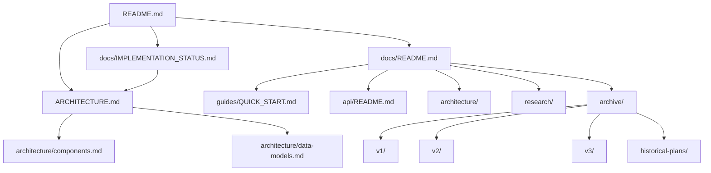

# Chrysalis Documentation Inventory

**Version**: 2.0.0  
**Last Updated**: January 11, 2026  
**Status**: Comprehensive Audit Complete

---

## Executive Summary

This inventory catalogs all documentation artifacts in the Chrysalis repository as of January 11, 2026. The audit reveals a documentation system requiring significant consolidation: **130+ documents** spread across multiple directories with substantial duplication, conflicting status claims, and outdated content.

### Key Findings

| Metric | Count | Assessment |
|--------|-------|------------|
| Total Documentation Files | 130+ | Excessive fragmentation |
| Root-level Docs | 12 | Mixed currency |
| Active docs/ Files | 55+ | Requires consolidation |
| Archive Files | 65+ | Well-organized |
| Conflicting Status Claims | 8+ | Critical issue |
| Build Status (Actual) | ❌ FAILING | Claims say "passing" |
| Python Tests (Actual) | ❌ FAILING | Claims say "84/84 passing" |

---

## Ground Truth: Codebase Verification

### TypeScript Build Status

**Actual**: ❌ **FAILING** (19 errors in `src/voice/providers/tts/`)

```
src/voice/providers/tts/elevenlabs.ts - Multiple type errors
src/voice/providers/tts/index.ts - Missing properties errors
```

**Documentation Claims**: README.md and docs/current/STATUS.md claim "✅ Builds and tests pass"

### Python Test Status

**Actual**: ❌ **FAILING** (2 errors during collection)

```
ERROR tests/test_security_integration.py
ERROR tests/test_singleton.py
```

**Documentation Claims**: Multiple docs claim "84/84 tests passing"

### Version Inconsistency

| Location | Version |
|----------|---------|
| package.json | 3.1.0 |
| README.md | 3.1.0 |
| ARCHITECTURE.md | 3.2.0 |
| docs/current/STATUS.md | 3.3.0 |
| CHANGELOG.md | Latest 3.3.0 |

---

## Documentation Artifact Inventory

### Root-Level Documentation

| File | Purpose | Status | Action |
|------|---------|--------|--------|
| `README.md` | Project overview, quick start | ⚠️ Contains false claims | Update |
| `ARCHITECTURE.md` | System design | ✅ Comprehensive | Update references |
| `CHANGELOG.md` | Version history | ✅ Current | Keep |
| `CONTRIBUTING.md` | Contributor guide | ✅ Current | Keep |
| `WORKPLAN_EXECUTIVE_SUMMARY.md` | Strategy overview | ⚠️ Dated 2025-01-XX | Archive |
| `WORKPLAN_FOCUS_AREAS.md` | Focus area details | ⚠️ Historical | Archive |
| `WORKPLAN_SECOND_PASS.md` | Workplan revision | ⚠️ Historical | Archive |
| `CODE_REVIEW_CHECKLIST.md` | Review standards | ✅ Current | Keep |
| `PULL_REQUEST_TEMPLATE.md` | PR template | ✅ Current | Keep |
| `QODO-REVIEW.md` | Review tool config | ⚠️ Tool-specific | Archive |
| `AGENT.md` | Agent guidelines | ⚠️ AI-specific | Keep |

### docs/ Directory Structure

#### docs/current/ (Active Specifications)

| File | Purpose | Status | Action |
|------|---------|--------|--------|
| `STATUS.md` | Implementation status | ⚠️ False claims | Update |
| `UNIFIED_SPEC_V3.1.md` | Technical specification | ✅ Comprehensive | Keep |
| `SYSTEM_SUMMARY.md` | System overview | ⚠️ Duplicates | Merge |
| `DOCUMENTATION_STANDARDS.md` | Doc standards | ✅ Current | Keep |
| `OBSERVABILITY_GUIDE.md` | Voyeur setup | ✅ Current | Keep |
| `MCP_SETUP.md` | MCP configuration | ✅ Current | Keep |
| `VECTOR_INDEX_SETUP.md` | Vector index guide | ✅ Current | Keep |
| `SANITIZATION_POLICY.md` | Input sanitization | ✅ Current | Keep |
| + 15 more files | Various specifications | Mixed | Review |

#### docs/architecture/ (Architecture Docs)

| File | Purpose | Status | Action |
|------|---------|--------|--------|
| `overview.md` | Architecture overview | ⚠️ Duplicates ARCHITECTURE.md | Archive |
| `memory-system.md` | Memory architecture | ✅ Current | Keep |
| `universal-patterns.md` | Pattern documentation | ✅ Current | Keep |
| `HIGH_PRIORITY_IMPLEMENTATION_PLAN.md` | Implementation plan | ⚠️ Dated | Archive |
| + 12 more files | Various architecture docs | Mixed | Review |

#### docs/api/ (API Documentation)

| File | Purpose | Status | Action |
|------|---------|--------|--------|
| `API_REFERENCE_INDEX.md` | API index | ✅ Current | Keep |
| `AUTHENTICATION.md` | Auth documentation | ✅ Current | Keep |
| `openapi-specification.md` | OpenAPI docs | ✅ Current | Keep |
| + 7 more files | API-related docs | Mixed | Review |

#### docs/guides/ (User Guides)

| File | Purpose | Status | Action |
|------|---------|--------|--------|
| `QUICK_START.md` | Getting started | ⚠️ Claims may be false | Verify |
| `TROUBLESHOOTING.md` | Problem resolution | ✅ Current | Keep |

#### docs/quality/ (Quality Docs)

| File | Purpose | Status | Action |
|------|---------|--------|--------|
| `README.md` | Quality overview | ✅ Current | Keep |
| `CODE_REVIEW_DESIGN_PATTERNS.md` | Pattern review | ✅ Current | Keep |
| + 8 more files | Quality documentation | ✅ Current | Keep |

#### docs/research/ (Research Foundation)

| Directory | Purpose | Status | Action |
|-----------|---------|--------|--------|
| `universal-patterns/` | Pattern research | ✅ Current | Keep |
| `deep-research/` | Deep dive research | ✅ Current | Keep |
| `agent-spec/` | Agent specifications | ✅ Current | Keep |
| `INDEX.md` | Research index | ✅ Current | Keep |

### Duplicate Content Identification

#### Status Documents (Multiple Sources of Truth)

1. `docs/current/STATUS.md` - Claims v3.3.0, 84 tests passing
2. `README.md` - Claims v3.1.0, builds pass
3. `ARCHITECTURE.md` - Claims v3.2.0
4. `docs/DOCUMENTATION_INVENTORY.md` (previous) - Dated 2026-01-09

**Resolution**: Create single authoritative `IMPLEMENTATION_STATUS.md`

#### Architecture Documents (Overlap)

1. `ARCHITECTURE.md` (root) - Primary, comprehensive
2. `docs/architecture/overview.md` - Duplicates root
3. `docs/current/SYSTEM_SUMMARY.md` - Partial duplicate

**Resolution**: Keep root ARCHITECTURE.md, archive duplicates

#### Workplan Documents (Historical)

1. `WORKPLAN_EXECUTIVE_SUMMARY.md`
2. `WORKPLAN_FOCUS_AREAS.md`
3. `WORKPLAN_SECOND_PASS.md`
4. Multiple `plans/` directory documents

**Resolution**: Archive all to `docs/archive/historical-plans/`

### Archive Content

The `docs/archive/` directory is well-organized with dated subdirectories:

| Directory | Contents | File Count |
|-----------|----------|------------|
| `2026-01-assessments/` | PM assessments | 1 |
| `2026-01-builder-reports/` | Builder reports | 1 |
| `2026-01-cleanup-history/` | Prior cleanup docs | 2 |
| `2026-01-code-reviews/` | Code review reports | 4 |
| `2026-01-phase-reports/` | Phase completion | 6 |
| `2026-01-quick-wins/` | Quick wins summary | 1 |
| `2026-01-semantic-merge/` | Semantic merge impl | 9 |
| `crewai/` | CrewAI integration | 7 |
| `deprecated/` | Old implementations | 16 |
| `historical-plans/` | Old planning docs | 4 |
| `legacy/` | Legacy status docs | 1 |
| `maintenance/` | Git instructions | 1 |
| `plans/` | Old plans | 2 |
| `reorg/` | Reorganization docs | 8 |
| `reports/` | Various reports | 10 |
| `review/` | Review summaries | 7 |
| `s2l/` | S2L documentation | 6 |
| `v1/, v2/, v3/` | Version archives | 17 |

**Total Archive Files**: 65+

---

## Conflicts Requiring Resolution

### Critical Conflicts

1. **Build Status Claims**
   - Claims: "TypeScript core builds and tests pass"
   - Reality: 19 TypeScript errors, build fails
   - **Resolution**: Fix build errors OR update documentation

2. **Python Test Claims**
   - Claims: "84/84 tests passing"
   - Reality: 2 tests fail during collection
   - **Resolution**: Fix tests OR update documentation

3. **Version Numbers**
   - package.json: 3.1.0
   - STATUS.md: 3.3.0
   - **Resolution**: Synchronize to correct version

### Documentation Conflicts

1. **Multiple Status Sources**
   - 4+ documents claim to be "the status"
   - **Resolution**: Single `IMPLEMENTATION_STATUS.md`

2. **Duplicate Architecture Descriptions**
   - Root and docs/architecture overlap
   - **Resolution**: Consolidate to root `ARCHITECTURE.md`

3. **Outdated Quick Start**
   - May reference non-working commands
   - **Resolution**: Verify and update

---

## Recommended Documentation Structure

### Proposed Final Structure

```
Chrysalis/
├── README.md                    # Project overview (updated)
├── ARCHITECTURE.md              # System architecture (single source)
├── CHANGELOG.md                 # Version history
├── CONTRIBUTING.md              # Contributor guide
├── CODE_REVIEW_CHECKLIST.md     # Review standards
├── PULL_REQUEST_TEMPLATE.md     # PR template
│
├── docs/
│   ├── README.md                # Documentation index (new)
│   ├── IMPLEMENTATION_STATUS.md # Single status source (new)
│   │
│   ├── getting-started/
│   │   ├── QUICK_START.md       # Verified quick start
│   │   └── CONFIGURATION.md     # Config guide
│   │
│   ├── architecture/
│   │   ├── README.md            # Architecture index
│   │   ├── components.md        # Component details
│   │   └── data-models.md       # Data structures
│   │
│   ├── api/
│   │   ├── README.md            # API index
│   │   └── [existing api docs]
│   │
│   ├── guides/
│   │   ├── development.md       # Developer guide
│   │   ├── deployment.md        # Deployment guide
│   │   └── troubleshooting.md   # Problem resolution
│   │
│   ├── research/
│   │   └── [existing research]  # Keep as-is
│   │
│   └── archive/
│       ├── README.md            # Archive index (updated)
│       └── [organized by date]  # Historical content
```

---

## Action Plan

### Phase 1: Ground Truth Alignment
1. Fix TypeScript build errors OR document known issues
2. Fix Python test errors OR document known issues
3. Synchronize version numbers across all documents

### Phase 2: Consolidation
1. Create single `IMPLEMENTATION_STATUS.md`
2. Archive duplicate status documents
3. Archive workplan documents to historical-plans/
4. Update docs/README.md as navigation hub

### Phase 3: Verification
1. Verify Quick Start commands work
2. Test all documentation links
3. Validate Mermaid diagrams render

### Phase 4: Maintenance
1. Add last-updated timestamps
2. Define document ownership
3. Establish review cadence

---

## Document Relationships Map



---

## Appendix: Full File List

### Root-Level Files

```
README.md
ARCHITECTURE.md
CHANGELOG.md
CONTRIBUTING.md
CODE_REVIEW_CHECKLIST.md
PULL_REQUEST_TEMPLATE.md
WORKPLAN_EXECUTIVE_SUMMARY.md (→ archive)
WORKPLAN_FOCUS_AREAS.md (→ archive)
WORKPLAN_SECOND_PASS.md (→ archive)
QODO-REVIEW.md (→ archive)
AGENT.md
```

### docs/ First-Level Files (55+)

See section "docs/ Directory Structure" above for complete listing.

---

**Document Owner**: Chrysalis Documentation Team  
**Next Review**: After Phase 4 completion  
**Related**: [Documentation Standards](current/DOCUMENTATION_STANDARDS.md)