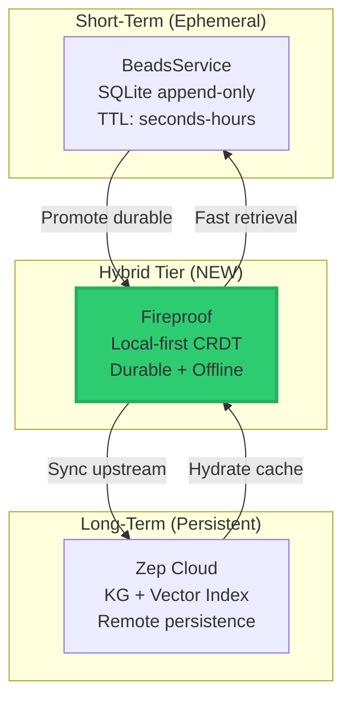
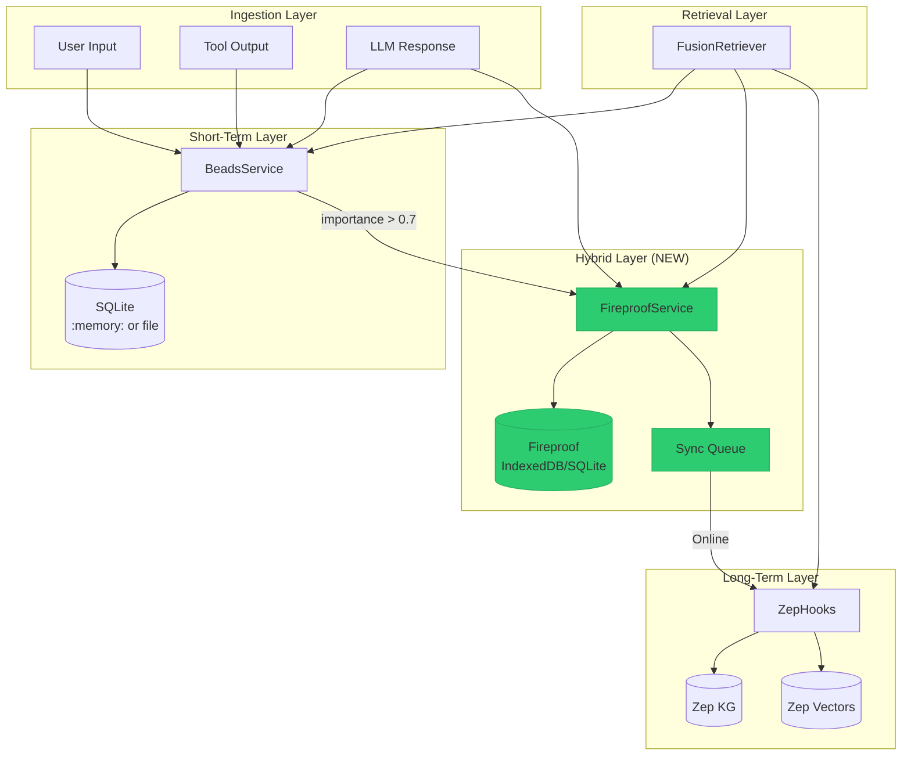
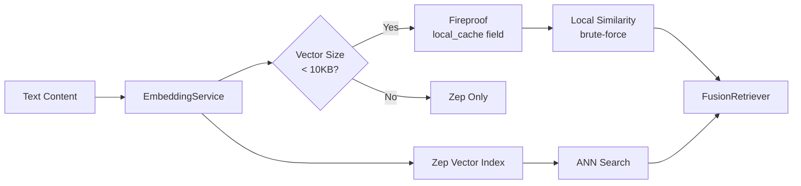
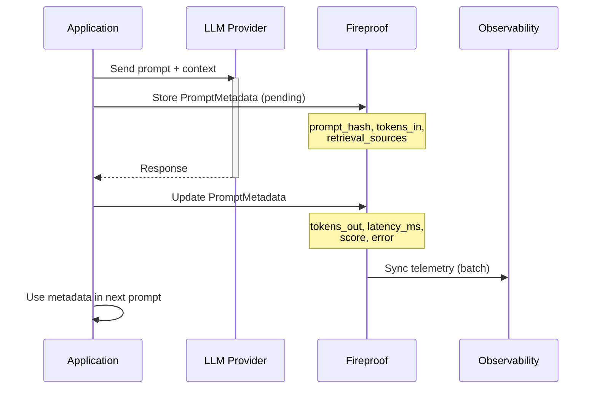
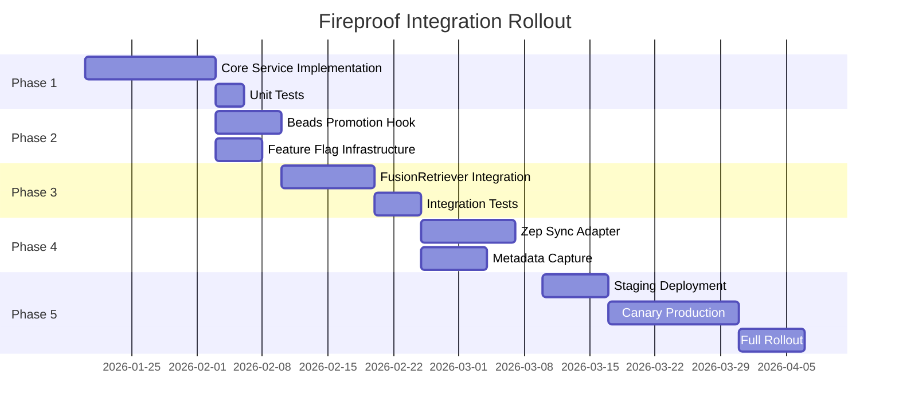

# Fireproof Integration Proposal for Chrysalis Memory System

**Version**: 1.0.0  
**Date**: January 13, 2026  
**Status**: Proposal  
**Author**: Architecture Team

---

## Table of Contents

1. [Executive Summary](#executive-summary)
2. [Role & Fit](#1-role--fit)
3. [Data Model & Flows](#2-data-model--flows)
4. [Metadata Reporting & System Prompts](#3-metadata-reporting--system-prompts)
5. [Architecture & Integration Steps](#4-architecture--integration-steps)
6. [Trade-offs & Recommendations](#5-trade-offs--recommendations)
7. [Appendix: Pseudo-Interfaces](#appendix-pseudo-interfaces)

---

## Executive Summary

This proposal outlines the integration of **Fireproof**, a local-first, CRDT-based embedded document database, into the Chrysalis memory system. Fireproof complements the existing Beads (short-term) and Zep (long-term) layers by providing:

- **Durable local storage** with cryptographic integrity (Merkle trees)
- **Offline-first operation** with deterministic conflict-free sync
- **Hybrid tier** bridging ephemeral Beads and persistent Zep
- **Metadata capture** for LLM system prompt observability

The recommended integration positions Fireproof as a **resilient middle tier** between Beads and Zep, serving as both a durable local cache and an offline-capable sync buffer.

---

## 1. Role & Fit

### 1.1 What "Fireproof" Implies

| Property | Definition | Fireproof Support |
|----------|------------|-------------------|
| **Local-first** | Data lives on-device before cloud | ✅ Core architecture |
| **CRDT-based** | Conflict-free replicated data types | ✅ Merkle-CRDT with Prolly trees |
| **Offline-sync** | Queue operations while disconnected | ✅ Automatic merge on reconnect |
| **High durability** | Tamper-evident, encrypted storage | ✅ Content-addressed encryption |
| **Cryptographic integrity** | Verifiable data provenance | ✅ Merkle tree proofs |

### 1.2 Position in Memory Stack



### 1.3 Comparison: Fireproof vs Beads vs Zep

| Aspect | Beads | Fireproof | Zep |
|--------|-------|-----------|-----|
| **Scope** | Session/context window | Session + cross-session | Permanent archive |
| **Storage** | SQLite (local) | IndexedDB/SQLite (local) | Cloud (remote) |
| **Sync** | None | CRDT auto-merge | API push/pull |
| **Offline** | Yes | Yes (queued ops) | No (network required) |
| **Durability** | TTL-based pruning | Persistent until explicit delete | Fully persistent |
| **Conflict Resolution** | N/A (append-only) | Deterministic CRDT | Last-write-wins |
| **Vector Storage** | No | Metadata only | Yes (full index) |
| **Best For** | Recent context | Durable local cache | Knowledge graph + RAG |

### 1.4 Recommended Role

Fireproof should serve as a **durable local cache and sync buffer**:

1. **Promotion from Beads**: High-importance beads are promoted to Fireproof for durability beyond TTL
2. **Sync buffer to Zep**: Accumulates changes offline, syncs to Zep when connected
3. **Fast local retrieval**: Provides sub-millisecond local queries before Zep fallback
4. **Metadata store**: Captures LLM prompt/response metadata for observability

---

## 2. Data Model & Flows

### 2.1 Data Types to Store in Fireproof

```typescript
// Core document types for Fireproof
interface FireproofDocument {
  _id: string;                    // Fireproof auto-generated or custom
  type: 'bead' | 'memory' | 'metadata' | 'embedding_ref';
  created_at: number;             // Timestamp
  updated_at: number;
  sync_status: 'local' | 'pending' | 'synced';
  version: number;                // For CRDT versioning
}

// Promoted bead from BeadsService
interface DurableBead extends FireproofDocument {
  type: 'bead';
  content: string;
  role: 'user' | 'assistant' | 'tool' | 'system';
  importance: number;             // 0.0 - 1.0
  span_refs: string[];
  original_bead_id: string;       // Reference to source bead
  metadata: Record<string, any>;
}

// Memory entry for local persistence
interface LocalMemory extends FireproofDocument {
  type: 'memory';
  content: string;
  memory_type: 'episodic' | 'semantic' | 'working';
  embedding_ref?: string;         // ID to embedding in Zep or local cache
  confidence: number;
  tags: string[];
  source_instance: string;
}

// LLM prompt/response metadata
interface PromptMetadata extends FireproofDocument {
  type: 'metadata';
  session_id: string;
  prompt_hash: string;            // Hash of system prompt
  model: string;
  tokens_in: number;
  tokens_out: number;
  latency_ms: number;
  retrieval_sources: string[];    // IDs of memories/beads used
  score?: number;                 // Quality/relevance score
  error?: string;
}

// Embedding reference (vectors stored in Zep, refs here)
interface EmbeddingRef extends FireproofDocument {
  type: 'embedding_ref';
  text_hash: string;
  zep_id: string;                 // Reference to Zep vector
  model: string;
  dimensions: number;
  local_cache?: number[];         // Optional local cache of vector
}
```

### 2.2 Data Flow Architecture



### 2.3 CRUD/Search Operations Mapping

| Operation | Beads | Fireproof | Zep |
|-----------|-------|-----------|-----|
| **Create** | `append()` | `database.put()` | `upsert_embeddings()` |
| **Read** | `recent()` | `database.get()` / `query()` | `on_retrieve_*()` |
| **Update** | N/A (append-only) | `database.put()` (merge) | `upsert_*()` |
| **Delete** | Pruned by TTL | `database.del()` | API delete |
| **Search** | Filter by role/importance | Index query | Vector ANN |

### 2.4 Vector/Embedding Strategy



**Strategy**: Store embedding **references** in Fireproof with optional local caching of small vectors (< 10KB). Full vector indices remain in Zep for scalable ANN search.

### 2.5 FusionRetriever Integration Flow

```python
# Pseudo-code for enhanced FusionRetriever.retrieve()

async def retrieve(self, query: str, ...) -> Dict[str, Any]:
    # 1. Short-term: Recent beads
    beads_recent = self.beads.recent(limit=bead_limit)
    
    # 2. Hybrid: Local Fireproof search (NEW)
    fp_results = []
    if self.fireproof:
        fp_results = await self.fireproof.query_by_relevance(
            query=query,
            types=['bead', 'memory'],
            limit=bead_limit
        )
    
    # 3. Long-term: Remote Zep (with fallback from Fireproof cache)
    remote_matches = []
    try:
        if self.zep_hooks:
            qvec = self.embedder.embed(query)
            remote_matches = self.zep_hooks.on_retrieve_embeddings(qvec, k=remote_k)
    except ZepClientError:
        # Fallback: Use Fireproof cached embeddings
        if self.fireproof:
            remote_matches = await self.fireproof.local_vector_search(query, k=remote_k)
    
    # 4. Fuse and rank
    return {
        "beads": beads_recent,
        "fireproof": fp_results,      # NEW
        "remote_embeddings": remote_matches,
        "kg": kg_result,
    }
```

---

## 3. Metadata Reporting & System Prompts

### 3.1 Metadata Capture Flow



### 3.2 PromptMetadata Schema

```typescript
interface PromptMetadata {
  _id: string;                    // Auto-generated
  type: 'metadata';
  
  // Request context
  session_id: string;
  conversation_turn: number;
  prompt_hash: string;            // SHA-256 of system prompt
  prompt_version: string;         // Semantic version if tracked
  
  // Model info
  model: string;                  // e.g., "claude-3-opus"
  provider: string;               // e.g., "anthropic"
  
  // Token usage
  tokens_in: number;
  tokens_out: number;
  tokens_context: number;         // Tokens from memory retrieval
  
  // Performance
  latency_ms: number;
  retrieval_latency_ms: number;
  
  // Retrieval provenance
  retrieval_sources: {
    type: 'bead' | 'fireproof' | 'zep';
    id: string;
    score: number;
  }[];
  
  // Quality metrics
  score?: number;                 // Human or automated rating
  feedback?: 'positive' | 'negative';
  
  // Error tracking
  error?: string;
  retry_count: number;
  
  // Timestamps
  created_at: number;
  completed_at: number;
  
  // Sync status
  sync_status: 'local' | 'pending' | 'synced';
}
```

### 3.3 Surfacing Metadata in System Prompts

**Use Cases**:

1. **Adaptive Routing**: Route to different models based on historical performance
2. **Context-Aware Reasoning**: Include retrieval provenance in prompts
3. **Auditing**: Track which memories influenced responses
4. **Quality Improvement**: Analyze low-scoring interactions

```python
# Example: Building context-aware system prompt

async def build_system_prompt(session_id: str, fireproof: FireproofService) -> str:
    # Query recent metadata for this session
    recent_meta = await fireproof.query('type', {
        'key': 'metadata',
        'filter': {'session_id': session_id},
        'limit': 5,
        'descending': True
    })
    
    # Calculate session statistics
    avg_score = mean([m.score for m in recent_meta if m.score])
    error_rate = sum(1 for m in recent_meta if m.error) / len(recent_meta)
    top_sources = Counter([s['type'] for m in recent_meta for s in m.retrieval_sources])
    
    # Build adaptive prompt section
    context_section = f"""
## Session Context
- Average response quality: {avg_score:.2f}/5.0
- Error rate: {error_rate:.1%}
- Primary memory sources: {dict(top_sources.most_common(3))}
- Last {len(recent_meta)} interactions available for reference
"""
    
    return BASE_SYSTEM_PROMPT + context_section
```

### 3.4 Metadata Query Patterns

```typescript
// Query: Get low-scoring interactions for review
const lowScoring = await database.query('score', {
  range: { gte: 0, lt: 3 },
  limit: 50
});

// Query: Get retrieval sources used in session
const sessionMeta = await database.query('session_id', {
  key: 'session-123',
  limit: 100
});
const allSources = sessionMeta.docs.flatMap(d => d.retrieval_sources);

// Query: Aggregate token usage by model
const usageByModel = await database.query('model', {
  reduce: (docs) => ({
    total_tokens: docs.reduce((sum, d) => sum + d.tokens_in + d.tokens_out, 0),
    count: docs.length
  })
});
```

---

## 4. Architecture & Integration Steps

### 4.1 Module Structure

```
memory_system/
├── fireproof/
│   ├── __init__.py
│   ├── service.py           # FireproofService class
│   ├── schemas.py           # Document type definitions
│   ├── sync.py              # Zep sync adapter
│   ├── hooks.py             # Integration hooks
│   └── tests/
│       ├── test_service.py
│       ├── test_sync.py
│       └── test_integration.py
├── fusion.py                 # Updated FusionRetriever
├── beads.py                  # Add promotion hook
└── hooks/
    └── zep.py                # Add Fireproof sync support
```

### 4.2 Integration Steps

#### Phase 1: Core Infrastructure (Week 1-2)

```python
# Step 1: Install Fireproof Python bindings (or use JS bridge)
# pip install fireproof-py  # Hypothetical - may need JS interop

# Step 2: Create FireproofService
class FireproofService:
    """
    Fireproof integration for Chrysalis memory system.
    """
    
    def __init__(
        self,
        db_name: str = "chrysalis-memory",
        sync_gateway: Optional[str] = None,
        enable_encryption: bool = True,
    ) -> None:
        self.db = fireproof.database(db_name)
        self.sync_gateway = sync_gateway
        self._setup_indexes()
    
    def _setup_indexes(self) -> None:
        """Create indexes for common query patterns."""
        # Index by type for filtered queries
        # Index by created_at for temporal queries
        # Index by sync_status for sync operations
        pass
    
    async def put(self, doc: Dict[str, Any]) -> str:
        """Store a document."""
        doc['updated_at'] = time.time()
        doc['sync_status'] = 'pending'
        result = await self.db.put(doc)
        return result.id
    
    async def get(self, doc_id: str) -> Optional[Dict[str, Any]]:
        """Retrieve a document by ID."""
        try:
            return await self.db.get(doc_id)
        except Exception:
            return None
    
    async def query(
        self,
        index: str,
        options: Dict[str, Any]
    ) -> List[Dict[str, Any]]:
        """Query documents by index."""
        result = await self.db.query(index, options)
        return result.docs
```

#### Phase 2: Beads Integration (Week 2-3)

```python
# Step 3: Add promotion hook to BeadsService

class BeadsService:
    def __init__(
        self,
        # ... existing params
        promotion_hook: Optional[Callable[[Dict], Awaitable[str]]] = None,
        promotion_threshold: float = 0.7,
    ) -> None:
        # ... existing init
        self.promotion_hook = promotion_hook
        self.promotion_threshold = promotion_threshold
    
    def append(self, content: str, ...) -> str:
        bead_id = super().append(content, ...)
        
        # Promote high-importance beads to Fireproof
        if self.promotion_hook and importance >= self.promotion_threshold:
            asyncio.create_task(self._promote_bead(bead_id, content, ...))
        
        return bead_id
    
    async def _promote_bead(self, bead_id: str, content: str, ...) -> None:
        """Promote bead to durable storage."""
        durable_bead = {
            'type': 'bead',
            'original_bead_id': bead_id,
            'content': content,
            'role': role,
            'importance': importance,
            'metadata': metadata,
            'created_at': time.time(),
        }
        await self.promotion_hook(durable_bead)
```

#### Phase 3: FusionRetriever Integration (Week 3-4)

```python
# Step 4: Update FusionRetriever

class FusionRetriever:
    def __init__(
        self,
        beads: BeadsService,
        embedder: Optional[EmbeddingService] = None,
        zep_hooks: Optional[ZepHooks] = None,
        fireproof: Optional[FireproofService] = None,  # NEW
    ) -> None:
        self.beads = beads
        self.embedder = embedder
        self.zep_hooks = zep_hooks
        self.fireproof = fireproof  # NEW
    
    async def retrieve(self, query: str, ...) -> Dict[str, Any]:
        beads_recent = self.beads.recent(limit=bead_limit)
        
        # NEW: Query Fireproof for durable local data
        fireproof_results = []
        if self.fireproof:
            fireproof_results = await self.fireproof.query('type', {
                'key': 'bead',
                'limit': bead_limit,
                'descending': True
            })
        
        # Existing: Remote Zep with Fireproof fallback
        remote_matches = []
        if include_remote and self.embedder and self.zep_hooks:
            try:
                qvec = self.embedder.embed(query)
                remote_matches = self.zep_hooks.on_retrieve_embeddings(qvec, k=remote_k)
            except ZepClientError as e:
                logger.warning(f"Zep unavailable, using Fireproof cache: {e}")
                if self.fireproof:
                    # Fallback to locally cached embeddings
                    remote_matches = await self.fireproof.local_similarity_search(
                        query, k=remote_k
                    )
        
        return {
            "beads": beads_recent,
            "fireproof": fireproof_results,  # NEW
            "remote_embeddings": remote_matches,
            "kg": kg_result,
        }
```

#### Phase 4: Sync Integration (Week 4-5)

```python
# Step 5: Implement Zep sync adapter

class FireproofZepSync:
    """
    Synchronizes Fireproof local data with Zep cloud.
    """
    
    def __init__(
        self,
        fireproof: FireproofService,
        zep_hooks: ZepHooks,
        sync_interval_s: int = 60,
        batch_size: int = 100,
    ) -> None:
        self.fireproof = fireproof
        self.zep_hooks = zep_hooks
        self.sync_interval_s = sync_interval_s
        self.batch_size = batch_size
        self._running = False
    
    async def start(self) -> None:
        """Start background sync loop."""
        self._running = True
        while self._running:
            await self._sync_pending()
            await asyncio.sleep(self.sync_interval_s)
    
    async def _sync_pending(self) -> None:
        """Push pending documents to Zep."""
        pending = await self.fireproof.query('sync_status', {
            'key': 'pending',
            'limit': self.batch_size
        })
        
        if not pending:
            return
        
        # Batch sync to Zep
        for doc in pending:
            try:
                if doc['type'] == 'memory' and 'embedding_ref' in doc:
                    # Sync embedding to Zep
                    await self._sync_embedding(doc)
                elif doc['type'] == 'metadata':
                    # Sync metadata (telemetry)
                    await self._sync_metadata(doc)
                
                # Mark as synced
                doc['sync_status'] = 'synced'
                await self.fireproof.put(doc)
                
            except Exception as e:
                logger.error(f"Sync failed for {doc['_id']}: {e}")
    
    async def _sync_embedding(self, doc: Dict) -> None:
        """Sync embedding reference to Zep."""
        if 'local_cache' in doc and doc['local_cache']:
            payload = [{
                'id': doc['_id'],
                'embedding': doc['local_cache'],
                'metadata': {'type': doc.get('memory_type', 'unknown')}
            }]
            self.zep_hooks.on_store_embedding(payload)
```

### 4.3 Schema Migrations

```python
# Fireproof handles schema evolution via document versioning
# For explicit migrations:

SCHEMA_VERSION = 1

async def migrate_documents(fireproof: FireproofService) -> None:
    """Migrate documents to current schema version."""
    
    # Query all documents without version
    legacy = await fireproof.query('version', {
        'key': None,  # No version field
        'limit': 1000
    })
    
    for doc in legacy:
        # Apply migration
        if 'type' not in doc:
            doc['type'] = 'bead'  # Default type
        if 'sync_status' not in doc:
            doc['sync_status'] = 'local'
        doc['version'] = SCHEMA_VERSION
        
        await fireproof.put(doc)
```

### 4.4 CRDT Considerations

Fireproof uses **Merkle-CRDTs** with deterministic merge semantics:

| Field Type | Merge Strategy | Notes |
|------------|----------------|-------|
| Scalar | Last-writer-wins | Timestamps from Fireproof clock |
| Array | Union with dedup | For `tags`, `span_refs` |
| Counter | Increment-only | For `access_count` |
| Set | OR-Set | For `retrieval_sources` |

```typescript
// Example: Custom merge for importance (take max)
const mergeImportance = (local: number, remote: number): number => {
  return Math.max(local, remote);
};

// Fireproof merge is automatic for most cases
// Custom merges require application-level logic
```

### 4.5 Operational Concerns

#### Backup/Restore

```python
# Fireproof supports export/import

async def backup(fireproof: FireproofService, path: str) -> None:
    """Export all documents to JSON file."""
    all_docs = await fireproof.query('_id', {'limit': 10000})
    with open(path, 'w') as f:
        json.dump([doc for doc in all_docs], f)

async def restore(fireproof: FireproofService, path: str) -> None:
    """Import documents from JSON file."""
    with open(path, 'r') as f:
        docs = json.load(f)
    for doc in docs:
        doc['sync_status'] = 'pending'  # Re-sync after restore
        await fireproof.put(doc)
```

#### Observability

```python
# Metrics to expose

class FireproofMetrics:
    documents_total: Counter          # Total documents by type
    sync_pending_count: Gauge         # Documents pending sync
    sync_latency_seconds: Histogram   # Sync operation latency
    query_latency_seconds: Histogram  # Query latency
    storage_bytes: Gauge              # Local storage size
```

#### Consistency Model


---

## 5. Trade-offs & Recommendations

### 5.1 Pros of Adding Fireproof

| Benefit | Impact |
|---------|--------|
| **Offline resilience** | System remains functional without network |
| **Reduced Zep latency** | Local cache for hot data |
| **Durable middle tier** | Survives process restarts, unlike in-memory Beads |
| **CRDT sync** | Deterministic conflict resolution |
| **Metadata capture** | Observability without external telemetry |
| **Cryptographic integrity** | Tamper-evident storage |
| **Cross-platform** | Works in browser, Node.js, edge functions |

### 5.2 Cons / Risks

| Risk | Mitigation |
|------|------------|
| **Added complexity** | Feature flags for gradual rollout |
| **Storage overhead** | Configurable TTL for local data |
| **Sync conflicts** | CRDT handles most; app-level for edge cases |
| **Python interop** | Use JS bridge or community bindings |
| **Learning curve** | Document-based vs relational model |
| **Vector storage** | Keep full vectors in Zep; refs only in Fireproof |

### 5.3 Decision Matrix

| Scenario | Recommendation |
|----------|----------------|
| Offline-first required | ✅ Add Fireproof |
| Zep latency > 100ms | ✅ Add Fireproof as cache |
| Need prompt metadata | ✅ Add Fireproof |
| Pure server-side, always online | ⚠️ Optional (Beads + Zep sufficient) |
| Edge/browser deployment | ✅ Strong fit |
| < 1000 memories | ⚠️ May be overkill |

### 5.4 Pragmatic Rollout Plan



#### Feature Flags

```python
# config.py
class FireproofConfig:
    ENABLED: bool = env.bool("FIREPROOF_ENABLED", False)
    SYNC_ENABLED: bool = env.bool("FIREPROOF_SYNC_ENABLED", False)
    PROMOTION_ENABLED: bool = env.bool("FIREPROOF_PROMOTION_ENABLED", False)
    METADATA_CAPTURE: bool = env.bool("FIREPROOF_METADATA_CAPTURE", False)
    LOCAL_VECTOR_CACHE: bool = env.bool("FIREPROOF_LOCAL_VECTORS", False)
```

### 5.5 Testing Strategy

| Test Type | Scope | Tools |
|-----------|-------|-------|
| **Unit** | FireproofService CRUD | pytest, mock |
| **Integration** | Beads → Fireproof promotion | pytest, test fixtures |
| **Integration** | Fireproof → Zep sync | pytest, mock Zep |
| **Offline** | Disconnected operation | Network simulation |
| **Conflict** | CRDT merge scenarios | Multi-instance tests |
| **Performance** | Latency benchmarks | pytest-benchmark |

```python
# Example test cases

def test_bead_promotion():
    """Beads with importance > 0.7 are promoted to Fireproof."""
    
def test_offline_query():
    """FusionRetriever returns Fireproof data when Zep unavailable."""
    
def test_sync_eventual_consistency():
    """Offline changes sync correctly when reconnected."""
    
def test_crdt_merge_conflict():
    """Concurrent edits merge deterministically."""
    
def test_metadata_capture():
    """LLM prompt metadata is captured in Fireproof."""
```

---

## Appendix: Pseudo-Interfaces

### A.1 FireproofService Interface

```python
class FireproofService(Protocol):
    """Protocol for Fireproof integration."""
    
    async def put(self, doc: Dict[str, Any]) -> str:
        """Store/update a document. Returns document ID."""
        ...
    
    async def get(self, doc_id: str) -> Optional[Dict[str, Any]]:
        """Retrieve document by ID."""
        ...
    
    async def delete(self, doc_id: str) -> bool:
        """Delete document by ID."""
        ...
    
    async def query(
        self,
        index: str,
        options: QueryOptions
    ) -> List[Dict[str, Any]]:
        """Query documents by index."""
        ...
    
    async def local_similarity_search(
        self,
        query: str,
        k: int = 5
    ) -> List[Dict[str, Any]]:
        """Search locally cached embeddings."""
        ...
    
    def subscribe(
        self,
        index: str,
        callback: Callable[[List[Dict]], None]
    ) -> Callable[[], None]:
        """Subscribe to live updates. Returns unsubscribe function."""
        ...
```

### A.2 Updated FusionRetriever Interface

```python
class FusionRetriever:
    """
    Local-first fusion retriever with Fireproof integration.
    """
    
    def __init__(
        self,
        beads: BeadsService,
        embedder: Optional[EmbeddingService] = None,
        zep_hooks: Optional[ZepHooks] = None,
        fireproof: Optional[FireproofService] = None,
    ) -> None: ...
    
    def ingest(
        self,
        content: str,
        role: str = "user",
        importance: float = 0.5,
        metadata: Optional[Dict[str, Any]] = None,
        promote_to_fireproof: bool = False,
    ) -> Dict[str, Any]:
        """
        Ingest content into memory system.
        
        Returns:
            {
                "bead_id": str,
                "fireproof_id": Optional[str],  # If promoted
                "remote": Optional[Dict]
            }
        """
        ...
    
    async def retrieve(
        self,
        query: str,
        bead_limit: int = 5,
        fireproof_limit: int = 10,
        remote_k: int = 5,
        include_remote: bool = True,
        include_fireproof: bool = True,
    ) -> Dict[str, Any]:
        """
        Retrieve context from all memory tiers.
        
        Returns:
            {
                "beads": List[Dict],
                "fireproof": List[Dict],
                "remote_embeddings": List[Dict],
                "kg": Optional[Dict]
            }
        """
        ...
```

### A.3 PromptMetadataCapture Hook

```python
class PromptMetadataCapture:
    """
    Captures LLM prompt/response metadata to Fireproof.
    """
    
    def __init__(self, fireproof: FireproofService) -> None:
        self.fireproof = fireproof
    
    @contextmanager
    def capture(
        self,
        session_id: str,
        model: str,
        retrieval_sources: List[Dict[str, Any]]
    ) -> Generator[PromptMetadata, None, None]:
        """
        Context manager for capturing prompt metadata.
        
        Usage:
            with metadata_capture.capture(session_id, model, sources) as meta:
                response = llm.generate(prompt)
                meta.tokens_out = count_tokens(response)
                meta.score = evaluate(response)
        """
        meta = PromptMetadata(
            session_id=session_id,
            model=model,
            retrieval_sources=retrieval_sources,
            created_at=time.time()
        )
        
        yield meta
        
        meta.completed_at = time.time()
        meta.latency_ms = (meta.completed_at - meta.created_at) * 1000
        
        asyncio.create_task(
            self.fireproof.put(meta.to_dict())
        )
```

---

## Open Risks & Prerequisites

### Prerequisites

1. **Fireproof Python bindings**: Official SDK is JavaScript; may need:
   - Use `@aspect-build/rules_js` for Node.js integration
   - Community Python bindings (if available)
   - HTTP bridge to Fireproof instance

2. **IndexedDB availability**: For browser deployments; SQLite for server-side

3. **Zep API stability**: Ensure sync adapter handles API changes

### Open Risks

| Risk | Probability | Impact | Mitigation |
|------|-------------|--------|------------|
| Fireproof API changes | Medium | Medium | Pin version, integration tests |
| Python SDK unavailable | Medium | High | JS bridge, subprocess |
| Storage quota limits | Low | Medium | TTL policies, size monitoring |
| Sync latency spikes | Low | Low | Configurable batch sizes |
| CRDT edge cases | Low | Medium | Comprehensive merge tests |

---

**Document Status**: Proposal for review  
**Next Steps**: 
1. Evaluate Fireproof Python interop options
2. Prototype Phase 1 with feature flag
3. Benchmark latency improvements
4. Review with architecture team

---

*End of Proposal*
