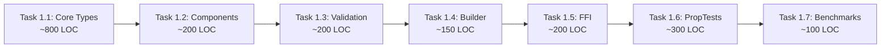

# Phase 1 Implementation Guide - Core Types Migration

**Status**: Ready to Implement
**Timeline**: Weeks 3-6 (4 weeks)
**Owner**: Core Platform Team
**Estimated Effort**: 12 engineer-weeks (3 engineers)

---

## Overview

Phase 1 migrates the foundational UniformSemanticAgentV2 type from TypeScript to Rust, establishing the basis for all subsequent migration work.

---

## TypeScript Source Analysis

**File**: `src/core/UniformSemanticAgentV2.ts` (578 lines)

### Top-Level Structure (14 fields)

1. `schema_version: string` - Version identifier
2. `identity` - Core identity (immutable)
3. `personality` - Personality traits (evolves)
4. `communication` - Communication style
5. `capabilities` - Capabilities and tools (expandable)
6. `knowledge` - Facts, topics, expertise (growing)
7. `memory` - Memory configuration and collections
8. `beliefs` - OODA-structured beliefs (refined over time)
9. `training` - Training examples (optional)
10. `instances` - Active and terminated instances
11. `experience_sync` - Sync configuration
12. `protocols` - Protocol stack (MCP, A2A, Agent Protocol)
13. `execution` - LLM and runtime configuration
14. `deployment` - Deployment preferences (optional)
15. `metadata` - Version and evolution tracking

### Supporting Types Count

**30+ supporting types** including:
- Episode, Concept, Belief, Skill (memory and knowledge)
- InstanceMetadata, InstanceHealth, InstanceStatistics
- ExperienceSyncConfig, ExperienceTransportConfig
- Protocols (MCP, A2A, Agent Protocol)
- Various enums (AgentImplementationType, SyncProtocol, etc.)

### Key Patterns

**TypeScript**:
- Union types: `string | string[]` (bio field)
- Optional fields: `?` operator
- Record types: `Record<string, any>`
- Nested structures: 4-5 levels deep

**Rust Equivalents**:
- Enum variants: `Bio::Single(String) | Bio::Multiple(Vec<String>)`
- Option types: `Option<T>`
- HashMap: `HashMap<String, serde_json::Value>`
- Nested structs with serde derives

---

## Implementation Checklist

### Task 1.1: Core Type Definitions (2-3 days)

**File**: `src/rust/chrysalis-core/src/agent.rs`

**Implement**:
- [ ] All 15 enum types (AgentImplementationType, SyncProtocol, etc.)
- [ ] All 30+ struct types
- [ ] Proper serde attributes (#[serde(rename_all = "snake_case")])
- [ ] Optional field handling (#[serde(skip_serializing_if)])
- [ ] Union type support (Bio enum for string|string[])

**Complexity**: ~800 lines of Rust

**Key Considerations**:
- Use `#[serde(rename = "type")]` for fields named "type"
- Use `#[serde(skip_serializing_if = "Option::is_none")]` for optional fields
- HashMap for TypeScript Record types
- serde_json::Value for truly dynamic data

### Task 1.2: Component Types (1 day)

**File**: `src/rust/chrysalis-core/src/components.rs`

**Implement**:
- [ ] Identity struct
- [ ] Personality struct
- [ ] Communication struct
- [ ] Capabilities struct
- [ ] Knowledge struct
- [ ] Memory struct
- [ ] Beliefs struct
- [ ] Default implementations for all

**Complexity**: ~200 lines

### Task 1.3: Validation Logic (2 days)

**File**: `src/rust/chrysalis-core/src/validation.rs`

**Port from TypeScript** `validateUniformSemanticAgentV2()`:
- [ ] Required field checks (schema_version, identity, instances, experience_sync, protocols)
- [ ] Schema version validation (must be "2.0.0")
- [ ] Instances validation (instances.active must exist)
- [ ] Protocol validation (at least one protocol enabled)
- [ ] Warnings for schema version mismatch
- [ ] Comprehensive error messages

**Complexity**: ~200 lines

**Implementation**:
```rust
pub fn validate_agent(agent: &UniformSemanticAgentV2) -> ValidationReport {
    let mut report = ValidationReport::new();

    // Required: schema_version
    if agent.schema_version.is_empty() {
        report.add_error("Missing schema_version".to_string());
    } else if agent.schema_version != SCHEMA_VERSION {
        report.add_warning(format!(
            "Schema version {} != {}",
            agent.schema_version, SCHEMA_VERSION
        ));
    }

    // Required: identity
    if agent.identity.id.is_empty() {
        report.add_error("Missing identity.id".to_string());
    }

    // Required: instances.active
    if agent.instances.active.is_empty() && agent.instances.terminated.is_empty() {
        report.add_warning("No instances defined".to_string());
    }

    // Required: At least one protocol enabled
    let has_protocol = agent.protocols.mcp.as_ref().map(|p| p.enabled).unwrap_or(false)
        || agent.protocols.a2a.as_ref().map(|p| p.enabled).unwrap_or(false)
        || agent.protocols.agent_protocol.as_ref().map(|p| p.enabled).unwrap_or(false);

    if !has_protocol {
        report.add_warning("No protocols enabled - agent may not be functional".to_string());
    }

    report
}
```

### Task 1.4: Builder Pattern (1 day)

**File**: `src/rust/chrysalis-core/src/builder.rs`

**Create fluent builder**:
```rust
pub struct AgentBuilder {
    agent: UniformSemanticAgentV2,
}

impl AgentBuilder {
    pub fn new(id: String, name: String) -> Self { ... }
    pub fn with_personality(mut self, traits: Vec<String>) -> Self { ... }
    pub fn with_capabilities(mut self, primary: Vec<String>) -> Self { ... }
    pub fn build(self) -> UniformSemanticAgentV2 { ... }
}
```

**Complexity**: ~150 lines

---

### Task 1.5: FFI Bindings (2 days)

**File**: `src/rust/chrysalis-ffi/src/core.rs`

**Expose to TypeScript**:
```rust
#[napi]
pub fn parse_agent_json(json: String) -> Result<JsUnknown> {
    let agent = UniformSemanticAgentV2::from_json(&json)?;
    // Convert to JS object
    Ok(to_js_value(agent)?)
}

#[napi]
pub fn validate_agent_json(json: String) -> Result<ValidationReport> {
    let agent = UniformSemanticAgentV2::from_json(&json)?;
    Ok(agent.validate())
}

#[napi]
pub fn serialize_agent(agent: JsUnknown) -> Result<String> {
    let agent: UniformSemanticAgentV2 = from_js_value(agent)?;
    Ok(agent.to_json()?)
}
```

**Also create**:
- TypeScript type declarations (.d.ts)
- Error conversion (Rust errors → JS errors)
- Async support if needed

**Complexity**: ~150 lines Rust + ~50 lines TypeScript declarations

---

### Task 1.6: Property-Based Tests (2 days)

**File**: `src/rust/chrysalis-core/tests/proptest.rs`

**Test Strategies**:
```rust
use proptest::prelude::*;

// Strategy: Generate random agents
prop_compose! {
    fn arb_agent()
        (id in "[a-z0-9-]{8,36}",
         name in "[A-Za-z ]{3,50}",
         designation in "[A-Za-z ]{3,50}")
        -> UniformSemanticAgentV2
    {
        UniformSemanticAgentV2::new(id, name, designation)
    }
}

proptest! {
    #[test]
    fn agent_json_roundtrip(agent in arb_agent()) {
        let json = agent.to_json().unwrap();
        let parsed = UniformSemanticAgentV2::from_json(&json).unwrap();
        assert_eq!(agent.identity.id, parsed.identity.id);
    }

    #[test]
    fn valid_agent_validates(agent in arb_agent()) {
        let report = agent.validate();
        prop_assert!(report.valid || !report.errors.is_empty());
    }
}
```

**Test Coverage**:
- [ ] JSON roundtrip (1,000+ random agents)
- [ ] Validation rules (required fields, schema version)
- [ ] Enum serialization (all variants)
- [ ] Optional field handling
- [ ] Nested structure integrity

**Complexity**: ~300 lines

---

### Task 1.7: Performance Benchmarks (1 day)

**File**: `src/rust/chrysalis-core/benches/agent_parsing.rs`

**Benchmarks**:
```rust
use criterion::{black_box, criterion_group, criterion_main, Criterion};

fn bench_parse_agent(c: &mut Criterion) {
    let json = include_str!("../tests/fixtures/sample_agent.json");

    c.bench_function("parse_agent_rust", |b| {
        b.iter(|| {
            UniformSemanticAgentV2::from_json(black_box(json))
        })
    });
}

fn bench_validate_agent(c: &mut Criterion) {
    let agent = UniformSemanticAgentV2::default();

    c.bench_function("validate_agent_rust", |b| {
        b.iter(|| {
            agent.validate()
        })
    });
}

criterion_group!(benches, bench_parse_agent, bench_validate_agent);
criterion_main!(benches);
```

**Compare against TypeScript**:
- Measure TS parsing time with Node.js
- Measure Rust parsing time with criterion
- Target: 5-10x improvement

**Complexity**: ~100 lines

---

## Implementation Order



**Critical Path**: Tasks 1.1 → 1.3 → 1.5 (core types → validation → FFI)
**Parallel**: Tasks 1.4, 1.6, 1.7 can be done simultaneously

---

## Acceptance Criteria

**Phase 1 Complete When**:

- [ ] All core types compile in Rust
- [ ] serde serialization roundtrips correctly (TS JSON → Rust → TS JSON)
- [ ] Property tests pass (1,000+ test cases)
- [ ] TypeScript can call Rust via FFI
- [ ] TypeScript tests pass with Rust backend
- [ ] Performance: Agent validation 5-10x faster
- [ ] Zero regressions in existing TypeScript tests

---

## Testing Strategy

### Unit Tests (Rust)
- Basic functionality tests (new, from_json, to_json)
- Validation logic tests
- Enum variant tests
- Optional field tests

### Property Tests (Rust)
- Random agent generation
- JSON roundtrip for all valid agents
- Validation correctness
- Serialization stability

### Integration Tests (TypeScript ↔ Rust)
- FFI boundary tests
- Data serialization roundtrip
- Error propagation
- Performance benchmarks

---

## Performance Targets

| Operation | TypeScript Baseline | Rust Target | Measurement |
|-----------|-------------------|-------------|-------------|
| Parse agent JSON | 100ms | <20ms (5x) | criterion bench |
| Validate agent | 10ms | <2ms (5x) | criterion bench |
| Serialize agent | 50ms | <10ms (5x) | criterion bench |
| Full roundtrip | 160ms | <32ms (5x) | integration test |

---

## Risks and Mitigations

| Risk | Mitigation |
|------|------------|
| TypeScript union types complex | Use Rust enums with #[serde(untagged)] |
| Optional field handling | Use Option<T> with skip_serializing_if |
| Dynamic data (Record<string, any>) | Use serde_json::Value |
| Validation complexity | Port logic directly from TS, add tests |
| FFI type conversions | Use napi-rs type helpers, test thoroughly |

---

## Dependencies

**Added to chrysalis-core**:
- uuid (v4 generation, serde support)
- chrono (timestamps, serde support)

**Already in workspace**:
- serde, serde_json (serialization)
- thiserror (error handling)

---

## Next Steps

1. **Implement full agent.rs** (~800 lines)
2. **Add Default impls** for all types
3. **Implement validation** logic
4. **Create FFI bindings**
5. **Property tests**
6. **Benchmarks**

**Estimated completion**: 1-2 weeks with focused team

---

**Current Status**: TypeScript source analyzed, dependencies added, ready to implement

**File to Implement**: `src/rust/chrysalis-core/src/agent.rs`
**Reference**: `src/core/UniformSemanticAgentV2.ts`
**Target LOC**: ~800 Rust (30+ types, 14 fields, full serde support)
