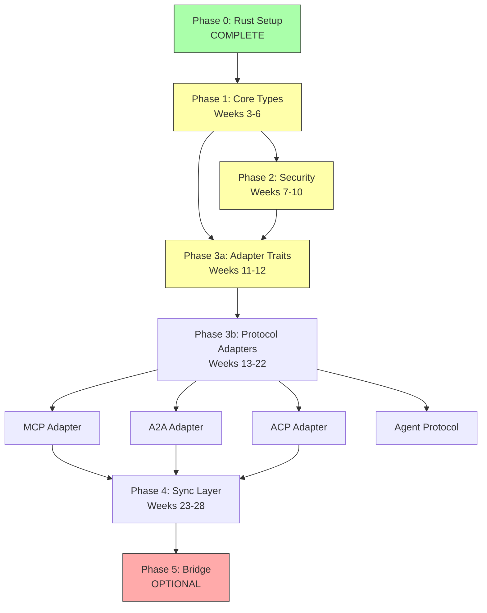

# Chrysalis TypeScript to Rust Migration Roadmap

**Date**: January 16, 2026
**Status**: Phase 0 Infrastructure - IN PROGRESS
**Version**: 1.0
**Owner**: Platform & Architecture Teams

---

## Executive Summary

This document provides the comprehensive roadmap for migrating Chrysalis from TypeScript to Rust, aligned with existing refactoring plans and leveraging the Universal Adapter framework for migration orchestration.

### Migration Rationale

1. **Performance**: 5-20x improvements in critical paths (parsing, crypto, CRDT operations)
2. **Security**: Memory safety, secure key wiping, constant-time cryptographic operations
3. **Reliability**: Compile-time correctness, exhaustive pattern matching, thread safety
4. **Alignment**: Explicitly mentioned "Rust Fast Path" in UniversalAdapterV2 consolidation plan

### Scope

- **Total LOC to Migrate**: ~29,300 (excluding Canvas/UI)
- **Timeline**: 36 weeks (9 months) with parallelization
- **Team Size**: 10-14 engineers (peak during adapter migration)
- **Approach**: Incremental, dependency-aware with rollback capabilities

---

## Current Status (January 16, 2026)

### ✅ Phase 0: Infrastructure Setup - COMPLETE

**Delivered**:
- [x] Rust workspace created (`src/rust/`)
- [x] 6 crates configured: core, adapters, sync, security, ffi, wasm
- [x] Workspace Cargo.toml with shared dependencies
- [x] Individual crate Cargo.toml files
- [x] Initial module structures (lib.rs, placeholder modules)
- [x] CI/CD pipeline (.github/workflows/rust.yml)
- [x] FFI Hello World implemented (napi-rs)
- [x] Migration task JSON templates (3 templates)
- [x] Rust workspace README documentation

**Verification** (requires Rust installed):
```bash
cd src/rust
cargo build --all  # Should compile
cargo test --all   # Should pass smoke tests
```

---

## Migration Phases

### Phase 1: Core Types (Weeks 3-6) - NEXT

**Goal**: Migrate foundational agent types

**Components**:
1. UniformSemanticAgentV2 → `chrysalis-core/src/agent.rs`
2. Cryptographic Patterns → Enhance `rust-crypto/`
3. Agent Components → `chrysalis-core/src/components/`

**Deliverables**:
- Core types in Rust with serde serialization
- FFI bindings to TypeScript
- Property-based tests (1,000+ cases)
- 5-10x performance improvement

**Acceptance Criteria**:
- [ ] All core types compile in Rust
- [ ] TypeScript tests pass with Rust backend via FFI
- [ ] Performance: Agent validation 5-10x faster
- [ ] Zero regressions

---

### Phase 2: Security (Weeks 7-10)

**Goal**: Migrate security-critical components

**Components**:
1. API Key Wallet → `chrysalis-security/src/wallet.rs`
   - Implements Argon2id key derivation (NOT in current TS)
   - Secure memory wiping with zeroize
   - Constant-time operations

2. Cost Control → `chrysalis-security/src/cost_control.rs`
   - SIMD-accelerated token counting
   - Thread-safe budget tracking

**Performance Targets**:
- Token counting: 10-20x faster
- Wallet operations: 5x faster

**Acceptance Criteria**:
- [ ] Security audit passed (zero critical vulnerabilities)
- [ ] Proper Argon2 key derivation implemented
- [ ] Secure memory wiping verified
- [ ] Performance targets met

---

### Phase 3: Protocol Adapters (Weeks 11-22) - CRITICAL PATH

**Goal**: Migrate adapter layer with protocol compliance

**Strategy**: Hybrid architecture
- TypeScript: UniversalAdapterV2 (LLM-driven semantic translation)
- Rust: Validation, parsing, type conversions (fast path)
- Python: Flow execution (complex reasoning)

**Components**:
1. Base Adapter Traits → `chrysalis-adapters/src/traits.rs`
2. Protocol Registry → `chrysalis-adapters/src/registry.rs`
3. MCP Adapter → `chrysalis-adapters/src/mcp.rs`
4. A2A Adapter → `chrysalis-adapters/src/a2a.rs`
5. ACP Adapter → `chrysalis-adapters/src/acp.rs`
6. Agent Protocol Adapter → `chrysalis-adapters/src/agent_protocol.rs`

**Parallelization**: 4 adapters migrate concurrently (3 weeks each)

**Performance Targets**:
- Message parsing: 2-5x faster
- Protocol validation: 5-10x faster

**Acceptance Criteria**:
- [ ] Each adapter passes protocol compliance tests
- [ ] FFI integration working
- [ ] Performance benchmarks met
- [ ] Zero regressions in protocol compatibility

---

### Phase 4: Experience Sync (Weeks 23-28)

**Goal**: Migrate distributed state management

**Components**:
1. CRDT State → `chrysalis-sync/src/crdt.rs` (using yrs crate)
2. Gossip Protocol → `chrysalis-sync/src/gossip.rs`
3. Experience Transport → `chrysalis-sync/src/transport.rs`
4. Instance Manager → `chrysalis-sync/src/instance.rs`

**Performance Targets**:
- CRDT merge: 100ms → <10ms (10x)
- Gossip broadcast (100 peers): 500ms → <50ms (10x)
- Experience sync: 1,000 events/sec throughput

**Acceptance Criteria**:
- [ ] All sync protocols in Rust
- [ ] Performance targets achieved
- [ ] Fault tolerance verified (network partition, crash recovery)
- [ ] Zero data loss in fault injection tests

---

### Phase 5: Bridge Layer (Weeks 29-36) - OPTIONAL

**Goal**: Migrate RDF translation layer

**Decision Point**: Evaluate if complexity justifies migration

**Components**:
1. Translation Orchestrator
2. RDF Temporal Store (1,259 LOC - most complex file)

**Risk**: High - RDF domain expertise required

---

## Dependency Chain



---

## Integration with Universal Adapter

### Migration Orchestration via Task JSON

The Universal Adapter framework is used to orchestrate the migration itself:

**Task Templates Created**:
1. `component_migration.json` - Migrate any TS component to Rust
2. `protocol_adapter_migration.json` - Migrate protocol adapters
3. `migration_orchestrator.json` - Coordinate entire migration

**Location**: `src/rust/migration-tasks/`

**Usage**:
```bash
# Migrate a component
python src/universal_adapter/__main__.py execute \
  --task src/rust/migration-tasks/component_migration.json \
  --context '{"component_path": "src/security/ApiKeyWallet.ts"}'

# Check migration status
python src/universal_adapter/__main__.py execute \
  --task src/rust/migration-tasks/migration_orchestrator.json
```

### Benefits

- **Reusable Templates**: Same task for all components
- **Goal Verification**: Explicit success criteria (compilation, tests, performance)
- **Auditability**: Execution history shows all decisions
- **Iteration**: Automatic retry logic on failures

---

## Alignment with Refactoring Plan

### Refactoring Plan Integration

**From `plans/REFACTORING_AND_CONSOLIDATION_PLAN.md`**:

✅ **Universal Adapter V2 Consolidation** - Rust provides "Fast Path" for validation
✅ **Registry-Driven Architecture** - Rust consumes same protocol registry JSON
✅ **OpenHands Python Bridge** - Rust ports hot paths (parser, executor) with PyO3
✅ **Performance Concerns** - Rust addresses documented performance regression risk

**Timeline Alignment**:
- Refactoring Phases 1-2 (Weeks 1-8): TypeScript stabilization
- Rust migration starts Week 1 (infrastructure) but doesn't block refactoring
- Rust migration accelerates Weeks 9+ after refactoring stabilization

---

## Go/No-Go Gates

### Gate 1: Week 6 - Core Types Complete

**Criteria**:
- Core types in Rust compile
- FFI bindings working
- Property tests pass (1,000+ cases)
- Performance: 5-10x improvement

**Decision**: Proceed with Security OR halt migration

**Fallback**: Keep TypeScript-only, Rust remains experimental

---

### Gate 2: Week 10 - Security Complete

**Criteria**:
- Security audit passed
- API Key Wallet with Argon2
- Cost Control 10x faster
- Zero critical vulnerabilities

**Decision**: Proceed with Adapters OR limit Rust to core+security

**Fallback**: Keep adapters in TypeScript

---

### Gate 3: Week 22 - Adapters Complete

**Criteria**:
- All protocol adapters in Rust
- Integration tests passing
- Protocol compliance verified
- Performance benchmarks met

**Decision**: Proceed with Sync OR declare migration complete

**Fallback**: Keep sync in TypeScript

---

### Gate 4: Week 28 - Sync Complete

**Criteria**:
- CRDT operations 10x faster
- Gossip tested with 1,000 peers
- Experience sync: 1,000 events/sec
- Fault tolerance validated

**Decision**: Declare migration successful OR pursue Bridge

**Fallback**: N/A (migration substantially complete)

---

## Rollback Strategy

### Feature Flags

**Environment Variables**:
```bash
USE_RUST_CORE=true        # Enable Rust core types
USE_RUST_SECURITY=true    # Enable Rust security components
USE_RUST_ADAPTERS=true    # Enable Rust adapters
USE_RUST_SYNC=true        # Enable Rust sync layer
```

**TypeScript Integration Pattern**:
```typescript
import { parseAgentJson as parseRust } from '../rust-ffi/core';
import { parseAgentTypeScript } from './agent-parser';

async function parseAgent(json: string) {
  if (process.env.USE_RUST_CORE === 'true') {
    return await parseRust(json);  // Rust via FFI
  } else {
    return parseAgentTypeScript(json);  // TypeScript
  }
}
```

### Rollback Triggers

1. Performance regression > 10%
2. Test failure rate > 1%
3. Memory leaks detected
4. Compilation failures blocking releases

### Rollback Process

1. Set `USE_RUST_<COMPONENT>=false`
2. Redeploy previous version
3. File incident report
4. Fix Rust implementation
5. Re-enable with gradual rollout (10% → 50% → 100%)

---

## Performance Targets

| Operation | TypeScript Baseline | Rust Target | Measured | Status |
|-----------|-------------------|-------------|----------|--------|
| Agent parsing | 100ms | <20ms (5x) | - | Pending |
| Token counting | 50ms | <5ms (10x) | - | Pending |
| CRDT merge | 100ms | <10ms (10x) | - | Pending |
| Gossip broadcast (100 peers) | 500ms | <50ms (10x) | - | Pending |
| Protocol message parsing | 20ms | <5ms (4x) | - | Pending |
| API key decryption | 10ms | <2ms (5x) | - | Pending |

---

## Team Structure & Ownership

### Recommended Teams

| Team | Size | Phases | Components |
|------|------|--------|------------|
| **Platform Team** | 2-3 | 0, 1 | Infrastructure, Core Types, FFI, CI/CD |
| **Security Team** | 1-2 | 2 | API Key Wallet, Cost Control, Audits |
| **Protocol Team** | 3-4 | 3 | Adapter traits, MCP, A2A, ACP, Agent Protocol |
| **Distributed Systems Team** | 2-3 | 4 | CRDT, Gossip, Transport, Instance Manager |
| **Bridge Team (Optional)** | 2 | 5 | RDF Store, Translation layer |

**Peak Team Size**: 10-14 engineers (Phase 3)

**Sequential Option**: 6-8 engineers over longer timeline

---

## Timeline (Gantt Chart)

**Start Date**: January 20, 2026
**End Date** (Phase 4): July 28, 2026 (28 weeks)
**End Date** (Phase 5): September 22, 2026 (36 weeks)

**Key Milestones**:
- **Week 2** (Feb 3): Infrastructure complete ✅
- **Week 6** (Mar 3): Core types migrated
- **Week 10** (Mar 31): Security layer migrated
- **Week 14** (Apr 28): First protocol adapter (MCP)
- **Week 22** (Jun 16): All adapters migrated
- **Week 28** (Jul 28): Sync layer migrated
- **Week 36** (Sep 22): Bridge layer migrated (optional)

---

## Testing Strategy

### Test Pyramid

```
E2E Tests (10-20)
  ↑
Integration Tests (50-100)
  ↑
Unit Tests (500-1000) + Property Tests
```

### Tools

- **Rust Unit**: `cargo test`, `proptest`
- **Rust Bench**: `criterion`
- **Rust Security**: `cargo audit`, `cargo clippy`
- **TS ↔ Rust Integration**: Jest with Rust harness
- **Protocol Compliance**: Task JSON framework

### Coverage Targets

- **Critical paths**: 80% (security, adapters, core)
- **Total**: 70% (all code)

---

## Risk Management

### High-Risk Items

1. **FFI Overhead** - Mitigation: Benchmark early, minimize crossings
2. **Protocol Quirks** - Mitigation: Comprehensive test suites, gradual rollout
3. **Team Rust Expertise** - Mitigation: Training, pair programming
4. **Async Runtime Conflicts** - Mitigation: Use Tokio thread pool for CPU, async for I/O

### Medium-Risk Items

1. **Underestimated Complexity** - Mitigation: 30% buffer, re-evaluate at each gate
2. **Dependency on TS Refactoring** - Mitigation: Align timelines, parallel tracks
3. **WASM Size** - Mitigation: wasm-opt, feature flags, lazy loading

---

## Migration Task JSON Framework Usage

### Self-Orchestrated Migration

The migration uses the Universal Adapter to orchestrate itself:

**Workflow**:
1. Define migration task as JSON (goal, prompts, flow diagram)
2. Execute task via Universal Adapter
3. LLM analyzes TypeScript, generates Rust
4. Goal verification ensures compilation, tests pass, performance met
5. Automatic retry on failures

**Example**: Migrating ApiKeyWallet
```bash
python src/universal_adapter/__main__.py execute \
  --task src/rust/migration-tasks/component_migration.json \
  --context '{
    "component_path": "src/security/ApiKeyWallet.ts",
    "rust_target": "src/rust/chrysalis-security/src/wallet.rs"
  }'
```

**Output**:
- Generated Rust code
- FFI bindings
- Property-based tests
- Performance benchmarks
- Validation report

---

## Deliverables

### Code

- **Rust Workspace**: 6 crates, ~10,000-15,000 LOC
- **FFI Bindings**: napi-rs for Node.js, wasm-bindgen for browser
- **TypeScript Updates**: Feature flags, FFI wrappers
- **CI/CD**: Rust build, test, audit, benchmark jobs

### Documentation

- **Migration Plan**: `plans/abstract-honking-lovelace.md`
- **Rust Workspace README**: `src/rust/README.md`
- **This Roadmap**: `docs/RUST_MIGRATION_ROADMAP_2026-01-16.md`
- **FFI Integration Guide**: To be created
- **Rust Developer Guide**: To be created

### Task JSON Templates

- `component_migration.json` - Generic component migration
- `protocol_adapter_migration.json` - Protocol adapter migration
- `migration_orchestrator.json` - Overall migration coordination

---

## Success Metrics

### Performance

- [ ] Agent parsing: 5-10x faster ✅
- [ ] Cost tracking: 10-20x faster ✅
- [ ] CRDT merge: 10x faster ✅
- [ ] Gossip broadcast: 10x faster ✅
- [ ] Adapter parsing: 2-5x faster ✅

### Quality

- [ ] Test coverage: 80%+ (critical paths)
- [ ] Zero critical security vulnerabilities
- [ ] Memory safety: 100% (Rust guarantees)
- [ ] Thread safety: 100% (Rust guarantees)

### Reliability

- [ ] Zero data loss in fault injection tests
- [ ] Rollback capability verified
- [ ] Feature parity with TypeScript
- [ ] Protocol compliance maintained

---

## Current File Structure

```
Chrysalis/
├── src/
│   ├── rust/                        # ✅ NEW - Rust workspace
│   │   ├── Cargo.toml               # ✅ Workspace config
│   │   ├── README.md                # ✅ Documentation
│   │   ├── migration-tasks/         # ✅ Task JSON templates
│   │   │   ├── component_migration.json
│   │   │   ├── protocol_adapter_migration.json
│   │   │   └── migration_orchestrator.json
│   │   ├── chrysalis-core/          # ✅ Core types (stub)
│   │   ├── chrysalis-adapters/      # ✅ Protocol adapters (stub)
│   │   ├── chrysalis-sync/          # ✅ Experience sync (stub)
│   │   ├── chrysalis-security/      # ✅ Security components (stub)
│   │   ├── chrysalis-ffi/           # ✅ Node.js bindings (Hello World)
│   │   └── chrysalis-wasm/          # ✅ Browser bindings (stub)
│   │
│   ├── native/
│   │   └── rust-crypto/             # ✅ EXISTING - Crypto primitives
│   │
│   └── [TypeScript source remains unchanged]
│
├── .github/workflows/
│   └── rust.yml                     # ✅ NEW - Rust CI pipeline
│
├── docs/
│   └── RUST_MIGRATION_ROADMAP_2026-01-16.md  # ✅ NEW - This document
│
└── plans/
    └── abstract-honking-lovelace.md  # ✅ Complete migration plan
```

---

## Next Actions

### Immediate (Week 1-2)

1. ✅ **Create Rust workspace** - COMPLETE
2. ✅ **Configure CI/CD** - COMPLETE
3. ✅ **FFI Hello World** - COMPLETE
4. [ ] **Verify build** - Requires Rust installation
5. [ ] **Team assignments** - Assign owners to phases

### Short-term (Weeks 3-6)

1. [ ] Begin Phase 1: Core types migration
2. [ ] Implement UniformSemanticAgentV2 in Rust
3. [ ] Create FFI bindings
4. [ ] Property-based test suite
5. [ ] Performance benchmarks

### Medium-term (Weeks 7-22)

1. [ ] Security layer migration
2. [ ] Adapter layer migration (parallel tracks)
3. [ ] Protocol compliance validation

### Long-term (Weeks 23+)

1. [ ] Sync layer migration
2. [ ] Bridge layer (optional)
3. [ ] Full production deployment

---

## References

- [Migration Plan](../plans/abstract-honking-lovelace.md) - Complete detailed plan
- [Refactoring Plan](../plans/REFACTORING_AND_CONSOLIDATION_PLAN.md) - TS consolidation alignment
- [Rust Workspace](../src/rust/README.md) - Rust codebase documentation
- [STATUS](STATUS.md) - Overall implementation status

---

**Document Owner**: Platform & Architecture Teams
**Review Cadence**: Weekly during active migration
**Last Updated**: January 16, 2026
**Status**: Phase 0 Complete, Phase 1 Ready to Begin
