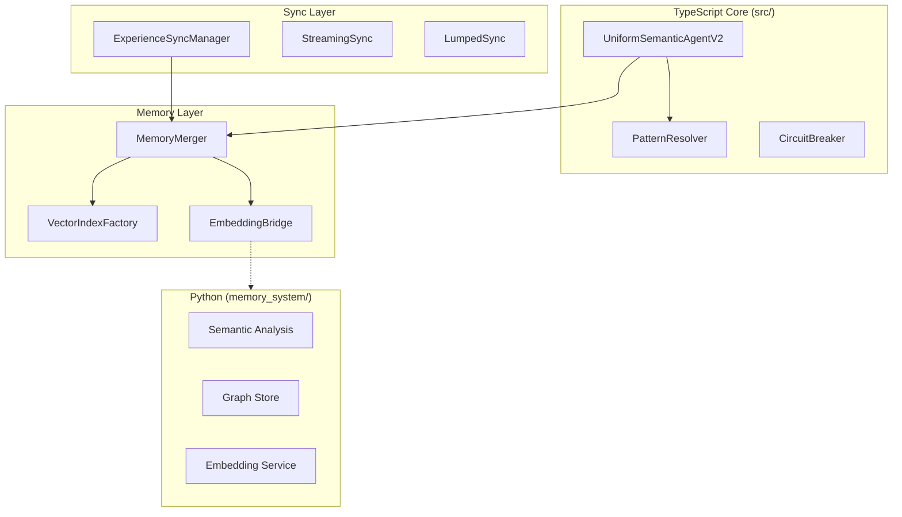

# Chrysalis Implementation Status

**Version**: 3.1.0  
**Last Updated**: January 12, 2026  
**Status**: Active Development  
**Owner**: Chrysalis Team  
**Review Cadence**: Weekly

> **This is the single source of truth for implementation status.**

---

## Executive Summary

Chrysalis is a **Uniform Semantic Agent transformation system** enabling AI agents to morph between framework implementations while maintaining persistent memory and cryptographic identity.

**Current State**: Active development. TypeScript build requires tsconfig.json restoration. Python memory_system tests passing (28/28).

---

## Build Status

### TypeScript Core

| Component | Status | Details |
|-----------|--------|---------|
| **Build** | ⚠️ **CONFIG MISSING** | No `tsconfig.json` in root |
| **Source Files** | ✅ Present | `src/` contains all TypeScript source |
| **Node Version** | Required: ≥18.0.0 | See `package.json` |

**Action Required**: Restore `tsconfig.json` to enable TypeScript compilation.

### Python Memory System

| Component | Status | Details |
|-----------|--------|---------|
| **Tests** | ✅ **28/28 PASSING** | All tests pass |
| **Python Version** | Required: 3.10+ | See `pyproject.toml` |
| **Coverage** | ✅ Available | `htmlcov/` present |

```bash
# Verify Python tests
cd memory_system && python3 -m pytest tests/ -v
# Result: 28 passed in 0.25s
```

### Go Crypto Server

| Component | Status | Details |
|-----------|--------|---------|
| **Source** | ✅ Present | `go-services/` |
| **Tests** | ⚠️ Not verified | Requires Go environment |

---

## Component Architecture



---

## Component Implementation Status

### Core Layer

| Component | File | Status |
|-----------|------|--------|
| Agent Schema v2.0 | `src/core/UniformSemanticAgentV2.ts` | ✅ Implemented |
| Agent Builder | `src/core/AgentBuilder.ts` | ✅ Implemented |
| Pattern Resolver | `src/fabric/PatternResolver.ts` | ✅ Implemented |
| Circuit Breaker | `src/utils/CircuitBreaker.ts` | ✅ Implemented |
| Cryptographic Patterns | `src/core/patterns/` | ✅ Implemented |

### Memory Layer

| Component | File | Status |
|-----------|------|--------|
| Memory Merger | `src/experience/MemoryMerger.ts` | ✅ Implemented |
| Vector Index Factory | `src/memory/VectorIndexFactory.ts` | ✅ Implemented |
| Embedding Bridge | `src/memory/EmbeddingBridge.ts` | ✅ Implemented |
| Memory Sanitizer | `src/experience/MemorySanitizer.ts` | ✅ Implemented |

### Sync Layer

| Component | File | Status |
|-----------|------|--------|
| Experience Sync Manager | `src/sync/ExperienceSyncManager.ts` | ✅ Implemented |
| Streaming Sync | `src/sync/StreamingSync.ts` | ✅ Implemented |
| Lumped Sync | `src/sync/LumpedSync.ts` | ✅ Implemented |
| Check-in Sync | `src/sync/CheckInSync.ts` | ✅ Implemented |
| Transport Layer | `src/sync/ExperienceTransport.ts` | ✅ Implemented |

### Observability Layer

| Component | File | Status |
|-----------|------|--------|
| Voyeur Event Bus | `src/observability/VoyeurEvents.ts` | ✅ Implemented |
| SSE Web Server | `src/observability/VoyeurWebServer.ts` | ✅ Implemented |
| Metrics Sink | `src/observability/Metrics.ts` | ✅ Implemented |

### Python Memory System

| Module | Directory | Status | Tests |
|--------|-----------|--------|-------|
| Beads | `memory_system/beads.py` | ✅ Implemented | 3/3 |
| Security | `memory_system/` | ✅ Implemented | 3/3 |
| Singleton | `memory_system/embedding/singleton.py` | ✅ Implemented | 18/18 |
| Zep Client | `memory_system/hooks/zep_client.py` | ✅ Implemented | 4/4 |

**Total Python Tests**: 28/28 passing

---

## Feature Status

### Implemented ✅

| Feature | Description | Location |
|---------|-------------|----------|
| Lossless Morphing | Agent transformation between types | `src/core/UniformSemanticAgentV2.ts` |
| Cryptographic Identity | SHA-384 + Ed25519 | `src/core/patterns/` |
| Memory Deduplication | Jaccard + embedding similarity | `src/experience/MemoryMerger.ts` |
| Experience Sync | Streaming, Lumped, Check-in | `src/sync/` |
| Observability | Voyeur bus + SSE + metrics | `src/observability/` |

### In Progress 🔄

| Feature | Blocking Issue | Next Step |
|---------|----------------|-----------|
| TypeScript Build | Missing tsconfig.json | Restore config file |

### Planned 📋

| Feature | Description | Estimated Effort |
|---------|-------------|------------------|
| True Gossip Protocol | Epidemic spreading (O(log N)) | 2-3 weeks |
| CRDT State Management | OR-Set, LWW, G-Set | 2-3 weeks |
| Vector Database Persistence | LanceDB integration | 1 week |

---

## Environment Variables

| Variable | Purpose | Required |
|----------|---------|----------|
| `VOYAGE_API_KEY` | Voyage AI embeddings | For production |
| `OPENAI_API_KEY` | OpenAI embeddings (fallback) | For production |
| `ANTHROPIC_API_KEY` | Claude semantic decomposition | For LLM analysis |
| `VECTOR_INDEX_TYPE` | Backend: `hnsw`, `lance`, `brute` | No |
| `METRICS_PROMETHEUS` | Enable Prometheus metrics | No |

---

## Quick Verification Commands

```bash
# TypeScript (requires tsconfig.json restoration)
npm run build

# Python memory_system
cd memory_system && python3 -m pytest tests/ -v

# Go services (requires Go)
cd go-services && go test ./...
```

---

## Next Steps

1. **Immediate**: Restore `tsconfig.json` to enable TypeScript build
2. **Short-term**: Verify all components work end-to-end
3. **Medium-term**: Implement remaining planned features

---

## Related Documentation

| Document | Purpose |
|----------|---------|
| [Architecture](../ARCHITECTURE.md) | System design |
| [Memory System](../memory_system/README.md) | Python package |
| [Documentation Index](INDEX.md) | Navigation hub |

---

**Document Owner**: Chrysalis Team  
**Review Cadence**: Weekly during active development