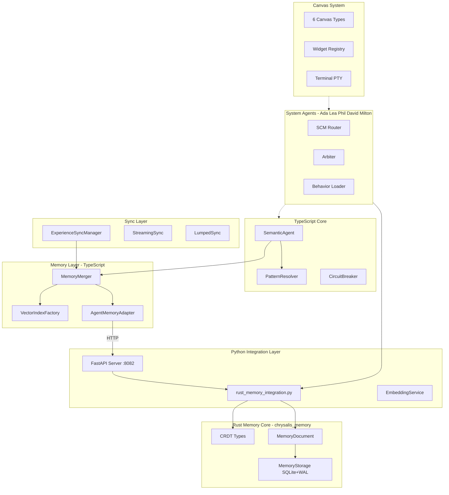

# Chrysalis Implementation Status

**Version**: 0.34.0
**Last Updated**: January 25, 2026
**Status**: Active Development - Phase 3 P1 Complete
**Owner**: Chrysalis Team
**Review Cadence**: Weekly

> **This is the single source of truth for implementation status.**
> All other status documents have been archived or consolidated here.

---

## Executive Summary

Chrysalis is a **Uniform Semantic Agent transformation system** enabling AI agents to morph between framework implementations while maintaining persistent memory and cryptographic identity.

**Current State**: Active development with TypeScript core, Rust system agents, Python memory system, and cloud-only LLM architecture.

| Domain | Build Status | Test Status |
|--------|--------------|-------------|
| TypeScript Core | ✅ Passing | ⚠️ Partial coverage |
| Rust System Agents | ✅ Passing | ✅ Integrated with knowledge graph |
| Python memory_system | ✅ Passing | ✅ 9+ tests passing |
| Canvas Architecture | ✅ Complete | 🔄 Prototype |
| Go LLM Gateway | ✅ Complete | ✅ Cloud-only routing + integration tests (9 test suites) |

---

## Build Status

### TypeScript Core (`src/`)

| Component | Status | Details |
|-----------|--------|---------|
| **Build** | ✅ **PASSING** | `npm run build` succeeds |
| **tsconfig.json** | ✅ Present | Strict mode enabled |
| **Node Version** | Required: ≥18.0.0 | See `package.json` |

**Modules with @ts-nocheck (pending fixes)**:
- `src/observability/index.ts` — Missing OpenTelemetry dependencies
- `src/sync/CRDTState.ts` — Logger signature issue
- `src/sync/GossipProtocol.ts` — Logger signature issue
- `src/security/ApiKeyRegistry.ts` — Missing method
- `src/integrations/agentbuilder/` — Type compatibility

```bash
# Verify TypeScript build
npm run build
```

### Python Memory System (`memory_system/`)

| Component | Status | Details |
|-----------|--------|---------|
| **Build** | ✅ Passing | pip install -e memory_system/ |
| **Python Version** | Required: 3.10+ | See `pyproject.toml` |
| **Coverage** | Available | `htmlcov/` present |

**Test Summary** (source: `memory_system/README.md`):

| Test File | Tests | Status |
|-----------|-------|--------|
| `test_beads.py` | 3 | ✅ |
| `test_zep_client.py` | 4 | ✅ |
| `test_fusion.py` | 2 | ✅ |
| `fireproof/tests/` | 25+ | ✅ |

```bash
# Verify Python tests
cd memory_system && python3 -m pytest tests/ fireproof/tests/ -v
```

### Canvas Architecture (`src/canvas/`)

| Component | Status | Details |
|-----------|--------|---------|
| **Core Types** | ✅ Complete | Canvas, Node, Edge, Viewport types |
| **Widget System** | ✅ Complete | Registry, Factory, lifecycle hooks |
| **Layout Engine** | ✅ Complete | Snap-to-grid, collision detection |
| **React Components** | 🔄 Prototype | Canvas, Toolbar, WidgetWrapper |
| **Build Integration** | ⚠️ Pending | Needs Vite config for demo |

**Canvas Types**: 6 types defined (architecture complete, React prototype)

| Canvas | Status | Key Features |
|--------|--------|--------------|
| Settings | ✅ Spec | API key management widgets |
| Agent | ✅ Spec | Managing internal agent teams |
| Scrapbook | ✅ Spec | Content collection, organization |
| Research | ✅ Spec | Information synthesis widgets |
| Wiki | ✅ Spec | MediaWiki knowledgebase |
| Terminal-Browser | ✅ Spec | xterm.js + sandboxed browser |

**Supporting Services**:

| Service | Status | Location |
|---------|--------|----------|
| Terminal PTY Server | ✅ Complete | `src/services/terminal/` |
| Backend Connector | ✅ Complete | `src/canvas/services/` |
| Widget Publishing | ✅ Spec | `src/canvas/publishing/` |

```bash
# Canvas demo (requires Vite integration)
cd src/canvas/react/demo
# npm run dev (pending)
```

### Go Crypto Server (`go-services/`)

| Component | Status | Details |
|-----------|--------|---------|
| **Source** | ✅ Present | `go-services/` |
| **Build** | ⚠️ Not verified | Requires Go environment |
| **Tests** | ⚠️ Not verified | `go test ./...` |

---

## Component Architecture



---

## Implementation Status by Layer

### Core Layer

| Component | File | Status |
|-----------|------|--------|
| Agent Schema v2.0 | `src/core/SemanticAgent.ts` | ✅ Implemented |
| Agent Builder | `src/core/AgentBuilder.ts` | ✅ Implemented |
| Pattern Resolver | `src/fabric/PatternResolver.ts` | ✅ Implemented |
| Circuit Breaker | `src/utils/CircuitBreaker.ts` | ✅ Implemented |
| Cryptographic Patterns | `src/core/patterns/` | ✅ Implemented |

### Memory Layer

| Component | File | Status |
|-----------|------|--------|
| Memory Merger | `src/experience/MemoryMerger.ts` | ✅ Implemented |
| Vector Index Factory | `src/memory/VectorIndexFactory.ts` | ✅ Implemented |
| Embedding Bridge | `src/memory/EmbeddingBridge.ts` | ✅ Implemented |
| Memory Sanitizer | `src/experience/MemorySanitizer.ts` | ✅ Implemented |

### Sync Layer

| Component | File | Status |
|-----------|------|--------|
| Experience Sync Manager | `src/sync/ExperienceSyncManager.ts` | ✅ Implemented |
| Streaming Sync | `src/sync/StreamingSync.ts` | ✅ Implemented |
| Lumped Sync | `src/sync/LumpedSync.ts` | ✅ Implemented |
| Check-in Sync | `src/sync/CheckInSync.ts` | ✅ Implemented |
| Transport Layer | `src/sync/ExperienceTransport.ts` | ✅ Implemented |

### Observability Layer

| Component | File | Status |
|-----------|------|--------|
| ObservabilityHub | `src/observability/ObservabilityHub.ts` | ✅ Implemented |
| Metrics Sink | `src/observability/Metrics.ts` | ✅ Implemented |
| Centralized Logger | `src/observability/CentralizedLogger.ts` | ✅ Implemented |

### Memory System (Rust + Python)

| Module | Location | Status |
|--------|----------|--------|
| **Rust CRDT Core** | `memory_system/rust_core/` | ✅ Implemented |
| Rust Python Bindings | `chrysalis_memory` (PyO3) | ✅ Implemented |
| MemoryDocument (CRDT) | `memory_system/rust_core/` | ✅ Implemented |
| SQLite Storage (WAL) | `memory_system/rust_core/` | ✅ Implemented |
| AgentMemory API | `memory_system/rust_core/python/` | ✅ Implemented |
| System Agent Bridge | `Agents/system-agents/rust_memory_integration.py` | ✅ Implemented |
| HTTP API Server | `memory_system/api_server.py` | ✅ Implemented |
| Beads (short-term) | `memory_system/beads.py` | ✅ Implemented |
| Fireproof (CRDT layer) | `memory_system/fireproof/` | ✅ Implemented |
| Embedding Service | `shared/embedding/` | ✅ Implemented |
| Graph Store | `memory_system/graph/` | ✅ Implemented |

**Performance Benchmarks (Rust Core)**:
- Write latency: 1.8ms mean (550 writes/sec)
- Read latency: 0.17ms mean (6000 reads/sec)
- CRDT merge: 0.04ms mean
- All agents validated with autonomous memory capabilities

---

## Feature Status

### Implemented ✅

| Feature | Description | Location |
|---------|-------------|----------|
| Lossless Morphing | Agent transformation between types | `src/core/SemanticAgent.ts` |
| Cryptographic Identity | SHA-384 + Ed25519 | `src/core/patterns/` |
| Memory Deduplication | Jaccard + embedding similarity | `src/experience/MemoryMerger.ts` |
| Experience Sync | Streaming, Lumped, Check-in protocols | `src/sync/` |
| Observability | Logging + tracing + metrics | `src/observability/` |
| Fireproof Layer | Local-first CRDT document store | `memory_system/fireproof/` |
| Canvas Architecture | 6 canvas types with widget system | `src/canvas/` |
| **ACP Adapter** | Client + Server + Bridge for ACP ecosystem | `src/adapters/acp/` |
| **Cloud-Only LLM Gateway** | OpenRouter, Anthropic, OpenAI routing | `go-services/internal/llm/` |
| **Knowledge Graph Reasoning** | YAML-based agent decision-making | `src/native/rust-system-agents/src/knowledge_graph.rs` |
| **Rust System Agents** | Ada, Lea, Phil, David, Milton with autonomous memory | `src/native/rust-system-agents/` |

### In Progress 🔄

| Feature | Blocking Issue | Next Step |
|---------|----------------|-----------|
| Error Tracking Infrastructure | Sentry not integrated | Install and configure Sentry SDK |
| User Feedback Backend | No endpoint | Create /api/feedback endpoint |
| Wiki Authentication | MediaWiki auth not implemented | Add OAuth flow |
| Bundle Optimization | 1,183 kB size | Implement code-splitting |

### Recently Completed ✅

| Feature | Status | Notes |
|---------|--------|-------|
| **Cloud-Only LLM Architecture** | ✅ Complete | ADR-001: OpenRouter, Anthropic, OpenAI only (Ollama removed) |
| **Knowledge Graph Integration** | ✅ Complete | ADR-002: Python + Rust reasoning engines |
| **Rust System Agents** | ✅ Complete | All 5 agents migrated from TypeScript |
| **Go CloudOnlyRouter** | ✅ Complete | Cost tracking, caching, circuit breaker |
| **ACP Adapter** | ✅ Complete | Client, Server, and Bridge for Agent Client Protocol ecosystem |
| **P0 Meta-Cognitive** | ✅ Complete | Context Condenser, Stuck Detector, Code Executor |
| OpenTelemetry Integration | ✅ Complete | Dependencies installed, no @ts-nocheck |
| Sync Module Types | ✅ Complete | Logger signatures fixed, TypeScript clean |
| Terminal WebSocket Backend | ✅ Complete | Server implemented, ready for deployment |
| **Voyeur Removal** | ✅ Complete | Replaced with standard logging |
| Error Boundary | ✅ Complete | User-friendly error display with recovery |
| Feedback Widget | ✅ Complete | In-app feedback mechanism working |

### Recently Completed ✅ (Rust Memory System)

| Feature | Status | Notes |
|---------|--------|-------|
| **Rust CRDT Core** | ✅ Complete | GSet, ORSet, LWWRegister, VectorClock in Rust |
| **PyO3 Bindings** | ✅ Complete | Full Python API via maturin |
| **MemoryDocument** | ✅ Complete | CRDT-aware document with automatic merge |
| **SQLite Storage** | ✅ Complete | WAL mode, 6000 reads/sec |
| **System Agent Integration** | ✅ Complete | All 5 agents with autonomous memory |
| **HTTP API Server** | ✅ Complete | FastAPI, backward-compatible with beads API |

### Planned 📋 (Not Yet Implemented)

| Feature | Description |
|---------|-------------|
| True Gossip Protocol | Epidemic spreading (O(log N)) |
| ~~Full CRDT State Management~~ | ~~Production OR-Set, LWW, G-Set~~ ✅ **DONE** |
| Vector Database Persistence | LanceDB integration |
| Slash Command System | `/invite`, `/agent`, `/canvas` commands |
| E2E Test Suite | Playwright integration tests |
| Session Replay | LogRocket or Sentry Replay |
| Test Coverage | Target 40% for UI, increase core coverage |

---

## Known Gaps

### Critical 🔴

| Gap | Impact | Blocking |
|-----|--------|----------|
| Backend/UI Type Mismatch | YJS sync may fail | Real backend integration |
| Universal Adapter not wired | Cannot translate protocols | v2 registry + LLM integration |

### High Priority 🟡

| Gap | Impact |
|-----|--------|
| Zero UI test coverage | Quality/regression risk |
| Bundle size (1,183 kB) | Performance on load |
| API keys in localStorage | Security concern for production |

### Medium Priority 🟢

| Gap | Impact |
|-----|--------|
| Slash commands not implemented | Documented UX missing |
| Emoji commands not bridged to UI | Feature unused |
| System service canvases incomplete | Bootstrap flow incomplete |

---

## Environment Variables

### Core

| Variable | Purpose | Required |
|----------|---------|----------|
| `OPENROUTER_API_KEY` | OpenRouter cloud routing (default) | **Yes** |
| `ANTHROPIC_API_KEY` | Direct Anthropic API access | Optional |
| `OPENAI_API_KEY` | Direct OpenAI API access | Optional |
| `VOYAGE_API_KEY` | Voyage AI embeddings | Production |
| `VECTOR_INDEX_TYPE` | Backend: `hnsw`, `lance`, `brute` | No |
| `METRICS_PROMETHEUS` | Enable Prometheus metrics | No |

**Note**: At least one LLM provider API key is required. OpenRouter is recommended as it provides access to multiple models through a single API.

### Fireproof

| Variable | Purpose | Default |
|----------|---------|---------|
| `FIREPROOF_ENABLED` | Master enable switch | `false` |
| `FIREPROOF_SYNC_ENABLED` | Enable Zep background sync | `false` |
| `FIREPROOF_PROMOTION_ENABLED` | Enable bead promotion | `false` |
| `FIREPROOF_METADATA_CAPTURE` | Enable LLM metadata capture | `false` |

---

## Quick Verification Commands

```bash
# TypeScript Core
npm run build

# Python memory_system
cd memory_system && python3 -m pytest tests/ fireproof/tests/ -v

# UI
cd ui && npm run build

# Go services (requires Go environment)
cd go-services && go test ./...
```

---

## Next Steps

### Immediate
1. Install OpenTelemetry dependencies for observability module
2. Fix logger signature issues in sync modules; remove @ts-nocheck

### Short-term
1. Implement Terminal WebSocket backend connection
2. Add unit test infrastructure for UI (Vitest)
3. Implement code-splitting to reduce bundle size

### Medium-term
1. Wire Universal Adapter v2 to Go LLM Gateway
2. Add slash command system
3. Complete Wiki authentication flow

---

## Related Documentation

| Document | Purpose |
|----------|---------|
| [Architecture](../ARCHITECTURE.md) | System design |
| [Memory System](../memory_system/README.md) | Python package |
| [Documentation Index](INDEX.md) | Navigation hub |
| [UI Architecture](CHRYSALIS_TERMINAL_ARCHITECTURE.md) | UI system design |

---

**Document Owner**: Chrysalis Team
**Review Cadence**: Weekly during active development