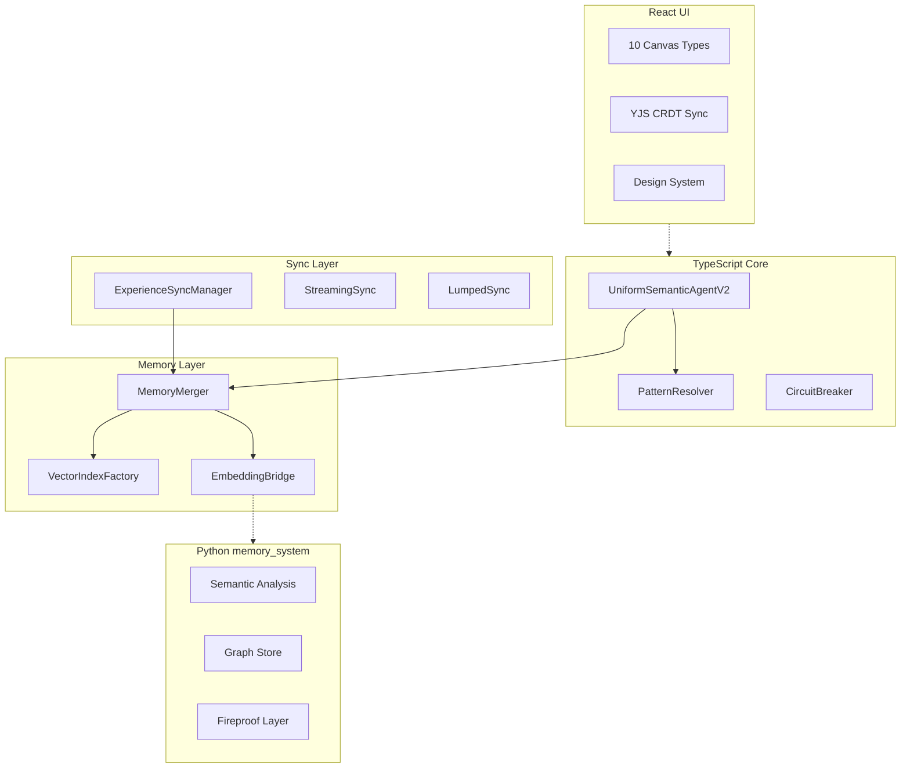

# Chrysalis Implementation Status

**Version**: 3.1.1  
**Last Updated**: January 15, 2026  
**Status**: Active Development  
**Owner**: Chrysalis Team  
**Review Cadence**: Weekly

> **This is the single source of truth for implementation status.**  
> All other status documents have been archived or consolidated here.

---

## Executive Summary

Chrysalis is a **Uniform Semantic Agent transformation system** enabling AI agents to morph between framework implementations while maintaining persistent memory and cryptographic identity.

**Current State**: Active development with separate build processes for core and UI.

| Domain | Build Status | Test Status |
|--------|--------------|-------------|
| TypeScript Core | ✅ Passing | ⚠️ Partial coverage |
| Python memory_system | ✅ Passing | ✅ 9+ tests passing |
| UI (React/Vite) | ✅ Passing | ❌ 0% coverage |
| Go Crypto Server | ⚠️ Not verified | ⚠️ Not verified |

---

## Build Status

### TypeScript Core (`src/`)

| Component | Status | Details |
|-----------|--------|---------|
| **Build** | ✅ **PASSING** | `npm run build` succeeds |
| **tsconfig.json** | ✅ Present | Strict mode enabled |
| **Node Version** | Required: ≥18.0.0 | See `package.json` |

**Modules with @ts-nocheck (pending fixes)**:
- `src/observability/index.ts` — Missing OpenTelemetry dependencies
- `src/sync/CRDTState.ts` — Logger signature issue
- `src/sync/GossipProtocol.ts` — Logger signature issue
- `src/security/ApiKeyRegistry.ts` — Missing method
- `src/integrations/agentbuilder/` — Type compatibility

```bash
# Verify TypeScript build
npm run build
```

### Python Memory System (`memory_system/`)

| Component | Status | Details |
|-----------|--------|---------|
| **Build** | ✅ Passing | pip install -e memory_system/ |
| **Python Version** | Required: 3.10+ | See `pyproject.toml` |
| **Coverage** | Available | `htmlcov/` present |

**Test Summary** (source: `memory_system/README.md`):

| Test File | Tests | Status |
|-----------|-------|--------|
| `test_beads.py` | 3 | ✅ |
| `test_zep_client.py` | 4 | ✅ |
| `test_fusion.py` | 2 | ✅ |
| `fireproof/tests/` | 25+ | ✅ |

```bash
# Verify Python tests
cd memory_system && python3 -m pytest tests/ fireproof/tests/ -v
```

### UI (React/Vite) (`ui/`)

| Component | Status | Details |
|-----------|--------|---------|
| **Build** | ✅ **PASSING** | `cd ui && npm run build` |
| **TypeScript** | ✅ 0 errors | Strict mode enabled |
| **Framework** | Vite 5.0 + React 18.2 | |
| **Bundle** | 1,183 kB (342 kB gzipped) | Needs code-splitting |

**Canvas Implementation**: 10/10 MVP canvases complete

| Canvas | Status | Key Features |
|--------|--------|--------------|
| Settings | ✅ 100% | API key management, encryption |
| Board | ✅ 100% | ReactFlow workspace, YJS sync |
| Scrapbook | ✅ 100% | Media collection, tags, lightbox |
| Research | ✅ 100% | Markdown editor, wiki-links |
| Wiki | ✅ 90% | MediaWiki integration (needs auth) |
| Terminal | ✅ 95% | xterm.js (needs WebSocket backend) |
| Browser | ✅ 100% | iframe embedding |
| Scenarios | ✅ 100% | Future planning, 3 view modes |
| Curation | ✅ 100% | Research library, graph viz |
| Media | ✅ 100% | Image/audio/video editing |

```bash
# Verify UI build
cd ui && npm run build
```

### Go Crypto Server (`go-services/`)

| Component | Status | Details |
|-----------|--------|---------|
| **Source** | ✅ Present | `go-services/` |
| **Build** | ⚠️ Not verified | Requires Go environment |
| **Tests** | ⚠️ Not verified | `go test ./...` |

---

## Component Architecture



---

## Implementation Status by Layer

### Core Layer

| Component | File | Status |
|-----------|------|--------|
| Agent Schema v2.0 | `src/core/UniformSemanticAgentV2.ts` | ✅ Implemented |
| Agent Builder | `src/core/AgentBuilder.ts` | ✅ Implemented |
| Pattern Resolver | `src/fabric/PatternResolver.ts` | ✅ Implemented |
| Circuit Breaker | `src/utils/CircuitBreaker.ts` | ✅ Implemented |
| Cryptographic Patterns | `src/core/patterns/` | ✅ Implemented |

### Memory Layer

| Component | File | Status |
|-----------|------|--------|
| Memory Merger | `src/experience/MemoryMerger.ts` | ✅ Implemented |
| Vector Index Factory | `src/memory/VectorIndexFactory.ts` | ✅ Implemented |
| Embedding Bridge | `src/memory/EmbeddingBridge.ts` | ✅ Implemented |
| Memory Sanitizer | `src/experience/MemorySanitizer.ts` | ✅ Implemented |

### Sync Layer

| Component | File | Status |
|-----------|------|--------|
| Experience Sync Manager | `src/sync/ExperienceSyncManager.ts` | ✅ Implemented |
| Streaming Sync | `src/sync/StreamingSync.ts` | ✅ Implemented |
| Lumped Sync | `src/sync/LumpedSync.ts` | ✅ Implemented |
| Check-in Sync | `src/sync/CheckInSync.ts` | ✅ Implemented |
| Transport Layer | `src/sync/ExperienceTransport.ts` | ✅ Implemented |

### Observability Layer

| Component | File | Status |
|-----------|------|--------|
| Voyeur Event Bus | `src/observability/VoyeurEvents.ts` | ✅ Implemented |
| SSE Web Server | `src/observability/VoyeurWebServer.ts` | ✅ Implemented |
| Metrics Sink | `src/observability/Metrics.ts` | ✅ Implemented |

### Python Memory System

| Module | Location | Status |
|--------|----------|--------|
| Beads (short-term) | `memory_system/beads.py` | ✅ Implemented |
| Fireproof (CRDT layer) | `memory_system/fireproof/` | ✅ Implemented |
| Embedding Service | `shared/embedding/` | ✅ Implemented |
| Graph Store | `memory_system/graph/` | ✅ Implemented |
| Zep Integration | `memory_system/hooks/` | ✅ Implemented |

---

## Feature Status

### Implemented ✅

| Feature | Description | Location |
|---------|-------------|----------|
| Lossless Morphing | Agent transformation between types | `src/core/UniformSemanticAgentV2.ts` |
| Cryptographic Identity | SHA-384 + Ed25519 | `src/core/patterns/` |
| Memory Deduplication | Jaccard + embedding similarity | `src/experience/MemoryMerger.ts` |
| Experience Sync | Streaming, Lumped, Check-in protocols | `src/sync/` |
| Observability | Voyeur bus + SSE + metrics | `src/observability/` |
| Fireproof Layer | Local-first CRDT document store | `memory_system/fireproof/` |
| 10 UI Canvases | React canvas workspace system | `ui/src/components/` |

### In Progress 🔄

| Feature | Blocking Issue | Next Step |
|---------|----------------|-----------|
| Error Tracking Infrastructure | Sentry not integrated | Install and configure Sentry SDK |
| User Feedback Backend | No endpoint | Create /api/feedback endpoint |
| Wiki Authentication | MediaWiki auth not implemented | Add OAuth flow |
| Bundle Optimization | 1,183 kB size | Implement code-splitting |

### Recently Completed ✅

| Feature | Status | Notes |
|---------|--------|-------|
| OpenTelemetry Integration | ✅ Complete | Dependencies installed, no @ts-nocheck |
| Sync Module Types | ✅ Complete | Logger signatures fixed, TypeScript clean |
| Terminal WebSocket Backend | ✅ Complete | Server implemented, ready for deployment |
| VoyeurBus UI Client | ✅ Complete | `useVoyeurEvents` hook ready |
| Error Boundary | ✅ Complete | User-friendly error display with recovery |
| Feedback Widget | ✅ Complete | In-app feedback mechanism working |

### Planned 📋 (Not Yet Implemented)

| Feature | Description |
|---------|-------------|
| True Gossip Protocol | Epidemic spreading (O(log N)) |
| Full CRDT State Management | Production OR-Set, LWW, G-Set |
| Vector Database Persistence | LanceDB integration |
| Slash Command System | `/invite`, `/agent`, `/canvas` commands |
| E2E Test Suite | Playwright integration tests |
| Session Replay | LogRocket or Sentry Replay |
| Test Coverage | Target 40% for UI, increase core coverage |

---

## Known Gaps

### Critical 🔴

| Gap | Impact | Blocking |
|-----|--------|----------|
| Backend/UI Type Mismatch | YJS sync may fail | Real backend integration |
| VoyeurBus missing from UI | Cannot observe agent activity | Core feature |

### High Priority 🟡

| Gap | Impact |
|-----|--------|
| Zero UI test coverage | Quality/regression risk |
| Bundle size (1,183 kB) | Performance on load |
| API keys in localStorage | Security concern for production |

### Medium Priority 🟢

| Gap | Impact |
|-----|--------|
| Slash commands not implemented | Documented UX missing |
| Emoji commands not bridged to UI | Feature unused |
| System service canvases incomplete | Bootstrap flow incomplete |

---

## Environment Variables

### Core

| Variable | Purpose | Required |
|----------|---------|----------|
| `VOYAGE_API_KEY` | Voyage AI embeddings | Production |
| `OPENAI_API_KEY` | OpenAI embeddings (fallback) | Production |
| `ANTHROPIC_API_KEY` | Claude semantic decomposition | LLM analysis |
| `VECTOR_INDEX_TYPE` | Backend: `hnsw`, `lance`, `brute` | No |
| `METRICS_PROMETHEUS` | Enable Prometheus metrics | No |

### Fireproof

| Variable | Purpose | Default |
|----------|---------|---------|
| `FIREPROOF_ENABLED` | Master enable switch | `false` |
| `FIREPROOF_SYNC_ENABLED` | Enable Zep background sync | `false` |
| `FIREPROOF_PROMOTION_ENABLED` | Enable bead promotion | `false` |
| `FIREPROOF_METADATA_CAPTURE` | Enable LLM metadata capture | `false` |

---

## Quick Verification Commands

```bash
# TypeScript Core
npm run build

# Python memory_system
cd memory_system && python3 -m pytest tests/ fireproof/tests/ -v

# UI
cd ui && npm run build

# Go services (requires Go environment)
cd go-services && go test ./...
```

---

## Next Steps

### Immediate
1. Install OpenTelemetry dependencies for observability module
2. Fix logger signature issues in sync modules; remove @ts-nocheck

### Short-term
1. Implement Terminal WebSocket backend connection
2. Add unit test infrastructure for UI (Vitest)
3. Implement code-splitting to reduce bundle size

### Medium-term
1. Implement VoyeurBus client in UI
2. Add slash command system
3. Complete Wiki authentication flow

---

## Related Documentation

| Document | Purpose |
|----------|---------|
| [Architecture](../ARCHITECTURE.md) | System design |
| [Memory System](../memory_system/README.md) | Python package |
| [Documentation Index](INDEX.md) | Navigation hub |
| [UI Architecture](CHRYSALIS_TERMINAL_ARCHITECTURE.md) | UI system design |

---

**Document Owner**: Chrysalis Team  
**Review Cadence**: Weekly during active development