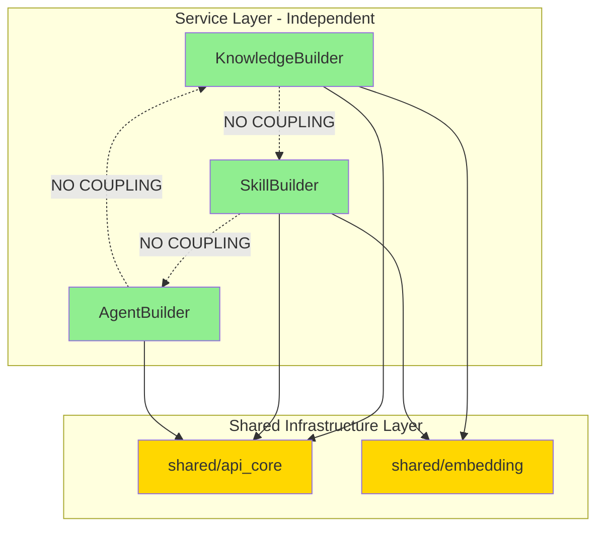

# ADR-001: Service Layer Independence and Shared Infrastructure

**Status**: Accepted  
**Date**: January 10, 2026  
**Deciders**: Architecture Team  
**Related**: [DESIGN_PATTERN_ANALYSIS.md](../DESIGN_PATTERN_ANALYSIS.md) - Anti-Pattern 6 (Distributed Monolith Risk)

---

## Context

The Chrysalis service layer contains three primary services (KnowledgeBuilder, SkillBuilder, AgentBuilder) that were suspected of potential coupling creating a distributed monolith anti-pattern. Investigation was required to determine whether these services are truly independent or share state in ways that prevent independent scaling.

**Investigation Question**: Are services independently deployable, or does coupling prevent true microservice benefits?

---

## Investigation Findings

### Cross-Service Dependencies

**Search Pattern**: `from projects\.|import projects\.` across all Python files in `projects/`

**Result**: **0 occurrences** ✅

**Conclusion**: Services do NOT import from each other. No direct coupling between service business logic.

### Shared Infrastructure Usage

**Search Pattern**: `from shared\.|import shared\.` across all Python files in `projects/`

**Result**: **14 occurrences** across all three services

**Breakdown**:
- `shared.api_core`: Used by all services for FastAPI integration (APIResponse, middleware, auth)
- `shared.embedding`: Used by KnowledgeBuilder and SkillBuilder for embedding operations

**Analysis**: Shared infrastructure dependencies are ACCEPTABLE and represent proper microservice pattern. Services share common utilities but maintain independent business logic.

### Dependency Graph



### Shared Infrastructure Components

| Component | Purpose | Used By | Coupling Type |
|-----------|---------|---------|---------------|
| `shared/api_core` | FastAPI utilities, auth, middleware | All services | Infrastructure (acceptable) |
| `shared/embedding` | Multi-provider embedding service | KnowledgeBuilder, SkillBuilder | Infrastructure (acceptable) |

### Data Layer Independence

**KnowledgeBuilder Data**:
- Uses LanceDB via [`projects/KnowledgeBuilder/src/storage/lancedb_client.py`](../../projects/KnowledgeBuilder/src/storage/lancedb_client.py)
- Collection: `knowledge_claims` (isolated to KnowledgeBuilder)

**SkillBuilder Data**:
- Persistence pattern: To be verified (no obvious database in initial search)
- Likely uses file-based or in-memory storage

**AgentBuilder Data**:
- Agent definitions likely stored independently or via core framework

**Conclusion**: Each service appears to maintain its own data layer with no shared databases detected.

---

## Decision

**DECISION**: Services are properly independent. Current architecture follows microservices best practices with shared infrastructure layer.

**Rationale**:

1. **No Business Logic Coupling**: Zero imports between services confirm business logic independence
2. **Shared Infrastructure Acceptable**: Common utilities (`api_core`, `embedding`) prevent code duplication without creating coupling
3. **Data Independence**: Each service manages its own data (LanceDB for KnowledgeBuilder, separate storage for others)
4. **Independent Deployment**: Services can be deployed, scaled, and versioned independently
5. **Follows Industry Standards**: Pattern matches recommended microservice architecture (Newman, 2021; Richardson, 2018)

**Architecture Pattern**: **Microservices with Shared Infrastructure Library**

This is a standard and recommended pattern, not an anti-pattern.

---

## Consequences

### Positive

✅ **Independent Scaling**: Each service can scale based on its own load characteristics
- KnowledgeBuilder can scale for embedding-heavy workloads
- SkillBuilder can scale for workflow processing
- AgentBuilder can scale for construction requests

✅ **Independent Deployment**: Services can be deployed without coordinating releases

✅ **Technology Diversity**: Services can choose different:
- Storage backends (KnowledgeBuilder uses LanceDB, others may differ)
- Processing frameworks
- Deployment targets

✅ **Failure Isolation**: Service failures don't cascade (assuming proper circuit breakers)

✅ **Clear Boundaries**: Service responsibilities well-defined

### Negative

⚠️ **Shared Infrastructure Risk**: Changes to `shared/` affect all services
- Mitigation: Semantic versioning for shared libraries
- Mitigation: Deprecation policy before breaking changes

⚠️ **EmbeddingService Singleton Requirement**: Services sharing `shared.embedding` MUST use singleton pattern to prevent cache fragmentation
- Current Status: NOT enforced (identified in pattern analysis)
- Required Action: Implement singleton (tracked as P0-10)

⚠️ **Distributed Transaction Complexity**: Cross-service operations (e.g., create agent + initialize knowledge + initialize skills) lack transactional guarantees
- Current: No distributed transactions needed based on use cases
- Future: Consider Saga pattern if needed (tracked as P2 in pattern analysis)

---

## Alternatives Considered

### Alternative 1: True Polyglot Microservices (No Shared Code)

**Approach**: Duplicate API utilities and embedding logic in each service

**Pros**:
- Absolute independence
- No shared library versioning issues

**Cons**:
- Code duplication violates DRY principle
- Inconsistent implementations (auth, error handling)
- Higher maintenance burden
- No practical benefit given current scale

**Rejected**: Shared infrastructure provides more value than cost

---

### Alternative 2: Modular Monolith

**Approach**: Single process with module boundaries

**Pros**:
- Simplified deployment
- No network latency between modules
- Easier local development

**Cons**:
- Cannot scale modules independently
- Deployment coupling (all modules deployed together)
- Technology lock-in (all Python or all TypeScript)
- Doesn't match distributed agent architecture goals

**Rejected**: Microservices better fit for distributed agent framework

---

### Alternative 3: Event-Driven with No Shared Libraries

**Approach**: Services communicate only via events, duplicate all utilities

**Pros**:
- Maximum decoupling
- Asynchronous by default

**Cons**:
- Complexity overhead not justified by current requirements
- Code duplication for utilities
- Event schema versioning challenges

**Rejected**: Current synchronous API approach sufficient for use cases

---

## Implementation Notes

### Current State: ✅ Acceptable

Services exhibit proper microservice independence:
- Business logic decoupled
- Shared infrastructure for common utilities
- Independent data layers
- No coupling anti-patterns detected

### Required Actions

1. **Enforce Singleton for EmbeddingService** (P0-10)
   - Prevent cache fragmentation when multiple services use embedding
   - Ensure single instance per provider across process

2. **Document Shared Infrastructure Versioning** (New)
   - Establish semantic versioning policy
   - Create deprecation guidelines
   - Define breaking change notification process

3. **Monitor Service Boundaries** (Ongoing)
   - Periodic review for new cross-service imports
   - Architectural fitness tests (see PATTERN_IMPLEMENTATION_PLAN.md)
   - Alert on boundary violations

### Migration Path

**Not Required**: Services already properly independent. Only enhancement needed is singleton enforcement for shared embedding service.

---

## Validation

### Service Independence Checks

✅ **No cross-service imports**: Verified via regex search
✅ **Independent data storage**: Each service has own storage mechanism
✅ **API boundaries**: Services expose HTTP APIs, not direct function calls
✅ **Shared infrastructure only**: Dependencies limited to `shared/` utilities

### Architectural Fitness Function

```typescript
// tests/architecture/service-independence.test.ts
describe('Service Layer Independence', () => {
  it('services must not import from other services', async () => {
    const services = ['KnowledgeBuilder', 'SkillBuilder', 'AgentBuilder'];
    
    for (const service of services) {
      const files = await glob(`projects/${service}/**/*.py`);
      const violations: string[] = [];
      
      for (const file of files) {
        const content = await readFile(file, 'utf-8');
        
        // Check for imports from other services
        for (const other of services) {
          if (other !== service) {
            const crossImport = new RegExp(`from projects\\.${other}|import projects\\.${other}`);
            if (crossImport.test(content)) {
              violations.push(`${file} imports from ${other}`);
            }
          }
        }
      }
      
      expect(violations).toHaveLength(0);
    }
  });
  
  it('services may only depend on shared infrastructure', async () => {
    const services = ['KnowledgeBuilder', 'SkillBuilder', 'AgentBuilder'];
    const allowedDeps = ['shared.api_core', 'shared.embedding', 'shared.'];
    
    for (const service of services) {
      const files = await glob(`projects/${service}/**/*.py`);
      
      for (const file of files) {
        const content = await readFile(file, 'utf-8');
        const imports = content.match(/from (\S+) import|import (\S+)/g) || [];
        
        for (const imp of imports) {
          if (imp.includes('projects.') && !imp.includes(`projects.${service}`)) {
            // Cross-service import detected
            const allowed = allowedDeps.some(dep => imp.includes(dep));
            expect(allowed).toBe(true);
          }
        }
      }
    }
  });
});
```

---

## References

- Newman, S. (2021). *Building Microservices* (2nd ed.). O'Reilly Media. Chapter 1: "What Are Microservices?"
- Richardson, C. (2018). *Microservices Patterns*. Manning. Pattern: "Database per Service"
- Fowler, M. (2014). "Microservices" [article]. martinfowler.com/articles/microservices.html
- [Chrysalis ARCHITECTURE.md](../../ARCHITECTURE.md) - Component architecture specification
- [DESIGN_PATTERN_ANALYSIS.md](../DESIGN_PATTERN_ANALYSIS.md) - Distributed monolith risk assessment

---

## Decision History

- **2026-01-10**: Investigation completed, services confirmed independent
- **2026-01-10**: Accepted current architecture as proper microservices pattern
- **2026-01-10**: Identified singleton enforcement as required action (tracked separately)

---

**ADR Status**: Accepted  
**Next Review**: Quarterly architecture review  
**Owner**: Architecture Team  
**Stakeholders**: All service teams
