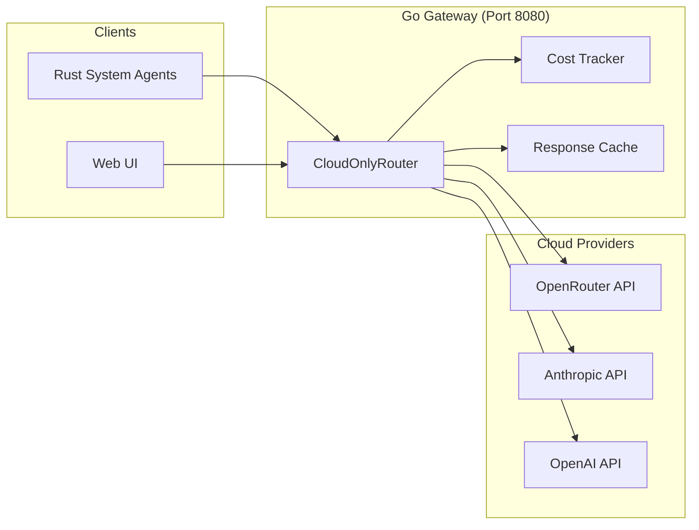

# ADR-001: Cloud-Only LLM Provider Architecture

**Status**: Accepted  
**Date**: 2026-01-25  
**Decision Makers**: Development Team  
**Technical Story**: Remove Ollama dependency, standardize on cloud LLM providers

## Context

The Chrysalis system agents previously supported both local (Ollama) and cloud LLM providers through a complexity router that would route requests based on task complexity and agent configuration. This hybrid approach introduced several challenges:

1. **Dependency Complexity**: Ollama requires local installation and model downloads
2. **Model Inconsistency**: Local models (phi4-mini, mistral3:3b) have different capabilities than cloud models
3. **Configuration Overhead**: Agents needed separate configurations for local vs cloud models
4. **Debugging Difficulty**: Issues could stem from either local or cloud provider

## Decision

**Remove Ollama/local LLM support and standardize on cloud-only providers (OpenRouter, Anthropic, OpenAI).**

### Key Changes

1. **Go Gateway**: Replace `ComplexityRouter` with `CloudOnlyRouter`
2. **Agent Registry**: All agents use `TierCloudLLM` with cloud model defaults
3. **Default Model**: `anthropic/claude-3-haiku` via OpenRouter for all system agents
4. **Universal Adapter**: Uses `openai/gpt-5.2-codex` for protocol translation

### Architecture

## Consequences

### Positive

- **Simplified Architecture**: Single provider type reduces complexity
- **Consistent Quality**: Cloud models provide consistent, high-quality responses
- **Easier Debugging**: All requests go through cloud APIs with standard error handling
- **Cost Visibility**: All usage tracked through cost tracker

### Negative

- **Cloud Dependency**: Requires internet connectivity and API keys
- **Cost**: Cloud API usage incurs costs (mitigated by caching and cost tracking)
- **Latency**: Cloud calls have higher latency than local models

### Neutral

- **API Key Management**: Users must configure OpenRouter/Anthropic/OpenAI API keys in `.env`

## Model Selection Rationale

| Model | Use Case | Rationale |
|-------|----------|-----------|
| `anthropic/claude-3-haiku` | System Agents (Ada, Lea, Phil, David, Milton) | Fast, affordable, good reasoning[^1] |
| `openai/gpt-5.2-codex` | Universal Adapter | Best-in-class code understanding[^2] |

[^1]: Claude 3 Haiku benchmarks: https://www.anthropic.com/claude/haiku
[^2]: GPT-5.2-codex capabilities: https://openai.com/codex

## Implementation Files

- `go-services/internal/llm/cloud_router.go` - CloudOnlyRouter implementation
- `go-services/internal/agents/registry.go` - Agent configurations with cloud models
- `go-services/cmd/gateway/main.go` - Gateway initialization
- `src/native/rust-system-agents/src/gateway.rs` - Rust client for Go gateway

## Related ADRs

- [ADR-002: Knowledge Graph Integration](ADR-002-knowledge-graph-integration.md)
- [ADR-003: Cost Analytics and Observability](ADR-003-cost-analytics-and-observability.md)
- [ADR-004: Integration Testing Strategy](ADR-004-integration-testing-strategy.md)
