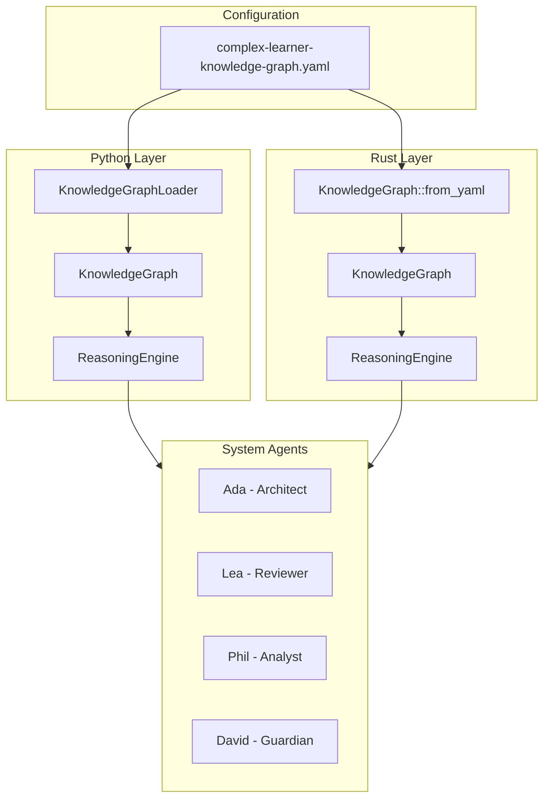

# ADR-002: Knowledge Graph Integration for Agent Reasoning

**Status**: Accepted  
**Date**: 2026-01-25  
**Decision Makers**: Development Team  
**Technical Story**: Integrate complex learner YAML knowledge graph into system agent reasoning

## Context

The Chrysalis system agents need structured reasoning patterns to guide their decision-making. A YAML-based knowledge graph (`complex-learner-knowledge-graph.yaml`) defines:

- Agent identity and principles
- Workflow stages (Discovery → Investigation → Synthesis → Reporting)
- Methods (semantic analysis, progressive refinement, direct challenges)
- Rigor constraints (single-step inference, confidence marking, evidence citation)
- Collaboration patterns (analytical tone, trust building)

This knowledge graph needed to be integrated into both Python and Rust agent implementations.

## Decision

**Create knowledge graph loaders in both Python and Rust that parse the YAML schema and provide reasoning context to system agents.**

### Key Components

1. **Python Module**: `Agents/system-agents/knowledge_graph.py`
   - `KnowledgeNode`, `KnowledgeEdge`, `KnowledgeGraph` data classes
   - `KnowledgeGraphLoader` for YAML parsing with validation
   - `ReasoningEngine` for workflow guidance and method selection

2. **Rust Module**: `src/native/rust-system-agents/src/knowledge_graph.rs`
   - Equivalent structs with serde for YAML deserialization
   - `ReasoningEngine` with workflow sequence extraction
   - Unit tests for parsing and workflow ordering

### Knowledge Graph Schema

```yaml
nodes:
  - id: <unique_identifier>
    label: <human_readable_name>
    type: <node_type>  # agent, principle, framework, priority, scope, 
                       # domain, deliverable, workflow_stage, method, 
                       # rigor, collaboration, reporting
    description: <description>

edges:
  - from: <source_node_id>
    to: <target_node_id>
    relation: <relation_type>  # embodies, anchored_in, prioritizes, 
                               # balances, operates_in, focuses_on, 
                               # produces, sequences, precedes, employs, 
                               # guides, constrained_by, requires, favors, 
                               # communicates_with, aims_for, 
                               # communicates_through, includes
```

### Architecture



## Consequences

### Positive

- **Structured Reasoning**: Agents follow defined workflow stages
- **Configurable Behavior**: Modify agent behavior by editing YAML
- **Validation**: Schema validation catches configuration errors early
- **Dual Implementation**: Both Python and Rust agents can use the same config

### Negative

- **YAML Dependency**: Requires PyYAML (Python) and serde_yaml (Rust)
- **Schema Coupling**: Changes to YAML schema require updates to both loaders

### Neutral

- **Backward Compatibility**: Existing agent configurations remain valid

## Workflow Stages

The knowledge graph defines a four-stage workflow:

| Stage | Description | Key Activities |
|-------|-------------|----------------|
| Discovery | Clarify objectives | Gather constraints, context |
| Investigation | Gather evidence | Symbol tracing, dependency mapping |
| Synthesis | Distill insights | Connect causal chains, resolve contradictions |
| Reporting | Deliver results | Summary, methodology, recommendations |

## Implementation Files

- `complex-learner-knowledge-graph.yaml` - Source knowledge graph
- `Agents/system-agents/knowledge_graph.py` - Python implementation
- `src/native/rust-system-agents/src/knowledge_graph.rs` - Rust implementation

## Related ADRs

- [ADR-001: Cloud-Only LLM Provider Architecture](ADR-001-cloud-only-llm.md)
- [ADR-005: Knowledge Graph Performance Optimization](ADR-005-knowledge-graph-performance-optimization.md)
