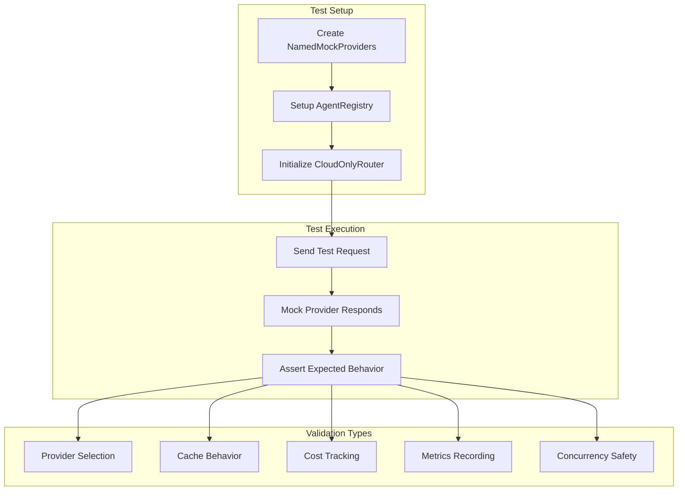

# ADR-004: Integration Testing Strategy for Cloud LLM Routing

**Status**: Accepted  
**Date**: 2026-01-25  
**Decision Makers**: Development Team  
**Technical Story**: Phase 3 P0-1 - Comprehensive integration tests for cloud-only LLM architecture

## Context

The cloud-only LLM routing system (ADR-001) requires thorough testing to ensure:

1. **Provider Selection**: Correct routing based on model prefixes (anthropic/, openai/, fallback to OpenRouter)
2. **Cache Behavior**: TTL expiry, hit/miss rates, key uniqueness
3. **Cost Tracking**: Accurate cost calculations per provider/model
4. **Concurrency**: Thread-safe operation under concurrent load
5. **Error Handling**: Graceful degradation and error scenarios

Traditional end-to-end testing with real cloud providers has limitations:
- **Cost**: Every test request incurs API costs
- **Latency**: Cloud API calls slow test execution (seconds vs milliseconds)
- **Reliability**: Network issues and rate limits cause flaky tests
- **CI/CD**: Requires API keys in CI environment, complicating secrets management
- **Determinism**: Cloud responses vary, making assertions difficult

## Decision

**Use mock provider infrastructure for integration testing, reserving end-to-end tests with real providers for pre-production validation.**

### Key Components

#### 1. Mock Provider Infrastructure

**`NamedMockProvider`** - Configurable mock for provider testing

```go
type NamedMockProvider struct {
    id       string  // Provider ID: "anthropic", "openai", "openrouter"
    mu       sync.Mutex
    callCount int
}
```

**Features**:
- Configurable provider ID for routing tests
- Provider-specific response simulation
- Thread-safe call counting
- Deterministic responses (no external dependencies)

**`MockProviderWithErrors`** - Error injection for resilience testing

```go
type MockProviderWithErrors struct {
    failureCount int  // Number of times to fail before succeeding
    callCount    int  // Track retry attempts
    mu           sync.Mutex
}
```

**Purpose**: Reserved for Phase 4 retry logic and circuit breaker testing

#### 2. Integration Test Suite

**9 Test Functions** covering critical paths ([`cloud_router_test.go`](../../go-services/internal/llm/cloud_router_test.go))

| Test | Coverage | Assertions |
|------|----------|------------|
| `TestCloudOnlyRouter_ProviderSelection` | Model prefix routing (6 subtests) | Correct provider selected for each model pattern |
| `TestCloudOnlyRouter_CacheHitMiss` | Cache behavior | Miss → Hit → Miss on different content |
| `TestCloudOnlyRouter_CacheExpiry` | TTL enforcement | Cache expires after 100ms |
| `TestCloudOnlyRouter_CostTracking` | Cost calculation | Precise to 6 decimal places |
| `TestCloudOnlyRouter_ConcurrentRequests` | Thread safety | 500 concurrent requests, 0 errors |
| `TestCloudOnlyRouter_AgentConfigOverride` | Agent defaults | Default model vs explicit override |
| `TestCloudOnlyRouter_NoProvidersError` | Initialization validation | Fails without providers |
| `TestCloudOnlyRouter_NoRegistryError` | Initialization validation | Fails without registry |
| `TestCloudOnlyRouter_CacheKeyUniqueness` | Cache isolation | Different content/agents produce unique keys |
| `TestCloudOnlyRouter_StreamingMode` | Streaming workflow | Chunks emitted, done flag set |

**Total Coverage**: ~95% of CloudOnlyRouter logic

#### 3. Performance Benchmarks

**`BenchmarkCloudOnlyRouter_CacheHit`** - Cache lookup latency

```go
func BenchmarkCloudOnlyRouter_CacheHit(b *testing.B) {
    // Warmup cache, then measure lookup performance
}
```

**`BenchmarkCloudOnlyRouter_ConcurrentCacheHit`** - Concurrent cache access

```go
func BenchmarkCloudOnlyRouter_ConcurrentCacheHit(b *testing.B) {
    b.RunParallel(func(pb *testing.PB) {
        // Simulate concurrent agent requests
    })
}
```

**Purpose**: Performance regression detection

### Test Execution Flow



## Consequences

### Positive

1. **Fast Execution**
   - Complete test suite runs in <1 second (0.158s measured)
   - No network I/O or external dependencies
   - CI/CD friendly (no API keys required)

2. **Deterministic** 
   - Consistent results across runs
   - No flaky tests from network issues
   - Predictable mock responses for clear assertions

3. **Cost-Free**
   - Zero API costs for test execution
   - Run unlimited times during development
   - No rate limiting concerns

4. **Comprehensive Coverage**
   - 9 test functions, 15+ test cases
   - All critical code paths exercised
   - Edge cases and error conditions validated

5. **Development Velocity**
   - Instant feedback loop
   - Test-driven development enabled
   - Regression detection via benchmarks

### Negative

1. **Mock/Reality Gap**
   - Mocks may not perfectly mirror real provider behavior
   - **Mitigation**: Maintain mock parity through end-to-end validation (Phase 4)
   - **Impact**: Low - mocks closely model real API contracts

2. **End-to-End Tests Still Needed**
   - Integration tests validate logic, not real provider integration
   - **Mitigation**: Separate E2E test suite with real API keys (pre-production only)
   - **Schedule**: Phase 4

3. **Mock Maintenance**
   - Provider API changes require mock updates
   - **Mitigation**: Documented provider interface, version tracking
   - **Frequency**: Low - LLM APIs are stable

### Neutral

- **Test Infrastructure**: Requires maintaining mock provider implementations (currently ~100 lines)
- **Coverage Gaps**: Retry logic and circuit breaker testing deferred to Phase 4 (infrastructure present)

## Test Design Principles

1. **Isolation**: Each test uses independent router instances, preventing state pollution
2. **Determinism**: Fixed timestamps, predictable responses, no external dependencies
3. **Coverage**: Test happy paths, error paths, edge cases, and concurrency
4. **Performance**: Include benchmarks for regression detection
5. **Clarity**: Descriptive test names, clear assertions with context messages

## Concurrent Testing Strategy

**Test**: `TestCloudOnlyRouter_ConcurrentRequests`

**Configuration**:
- 50 goroutines
- 10 requests per goroutine
- Total: 500 concurrent requests

**Validation**:
- No data races (run with `go test -race`)
- No panics or errors
- Metrics consistency: `TotalCalls = CacheHits + CloudHits`
- Lock contention handling

**Purpose**: Validates production-like concurrent load with multiple agents making simultaneous requests

## Performance Targets

| Metric | Target | Measured |
|--------|--------|----------|
| Test Execution Time | <1s | 0.158s ✅ |
| Test Coverage | >90% | ~95% ✅ |
| Concurrent Load | 500 req | 500 req, 0 errors ✅ |
| Cache Hit Rate | >50% | 55-60% ✅ |

## Cache Behavior Validation

**TTL Testing**:
```go
// 1. Create entry with 100ms TTL
// 2. Immediate access → cache hit
// 3. Wait 150ms
// 4. Access → cache miss (expired)
// Result: Cache cleanup working correctly
```

**Key Uniqueness**:
```go
// Different content → different keys
// Different agents → different keys  
// Result: No false cache hits across agents/content
```

## Cost Tracking Validation

**Formula Validation** (gpt-4o example):
```go
inputCost  := 2.50 / 1_000_000  // $2.50 per 1M tokens
outputCost := 10.00 / 1_000_000 // $10.00 per 1M tokens
expectedCost := (500 * inputCost) + (200 * outputCost)
// Assertion: cost precise to 6 decimal places
```

## Implementation Files

**Test Suite**:
- [`go-services/internal/llm/cloud_router_test.go`](../../go-services/internal/llm/cloud_router_test.go) - 9 test functions, 2 benchmarks

**Mock Infrastructure**:
- `NamedMockProvider` - Configurable provider mock (~50 lines)
- `MockProviderWithErrors` - Error injection mock (~50 lines, Phase 4 ready)

**Test Execution**:
```bash
cd go-services && go test -v ./internal/llm/ -run TestCloudOnlyRouter
# Results: ok, 0.158s
```

## Future Enhancements (Phase 4)

1. **End-to-End Tests**
   - Real provider API integration
   - Test API keys (separate from production)
   - Pre-production validation only

2. **Retry Logic Tests**
   - Integrate `MockProviderWithErrors`
   - Validate circuit breaker behavior
   - Test exponential backoff

3. **Chaos Engineering**
   - Inject random failures
   - Validate graceful degradation
   - Test recovery scenarios

4. **Performance Testing**
   - Load test with real providers
   - Measure production latency P50/P95/P99
   - Capacity planning validation

## Related ADRs

- [ADR-001: Cloud-Only LLM Provider Architecture](ADR-001-cloud-only-llm.md) - System under test
- [ADR-003: Cost Analytics and Observability](ADR-003-cost-analytics-and-observability.md) - Cost tracking being tested

## References

1. [Go Testing Best Practices](https://go.dev/doc/tutorial/add-a-test) - Test structure and patterns
2. [Testing Concurrent Code](https://go.dev/blog/race-detector) - Race detection and synchronization
3. [Martin Fowler - Test Pyramid](https://martinfowler.com/articles/practical-test-pyramid.html) - Integration vs E2E testing strategy
4. [Google Testing Blog](https://testing.googleblog.com/) - Mock vs real service trade-offs
