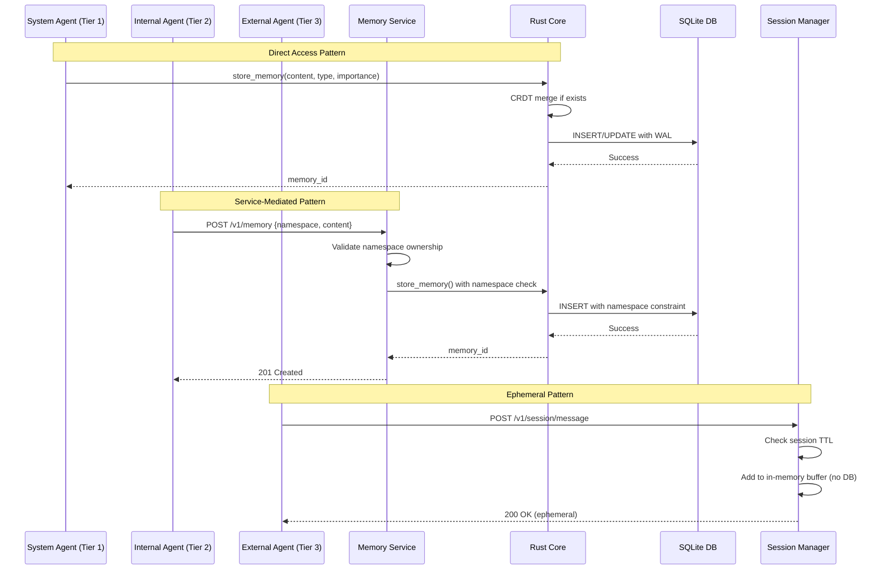

# ADR-006: Multi-Agent Memory Architecture with Three-Tier Security Model

**Status**: Proposed  
**Date**: 2026-01-25  
**Decision Makers**: Systems Architecture Team, Security Team  
**Technical Story**: Phase 4 - Comprehensive memory architecture for system, internal, and external agents

## Context

The Chrysalis multi-agent system requires a scalable, secure memory architecture that supports:

1. **Multiple Agent Tiers**: System agents (Ada, Lea, Phil, David, Milton) require full infrastructure access, while internal user-created agents need namespace isolation, and external API consumers should have ephemeral-only memory
2. **Conflict-Free Replication**: Agents must be able to write concurrently without coordination, requiring CRDT-based merge semantics
3. **Local-First Operation**: Agents must function offline with automatic sync when connectivity returns
4. **Security Isolation**: Different trust levels require different access control mechanisms
5. **Observability**: Memory operations must be traceable for debugging and compliance

Previous architecture documents ([`CHRYSALIS_SHARED_MEMORY_ARCHITECTURE.md`](../../docs/CHRYSALIS_SHARED_MEMORY_ARCHITECTURE.md), [`AGENTIC_MEMORY_DESIGN.md`](../../docs/AGENTIC_MEMORY_DESIGN.md)) established CRDT foundations and Fireproof selection, but lacked:
- Formal agent tier classification
- Security boundaries and access control
- Testing strategy for multi-tier architecture
- Production deployment patterns

## Decision

**Implement a three-tier memory architecture with differentiated access patterns: (1) System Agents with direct database access, (2) Internal Agents with service-layer mediation, and (3) External Agents with session-only ephemeral storage.**

### Key Architectural Components

#### 1. Three-Tier Agent Classification

| Tier | Trust Level | Examples | Access Pattern | Persistence |
|------|------------|----------|----------------|-------------|
| **Tier 1: System** | High - Infrastructure | Ada, Lea, Phil, David, Milton | Direct Rust Core → SQLite | Permanent |
| **Tier 2: Internal** | Medium - Application | User-created agents, workflows | Memory Service API → Rust Core | Permanent (namespace-scoped) |
| **Tier 3: External** | Low - Public | Chat users, API clients | HTTP → Session Manager | Ephemeral (TTL-based) |

#### 2. Memory Storage Stack

```
┌─────────────────────────────────────────────────┐
│          Tier 1: System Agents                  │
│      (Direct Rust + SQLite Access)              │
├─────────────────────────────────────────────────┤
│          Tier 2: Internal Agents                │
│      (Memory Service API Mediation)             │
├─────────────────────────────────────────────────┤
│          Tier 3: External Agents                │
│      (Session Manager - Ephemeral)              │
└─────────────────────────────────────────────────┘
                     ↓
        ┌────────────────────────┐
        │   Rust Memory Core     │
        │   (CRDT Operations)    │
        └────────────────────────┘
                     ↓
        ┌────────────────────────┐
        │   SQLite + WAL Mode    │
        │   (Persistent Storage) │
        └────────────────────────┘
                     ↓
        ┌────────────────────────┐
        │  Fireproof Sync Gateway│
        │  (Cloud Replication)   │
        └────────────────────────┘
```

#### 3. Data Model

**Memory Document** (Rust):
```rust
pub struct MemoryDocument {
    // Identity
    pub id: String,
    pub doc_type: DocumentType,
    
    // Content
    pub content: String,
    pub embedding_ref: Option<String>,
    
    // Classification
    pub memory_type: MemoryType,
    pub tags: GSet<String>,          // CRDT G-Set
    
    // Importance (CRDT LWW-Max)
    pub importance: LWWRegister<f64>,
    pub confidence: LWWRegister<f64>,
    pub access_count: Counter,
    
    // Provenance
    pub source_instance: String,
    pub created_at: DateTime<Utc>,
    pub updated_at: DateTime<Utc>,
    
    // CRDT metadata
    pub version: u64,
    pub sync_status: SyncStatus,
    
    // Security (NEW)
    pub tier: AgentTier,            // system, internal, external
    pub namespace: String,          // Isolation boundary
}
```

**Session Memory** (External Agents - Ephemeral):
```typescript
interface SessionMemory {
  session_id: string;
  user_id?: string;
  created_at: Date;
  expires_at: Date;
  
  working_memory: Message[];      // In-memory only
  conversation_state: ConversationState;
  
  max_messages: number;           // Default: 50
  ttl_seconds: number;            // Default: 3600
}
```

#### 4. Testing Strategy

**Test Pyramid**:
- Unit Tests (50%): CRDT operations, document validation, access control
- Integration Tests (40%): Memory persistence, security isolation, sync gateway
- E2E Tests (10%): Full system workflows, UI interactions

**Key Test Suites**:
1. `memory_persistence_test.rs` - Rust CRDT persistence validation
2. `security_isolation_test.rs` - Namespace and tier access control
3. `sync_gateway_test.ts` - Fireproof sync behavior
4. **UI Tests** (New):
   - `tests/unit/components/` - Component unit tests (Jest + RTL)
   - `tests/integration/` - Workflow integration tests
   - `tests/e2e/playwright/` - End-to-end + accessibility tests

**CI/CD Pipeline**:
- GitHub Actions with parallel test execution
- Test coverage >90% requirement
- Security isolation tests as quality gate
- E2E tests in staging before production deployment

## Rationale

### Why Three Tiers?

1. **Security Depth**: Defense in depth - system agents are trusted, external agents are not
2. **Performance**: Direct access for system agents avoids API overhead for high-frequency operations
3. **Isolation**: Namespace boundaries prevent cross-agent data leakage for internal agents
4. **Compliance**: External agents have no persistent data, simplifying GDPR/privacy requirements

### Why Fireproof for Cloud Memory?

Fireproof was selected in earlier architecture ([`CHRYSALIS_SHARED_MEMORY_ARCHITECTURE.md`](../../docs/CHRYSALIS_SHARED_MEMORY_ARCHITECTURE.md)) based on:

| Feature | Fireproof | Turso | Supabase | Ditto |
|---------|-----------|-------|----------|-------|
| **Local-First** | ✅ Full | ❌ Cloud-first | ❌ Cloud-first | ✅ Full |
| **CRDT Native** | ✅ Merkle CRDT | ❌ | ❌ | ✅ |
| **Offline Operation** | ✅ Complete | ⚠️ Limited | ⚠️ Limited | ✅ Complete |
| **Self-Hosted** | ✅ | ❌ Proprietary | ✅ | ❌ Enterprise |
| **Cost** | Free (self-host) | $0.10/GB + egress | $25/month | Enterprise pricing |
| **Rust Integration** | ⚠️ FFI possible | ✅ Native driver | ⚠️ HTTP only | ⚠️ Limited |

**Key Advantages**:
- CRDT conflict resolution aligns with multi-agent concurrent writes
- Local-first enables offline agent operation
- Merkle DAG provides cryptographic integrity
- WebSocket sync gateway for real-time replication

**Trade-offs Accepted**:
- Rust integration requires PyO3 bridge (already implemented)
- Sync gateway deployment adds operational complexity (containerized)

### Why Session-Only for External Agents?

1. **Privacy**: No persistent PII storage reduces compliance burden
2. **Security**: Attack surface limited to session duration
3. **Cost**: No storage costs for high-volume external traffic
4. **Simplicity**: No GDPR "right to be forgotten" implementation needed

## Architecture

### Memory Access Flow



### CRDT Merge Strategy

| Field | CRDT Type | Merge Rule | Rationale |
|-------|-----------|-----------|-----------|
| `tags` | G-Set | Union | Accumulate all tags from all agents |
| `importance` | LWW-Max | Maximum | Importance only increases over time |
| `confidence` | LWW-Max | Maximum | Confidence reflects accumulated evidence |
| `content` | LWW-Register | Latest timestamp | Most recent content wins |
| `access_count` | Counter | Sum | Track total accesses across replicas |
| `related_memories` | G-Set | Union | Accumulate all relationships |

## Consequences

### Positive

1. **Security**
   - Clear trust boundaries between agent tiers
   - Defense in depth via access control layers
   - Minimal external agent attack surface

2. **Performance**
   - System agents avoid API overhead for high-frequency operations
   - CRDT merge enables lock-free concurrent writes
   - Local-first reduces cloud dependency latency

3. **Scalability**
   - Namespace isolation enables horizontal scaling of internal agents
   - Session-only external agents eliminate storage scaling concerns
   - Fireproof sync gateway handles O(log N) gossip propagation

4. **Developer Experience**
   - Three clear patterns for different use cases
   - Comprehensive test coverage (90%+)
   - CI/CD automation eliminates manual testing

5. **Compliance**
   - External agents no persistent data = no PII storage
   - Audit logs for all memory access
   - Cryptographic integrity via Merkle DAG

### Negative

1. **Operational Complexity**
   - Fireproof sync gateway adds deployment component (mitigated by Docker)
   - Three different memory patterns to maintain (documented in [`PHASE4_MEMORY_ARCHITECTURE_PLAN.md`](../../plans/PHASE4_MEMORY_ARCHITECTURE_PLAN.md))
   - Monitoring must track sync lag, conflicts, and namespace violations

2. **Learning Curve**
   - Developers must understand CRDT semantics
   - Different APIs for each tier
   - **Mitigation**: Comprehensive documentation, code examples, developer guides

3. **External Agent Limitations**
   - No conversation history across sessions
   - No learning from interactions
   - **Mitigation**: Document as intentional privacy-by-design, offer internal agent tier for authenticated users

4. **Fireproof Maturity**
   - Fireproof is pre-1.0 (currently v0.19)
   - **Mitigation**: Test suite validates behavior, fallback to direct SQLite if sync unavailable

### Neutral

- **Test Infrastructure**: Requires significant upfront investment (offset by long-term quality)
- **Memory Overhead**: CRDT metadata adds ~20% storage overhead (acceptable for benefits)

## Implementation

### Key Files

**Core Infrastructure**:
- [`src/native/rust-system-agents/src/memory.rs`](../../src/native/rust-system-agents/src/memory.rs) - Rust memory core (add tier field)
- [`Agents/system-agents/rust_memory_integration.py`](../../Agents/system-agents/rust_memory_integration.py) - System agent integration
- `go-services/internal/memory/service.go` (NEW) - Memory service API for internal agents
- `src/session/SessionMemoryManager.ts` (NEW) - Session manager for external agents

**Testing**:
- `tests/integration/memory_persistence_test.rs` (NEW) - Persistence validation
- `tests/integration/security_isolation_test.rs` (NEW) - Tier access control
- `tests/integration/sync_gateway_test.ts` (NEW) - Fireproof sync tests
- `tests/e2e/playwright/memory-ui.spec.ts` (NEW) - UI E2E tests

**Documentation**:
- [`plans/PHASE4_MEMORY_ARCHITECTURE_PLAN.md`](../../plans/PHASE4_MEMORY_ARCHITECTURE_PLAN.md) - Implementation plan (this document references)
- `docs/MEMORY_SECURITY_POLICY.md` (NEW) - Security policies and threat model

**CI/CD**:
- `.github/workflows/phase4-memory-tests.yml` (NEW) - Automated test pipeline

### Deployment

**Development**:
```bash
# Start local Fireproof sync gateway
docker-compose up -d fireproof-sync

# Run memory tests
cargo test --test memory_persistence_test
npm run test:integration
playwright test tests/e2e/memory-ui.spec.ts
```

**Production** (Kubernetes):
```yaml
# Fireproof Sync Gateway Deployment
apiVersion: apps/v1
kind: Deployment
metadata:
  name: fireproof-sync-gateway
spec:
  replicas: 3
  template:
    spec:
      containers:
      - name: sync-gateway
        image: fireproof/sync-gateway:latest
        ports:
        - containerPort: 4444
        volumeMounts:
        - name: sync-data
          mountPath: /data
      volumes:
      - name: sync-data
        persistentVolumeClaim:
          claimName: fireproof-pvc
```

## Migration Plan

### Phase 4.1: Security Model (Weeks 1-2)
- Add `AgentTier` enum to Rust core
- Implement namespace validation in memory service
- Create session manager for external agents
- Security isolation tests

### Phase 4.2: Memory Architecture (Weeks 3-4)
- Add `tier` and `namespace` fields to `MemoryDocument`
- Implement namespace-scoped queries
- Create memory service API endpoints
- Memory persistence tests

### Phase 4.3: Fireproof Integration (Weeks 5-6)
- Deploy sync gateway (Docker)
- Configure sync clients in agents
- Implement offline queue
- Sync gateway tests

### Phase 4.4: Testing Infrastructure (Weeks 7-8)
- Setup Jest + React Testing Library
- Create component test suite
- Setup Playwright E2E tests
- Accessibility tests (axe-core)

### Phase 4.5: CI/CD (Weeks 9-10)
- GitHub Actions workflows
- Test parallelization
- Grafana test dashboard
- Automated deployment

### Phase 4.6: Documentation (Weeks 11-12)
- Security policy documentation
- Developer integration guides
- Security audit
- Production deployment

## Success Criteria

### Functional
- [ ] System agents read/write with direct DB access (<10ms latency)
- [ ] Internal agents isolated to namespaces via service API
- [ ] External agents session-only with no persistence
- [ ] CRDT merge handles concurrent updates without data loss
- [ ] Sync gateway replicates changes within 5 seconds
- [ ] Offline agents queue and sync when reconnected

### Non-Functional
- [ ] Test coverage >90%
- [ ] All security isolation tests passing
- [ ] E2E test suite <5 minutes runtime
- [ ] Zero critical vulnerabilities (SAST scan)
- [ ] Production deployment with rollback plan

## Risks and Mitigations

| Risk | Likelihood | Impact | Mitigation |
|------|-----------|--------|-----------|
| CRDT merge bugs | Medium | High | Extensive test coverage, property-based testing |
| Fireproof sync gateway downtime | Low | Medium | Offline queue, exponential backoff retry |
| Namespace escape vulnerability | Low | High | Service-layer validation, DB constraints, security audit |
| Test suite slowness | Medium | Medium | Parallel execution, selective test runs |

## Alternatives Considered

### Alternative 1: Single-Tier (All Agents Equal)
- **Pros**: Simpler architecture, single API
- **Cons**: No security depth, external agents would have persistent storage
- **Rejected**: Security concerns outweigh simplicity

### Alternative 2: Two-Tier (Internal + External Only)
- **Pros**: System agents use same API as internal agents
- **Cons**: Performance overhead for high-frequency system agent operations
- **Rejected**: Performance-critical system agents need direct access

### Alternative 3: Turso for Cloud Memory
- **Pros**: Native SQLite compatibility, Rust driver
- **Cons**: Not local-first, no CRDT support, proprietary cloud
- **Rejected**: CRDT requirement for multi-agent conflict resolution

## Related ADRs

- [ADR-001: Cloud-Only LLM Provider Architecture](ADR-001-cloud-only-llm.md) - Cloud infrastructure patterns
- [ADR-003: Cost Analytics and Observability](ADR-003-cost-analytics-and-observability.md) - Observability patterns applied to memory
- [ADR-004: Integration Testing Strategy](ADR-004-integration-testing-strategy.md) - Testing patterns to apply
- [ADR-005: Knowledge Graph Performance Optimization](ADR-005-knowledge-graph-performance-optimization.md) - Performance optimization techniques

## References

### Internal
1. [CHRYSALIS_SHARED_MEMORY_ARCHITECTURE.md](../../docs/CHRYSALIS_SHARED_MEMORY_ARCHITECTURE.md) - Fireproof CRDT foundation
2. [AGENTIC_MEMORY_DESIGN.md](../../docs/AGENTIC_MEMORY_DESIGN.md) - Memory tiers and beads design
3. [memory-system.md](../../docs/architecture/memory-system.md) - Current implementation
4. [PHASE4_MEMORY_ARCHITECTURE_PLAN.md](../../plans/PHASE4_MEMORY_ARCHITECTURE_PLAN.md) - Implementation plan

### External
1. [Fireproof Documentation](https://use-fireproof.com/) - CRDT database guide
2. [Shapiro et al. (2011)](https://hal.inria.fr/inria-00555588) - CRDTs: Consistency without Concurrency Control
3. [OWASP Secure Coding Practices](https://owasp.org/www-project-secure-coding-practices-quick-reference-guide/)
4. [Playwright Best Practices](https://playwright.dev/docs/best-practices)

---

**Version**: 1.0.0  
**Last Updated**: 2026-01-25  
**Authors**: Systems Architecture Team  
**Reviewers**: TBD  
**Status**: Proposed (Awaiting Review)
