# Chrysalis C4 Architecture Diagrams

**Version**: 1.0.0  
**Date**: 2026-01-11  
**Status**: Current

---

## Table of Contents

1. [Overview](#overview)
2. [Level 1: System Context](#level-1-system-context)
3. [Level 2: Container Diagram](#level-2-container-diagram)
4. [Level 3: Component Diagrams](#level-3-component-diagrams)
5. [Level 4: Code Diagrams](#level-4-code-diagrams)
6. [Deployment Diagrams](#deployment-diagrams)
7. [Sequence Diagrams](#sequence-diagrams)

---

## Overview

This document provides C4 architecture diagrams for the Chrysalis system following the [C4 model](https://c4model.com/) by Simon Brown. The C4 model provides a hierarchical set of software architecture diagrams for different audiences:

- **Level 1 (Context)**: System context and external dependencies
- **Level 2 (Containers)**: High-level technology choices and communication
- **Level 3 (Components)**: Components within containers
- **Level 4 (Code)**: Implementation details (optional)

### Diagram Legend

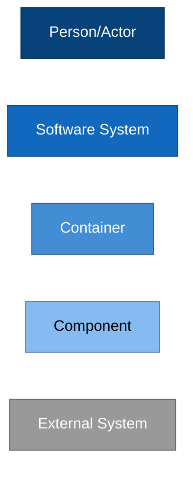

---

## Level 1: System Context

### System Context Diagram

Shows how Chrysalis fits into the world around it - who uses it and what systems it integrates with.

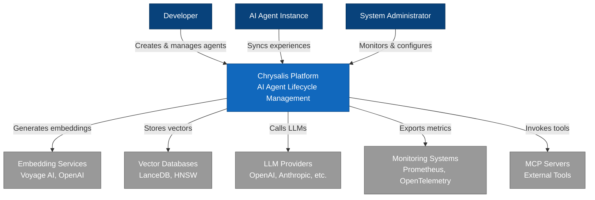

### Key Relationships

| Actor/System | Relationship | Description |
|--------------|--------------|-------------|
| **Developer** | Creates agents | Defines agent schemas, skills, knowledge, and personality |
| **AI Agent Instance** | Syncs experiences | Deployed instances send back learned experiences |
| **System Administrator** | Monitors system | Tracks health, performance, and resource usage |
| **LLM Providers** | Provides intelligence | OpenAI, Anthropic for reasoning and generation |
| **Embedding Services** | Generates vectors | Voyage AI, OpenAI for semantic embeddings |
| **Vector Databases** | Stores memories | LanceDB, HNSW for similarity search |
| **Monitoring Systems** | Collects telemetry | Prometheus, OpenTelemetry for observability |
| **MCP Servers** | Extends capabilities | External tools and services via MCP protocol |

---

## Level 2: Container Diagram

### Container Overview

Shows the high-level technology choices and how containers communicate.

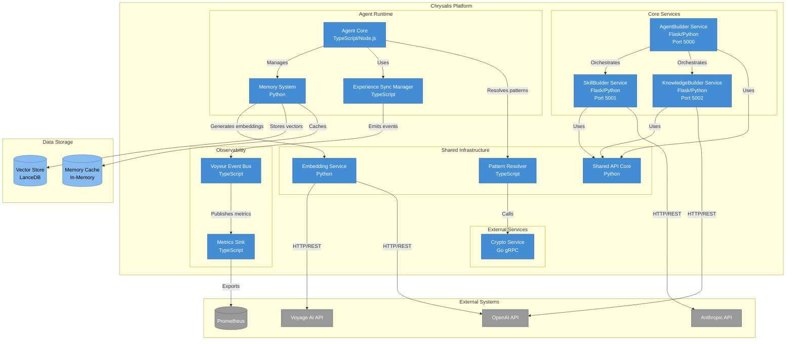

### Container Responsibilities

| Container | Technology | Port | Responsibility |
|-----------|-----------|------|----------------|
| **AgentBuilder** | Flask/Python | 5000 | Orchestrates agent creation, coordinates KnowledgeBuilder and SkillBuilder |
| **SkillBuilder** | Flask/Python | 5001 | Generates agent skills from occupation and corpus text |
| **KnowledgeBuilder** | Flask/Python | 5002 | Collects and structures knowledge about entities |
| **Agent Core** | TypeScript/Node.js | - | Agent schema, validation, morphing between frameworks |
| **Memory System** | Python | - | Episodic and semantic memory with deduplication |
| **Experience Sync Manager** | TypeScript | - | Synchronizes experiences from deployed instances |
| **Shared API Core** | Python | - | Unified API patterns, auth, validation, error handling |
| **Embedding Service** | Python | - | Abstraction over embedding providers (Voyage, OpenAI) |
| **Pattern Resolver** | TypeScript | - | Adaptive pattern implementation selection |
| **Voyeur Event Bus** | TypeScript | - | Observability event streaming |
| **Metrics Sink** | TypeScript | - | Metrics collection and export |
| **Crypto Service** | Go gRPC | 50051 | Cryptographic operations (hashing, signatures) |

### Communication Protocols

| From | To | Protocol | Purpose |
|------|-----|----------|---------|
| AgentBuilder | SkillBuilder | HTTP/REST | Request skill generation |
| AgentBuilder | KnowledgeBuilder | HTTP/REST | Request knowledge collection |
| All Services | Shared API Core | Library Import | Unified API patterns |
| Memory System | Embedding Service | Function Call | Generate embeddings |
| Memory System | Vector Store | Native API | Store/query vectors |
| Pattern Resolver | Crypto Service | gRPC | Cryptographic operations |
| All Components | Voyeur Bus | Event Emission | Observability events |
| Metrics Sink | Prometheus | HTTP/Metrics | Export metrics |
| Embedding Service | Voyage/OpenAI | HTTP/REST | Generate embeddings |

---

## Level 3: Component Diagrams

### AgentBuilder Service Components

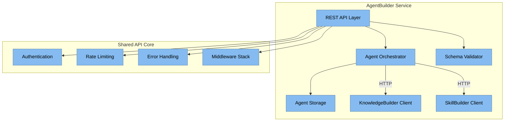

**Key Components**:
- **REST API Layer**: Flask routes, request/response handling
- **Agent Orchestrator**: Coordinates knowledge and skill generation
- **Schema Validator**: Validates agent schemas against USA v2 spec
- **Agent Storage**: In-memory storage with persistence hooks
- **KnowledgeBuilder Client**: HTTP client for knowledge service
- **SkillBuilder Client**: HTTP client for skill service

### Memory System Components

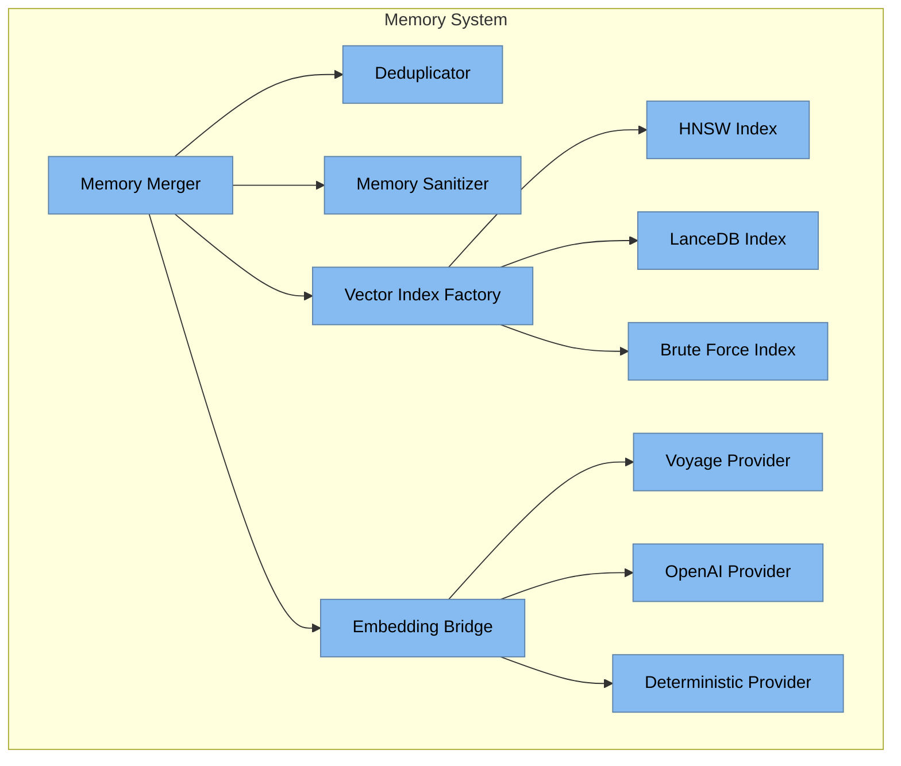

**Key Components**:
- **Memory Merger**: Orchestrates memory deduplication and merging
- **Deduplicator**: Finds similar memories using Jaccard or embeddings
- **Memory Sanitizer**: Filters malicious content, rate limiting
- **Vector Index Factory**: Selects appropriate vector index backend
- **Embedding Bridge**: Abstracts embedding provider selection
- **HNSW/Lance/Brute**: Vector index implementations
- **Provider Implementations**: Voyage AI, OpenAI, Deterministic

### Experience Sync Components

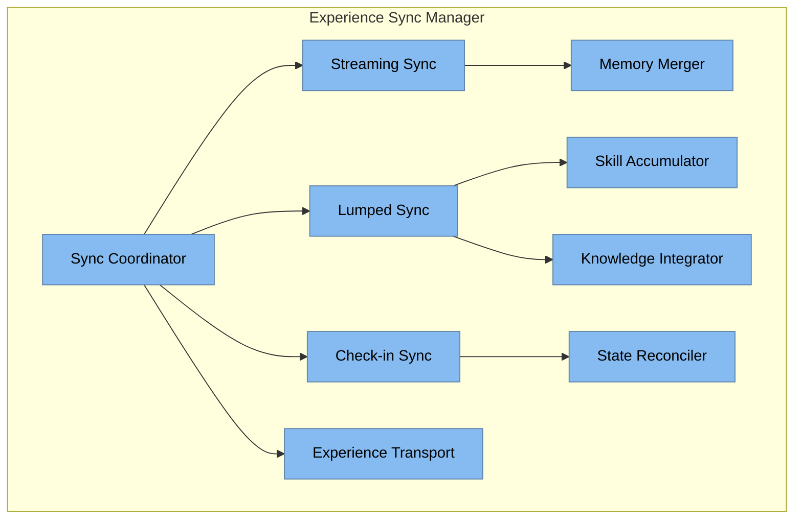

**Key Components**:
- **Sync Coordinator**: Manages sync protocol selection and lifecycle
- **Streaming Sync**: Real-time experience streaming
- **Lumped Sync**: Batch experience synchronization
- **Check-in Sync**: Periodic full state synchronization
- **Experience Transport**: Network transport abstraction
- **Memory Merger**: Integrates experiences into agent memory
- **Skill Accumulator**: Aggregates learned skills
- **Knowledge Integrator**: Merges new knowledge
- **State Reconciler**: Resolves state conflicts

### Shared API Core Components

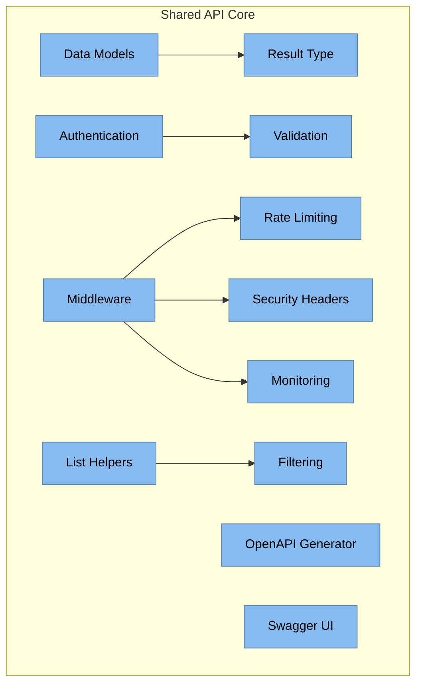

**Key Components**:
- **Data Models**: APIResponse, APIError, ErrorCode, Pagination
- **Result Type**: Monadic error handling (Success/Failure)
- **Authentication**: JWT and API key validation, RBAC
- **Validation**: Request validation with Result pattern
- **Middleware**: Request ID, CORS, error handling, audit logging
- **Rate Limiting**: Token bucket algorithm
- **Monitoring**: Health checks, metrics collection
- **Security Headers**: OWASP security headers
- **List Helpers**: Pagination, filtering, sorting
- **Filtering**: Query parameter parsing
- **OpenAPI Generator**: Automatic spec generation
- **Swagger UI**: Interactive API documentation

---

## Level 4: Code Diagrams

### Memory Merger Class Diagram

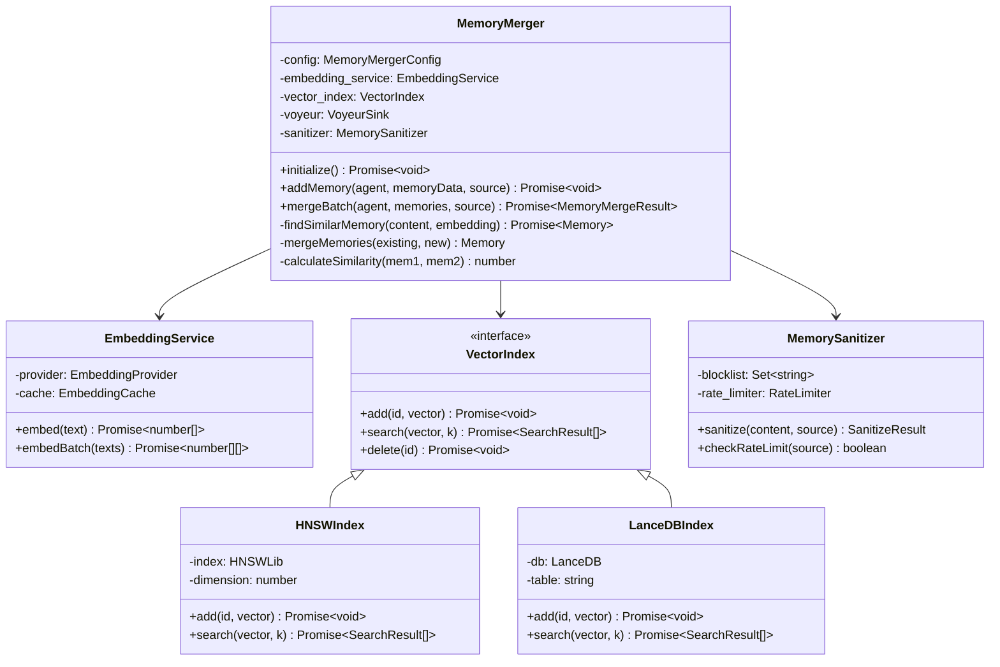

### Result Type Pattern

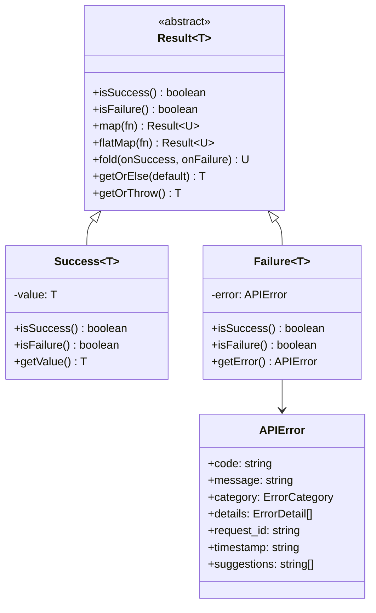

### Pattern Resolver Sequence

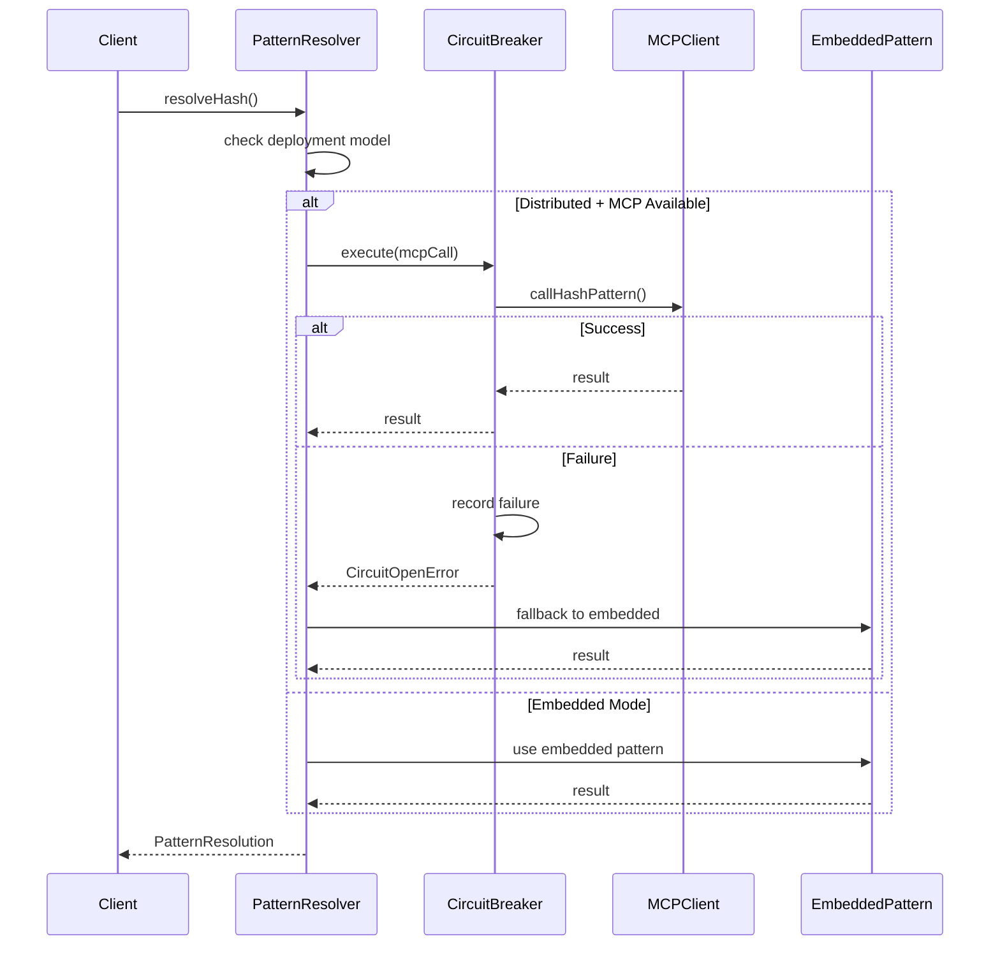

---

## Deployment Diagrams

### Production Deployment (Distributed Model)

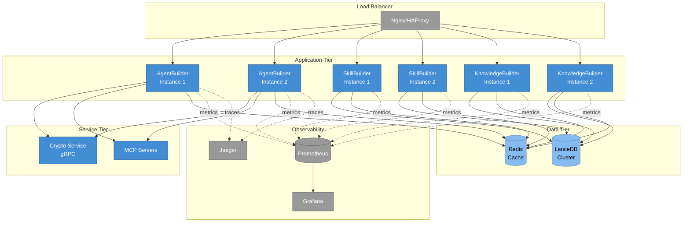

### Development Deployment (Embedded Model)

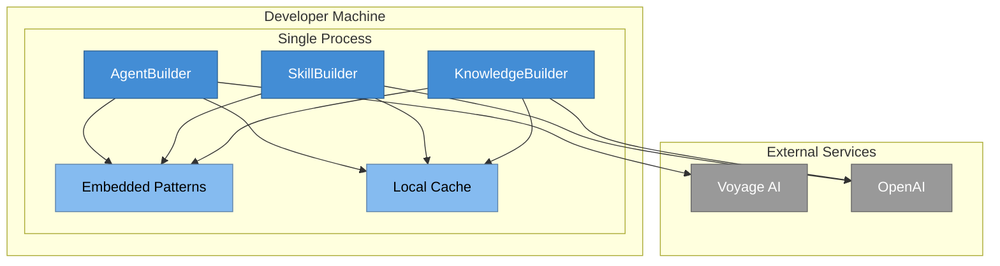

---

## Sequence Diagrams

### Agent Creation Flow

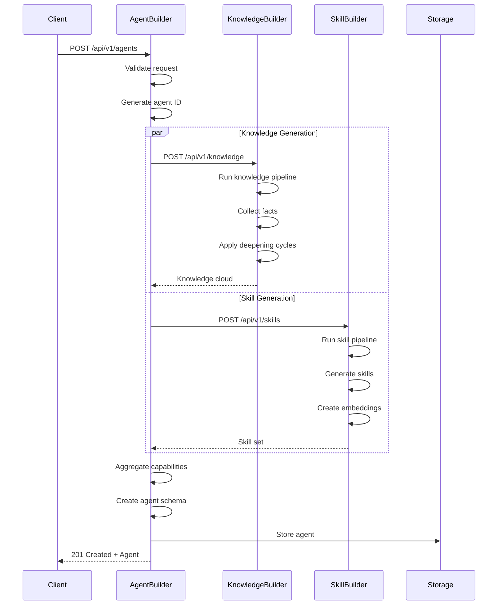

### Memory Merge Flow

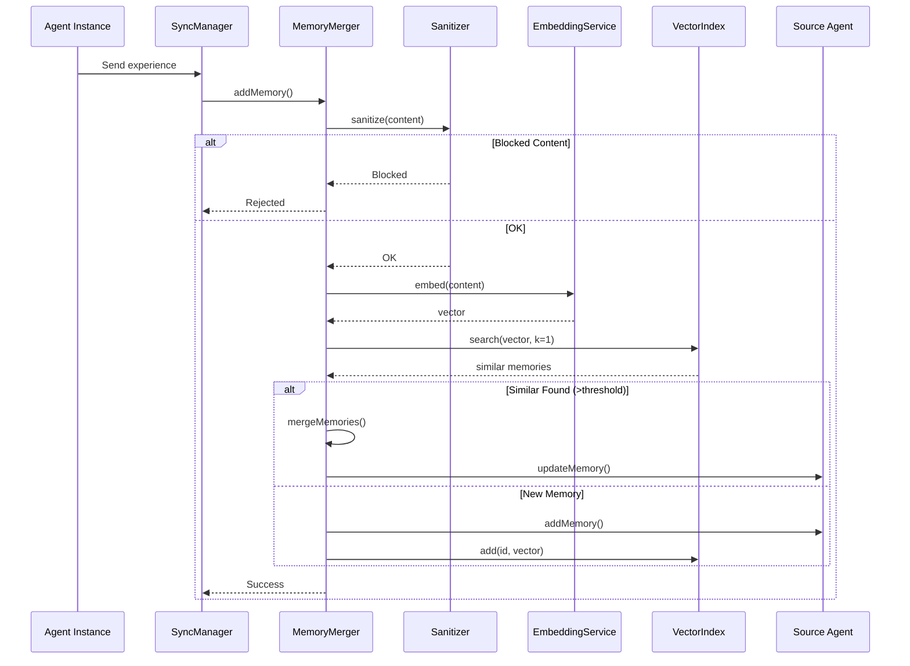

### Authentication Flow

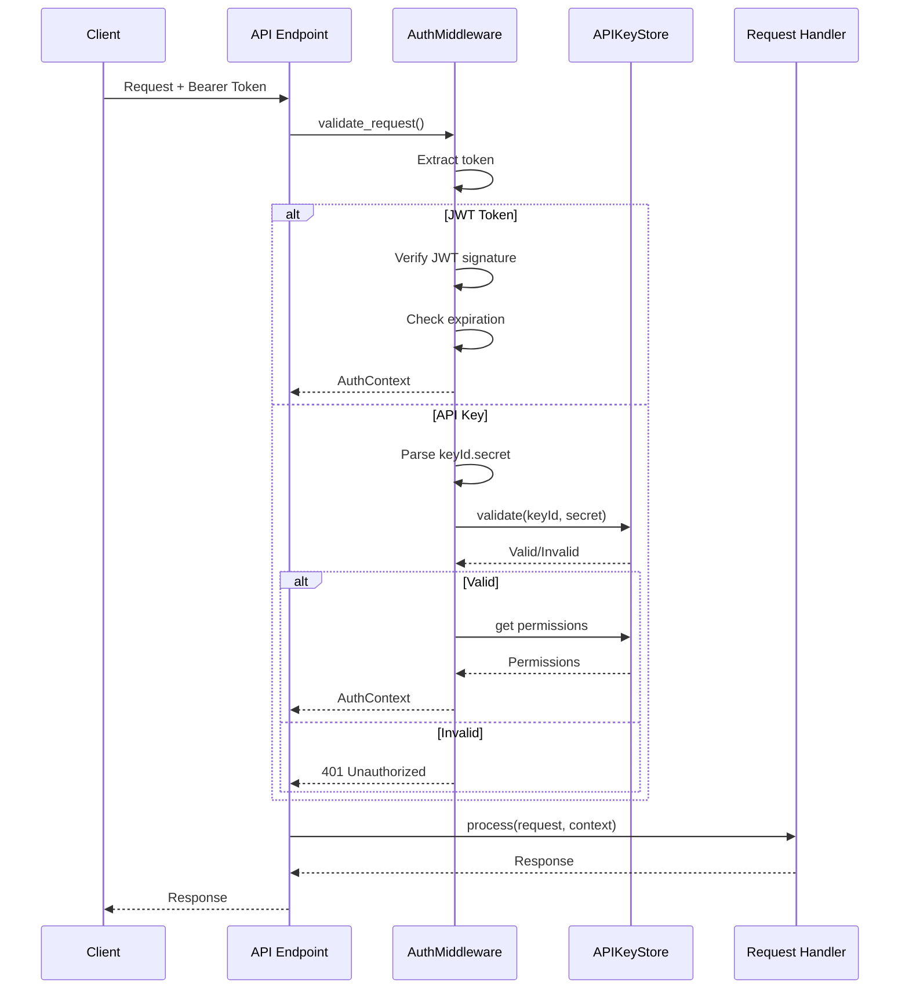

---

## Architecture Decision Records

### ADR-001: Service Layer Independence

**Status**: Accepted  
**Date**: 2026-01-11

**Context**: Need to ensure services can evolve independently while maintaining consistency.

**Decision**: Implement shared API core as a library, not a service.

**Consequences**:
- ✅ Services remain independent
- ✅ No network overhead for shared functionality
- ✅ Consistent patterns across all services
- ⚠️ Requires version management for shared library

### ADR-002: Adaptive Pattern Resolution

**Status**: Accepted  
**Date**: 2026-01-11

**Context**: Need to support multiple deployment models (embedded, distributed, hybrid).

**Decision**: Implement PatternResolver with runtime selection based on deployment context.

**Consequences**:
- ✅ Supports gradual migration
- ✅ Optimizes for deployment context
- ✅ Graceful degradation on service failure
- ⚠️ Increased complexity in pattern implementation

### ADR-003: Result Type for Error Handling

**Status**: Accepted  
**Date**: 2026-01-11

**Context**: Need type-safe error handling without exceptions.

**Decision**: Implement Result<T> monad pattern for all API operations.

**Consequences**:
- ✅ Type-safe error handling
- ✅ Explicit error propagation
- ✅ Composable operations
- ⚠️ Learning curve for developers

---

## Related Documentation

- [Architecture Specification](../../ARCHITECTURE.md)
- [API Reference Index](../api/API_REFERENCE_INDEX.md)
- [Shared API Core Documentation](../api/SHARED_API_CORE.md)
- [AgentBuilder API Spec](../api/services/AGENTBUILDER_COMPLETE_SPEC.md)
- [SkillBuilder API Spec](../api/services/SKILLBUILDER_API_SPEC.md)
- [KnowledgeBuilder API Spec](../api/services/KNOWLEDGEBUILDER_API_SPEC.md)

---

## Diagram Tools

These diagrams are created using [Mermaid](https://mermaid.js.org/), which is supported by:

- **GitHub**: Native rendering in Markdown
- **GitLab**: Native rendering in Markdown
- **VS Code**: Mermaid Preview extension
- **IntelliJ**: Mermaid plugin
- **Confluence**: Mermaid macro
- **Online**: https://mermaid.live/

### Rendering Diagrams

**In VS Code**:
```bash
# Install Mermaid Preview extension
code --install-extension bierner.markdown-mermaid

# Open this file and use preview (Ctrl+Shift+V)
```

**Export to PNG/SVG**:
```bash
# Install mermaid-cli
npm install -g @mermaid-js/mermaid-cli

# Export diagram
mmdc -i C4_ARCHITECTURE_DIAGRAMS.md -o diagrams/
```

**Online Editor**:
1. Go to https://mermaid.live/
2. Copy diagram code
3. Edit and export

---

**Document Version**: 1.0.0  
**Last Updated**: 2026-01-11  
**Maintained By**: Chrysalis Architecture Team  
**Next Review**: 2026-02-11
