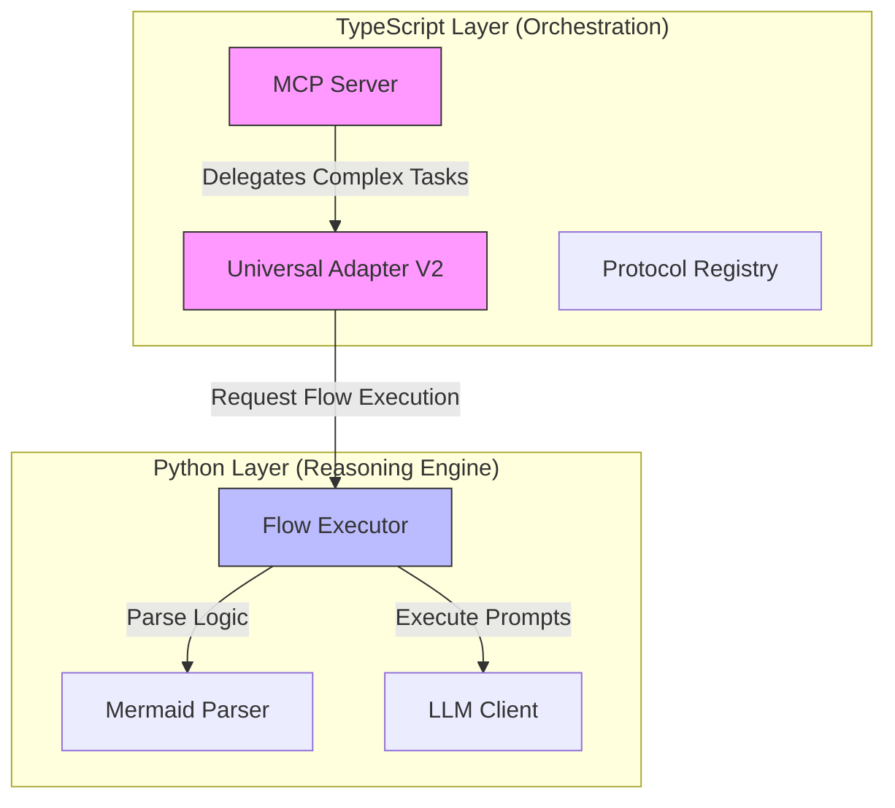

# Code Consolidation & Integration Report

**Date**: 2026-01-16
**Status**: In Progress
**Focus**: Adapter Refactoring & OpenHands Tool Integration

## 1. Legacy Code Cleanup

### Actions Taken
We have successfully audited the `src/adapters` directory and removed the following legacy files which were superseded by the `UniversalAdapterV2` architecture:

*   `src/adapters/base-adapter.ts`
*   `src/adapters/MCPAdapter.ts`
*   `src/adapters/CrewAIAdapter.ts`
*   `src/adapters/ElizaOSAdapter.ts`
*   `src/adapters/MultiAgentAdapter.ts`
*   `src/adapters/OrchestratedAdapter.ts`

### Verification
*   **Static Analysis**: The `src/adapters/index.ts` file correctly exports the new `UniversalAdapterV2` and `unified-adapter` interfaces. The removed files were explicitly marked as "LEGACY ADAPTERS REMOVED" in the index comments.
*   **Architecture Integrity**: The removal of these files enforces the use of the semantic, LLM-driven translation layer (`adapter-v2.ts`) instead of brittle, hand-coded mappings.

## 2. Algorithmic Reasoner Integration (OpenHands Port)

### Component Analysis
The "Algorithmic Reasoner" ported from OpenHands consists of a Python-based Flow Execution Engine located in `src/universal_adapter/`:

1.  **Flow Executor (`flow/executor.py`)**: A robust state machine that executes directed graphs. It supports:
    *   **Loops**: `LOOP` nodes with iteration limits.
    *   **Conditions**: `CONDITION` nodes for branching logic.
    *   **State Management**: Immutable `ExecutionState` for time-travel debugging.
2.  **Mermaid Parser (`flow/parser.py`)**: A parser that compiles Mermaid flowchart syntax directly into executable `FlowGraph` objects. This allows defining agent logic visually.
3.  **LLM Client (`engine/llm_client.py`)**: A provider-agnostic client (OpenAI/Anthropic) for executing prompt nodes.

### Integration Architecture
The integration strategy connects the TypeScript Orchestrator with the Python Reasoning Engine:

### Capabilities
This integration augments the Chrysalis core with:
*   **Visual Logic Definition**: Agents can be defined as Mermaid diagrams.
*   **Cyclic Reasoning**: Unlike the linear TS adapter, the Python engine handles "Think -> Act -> Observe -> Loop" cycles natively.
*   **Resiliency**: The `ExecutionState` model allows pausing, resuming, and retrying workflows.

## 3. Documentation & Modeling

### Reference Models

#### Decision-Making Process
The system uses a **Hybrid Neuro-Symbolic** approach:
1.  **Symbolic**: The `FlowGraph` defines the rigid structure (steps, allowed transitions).
2.  **Neural**: The `LLMClient` makes the fuzzy decisions (branching conditions, content generation) within that structure.

#### Data Flow
1.  **Input**: `UniversalMessage` received by `MCPServer`.
2.  **Routing**: `UniversalAdapterV2` determines if simple translation or complex reasoning is needed.
3.  **Execution**:
    *   *Simple*: `adapter-v2.ts` calls LLM for one-shot translation.
    *   *Complex*: Request forwarded to Python `FlowExecutor` (future work: via MCP/RPC).
4.  **Output**: Result normalized back to `UniversalMessage`.

## 4. Next Steps

1.  **Bridge Implementation**: Create a lightweight RPC mechanism (e.g., a local HTTP server or stdio pipe) to allow the TypeScript `UniversalAdapterV2` to invoke the Python `FlowExecutor`.
2.  **Rust Migration**: As identified in the architectural review, migrate the *validation* and *parsing* logic of the Python engine to Rust for performance, while keeping the execution logic in Python (or moving it to Rust later).
3.  **Unit Testing**: Add tests for the `MermaidParser` to ensure it handles complex subgraphs and edge cases correctly.
