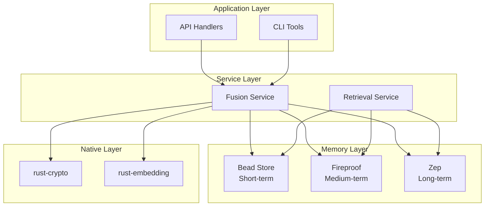

# Documentation Standards and Developer Guidelines

> **Purpose**: Establish consistent documentation practices and developer guidelines for Chrysalis  
> **Audience**: All contributors, maintainers, and reviewers  
> **Status**: Active Standard

---

## Table of Contents

1. [Documentation Philosophy](#1-documentation-philosophy)
2. [Code Documentation Standards](#2-code-documentation-standards)
3. [API Documentation](#3-api-documentation)
4. [Architecture Documentation](#4-architecture-documentation)
5. [Developer Guidelines](#5-developer-guidelines)
6. [Commit and PR Standards](#6-commit-and-pr-standards)
7. [Review Checklist](#7-review-checklist)

---

## 1. Documentation Philosophy

### 1.1 Core Principles

| Principle | Description |
|-----------|-------------|
| **Accuracy over Volume** | Brief, correct documentation beats lengthy outdated docs |
| **Code is Truth** | Documentation supplements code; code is authoritative |
| **Audience Awareness** | Write for the reader: new contributor vs maintainer vs user |
| **Living Documents** | Update docs alongside code changes |
| **Examples over Explanations** | Show, don't just tell |

### 1.2 Documentation Hierarchy

```
┌─────────────────────────────────────────────────────────────────┐
│  Level 1: README.md                                              │
│  - Project overview, quick start, installation                   │
├─────────────────────────────────────────────────────────────────┤
│  Level 2: Architecture Docs (docs/architecture/)                 │
│  - System design, decisions, patterns, standards                 │
├─────────────────────────────────────────────────────────────────┤
│  Level 3: API Docs (docs/openapi/, inline TSDoc/docstrings)      │
│  - Endpoint specs, function signatures, parameters               │
├─────────────────────────────────────────────────────────────────┤
│  Level 4: Code Comments                                          │
│  - Why (not what), non-obvious logic, edge cases                │
└─────────────────────────────────────────────────────────────────┘
```

---

## 2. Code Documentation Standards

### 2.1 TypeScript Documentation (TSDoc)

#### Function Documentation

```typescript
/**
 * Convert an agent from one framework to another.
 * 
 * Performs bidirectional conversion using framework adapters,
 * preserving non-mappable data in encrypted shadow fields.
 * 
 * @param sourceAgent - The agent to convert (must be validated)
 * @param fromAdapter - Adapter for the source framework
 * @param toAdapter - Adapter for the target framework
 * @param options - Optional conversion settings
 * @returns Conversion result including the converted agent and restoration key
 * @throws {ValidationError} When source agent fails validation
 * @throws {ConversionError} When conversion fails
 * 
 * @example
 * ```typescript
 * const result = await converter.convert(
 *   langchainAgent,
 *   langchainAdapter,
 *   autogenAdapter,
 *   { preserveShadow: true }
 * );
 * console.log(result.agent); // AutoGen agent
 * console.log(result.restorationKey); // Save for restoration
 * ```
 * 
 * @see {@link Converter.restore} for restoring agents
 * @see {@link FrameworkAdapter} for adapter interface
 */
async convert<TSource, TTarget>(
  sourceAgent: TSource,
  fromAdapter: FrameworkAdapter<TSource>,
  toAdapter: FrameworkAdapter<TTarget>,
  options?: ConversionOptions
): Promise<ConversionResult<TTarget>>
```

#### Class Documentation

```typescript
/**
 * Manages secure storage and retrieval of API keys.
 * 
 * Uses encrypted storage with automatic key rotation and
 * secure memory handling via the Rust crypto module.
 * 
 * @remarks
 * This class should be instantiated once per application.
 * Keys are automatically encrypted at rest and zeroized
 * from memory after use.
 * 
 * @example
 * ```typescript
 * const wallet = new ApiKeyWallet();
 * await wallet.store('openai', process.env.OPENAI_KEY);
 * const key = await wallet.retrieve('openai');
 * ```
 */
export class ApiKeyWallet {
  // ...
}
```

#### When to Comment Code

```typescript
// ✅ GOOD: Explains WHY, not WHAT
// Use exponential backoff to avoid rate limiting from OpenAI
const delay = Math.pow(2, attempt) * 1000;

// ✅ GOOD: Documents non-obvious behavior
// LangChain agents store metadata in _metadata, not metadata
const metadata = agent._metadata ?? agent.metadata ?? {};

// ✅ GOOD: Explains business logic
// Premium users get 10x the rate limit per our pricing tier
const rateLimit = user.isPremium ? baseLimit * 10 : baseLimit;

// ❌ BAD: States the obvious
// Increment the counter by 1
counter++;

// ❌ BAD: Describes what, not why
// Loop through all items
for (const item of items) {
```

### 2.2 Python Documentation (Docstrings)

#### Function Documentation

```python
def store_embedding(
    self,
    content: str,
    vector: list[float],
    metadata: MemoryMetadata | None = None,
) -> str:
    """Store an embedding vector with associated content.
    
    Stores the embedding in the vector database with optional metadata.
    Automatically generates a unique ID and timestamp.
    
    Args:
        content: The text content that was embedded.
        vector: The embedding vector (must match configured dimensions).
        metadata: Optional metadata including source, confidence, tags.
    
    Returns:
        The generated unique identifier for the stored embedding.
    
    Raises:
        DimensionMismatchError: If vector dimensions don't match configuration.
        StorageError: If database write fails.
    
    Example:
        >>> embedding = model.embed("Hello world")
        >>> doc_id = store.store_embedding(
        ...     content="Hello world",
        ...     vector=embedding,
        ...     metadata=MemoryMetadata(source="user_input")
        ... )
        >>> print(doc_id)
        'mem_abc123'
    
    Note:
        Vector dimensions are validated against the store's configuration.
        Mismatched dimensions will raise an error rather than silently fail.
    """
```

#### Class Documentation

```python
class FusionMemorySystem:
    """Three-tier memory system with intelligent retrieval.
    
    Combines short-term (beads), medium-term (Fireproof), and
    long-term (Zep) storage with automatic tier promotion based
    on access patterns and importance scores.
    
    The system implements the "fusion" pattern where memories are
    retrieved from all tiers and merged with conflict resolution.
    
    Attributes:
        beads: Short-term memory store (SQLite-based).
        fireproof: Durable local cache with CRDT support.
        zep_hook: Connection to remote Zep knowledge graph.
    
    Example:
        >>> memory = FusionMemorySystem(config)
        >>> await memory.store(content="User prefers dark mode", importance=0.8)
        >>> results = await memory.query("user preferences")
        >>> print(results.matches[0].content)
        'User prefers dark mode'
    
    See Also:
        BeadStore: For short-term memory implementation.
        FireproofAdapter: For medium-term storage.
        ZepHook: For long-term knowledge graph.
    """
```

### 2.3 Rust Documentation

```rust
//! Cryptographic primitives for the Chrysalis memory system.
//! 
//! This module provides secure cryptographic operations including:
//! - Symmetric encryption (AES-256-GCM)
//! - Digital signatures (Ed25519)
//! - Key derivation (Scrypt)
//! - Secure memory handling with automatic zeroization
//! 
//! # Security Considerations
//! 
//! All keys are automatically zeroized when dropped. API keys and
//! other secrets should use the [`SecureBuffer`] type to ensure
//! proper memory handling.
//! 
//! # Examples
//! 
//! ```rust
//! use chrysalis_crypto::{encrypt, decrypt, generate_key};
//! 
//! let key = generate_key();
//! let ciphertext = encrypt(b"secret data", &key)?;
//! let plaintext = decrypt(&ciphertext, &key)?;
//! assert_eq!(plaintext, b"secret data");
//! ```

/// Encrypt data using AES-256-GCM authenticated encryption.
/// 
/// Returns the ciphertext with the nonce and auth tag prepended.
/// The caller is responsible for secure key management.
/// 
/// # Arguments
/// 
/// * `plaintext` - Data to encrypt (any length)
/// * `key` - 256-bit encryption key
/// 
/// # Returns
/// 
/// Encrypted data in format: `nonce (12 bytes) || auth_tag (16 bytes) || ciphertext`
/// 
/// # Errors
/// 
/// Returns [`CryptoError::EncryptionFailed`] if encryption fails.
/// 
/// # Example
/// 
/// ```rust
/// let key = [0u8; 32]; // Use generate_key() in production
/// let ciphertext = encrypt(b"hello", &key)?;
/// ```
pub fn encrypt(plaintext: &[u8], key: &[u8; 32]) -> Result<Vec<u8>, CryptoError> {
    // ...
}
```

---

## 3. API Documentation

### 3.1 OpenAPI Specification

All REST APIs must have OpenAPI 3.1 specifications in `docs/openapi/`.

```yaml
# docs/openapi/converter-api.yaml
openapi: "3.1.0"
info:
  title: Chrysalis Converter API
  version: "1.0.0"
  description: |
    API for converting agents between AI frameworks.
    
    ## Authentication
    All endpoints require Bearer token authentication.
    
    ## Rate Limiting
    - Standard tier: 100 requests/hour
    - Premium tier: 1000 requests/hour
    
    ## Error Handling
    All errors follow RFC 7807 Problem Details format.

paths:
  /api/v1/convert:
    post:
      operationId: convertAgent
      summary: Convert agent between frameworks
      description: |
        Converts an agent from one framework format to another.
        Non-mappable fields are preserved in an encrypted shadow.
      tags:
        - conversion
      security:
        - bearerAuth: []
      requestBody:
        required: true
        content:
          application/json:
            schema:
              $ref: "#/components/schemas/ConvertRequest"
            example:
              agent:
                name: "Research Assistant"
                description: "Helps with research tasks"
              fromFramework: "langchain"
              toFramework: "autogen"
      responses:
        "200":
          description: Conversion successful
          content:
            application/json:
              schema:
                $ref: "#/components/schemas/ConvertResponse"
        "400":
          $ref: "#/components/responses/ValidationError"
        "401":
          $ref: "#/components/responses/Unauthorized"
        "429":
          $ref: "#/components/responses/RateLimited"
        "500":
          $ref: "#/components/responses/InternalError"

components:
  schemas:
    ConvertRequest:
      type: object
      required:
        - agent
        - fromFramework
        - toFramework
      properties:
        agent:
          type: object
          description: The agent object in source framework format
        fromFramework:
          type: string
          enum: [langchain, autogen, crewai, custom]
        toFramework:
          type: string
          enum: [langchain, autogen, crewai, custom]
        options:
          $ref: "#/components/schemas/ConversionOptions"
```

### 3.2 Inline API Documentation

For internal TypeScript/Python APIs, use the module's type system with documentation:

```typescript
// src/api/types.ts

/**
 * Request body for agent conversion endpoint.
 * @public
 */
export interface ConvertRequest {
  /** The source agent object in framework-specific format */
  agent: Record<string, unknown>;
  
  /** Source framework identifier */
  fromFramework: SupportedFramework;
  
  /** Target framework identifier */
  toFramework: SupportedFramework;
  
  /** Optional conversion settings */
  options?: ConversionOptions;
}

/**
 * Supported AI agent frameworks.
 * @public
 */
export type SupportedFramework = 'langchain' | 'autogen' | 'crewai' | 'custom';
```

---

## 4. Architecture Documentation

### 4.1 Architecture Decision Records (ADRs)

Major architectural decisions should be documented in `docs/adr/` using this template:

```markdown
# ADR-001: Use Rust for Security-Critical Code

## Status
Accepted

## Context
Security-critical code (cryptography, key management) is currently in TypeScript,
which provides no memory safety guarantees. We need to decide whether to:
1. Keep TypeScript and add runtime checks
2. Migrate to Rust via WASM
3. Use a different approach

## Decision
We will migrate security-critical code to Rust, compiled to WASM for browser
compatibility and PyO3 for Python integration.

## Consequences

### Positive
- Memory safety guarantees at compile time
- Automatic zeroization of secrets via `zeroize` crate
- Performance improvements for crypto operations
- Single implementation shared across TypeScript and Python

### Negative
- Increased build complexity
- Team needs Rust expertise
- WASM has some performance overhead vs native

### Neutral
- Requires new tooling (wasm-pack, maturin)
- CI/CD pipeline changes needed

## References
- [Rust Migration Roadmap](./RUST_MIGRATION_ROADMAP.md)
- [Target Architecture Standards](./TARGET_ARCHITECTURE_STANDARDS.md)
```

### 4.2 System Diagrams

Include diagrams for complex systems using Mermaid or ASCII:

```markdown
## Memory System Architecture


```

---

## 5. Developer Guidelines

### 5.1 Code Style

#### TypeScript Style Guide

```typescript
// ✅ Use explicit return types
function calculateScore(items: Item[]): number {
  return items.reduce((sum, item) => sum + item.value, 0);
}

// ✅ Use early returns to reduce nesting
async function processAgent(agent: Agent): Promise<Result> {
  if (!agent) {
    return { success: false, error: 'No agent provided' };
  }
  
  if (!agent.isValid) {
    return { success: false, error: 'Invalid agent' };
  }
  
  // Happy path continues here
  const result = await transform(agent);
  return { success: true, data: result };
}

// ✅ Use destructuring for cleaner code
function createUser({ name, email, role = 'user' }: UserInput): User {
  return { id: generateId(), name, email, role, createdAt: new Date() };
}

// ✅ Prefer named exports
export { Converter, ConversionResult, ConversionOptions };

// ❌ Avoid default exports (harder to refactor)
export default class Converter { }  // Don't do this
```

#### Python Style Guide

```python
# ✅ Use type hints everywhere
def process_memory(
    content: str,
    importance: float = 0.5,
    *,  # Force keyword arguments after this
    metadata: dict[str, Any] | None = None,
) -> MemoryResult:
    """Process and store a memory entry."""

# ✅ Use dataclasses for data structures
@dataclass(frozen=True)
class MemoryEntry:
    id: str
    content: str
    importance: float
    created_at: datetime = field(default_factory=datetime.utcnow)

# ✅ Use context managers for resources
async with aiofiles.open(path, 'r') as f:
    content = await f.read()

# ✅ Use pathlib for file paths
from pathlib import Path
config_path = Path(__file__).parent / 'config' / 'settings.yaml'
```

### 5.2 Error Handling

```typescript
// ✅ Use custom error types
export class ConversionError extends Error {
  constructor(
    message: string,
    public readonly code: ErrorCode,
    public readonly details?: unknown
  ) {
    super(message);
    this.name = 'ConversionError';
  }
}

// ✅ Handle errors explicitly
async function convert(agent: Agent): Promise<Result<ConvertedAgent, ConversionError>> {
  try {
    const validated = await validate(agent);
    if (!validated.success) {
      return Err(new ConversionError('Validation failed', 'VALIDATION_ERROR', validated.errors));
    }
    
    const converted = await doConversion(validated.data);
    return Ok(converted);
  } catch (error) {
    // Log unexpected errors with context
    logger.error('Conversion failed', { agent, error });
    return Err(new ConversionError(
      'Unexpected conversion failure',
      'INTERNAL_ERROR',
      error instanceof Error ? error.message : String(error)
    ));
  }
}
```

### 5.3 Testing Guidelines

```typescript
// ✅ Descriptive test names
describe('Converter', () => {
  describe('convert', () => {
    it('should convert LangChain agent to AutoGen format', async () => {
      // Arrange
      const source = createLangChainAgent({ name: 'Test' });
      
      // Act
      const result = await converter.convert(source, langchain, autogen);
      
      // Assert
      expect(result.agent.name).toBe('Test');
      expect(result.metadata.from).toBe('langchain');
      expect(result.metadata.to).toBe('autogen');
    });
    
    it('should preserve non-mappable fields in shadow', async () => {
      // ...
    });
    
    it('should throw ValidationError for invalid agent', async () => {
      // ...
    });
  });
});

// ✅ Use test fixtures
const fixtures = {
  validLangChainAgent: {
    name: 'Research Assistant',
    description: 'Helps with research',
    tools: [{ name: 'search', description: 'Web search' }],
  },
  invalidAgent: {
    // Missing required fields
  },
};
```

---

## 6. Commit and PR Standards

### 6.1 Commit Message Format

Use Conventional Commits format:

```
<type>(<scope>): <description>

[optional body]

[optional footer(s)]
```

**Types:**
- `feat`: New feature
- `fix`: Bug fix
- `docs`: Documentation only
- `style`: Formatting, missing semicolons, etc.
- `refactor`: Code change that neither fixes a bug nor adds a feature
- `perf`: Performance improvement
- `test`: Adding or updating tests
- `chore`: Build process, dependencies, etc.

**Examples:**
```
feat(converter): add support for CrewAI framework

Implements the CrewAI adapter with full shadow support.
Includes role, goal, and backstory field mapping.

Closes #123

---

fix(memory): handle null embeddings in fusion query

Previously, null embeddings from failed providers would crash
the fusion query. Now they are filtered out with a warning.

Fixes #456

---

refactor(security): migrate API key storage to Rust

BREAKING CHANGE: ApiKeyWallet constructor now requires async initialization.

Before: const wallet = new ApiKeyWallet();
After:  const wallet = await ApiKeyWallet.create();
```

### 6.2 Pull Request Template

```markdown
## Summary
<!-- Brief description of changes -->

## Type of Change
- [ ] Bug fix (non-breaking)
- [ ] New feature (non-breaking)
- [ ] Breaking change
- [ ] Documentation update
- [ ] Refactoring

## Checklist
- [ ] Code follows style guidelines
- [ ] Self-reviewed
- [ ] Comments added for complex logic
- [ ] Documentation updated
- [ ] Tests added/updated
- [ ] All tests pass locally
- [ ] No new warnings

## Testing
<!-- How was this tested? -->

## Screenshots
<!-- If applicable -->

## Related Issues
<!-- Closes #123, Fixes #456 -->
```

---

## 7. Review Checklist

### For Code Reviews

- [ ] **Correctness**: Does the code do what it claims?
- [ ] **Type Safety**: Are types explicit and correct?
- [ ] **Error Handling**: Are errors handled appropriately?
- [ ] **Testing**: Are there sufficient tests?
- [ ] **Documentation**: Are public APIs documented?
- [ ] **Security**: Are there security implications?
- [ ] **Performance**: Are there performance concerns?
- [ ] **Style**: Does it follow project conventions?

### For Documentation Reviews

- [ ] **Accuracy**: Is the information correct?
- [ ] **Completeness**: Does it cover all use cases?
- [ ] **Clarity**: Is it understandable by the target audience?
- [ ] **Examples**: Are there helpful examples?
- [ ] **Consistency**: Does it follow documentation standards?

---

## Document Index

| Document | Purpose | Location |
|----------|---------|----------|
| Codebase Audit | Technical debt inventory | [`CODEBASE_MODERNIZATION_AUDIT.md`](./CODEBASE_MODERNIZATION_AUDIT.md) |
| Architecture Standards | Type safety & patterns | [`TARGET_ARCHITECTURE_STANDARDS.md`](./TARGET_ARCHITECTURE_STANDARDS.md) |
| Rust Migration | Language migration plan | [`RUST_MIGRATION_ROADMAP.md`](./RUST_MIGRATION_ROADMAP.md) |
| Agent Refactoring | Type-safe agent patterns | [`AGENT_REFACTORING_GUIDE.md`](./AGENT_REFACTORING_GUIDE.md) |
| Quality Enforcement | CI/CD & testing | [`QUALITY_ENFORCEMENT_GUIDE.md`](./QUALITY_ENFORCEMENT_GUIDE.md) |
| Documentation Standards | This document | [`DOCUMENTATION_STANDARDS.md`](./DOCUMENTATION_STANDARDS.md) |

---

*These standards are living documents. Propose updates via pull request with justification.*
