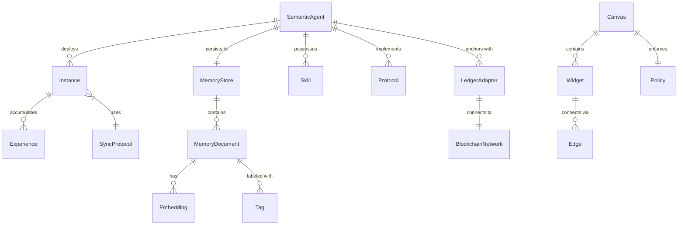
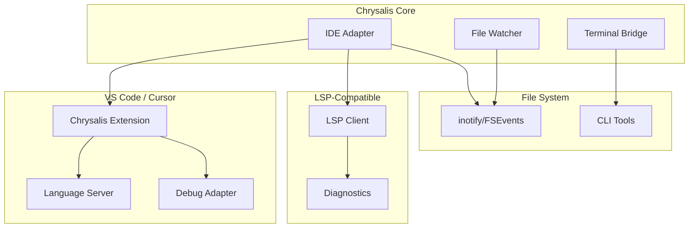
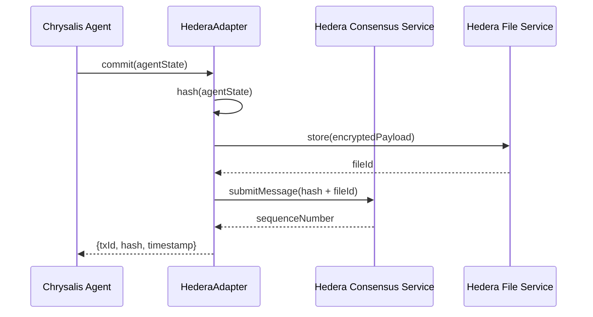
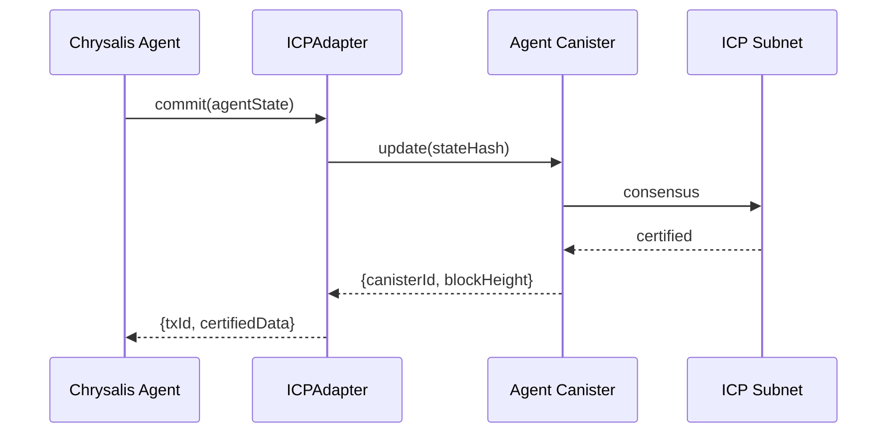
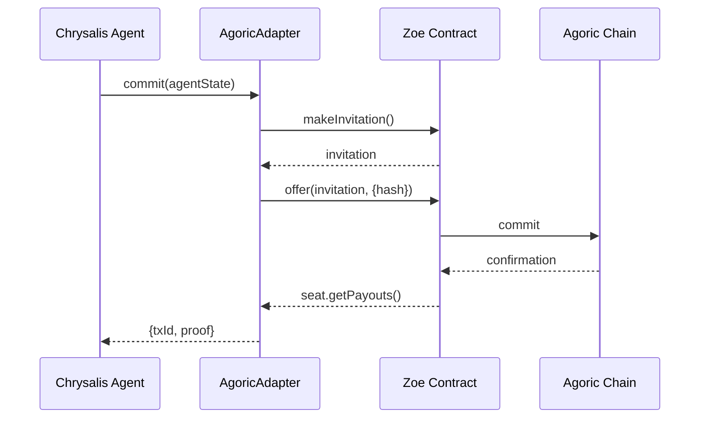
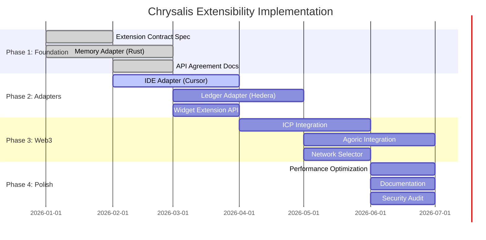

# Chrysalis Extensibility Architecture

## A Unified Framework for Cross-System Interoperability

**Version**: 1.0.0
**Last Updated**: January 2026
**Status**: Technical Specification
**Authors**: Systems Architecture Team

---

## Table of Contents

1. [Executive Summary](#1-executive-summary)
2. [Semantic Knowledge Graph](#2-semantic-knowledge-graph)
3. [Extension Mechanism Analysis](#3-extension-mechanism-analysis)
4. [Unified API Agreement (Code Contract)](#4-unified-api-agreement-code-contract)
5. [Interaction/Expectations Contract](#5-interactionexpectations-contract)
6. [IDE Integration Assessment](#6-ide-integration-assessment)
7. [Three Core Adapters](#7-three-core-adapters)
8. [Web3 Integration Patterns](#8-web3-integration-patterns)
9. [Implementation Strategy](#9-implementation-strategy)

---

## 1. Executive Summary

Chrysalis is designed as a **high-throughput, human-in-the-loop agent interaction platform** that abstracts domain-specific complexities into modular, swappable components. This document formalizes the extensibility principles, defines binding contracts, and specifies the three core adapters that enable robust connections to memory systems, crypto/Web3 infrastructure, and IDE environments.

### Core Architectural Principles

| Principle | Description | Enforcement |
|-----------|-------------|-------------|
| **Fractal Composition** | Patterns recur at all scales (math → library → service → application) | PatternResolver |
| **Adaptive Resolution** | Select implementation based on deployment context | Runtime detection |
| **Contract-First Design** | All extensions implement well-defined interfaces | TypeScript interfaces + JSON Schema |
| **Graceful Degradation** | System remains functional when components fail | CircuitBreaker + fallback chains |
| **Human-in-the-Loop** | Preserve workflow speed; never block user interaction | Async operations + optimistic UI |

### Design Goals

1. **Speed**: Sub-100ms response for all interactive operations
2. **Clarity**: Predictable behavior with explicit contracts
3. **Scalability**: Support 1-10,000 concurrent agent instances
4. **Interoperability**: Seamless Web3 and IDE integration

---

## 2. Semantic Knowledge Graph

### 2.1 Core Component Taxonomy

```mermaid
graph TB
    subgraph CoreEntities["Core Entities"]
        Agent[SemanticAgent]
        Memory[MemorySystem]
        Widget[Widget]
        Canvas[Canvas]
    end

    subgraph AgentComponents["Agent Layer"]
        Identity[Identity<br/>fingerprint: SHA-384<br/>signature: Ed25519]
        Personality[Personality<br/>traits, communication style]
        Capabilities[Capabilities<br/>skills, tools, protocols]
        Instances[Instances<br/>deployed copies]
    end

    subgraph MemoryComponents["Memory Layer"]
        Episodic[Episodic<br/>experiences, events]
        Semantic[Semantic<br/>facts, knowledge]
        Procedural[Procedural<br/>skills, how-to]
        Working[Working<br/>transient context]
    end

    subgraph WidgetComponents["Widget Layer"]
        Renderer[Renderer<br/>React component]
        Schema[Schema<br/>data validation]
        Capabilities[Capabilities<br/>required permissions]
        Events[Events<br/>lifecycle hooks]
    end

    subgraph CanvasComponents["Canvas Layer"]
        Policy[Policy<br/>limits, allowed types]
        Nodes[Nodes<br/>widget instances]
        Edges[Edges<br/>connections]
        Layout[Layout<br/>positioning]
    end

    Agent --> Identity
    Agent --> Personality
    Agent --> Capabilities
    Agent --> Instances
    Agent -.-> Memory

    Memory --> Episodic
    Memory --> Semantic
    Memory --> Procedural
    Memory --> Working

    Widget --> Renderer
    Widget --> Schema
    Widget --> Capabilities
    Widget --> Events

    Canvas --> Policy
    Canvas --> Nodes
    Canvas --> Edges
    Canvas --> Layout
    Canvas -.-> Widget
```



### 2.2 Relationship Ontology



### 2.3 SDLC Integration Points

The knowledge graph maps to software development lifecycle stages:

| SDLC Stage | Chrysalis Component | Integration Point |
|------------|---------------------|-------------------|
| **Requirements** | Agent Personality/Goals | Constraint definition |
| **Design** | Canvas + Widgets | Visual collaboration |
| **Implementation** | Terminal + CodeEditor widgets | IDE adapter |
| **Testing** | System Agents (Lea, Phil) | Automated evaluation |
| **Deployment** | Instances + Sync | Distributed orchestration |
| **Operations** | Memory + Experience Sync | Continuous learning |
| **Security** | Cryptographic Patterns | Identity & audit trail |

---

## 3. Extension Mechanism Analysis

### 3.1 Memory Extension Pattern

**Location**: `memory_system/`
**Language**: Rust + Python (PyO3)

```typescript
// Extension contract for memory providers
interface MemoryProvider {
  // Core operations
  store(doc: MemoryDocument): Promise<string>;
  retrieve(id: string): Promise<MemoryDocument | null>;
  search(query: string, options: SearchOptions): Promise<MemoryDocument[]>;
  delete(id: string): Promise<void>;

  // CRDT operations
  merge(local: MemoryDocument, remote: MemoryDocument): MemoryDocument;

  // Sync operations
  pushPending(): Promise<SyncResult>;
  pullRemote(since?: Date): Promise<MemoryDocument[]>;

  // Health
  health(): Promise<ProviderHealth>;
}
```

**Design Principles**:
- CRDT-first: All operations are conflict-free
- Local-first: Full functionality offline
- Provider-agnostic: Swap backends without code changes

### 3.2 Crypto/Web3 Extension Pattern

**Location**: `src/sync/adapters/`

```typescript
// Extension contract for ledger adapters
interface LedgerAdapter {
  // Write operations
  commit(req: LedgerCommitRequest): Promise<LedgerCommitResponse>;
  keyRotate(req: KeyRotateRequest): Promise<LedgerCommitResponse>;

  // Read operations
  query(ref: QueryRef): Promise<LedgerQueryResponse>;
  verifyProof(proof: MerkleProof): Promise<boolean>;

  // Network info
  getNetworkStatus(): Promise<NetworkStatus>;
  estimateFees(operation: OperationType): Promise<FeeEstimate>;
}

// Supported networks
type SupportedNetwork =
  | 'hedera-mainnet'
  | 'hedera-testnet'
  | 'icp-mainnet'
  | 'icp-local'
  | 'agoric-mainnet'
  | 'agoric-local';
```

**Design Principles**:
- Minimal on-chain footprint (hash + metadata only)
- Off-chain encrypted payload storage
- Network-agnostic interface

### 3.3 Agent Framework Extension Pattern

**Location**: `src/adapters/`

```typescript
// Extension contract for framework adapters
interface FrameworkAdapter {
  // Identity
  readonly frameworkId: ProtocolId;
  readonly frameworkName: string;
  readonly version: SemanticVersion;

  // Translation
  toCanonical(agent: FrameworkAgent): SemanticAgent;
  fromCanonical(agent: SemanticAgent): FrameworkAgent;

  // Validation
  validate(agent: unknown): ValidationResult;
  getSchema(): JsonSchema;

  // Capabilities
  supportedFeatures(): FeatureSet;
}
```

**Design Principles**:
- Lossless morphing via shadow fields
- Schema-driven validation
- Capability negotiation

### 3.4 UI Widget Extension Pattern

**Location**: `src/canvas/widgets/`

```typescript
// Extension contract for widgets
interface WidgetDefinition<TData extends WidgetNodeData> {
  // Identity
  type: string;
  displayName: string;
  category?: string;
  icon?: string;

  // Rendering
  renderer: ComponentType<WidgetProps<TData>>;

  // Validation
  schema?: JsonSchema;
  defaultData?: Partial<TData>;

  // Security
  capabilities: string[];

  // Lifecycle
  onMount?: (context: WidgetContext) => void;
  onUnmount?: (context: WidgetContext) => void;
  onActivate?: (context: WidgetContext) => void;
  onDeactivate?: (context: WidgetContext) => void;
}
```

**Design Principles**:
- Capability-based security
- Schema-validated data
- Lifecycle hooks for resource management

### 3.5 Common Design Patterns Across Extensions

| Pattern | Memory | Crypto | Agent | Widget |
|---------|--------|--------|-------|--------|
| **Interface-first** | ✓ | ✓ | ✓ | ✓ |
| **Schema validation** | JSON Schema | - | JSON Schema | JSON Schema |
| **Async operations** | ✓ | ✓ | ✓ | ✓ |
| **Error boundaries** | CircuitBreaker | Retry + backoff | Validation | Try/catch |
| **Capability model** | R/W/Sync | Commit/Query | Protocol support | Permission list |
| **Versioning** | Semantic | - | Semantic | - |

---

## 4. Unified API Agreement (Code Contract)

### 4.1 Core Contract Principles

All Chrysalis extensions MUST adhere to these contractual obligations:

```typescript
/**
 * CHRYSALIS EXTENSION CONTRACT
 *
 * Every extension implements this meta-interface.
 * Violations result in runtime rejection.
 */
interface ChrysalisExtension {
  // ──────────────────────────────────────────────────────────────
  // IDENTITY (REQUIRED)
  // ──────────────────────────────────────────────────────────────

  /** Unique extension identifier (namespace:name format) */
  readonly extensionId: string;

  /** Semantic version */
  readonly version: SemanticVersion;

  /** Extension category */
  readonly category: ExtensionCategory;

  // ──────────────────────────────────────────────────────────────
  // LIFECYCLE (REQUIRED)
  // ──────────────────────────────────────────────────────────────

  /** Initialize extension with configuration */
  initialize(config: ExtensionConfig): Promise<void>;

  /** Graceful shutdown with cleanup */
  dispose(): Promise<void>;

  /** Health check (must complete in <1s) */
  health(): Promise<HealthStatus>;

  // ──────────────────────────────────────────────────────────────
  // CAPABILITIES (REQUIRED)
  // ──────────────────────────────────────────────────────────────

  /** Declared capabilities this extension provides */
  capabilities(): CapabilitySet;

  /** Required capabilities from other extensions */
  dependencies(): CapabilitySet;

  // ──────────────────────────────────────────────────────────────
  // OBSERVABILITY (REQUIRED)
  // ──────────────────────────────────────────────────────────────

  /** Metrics endpoint */
  metrics(): MetricSet;

  /** Logging configuration */
  logConfig(): LogConfig;
}

type ExtensionCategory =
  | 'memory'      // Memory providers
  | 'ledger'      // Blockchain/DLT adapters
  | 'framework'   // Agent framework adapters
  | 'widget'      // UI widgets
  | 'protocol'    // Communication protocols
  | 'embedding'   // Vector embedding providers
  | 'llm';        // LLM providers
```

### 4.2 Memory Adapter Contract

```typescript
/**
 * MEMORY ADAPTER CONTRACT
 *
 * Extends ChrysalisExtension for memory system integration.
 * All operations MUST be idempotent and conflict-free.
 */
interface MemoryAdapterContract extends ChrysalisExtension {
  readonly category: 'memory';

  // ──────────────────────────────────────────────────────────────
  // STORAGE OPERATIONS
  // ──────────────────────────────────────────────────────────────

  /**
   * Store a memory document.
   *
   * CONTRACT:
   * - MUST assign ID if not provided
   * - MUST set sync_status to PENDING
   * - MUST perform CRDT merge if document exists
   * - MUST complete in <10ms for local storage
   */
  put(doc: MemoryDocument): Promise<string>;

  /**
   * Retrieve a memory document by ID.
   *
   * CONTRACT:
   * - MUST return null if not found (not throw)
   * - MUST complete in <5ms for local storage
   */
  get(id: string): Promise<MemoryDocument | null>;

  /**
   * Delete a memory document.
   *
   * CONTRACT:
   * - For CRDT systems: MUST use tombstone, not physical delete
   * - MUST be idempotent (no error if already deleted)
   */
  delete(id: string): Promise<void>;

  // ──────────────────────────────────────────────────────────────
  // SEARCH OPERATIONS
  // ──────────────────────────────────────────────────────────────

  /**
   * Semantic search using embeddings.
   *
   * CONTRACT:
   * - MUST support vector similarity search
   * - MUST respect limit parameter
   * - MUST return results sorted by relevance (descending)
   */
  search(query: string, options: SearchOptions): Promise<SearchResult[]>;

  // ──────────────────────────────────────────────────────────────
  // SYNC OPERATIONS
  // ──────────────────────────────────────────────────────────────

  /**
   * Push pending changes to sync target.
   *
   * CONTRACT:
   * - MUST be non-blocking (async)
   * - MUST update sync_status on success
   * - MUST NOT lose data on failure (retry later)
   */
  sync(): Promise<SyncResult>;

  /**
   * CRDT merge operation.
   *
   * CONTRACT:
   * - MUST be commutative: merge(A,B) = merge(B,A)
   * - MUST be associative: merge(merge(A,B),C) = merge(A,merge(B,C))
   * - MUST be idempotent: merge(A,A) = A
   */
  merge(local: MemoryDocument, remote: MemoryDocument): MemoryDocument;
}
```

### 4.3 Ledger Adapter Contract

```typescript
/**
 * LEDGER ADAPTER CONTRACT
 *
 * Extends ChrysalisExtension for blockchain/DLT integration.
 * All write operations are atomic and auditable.
 */
interface LedgerAdapterContract extends ChrysalisExtension {
  readonly category: 'ledger';
  readonly network: SupportedNetwork;

  // ──────────────────────────────────────────────────────────────
  // WRITE OPERATIONS
  // ──────────────────────────────────────────────────────────────

  /**
   * Commit a hash to the ledger.
   *
   * CONTRACT:
   * - MUST NOT include sensitive data in on-chain payload
   * - MUST return transaction ID on success
   * - MUST throw on insufficient funds
   * - SHOULD support payload URI for off-chain data
   */
  commit(req: LedgerCommitRequest): Promise<LedgerCommitResponse>;

  /**
   * Rotate cryptographic keys.
   *
   * CONTRACT:
   * - MUST create verifiable chain of key custody
   * - MUST invalidate old key after rotation
   */
  keyRotate(req: KeyRotateRequest): Promise<LedgerCommitResponse>;

  // ──────────────────────────────────────────────────────────────
  // READ OPERATIONS
  // ──────────────────────────────────────────────────────────────

  /**
   * Query ledger state.
   *
   * CONTRACT:
   * - MUST support query by txId OR hash
   * - MUST return status (pending/confirmed/failed)
   * - MUST include block number if confirmed
   */
  query(ref: QueryRef): Promise<LedgerQueryResponse>;

  /**
   * Verify Merkle proof.
   *
   * CONTRACT:
   * - MUST cryptographically verify inclusion
   * - MUST NOT require network call for verification
   */
  verifyProof(proof: MerkleProof): Promise<boolean>;

  // ──────────────────────────────────────────────────────────────
  // NETWORK OPERATIONS
  // ──────────────────────────────────────────────────────────────

  /**
   * Get network status.
   *
   * CONTRACT:
   * - MUST cache results (TTL: 30s)
   * - MUST NOT block on network failure
   */
  getNetworkStatus(): Promise<NetworkStatus>;

  /**
   * Estimate transaction fees.
   *
   * CONTRACT:
   * - MUST return estimate in native token
   * - SHOULD include USD equivalent
   */
  estimateFees(operation: OperationType): Promise<FeeEstimate>;
}
```

### 4.4 IDE Adapter Contract

```typescript
/**
 * IDE ADAPTER CONTRACT
 *
 * Extends ChrysalisExtension for IDE integration.
 * Enables high-throughput human-agent code collaboration.
 */
interface IDEAdapterContract extends ChrysalisExtension {
  readonly category: 'ide';
  readonly ideName: string;

  // ──────────────────────────────────────────────────────────────
  // FILE OPERATIONS
  // ──────────────────────────────────────────────────────────────

  /**
   * Read file contents.
   *
   * CONTRACT:
   * - MUST support line range queries
   * - MUST return null for non-existent files (not throw)
   * - SHOULD cache recently accessed files
   */
  readFile(path: string, options?: ReadOptions): Promise<FileContent | null>;

  /**
   * Write file contents.
   *
   * CONTRACT:
   * - MUST support atomic writes
   * - MUST preserve file permissions
   * - SHOULD trigger IDE refresh
   */
  writeFile(path: string, content: string): Promise<void>;

  /**
   * Apply diff/patch.
   *
   * CONTRACT:
   * - MUST support unified diff format
   * - MUST validate patch applicability before applying
   * - MUST be atomic (all or nothing)
   */
  applyPatch(path: string, patch: string): Promise<PatchResult>;

  // ──────────────────────────────────────────────────────────────
  // CODE INTELLIGENCE
  // ──────────────────────────────────────────────────────────────

  /**
   * Get symbol at position.
   *
   * CONTRACT:
   * - MUST return null if no symbol at position
   * - SHOULD include type information if available
   */
  getSymbolAt(path: string, position: Position): Promise<SymbolInfo | null>;

  /**
   * Find references.
   *
   * CONTRACT:
   * - MUST support workspace-wide search
   * - SHOULD respect .gitignore patterns
   */
  findReferences(symbol: string): Promise<Reference[]>;

  /**
   * Get diagnostics (errors, warnings).
   *
   * CONTRACT:
   * - MUST return all diagnostics for file
   * - SHOULD include quick-fix suggestions
   */
  getDiagnostics(path: string): Promise<Diagnostic[]>;

  // ──────────────────────────────────────────────────────────────
  // TERMINAL INTEGRATION
  // ──────────────────────────────────────────────────────────────

  /**
   * Execute command in terminal.
   *
   * CONTRACT:
   * - MUST support async execution
   * - MUST stream output in real-time
   * - MUST support cancellation
   */
  executeCommand(command: string, options?: ExecOptions): Promise<ExecResult>;

  /**
   * Get terminal state.
   *
   * CONTRACT:
   * - MUST include current working directory
   * - SHOULD include recent command history
   */
  getTerminalState(terminalId: string): Promise<TerminalState>;
}
```

---

## 5. Interaction/Expectations Contract

### 5.1 UI Behavior Guarantees

```typescript
/**
 * UI INTERACTION CONTRACT
 *
 * Defines performance and behavior expectations for user interactions.
 * All times are maximums; implementations SHOULD be faster.
 */
interface UIInteractionContract {
  // ──────────────────────────────────────────────────────────────
  // RESPONSE TIME GUARANTEES
  // ──────────────────────────────────────────────────────────────

  latencyBudgets: {
    /** User input → visual feedback */
    inputFeedback: '16ms';   // 60fps

    /** Click → action initiation */
    clickResponse: '50ms';

    /** Navigation → content visible */
    navigation: '100ms';

    /** Search → first results */
    searchResults: '200ms';

    /** LLM request → streaming start */
    llmStreaming: '500ms';

    /** Full page load */
    pageLoad: '1000ms';
  };

  // ──────────────────────────────────────────────────────────────
  // LOADING STATE REQUIREMENTS
  // ──────────────────────────────────────────────────────────────

  loadingStates: {
    /** Show spinner after this delay (avoid flash) */
    spinnerDelay: '100ms';

    /** Show skeleton after this delay */
    skeletonDelay: '200ms';

    /** Show error state after this timeout */
    errorTimeout: '10000ms';

    /** Auto-retry interval */
    retryInterval: '3000ms';
  };

  // ──────────────────────────────────────────────────────────────
  // OPTIMISTIC UI RULES
  // ──────────────────────────────────────────────────────────────

  optimisticBehavior: {
    /** Apply changes immediately before server confirmation */
    immediateApply: true;

    /** Rollback on server error */
    rollbackOnError: true;

    /** Show pending indicator for unconfirmed changes */
    pendingIndicator: true;

    /** Maximum time to wait for confirmation */
    confirmationTimeout: '5000ms';
  };

  // ──────────────────────────────────────────────────────────────
  // ACCESSIBILITY REQUIREMENTS
  // ──────────────────────────────────────────────────────────────

  accessibility: {
    /** All interactive elements must be keyboard accessible */
    keyboardNavigation: true;

    /** Minimum touch target size */
    touchTargetMin: '44px';

    /** Color contrast ratio (WCAG AA) */
    contrastRatio: 4.5;

    /** Support reduced motion preference */
    respectsMotionPreference: true;
  };
}
```

### 5.2 Agent Interaction Expectations

```typescript
/**
 * AGENT INTERACTION CONTRACT
 *
 * Defines how human users interact with AI agents.
 * Prioritizes responsiveness and predictability.
 */
interface AgentInteractionContract {
  // ──────────────────────────────────────────────────────────────
  // COMMUNICATION PATTERNS
  // ──────────────────────────────────────────────────────────────

  communication: {
    /** Agent acknowledges within this time */
    acknowledgment: '500ms';

    /** Agent starts streaming response within this time */
    streamingStart: '1000ms';

    /** Maximum silence before heartbeat */
    heartbeatInterval: '5000ms';

    /** User can interrupt agent at any time */
    interruptible: true;

    /** Agent explains interruption handling */
    interruptionFeedback: true;
  };

  // ──────────────────────────────────────────────────────────────
  // TRANSPARENCY REQUIREMENTS
  // ──────────────────────────────────────────────────────────────

  transparency: {
    /** Show reasoning process when requested */
    explainableReasoning: true;

    /** Indicate confidence levels */
    confidenceIndicators: true;

    /** Cite sources for factual claims */
    sourceCitation: true;

    /** Acknowledge uncertainty explicitly */
    uncertaintyDisclosure: true;

    /** Show memory retrieval context */
    memoryContext: true;
  };

  // ──────────────────────────────────────────────────────────────
  // HUMAN-IN-THE-LOOP REQUIREMENTS
  // ──────────────────────────────────────────────────────────────

  humanOversight: {
    /** Require approval for destructive actions */
    destructiveActionApproval: true;

    /** Allow undo for recent actions */
    undoWindow: '30000ms';

    /** Explicit handoff for out-of-scope requests */
    scopeBoundaryHandoff: true;

    /** User can override agent decisions */
    overrideCapability: true;
  };
}
```

### 5.3 Performance SLAs

| Operation | Target p50 | Target p99 | Max Acceptable |
|-----------|-----------|-----------|----------------|
| Widget render | 8ms | 16ms | 50ms |
| Canvas pan/zoom | 8ms | 16ms | 33ms |
| Memory store | 2ms | 10ms | 50ms |
| Memory search | 10ms | 50ms | 200ms |
| Agent message send | 50ms | 200ms | 500ms |
| Ledger commit | 500ms | 2000ms | 5000ms |
| Ledger query | 100ms | 500ms | 1000ms |
| File read (IDE) | 5ms | 20ms | 100ms |
| Command execute | 50ms | 100ms | 500ms (start) |

---

## 6. IDE Integration Assessment

### 6.1 Evaluation Criteria

Chrysalis leverages IDE interaction paradigms without being a full IDE. Integration assessment criteria:

| Criterion | Weight | Description |
|-----------|--------|-------------|
| **API Richness** | 25% | Completeness of file, symbol, and diagnostic APIs |
| **Latency** | 25% | Response times for common operations |
| **Extensibility** | 20% | Plugin/extension architecture |
| **Protocol Support** | 15% | LSP, DAP, MCP support |
| **Community** | 15% | Active development, documentation quality |

### 6.2 IDE Candidate Assessment

| IDE | API Richness | Latency | Extensibility | Protocol | Community | **Score** |
|-----|-------------|---------|---------------|----------|-----------|-----------|
| **VS Code** | 95 | 85 | 95 | 90 | 95 | **92** |
| **Cursor** | 90 | 90 | 85 | 85 | 80 | **86** |
| **Zed** | 75 | 95 | 70 | 80 | 70 | **78** |
| **JetBrains** | 90 | 75 | 90 | 70 | 90 | **83** |
| **Neovim** | 85 | 95 | 90 | 85 | 85 | **88** |

### 6.3 Selected Integration Strategy

**Primary**: VS Code / Cursor (Extension API)
**Secondary**: LSP-compatible editors
**Fallback**: File system watching + CLI



---

## 7. Three Core Adapters

### 7.1 Memory Adapter (Rust + Python)

**Purpose**: High-performance, CRDT-based persistent memory
**Location**: `memory_system/rust_core/`

```python
# memory_system/adapters/memory_adapter.py

from abc import ABC, abstractmethod
from typing import Optional, List, Dict, Any
from dataclasses import dataclass
from enum import Enum

class MemoryType(Enum):
    EPISODIC = "episodic"
    SEMANTIC = "semantic"
    PROCEDURAL = "procedural"
    WORKING = "working"

@dataclass
class MemoryDocument:
    id: str
    content: str
    memory_type: MemoryType
    embedding: Optional[List[float]] = None
    confidence: float = 0.5
    importance: float = 0.5
    tags: List[str] = None
    metadata: Dict[str, Any] = None
    sync_status: str = "local"

class MemoryAdapter(ABC):
    """
    Abstract base for memory adapters.

    Implementations MUST satisfy:
    1. CRDT merge semantics (commutative, associative, idempotent)
    2. Local-first operation (offline capable)
    3. Async-safe (thread-safe for concurrent access)
    """

    @abstractmethod
    async def put(self, doc: MemoryDocument) -> str:
        """Store document, return ID."""
        pass

    @abstractmethod
    async def get(self, id: str) -> Optional[MemoryDocument]:
        """Retrieve document by ID."""
        pass

    @abstractmethod
    async def search(
        self,
        query: str,
        limit: int = 10,
        memory_types: Optional[List[MemoryType]] = None
    ) -> List[MemoryDocument]:
        """Semantic search."""
        pass

    @abstractmethod
    async def sync(self) -> Dict[str, int]:
        """Push pending, pull remote, return counts."""
        pass

    @abstractmethod
    def merge(
        self,
        local: MemoryDocument,
        remote: MemoryDocument
    ) -> MemoryDocument:
        """CRDT merge."""
        pass
```

### 7.2 Crypto/Web3 Adapter

**Purpose**: Blockchain anchoring for agent identity and audit
**Location**: `src/sync/adapters/`

```typescript
// src/adapters/ledger/LedgerAdapter.ts

import { ChrysalisExtension, CapabilitySet } from '../core/extension';

/**
 * Abstract base for ledger adapters.
 *
 * Implementations provide network-specific logic while
 * maintaining a consistent interface for Chrysalis.
 */
export abstract class LedgerAdapter implements ChrysalisExtension {
  readonly category = 'ledger' as const;
  abstract readonly network: SupportedNetwork;
  abstract readonly extensionId: string;
  abstract readonly version: SemanticVersion;

  // ──────────────────────────────────────────────────────────────
  // LIFECYCLE
  // ──────────────────────────────────────────────────────────────

  abstract initialize(config: LedgerConfig): Promise<void>;
  abstract dispose(): Promise<void>;
  abstract health(): Promise<HealthStatus>;

  // ──────────────────────────────────────────────────────────────
  // WRITE OPERATIONS
  // ──────────────────────────────────────────────────────────────

  /**
   * Commit hash to ledger.
   *
   * @param req - Commit request with hash and metadata
   * @returns Transaction ID and confirmation
   */
  abstract commit(req: LedgerCommitRequest): Promise<LedgerCommitResponse>;

  /**
   * Rotate agent keys on ledger.
   *
   * @param req - Key rotation request
   * @returns Transaction ID and confirmation
   */
  abstract keyRotate(req: KeyRotateRequest): Promise<LedgerCommitResponse>;

  // ──────────────────────────────────────────────────────────────
  // READ OPERATIONS
  // ──────────────────────────────────────────────────────────────

  /**
   * Query ledger state.
   */
  abstract query(ref: QueryRef): Promise<LedgerQueryResponse>;

  /**
   * Verify Merkle proof locally.
   */
  abstract verifyProof(proof: MerkleProof): Promise<boolean>;

  // ──────────────────────────────────────────────────────────────
  // NETWORK
  // ──────────────────────────────────────────────────────────────

  abstract getNetworkStatus(): Promise<NetworkStatus>;
  abstract estimateFees(operation: OperationType): Promise<FeeEstimate>;

  // ──────────────────────────────────────────────────────────────
  // CAPABILITIES
  // ──────────────────────────────────────────────────────────────

  capabilities(): CapabilitySet {
    return new Set([
      'ledger:commit',
      'ledger:query',
      'ledger:keyRotate',
      'ledger:verifyProof',
    ]);
  }

  dependencies(): CapabilitySet {
    return new Set(['crypto:hash', 'crypto:sign']);
  }
}

// ──────────────────────────────────────────────────────────────
// NETWORK-SPECIFIC IMPLEMENTATIONS
// ──────────────────────────────────────────────────────────────

export class HederaAdapter extends LedgerAdapter {
  readonly network = 'hedera-mainnet' as const;
  readonly extensionId = 'chrysalis:ledger:hedera';
  readonly version = { major: 1, minor: 0, patch: 0 };
  // ... implementation
}

export class ICPAdapter extends LedgerAdapter {
  readonly network = 'icp-mainnet' as const;
  readonly extensionId = 'chrysalis:ledger:icp';
  readonly version = { major: 1, minor: 0, patch: 0 };
  // ... implementation
}

export class AgoricAdapter extends LedgerAdapter {
  readonly network = 'agoric-mainnet' as const;
  readonly extensionId = 'chrysalis:ledger:agoric';
  readonly version = { major: 1, minor: 0, patch: 0 };
  // ... implementation
}
```

### 7.3 IDE Adapter

**Purpose**: High-throughput code collaboration
**Location**: `src/adapters/ide/`

```typescript
// src/adapters/ide/IDEAdapter.ts

import { ChrysalisExtension, CapabilitySet } from '../core/extension';

/**
 * Abstract base for IDE adapters.
 *
 * Enables Chrysalis agents to interact with code editing
 * environments without becoming a full IDE.
 */
export abstract class IDEAdapter implements ChrysalisExtension {
  readonly category = 'ide' as const;
  abstract readonly ideName: string;
  abstract readonly extensionId: string;
  abstract readonly version: SemanticVersion;

  // ──────────────────────────────────────────────────────────────
  // FILE OPERATIONS
  // ──────────────────────────────────────────────────────────────

  abstract readFile(path: string, options?: ReadOptions): Promise<FileContent | null>;
  abstract writeFile(path: string, content: string): Promise<void>;
  abstract applyPatch(path: string, patch: string): Promise<PatchResult>;
  abstract listDirectory(path: string): Promise<DirectoryEntry[]>;

  // ──────────────────────────────────────────────────────────────
  // CODE INTELLIGENCE
  // ──────────────────────────────────────────────────────────────

  abstract getSymbolAt(path: string, position: Position): Promise<SymbolInfo | null>;
  abstract findReferences(symbol: string): Promise<Reference[]>;
  abstract findDefinition(path: string, position: Position): Promise<Location | null>;
  abstract getDiagnostics(path: string): Promise<Diagnostic[]>;
  abstract getCompletions(path: string, position: Position): Promise<Completion[]>;

  // ──────────────────────────────────────────────────────────────
  // TERMINAL
  // ──────────────────────────────────────────────────────────────

  abstract executeCommand(command: string, options?: ExecOptions): Promise<ExecResult>;
  abstract getTerminalState(terminalId?: string): Promise<TerminalState>;
  abstract sendInput(terminalId: string, input: string): Promise<void>;

  // ──────────────────────────────────────────────────────────────
  // WORKSPACE
  // ──────────────────────────────────────────────────────────────

  abstract getWorkspaceRoot(): Promise<string>;
  abstract getOpenFiles(): Promise<string[]>;
  abstract openFile(path: string, options?: OpenOptions): Promise<void>;

  // ──────────────────────────────────────────────────────────────
  // CAPABILITIES
  // ──────────────────────────────────────────────────────────────

  capabilities(): CapabilitySet {
    return new Set([
      'file:read',
      'file:write',
      'file:list',
      'code:symbol',
      'code:references',
      'code:diagnostics',
      'terminal:execute',
      'terminal:state',
      'workspace:info',
    ]);
  }
}

// ──────────────────────────────────────────────────────────────
// IMPLEMENTATIONS
// ──────────────────────────────────────────────────────────────

export class CursorIDEAdapter extends IDEAdapter {
  readonly ideName = 'Cursor';
  readonly extensionId = 'chrysalis:ide:cursor';
  readonly version = { major: 1, minor: 0, patch: 0 };

  // Uses Cursor's built-in tool APIs
  // ...
}

export class VSCodeIDEAdapter extends IDEAdapter {
  readonly ideName = 'VS Code';
  readonly extensionId = 'chrysalis:ide:vscode';
  readonly version = { major: 1, minor: 0, patch: 0 };

  // Uses VS Code Extension API
  // ...
}

export class LSPIDEAdapter extends IDEAdapter {
  readonly ideName = 'LSP Generic';
  readonly extensionId = 'chrysalis:ide:lsp';
  readonly version = { major: 1, minor: 0, patch: 0 };

  // Uses Language Server Protocol for any LSP-compatible editor
  // ...
}
```

---

## 8. Web3 Integration Patterns

### 8.1 Hedera Integration



### 8.2 ICP Integration



### 8.3 Agoric Integration



### 8.4 Network Selection Strategy

```typescript
interface NetworkSelector {
  /**
   * Select optimal network based on requirements.
   */
  selectNetwork(requirements: NetworkRequirements): SupportedNetwork;
}

interface NetworkRequirements {
  /** Maximum acceptable transaction latency */
  maxLatency: 'fast' | 'medium' | 'slow';  // <5s, <30s, <60s

  /** Cost sensitivity */
  costSensitivity: 'low' | 'medium' | 'high';

  /** Required features */
  features: NetworkFeature[];

  /** Preferred networks (in order) */
  preferences?: SupportedNetwork[];
}

type NetworkFeature =
  | 'smart-contracts'
  | 'file-storage'
  | 'consensus-timestamps'
  | 'token-transfers'
  | 'nft-support';

// Decision matrix
const NETWORK_CAPABILITIES: Record<SupportedNetwork, NetworkProfile> = {
  'hedera-mainnet': {
    latency: 'fast',        // ~3-5s finality
    cost: 'low',            // ~$0.0001 per tx
    features: ['consensus-timestamps', 'file-storage', 'token-transfers', 'nft-support'],
  },
  'icp-mainnet': {
    latency: 'fast',        // ~2s finality
    cost: 'medium',         // Variable cycles
    features: ['smart-contracts', 'file-storage', 'token-transfers'],
  },
  'agoric-mainnet': {
    latency: 'medium',      // ~6s finality
    cost: 'medium',         // Variable IST
    features: ['smart-contracts', 'token-transfers', 'nft-support'],
  },
};
```

---

## 9. Implementation Strategy

### 9.1 Phased Rollout



### 9.2 Success Metrics

| Metric | Target | Measurement |
|--------|--------|-------------|
| Extension load time | <100ms | Automated benchmark |
| Memory operation latency | <10ms p99 | Prometheus metrics |
| Ledger commit success rate | >99.5% | Error tracking |
| IDE command latency | <50ms p50 | User telemetry |
| Widget render time | <16ms | React Profiler |
| Contract compliance | 100% | Automated tests |

### 9.3 Risk Mitigation

| Risk | Probability | Impact | Mitigation |
|------|-------------|--------|------------|
| Web3 API instability | Medium | High | Multi-network fallback |
| IDE API changes | Medium | Medium | Abstraction layer |
| CRDT merge conflicts | Low | High | Comprehensive test suite |
| Performance regression | Medium | High | Continuous benchmarking |
| Security vulnerabilities | Low | Critical | Regular audits |

---

## Appendix A: Type Definitions

```typescript
// Full type definitions available in:
// - src/adapters/core/extension.ts
// - src/adapters/ledger/types.ts
// - src/adapters/ide/types.ts
// - memory_system/rust_core/src/memory.rs
```

## Appendix B: References

### Academic
- Shapiro, M., et al. (2011). "Conflict-free Replicated Data Types." HAL INRIA.
- Lamport, L. (1978). "Time, Clocks, and the Ordering of Events."
- Gamma, E., et al. (1994). "Design Patterns: Elements of Reusable Object-Oriented Software."

### Standards
- JSON Schema: https://json-schema.org/
- OpenAPI: https://spec.openapis.org/oas/latest.html
- Language Server Protocol: https://microsoft.github.io/language-server-protocol/

### Web3
- Hedera: https://docs.hedera.com/
- Internet Computer: https://internetcomputer.org/docs/
- Agoric: https://docs.agoric.com/

---

**Document Version History**

| Version | Date | Changes |
|---------|------|---------|
| 1.0.0 | Jan 2026 | Initial specification |
