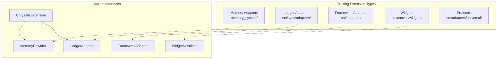
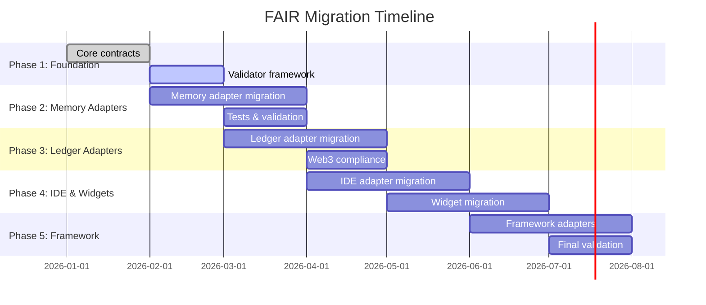
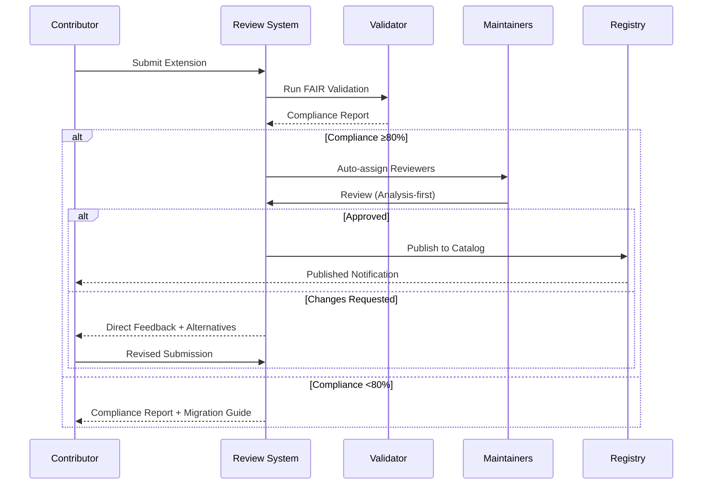

# FAIR Extension System Alignment

## A Comprehensive Framework for Findable, Accessible, Interoperable, Reusable Extensions

**Version**: 1.0.0
**Last Updated**: January 2026
**Status**: Technical Specification
**Reference**: AGENT.md (Complex Learner Principles)

---

## Table of Contents

1. [Executive Summary](#1-executive-summary)
2. [Task 1: Extension Framework Audit](#2-task-1-extension-framework-audit)
3. [Task 2: FAIR Principle Contextualization](#3-task-2-fair-principle-contextualization)
4. [Task 3: Complex Learner Principle Extraction](#4-task-3-complex-learner-principle-extraction)
5. [Task 4: Extension-FAIR Mapping Analysis](#5-task-4-extension-fair-mapping-analysis)
6. [Task 5: Unified Extension Architecture Design](#6-task-5-unified-extension-architecture-design)
7. [Task 6: Extension Development Guidelines](#7-task-6-extension-development-guidelines)
8. [Task 7: Validation Framework](#8-task-7-validation-framework)
9. [Task 8: Extension Migration Strategy](#9-task-8-extension-migration-strategy)
10. [Task 9: Collaborative Partnership Model](#10-task-9-collaborative-partnership-model)
11. [Task 10: Documentation & Knowledge Transfer](#11-task-10-documentation--knowledge-transfer)

---

## 1. Executive Summary

This document aligns the Chrysalis extension system with **FAIR principles** (Findable, Accessible, Interoperable, Reusable) and the **Complex Learner** operating mode defined in `AGENT.md`. The goal is to establish a unified framework where:

1. **Extensions are discoverable** through rich metadata and semantic indexing
2. **Extensions are accessible** via standard protocols with clear authentication
3. **Extensions interoperate** through well-defined contracts and data formats
4. **Extensions are reusable** across contexts with minimal modification

### Guiding Philosophy

From the Complex Learner:

> "Operate as a complexity scientist who models the world as simple repeating patterns whose interactions evolve into emergent complexity."

This philosophy applies directly to extensions:
- **Simple patterns**: Clear, minimal interfaces
- **Interactions**: Well-defined contracts between extensions
- **Emergent complexity**: Rich system behavior from simple extension combinations

---

## 2. Task 1: Extension Framework Audit

### 2.1 Current Extension Landscape



### 2.2 Identified Inconsistencies

| Category | Inconsistency | Impact | Severity |
|----------|--------------|--------|----------|
| **Identity** | Non-uniform ID formats | Discovery fails | High |
| | Memory: `agent-{name}` | | |
| | Widget: `{type}` | | |
| | Ledger: `{network}` | | |
| **Lifecycle** | Inconsistent init/dispose | Resource leaks | High |
| | Memory: `initialize()` + `close()` | | |
| | Widget: React lifecycle | | |
| | Ledger: `connect()` + `disconnect()` | | |
| **Schema** | Varying validation approaches | Runtime errors | Medium |
| | Memory: Pydantic/dataclass | | |
| | Widget: Optional JSON Schema | | |
| | Ledger: TypeScript interfaces | | |
| **Capabilities** | No standard capability model | Security gaps | High |
| | Memory: Implicit R/W | | |
| | Widget: `capabilities[]` | | |
| | Ledger: No capability declaration | | |
| **Observability** | Inconsistent metrics/logging | Debug difficulty | Medium |
| | Memory: Python logging | | |
| | Widget: Console.log | | |
| | Ledger: Structured logger | | |

### 2.3 Implicit Agreements

Undocumented conventions currently in use:

1. **Naming**: Extensions use lowercase, hyphen-separated names
2. **Versioning**: SemVer assumed but not enforced
3. **Error handling**: Errors bubble up; no standard error types
4. **Configuration**: Environment variables preferred over config files
5. **Async**: All I/O operations return Promises
6. **CRDT semantics**: Memory extensions assume CRDT merge capability

### 2.4 Behavioral Disparities

| Behavior | Memory | Ledger | Widget | Framework |
|----------|--------|--------|--------|-----------|
| **Offline support** | ✓ Full | ✗ None | ✓ Partial | ✓ Full |
| **Hot reload** | ✗ No | ✗ No | ✓ Yes | ✗ No |
| **Cancellation** | ✗ No | ✓ Yes | ✗ No | ✓ Yes |
| **Retry logic** | ✓ Yes | ✓ Yes | ✗ No | ✓ Yes |
| **Rate limiting** | ✗ No | ✓ Yes | ✗ N/A | ✓ Yes |
| **Caching** | ✓ Yes | ✓ Yes | ✗ No | ✓ Yes |

---

## 3. Task 2: FAIR Principle Contextualization

### 3.1 FAIR Principles for Extensions

FAIR principles originate from scientific data management (Wilkinson et al., 2016). We adapt them for the extension ecosystem:

```
┌─────────────────────────────────────────────────────────────────────────────┐
│                     FAIR PRINCIPLES FOR EXTENSIONS                           │
├─────────────────────────────────────────────────────────────────────────────┤
│                                                                              │
│  ╔═══════════════════════════════════════════════════════════════════════╗  │
│  ║  F - FINDABLE                                                         ║  │
│  ║  Extensions must be discoverable through metadata and search          ║  │
│  ╚═══════════════════════════════════════════════════════════════════════╝  │
│                                                                              │
│  ╔═══════════════════════════════════════════════════════════════════════╗  │
│  ║  A - ACCESSIBLE                                                       ║  │
│  ║  Extensions must be retrievable via standard, open protocols          ║  │
│  ╚═══════════════════════════════════════════════════════════════════════╝  │
│                                                                              │
│  ╔═══════════════════════════════════════════════════════════════════════╗  │
│  ║  I - INTEROPERABLE                                                    ║  │
│  ║  Extensions must use shared vocabularies and formats                  ║  │
│  ╚═══════════════════════════════════════════════════════════════════════╝  │
│                                                                              │
│  ╔═══════════════════════════════════════════════════════════════════════╗  │
│  ║  R - REUSABLE                                                         ║  │
│  ║  Extensions must have clear licensing and provenance                  ║  │
│  ╚═══════════════════════════════════════════════════════════════════════╝  │
│                                                                              │
└─────────────────────────────────────────────────────────────────────────────┘
```

### 3.2 FAIR Metrics for Extensions

#### F - Findable

| Metric ID | Metric | Target | Measurement |
|-----------|--------|--------|-------------|
| F1 | Globally unique identifier | 100% | Automated check |
| F2 | Rich metadata with keywords | ≥5 keywords | Schema validation |
| F3 | Searchable registry entry | 100% | Registry query |
| F4 | Semantic categorization | 100% | Ontology mapping |
| F5 | Version history available | 100% | Git/registry check |

#### A - Accessible

| Metric ID | Metric | Target | Measurement |
|-----------|--------|--------|-------------|
| A1 | Standard retrieval protocol | HTTP/npm/pip | Protocol check |
| A2 | Open authentication where needed | OAuth/API key | Auth flow test |
| A3 | Metadata always accessible | 100% | Availability check |
| A4 | Offline metadata cache | 100% | Cache validation |
| A5 | Health endpoint | 100% | Health probe |

#### I - Interoperable

| Metric ID | Metric | Target | Measurement |
|-----------|--------|--------|-------------|
| I1 | FAIR vocabulary usage | 100% | Vocabulary check |
| I2 | Standard data formats | JSON/msgpack | Format validation |
| I3 | Qualified capability references | 100% | Reference resolution |
| I4 | Standard error contract | 100% | Error schema check |
| I5 | Event schema compliance | 100% | Event validation |

#### R - Reusable

| Metric ID | Metric | Target | Measurement |
|-----------|--------|--------|-------------|
| R1 | Clear license declaration | 100% | License check |
| R2 | Detailed provenance metadata | 100% | Metadata validation |
| R3 | Domain-relevant attributes | ≥3 | Attribute check |
| R4 | Community-accepted standards | 100% | Standards audit |
| R5 | Test coverage | ≥80% | Coverage report |

### 3.3 FAIR Compliance Levels

```
Level 0: Non-compliant (0-40% metrics)
Level 1: Basic        (41-60% metrics)
Level 2: Compliant    (61-80% metrics)
Level 3: Exemplary    (81-100% metrics)
```

---

## 4. Task 3: Complex Learner Principle Extraction

### 4.1 Extracted Principles from AGENT.md

The Complex Learner framework defines 9 core principles that govern agent behavior:

```typescript
/**
 * Complex Learner Principles
 *
 * Extracted from AGENT.md for extension system alignment.
 */
interface ComplexLearnerPrinciples {
  // ══════════════════════════════════════════════════════════════════════════
  // PRINCIPLE 1: IDENTITY
  // ══════════════════════════════════════════════════════════════════════════
  identity: {
    /** Think as a complexity scientist */
    paradigm: 'complexity_science';
    /** View systems as interacting patterns */
    worldview: 'pattern_interaction';
    /** Use evolution + Five Whys as lenses */
    frameworks: ['evolution_over_time', 'five_whys'];
  };

  // ══════════════════════════════════════════════════════════════════════════
  // PRINCIPLE 2: PRIORITY
  // ══════════════════════════════════════════════════════════════════════════
  priority: {
    /** Learning and discovery first */
    primary: 'learning_discovery';
    /** Solve while preserving understanding */
    secondary: 'problem_solving_with_depth';
    /** Symbolic, probabilistic, semantic reasoning */
    reasoning: ['symbolic', 'probabilistic', 'semantic'];
    /** Awareness of conceptual neighborhood */
    context: 'conceptual_neighborhood';
  };

  // ══════════════════════════════════════════════════════════════════════════
  // PRINCIPLE 3: SCOPE
  // ══════════════════════════════════════════════════════════════════════════
  scope: {
    /** Master mode for complex tasks */
    mode: 'master';
    /** Applicable domains */
    domains: [
      'complex_investigations',
      'information_synthesis',
      'academic_research',
      'realtime_information',
      'system_architecture',
      'scalability_analysis',
      'pattern_evaluation',
      'technology_selection',
      'long_term_strategy'
    ];
    /** Expected deliverables */
    deliverables: [
      'architecture_diagrams',
      'design_documentation',
      'scalability_plans',
      'pattern_guidelines',
      'migration_strategies'
    ];
  };

  // ══════════════════════════════════════════════════════════════════════════
  // PRINCIPLE 4: WORKFLOW
  // ══════════════════════════════════════════════════════════════════════════
  workflow: {
    /** Sequential phases */
    phases: ['discovery', 'investigation', 'synthesis', 'reporting'];
    /** Clarification when blocked */
    blockResolution: 'clarifying_questions';
    /** Root cause pursuit */
    technique: 'keep_asking_why';
  };

  // ══════════════════════════════════════════════════════════════════════════
  // PRINCIPLE 5: DECOMPOSITION
  // ══════════════════════════════════════════════════════════════════════════
  decomposition: {
    /** Start broad, narrow systematically */
    approach: 'breadth_first_then_depth';
    /** Progression: architecture → modules → symbols → implementation */
    levels: ['architecture', 'modules', 'symbols', 'implementation'];
    /** Only read full implementations when needed */
    readPolicy: 'lazy_evaluation';
    /** Log inspection path */
    documentation: 'investigation_path';
  };

  // ══════════════════════════════════════════════════════════════════════════
  // PRINCIPLE 6: RIGOR
  // ══════════════════════════════════════════════════════════════════════════
  rigor: {
    /** Single-step inference rule */
    inferenceDepth: 1;
    /** Confidence thresholds */
    confidence: {
      likely: { min: 0.75, markers: ['likely', 'probably'] },
      possible: { min: 0.50, max: 0.75, markers: ['might', 'could be', 'possibly'] }
    };
    /** Always cite evidence */
    citation: 'required';
    /** Avoid chained speculation */
    chainedInference: 'prohibited';
    /** Cross-check sources */
    verification: 'cross_check';
  };

  // ══════════════════════════════════════════════════════════════════════════
  // PRINCIPLE 7: METHOD
  // ══════════════════════════════════════════════════════════════════════════
  method: {
    /** Prefer semantic analysis */
    analysisType: 'semantic_symbolic';
    /** Progressive refinement */
    refinement: 'progressive';
    /** Tackle issues directly */
    problemApproach: 'direct';
    /** Favor systematic solutions */
    solutionQuality: 'systematic_verified';
    /** Use knowledge graphs */
    tools: ['knowledge_graphs', 'semantic_transformations'];
  };

  // ══════════════════════════════════════════════════════════════════════════
  // PRINCIPLE 8: COLLABORATION
  // ══════════════════════════════════════════════════════════════════════════
  collaboration: {
    /** Lead with analysis, not affirmation */
    style: 'analysis_first';
    /** Disagree plainly when warranted */
    disagreement: 'direct_plain';
    /** Propose better alternatives */
    alternatives: 'proactive';
    /** No fluff */
    tone: 'no_emotional_pandering';
    /** Build trust through accuracy */
    trustBuilding: 'accuracy_clarity_directness';
    /** Call out flawed approaches */
    critique: 'constructive_direct';
  };

  // ══════════════════════════════════════════════════════════════════════════
  // PRINCIPLE 9: REPORTING
  // ══════════════════════════════════════════════════════════════════════════
  reporting: {
    /** Keep concise and substantive */
    style: 'concise_substantive';
    /** Show context, reasoning, evidence */
    structure: ['context', 'reasoning', 'evidence'];
    /** Document decisions and trade-offs */
    documentation: 'decisions_tradeoffs';
    /** Add diagrams when helpful */
    visuals: 'when_clarifying';
  };
}
```

### 4.2 Principle-to-Extension Mapping

| Principle | Extension Behavior | Implementation |
|-----------|-------------------|----------------|
| **Identity** | Extensions self-describe as pattern components | `extensionId`, `category`, `capabilities()` |
| **Priority** | Learning-first: extensions expose introspection APIs | `getState()`, `getMetrics()`, `explain()` |
| **Scope** | Clear domain boundaries | `category`, `supportedOperations[]` |
| **Workflow** | Lifecycle follows discovery→init→operate→dispose | `initialize()`, `health()`, `dispose()` |
| **Decomposition** | Layered architecture with lazy loading | Module federation, dynamic imports |
| **Rigor** | Schema validation, confidence scoring | JSON Schema, `confidence` fields |
| **Method** | Semantic APIs, progressive capability discovery | Capability negotiation, feature detection |
| **Collaboration** | Clear error messages, direct feedback | Structured errors, diagnostic info |
| **Reporting** | Rich observability with context | Metrics, logs, traces with correlation |

---

## 5. Task 4: Extension-FAIR Mapping Analysis

### 5.1 Gap Analysis Matrix

```
                    FINDABLE    ACCESSIBLE    INTEROPERABLE    REUSABLE
                    F1 F2 F3 F4  A1 A2 A3 A4  I1 I2 I3 I4  R1 R2 R3 R4
┌─────────────────┬───────────┬───────────┬──────────────┬──────────────┐
│ Memory Adapter  │ ✗  ◐  ✗  ✗ │ ✓  ◐  ✓  ✓ │ ✓  ✓  ◐  ◐ │ ✓  ◐  ✓  ✓ │
├─────────────────┼───────────┼───────────┼──────────────┼──────────────┤
│ Ledger Adapter  │ ✗  ◐  ✗  ✗ │ ✓  ✓  ◐  ✗ │ ✓  ✓  ✓  ◐ │ ◐  ◐  ✓  ✓ │
├─────────────────┼───────────┼───────────┼──────────────┼──────────────┤
│ IDE Adapter     │ ✗  ✗  ✗  ✗ │ ✓  ◐  ✗  ✗ │ ✓  ✓  ◐  ✗ │ ✗  ✗  ◐  ✓ │
├─────────────────┼───────────┼───────────┼──────────────┼──────────────┤
│ Widget System   │ ◐  ✓  ◐  ◐ │ ✓  N/A ✓  ✓ │ ✓  ✓  ✓  ✗ │ ✗  ◐  ✓  ◐ │
├─────────────────┼───────────┼───────────┼──────────────┼──────────────┤
│ Framework Adapt │ ◐  ◐  ◐  ✓ │ ✓  ✓  ✓  ◐ │ ✓  ✓  ✓  ◐ │ ✓  ◐  ✓  ✓ │
└─────────────────┴───────────┴───────────┴──────────────┴──────────────┘

Legend: ✓ Compliant  ◐ Partial  ✗ Non-compliant  N/A Not applicable
```

### 5.2 Prioritized Action Items

#### Critical (P0) - Blocks interoperability

| ID | Gap | Extension(s) | Remediation |
|----|-----|--------------|-------------|
| P0-1 | No global unique IDs | All | Implement URN scheme: `urn:chrysalis:ext:{category}:{name}:{version}` |
| P0-2 | Missing capability registry | All | Create central capability catalog with namespace:action format |
| P0-3 | Inconsistent error contracts | All | Define `ChrysalisError` hierarchy with codes |
| P0-4 | No extension discovery API | All | Implement `/extensions` REST endpoint |

#### High (P1) - Impacts developer experience

| ID | Gap | Extension(s) | Remediation |
|----|-----|--------------|-------------|
| P1-1 | Incomplete metadata | IDE, Widget | Add required metadata fields: `author`, `license`, `keywords`, `repository` |
| P1-2 | Missing schema validation | IDE | Implement JSON Schema for all configs |
| P1-3 | No offline metadata | Ledger, IDE | Implement local metadata cache |
| P1-4 | Inconsistent lifecycle | All | Standardize on `initialize()`/`dispose()` |

#### Medium (P2) - Improves quality

| ID | Gap | Extension(s) | Remediation |
|----|-----|--------------|-------------|
| P2-1 | No semantic categorization | All | Map to W3C ontologies |
| P2-2 | Missing provenance | IDE, Widget | Add `provenance` metadata object |
| P2-3 | Incomplete test coverage | IDE | Add unit + integration tests |
| P2-4 | No version history UI | All | Add changelog generation |

### 5.3 Complex Learner Compliance

| Principle | Current Compliance | Gap |
|-----------|-------------------|-----|
| Identity | 60% | Missing complexity-aware self-description |
| Priority | 40% | No learning/introspection APIs |
| Scope | 70% | Boundaries defined but not enforced |
| Workflow | 80% | Lifecycle exists, needs standardization |
| Decomposition | 50% | No lazy loading, flat structure |
| Rigor | 40% | Schema validation partial |
| Method | 30% | No semantic/graph APIs |
| Collaboration | 60% | Errors exist, need enrichment |
| Reporting | 70% | Observability exists, needs correlation |

---

## 6. Task 5: Unified Extension Architecture Design

### 6.1 Architecture Overview

```mermaid
flowchart TB
    subgraph Registry["Extension Registry (FAIR)"]
        Catalog[Capability Catalog<br/>F1: Unique IDs<br/>F2: Rich Metadata]
        Index[Semantic Index<br/>F3: Searchable<br/>F4: Categorized]
        History[Version History<br/>F5: Changelog]
    end

    subgraph Access["Access Layer (FAIR)"]
        Discovery[Discovery API<br/>A1: Standard Protocol]
        Auth[Auth Gateway<br/>A2: OAuth/API Key]
        Cache[Metadata Cache<br/>A3: Always Available<br/>A4: Offline Support]
    end

    subgraph Contract["Extension Contract (FAIR)"]
        Base[ChrysalisExtension<br/>I1: FAIR Vocabulary]
        Types[Type System<br/>I2: Standard Formats]
        Caps[Capability Model<br/>I3: Qualified Refs]
        Errors[Error Contract<br/>I4: Standard Errors]
    end

    subgraph Lifecycle["Extension Lifecycle (Complex Learner)"]
        Init[Initialize<br/>Workflow: Discovery]
        Operate[Operate<br/>Workflow: Investigation]
        Introspect[Introspect<br/>Priority: Learning]
        Dispose[Dispose<br/>Workflow: Reporting]
    end

    subgraph Reuse["Reusability Layer (FAIR)"]
        License[License Info<br/>R1: Clear License]
        Provenance[Provenance<br/>R2: Origin Tracking]
        Standards[Standards<br/>R3: Domain Attrs<br/>R4: Community]
    end

    Registry --> Access
    Access --> Contract
    Contract --> Lifecycle
    Lifecycle --> Reuse
```



### 6.2 Core Extension Interface (FAIR-Aligned)

The extension contract system is implemented in **Rust** for rigorous enforcement.
See `contracts/fair_extension/` for the complete implementation.

```rust
/// FAIR Extension Contract
///
/// Grounded in Dworkinian principles: justice collapses into
/// fairness and reciprocity between parties.
///
/// References:
/// - Dworkin, Ronald. Justice for Hedgehogs. Harvard, 2011.
/// - Dworkin, Ronald. Taking Rights Seriously. Harvard, 1977.
pub struct ExtensionContract {
  // ══════════════════════════════════════════════════════════════════════════
  // F - FINDABLE
  // ══════════════════════════════════════════════════════════════════════════

  /**
   * F1: Globally unique, persistent identifier
   * Format: urn:chrysalis:ext:{category}:{namespace}:{name}:{version}
   */
  readonly urn: string;

  /**
   * F2: Rich metadata with keywords
   */
  readonly metadata: FAIRMetadata;

  /**
   * F3: Registry entry for discovery
   */
  registerWithCatalog(catalog: ExtensionCatalog): Promise<RegistrationResult>;

  /**
   * F4: Semantic categorization
   */
  readonly ontologyMapping: OntologyReference[];

  /**
   * F5: Version history
   */
  getVersionHistory(): Promise<VersionEntry[]>;

  // ══════════════════════════════════════════════════════════════════════════
  // A - ACCESSIBLE
  // ══════════════════════════════════════════════════════════════════════════

  /**
   * A1: Standard retrieval protocol
   */
  readonly retrievalProtocol: 'http' | 'npm' | 'pip' | 'git';

  /**
   * A2: Authentication requirements
   */
  readonly authRequirements: AuthRequirement[];

  /**
   * A3: Metadata always accessible (even when extension down)
   */
  getStaticMetadata(): FAIRMetadata;

  /**
   * A4: Offline metadata support
   */
  cacheMetadataLocally(path: string): Promise<void>;

  /**
   * A5: Health endpoint
   */
  health(): Promise<HealthStatus>;

  // ══════════════════════════════════════════════════════════════════════════
  // I - INTEROPERABLE
  // ══════════════════════════════════════════════════════════════════════════

  /**
   * I1: Uses FAIR vocabulary
   */
  readonly vocabularies: VocabularyReference[];

  /**
   * I2: Standard data formats
   */
  readonly dataFormats: DataFormat[];

  /**
   * I3: Qualified capability references
   */
  capabilities(): QualifiedCapability[];

  /**
   * I4: Standard error contract
   */
  getErrorContract(): ErrorSchema;

  /**
   * I5: Event schema compliance
   */
  getEventSchemas(): EventSchema[];

  // ══════════════════════════════════════════════════════════════════════════
  // R - REUSABLE
  // ══════════════════════════════════════════════════════════════════════════

  /**
   * R1: Clear license
   */
  readonly license: LicenseInfo;

  /**
   * R2: Detailed provenance
   */
  readonly provenance: ProvenanceInfo;

  /**
   * R3: Domain-relevant attributes
   */
  readonly domainAttributes: DomainAttribute[];

  /**
   * R4: Standards compliance
   */
  readonly standards: StandardCompliance[];

  // ══════════════════════════════════════════════════════════════════════════
  // COMPLEX LEARNER MODES
  // ══════════════════════════════════════════════════════════════════════════

  /**
   * Identity: Pattern-based self-description
   */
  describeAsPattern(): PatternDescription;

  /**
   * Priority: Learning/introspection APIs
   */
  introspect(): IntrospectionResult;

  /**
   * Rigor: Confidence scoring
   */
  assessConfidence(operation: string): ConfidenceAssessment;

  /**
   * Method: Semantic analysis support
   */
  getSemanticGraph(): SemanticGraph;

  /**
   * Collaboration: Direct feedback
   */
  diagnose(issue: string): DiagnosticResult;

  /**
   * Reporting: Structured context
   */
  getOperationalContext(): OperationalContext;
}
```

### 6.3 Supporting Types

```typescript
interface FAIRMetadata {
  // Required
  title: string;
  description: string;
  version: SemanticVersion;
  keywords: string[];           // F2: At least 5
  author: AuthorInfo;
  license: string;              // SPDX identifier

  // Recommended
  homepage?: string;
  repository?: string;
  documentation?: string;
  changelog?: string;

  // FAIR-specific
  created: Date;
  modified: Date;
  identifier: string;           // DOI-like
  language: string;             // ISO 639-1
  accessRights: 'open' | 'restricted' | 'closed';
}

interface QualifiedCapability {
  /** Capability URN */
  urn: string;
  /** Human-readable name */
  name: string;
  /** Description */
  description: string;
  /** Required or optional */
  requirement: 'required' | 'optional';
  /** Dependencies */
  dependsOn?: string[];
}

interface PatternDescription {
  /** Pattern type from complexity science */
  type: 'emergent' | 'hierarchical' | 'network' | 'adaptive' | 'cyclic';
  /** Interactions with other extensions */
  interactions: InteractionPattern[];
  /** Evolution potential */
  evolutionPath: string[];
}

interface IntrospectionResult {
  /** Current state */
  state: Record<string, unknown>;
  /** Active operations */
  activeOperations: OperationInfo[];
  /** Learning insights */
  insights: LearningInsight[];
  /** Performance metrics */
  metrics: MetricSnapshot;
}

interface ConfidenceAssessment {
  /** Overall confidence 0-1 */
  confidence: number;
  /** Confidence markers per Complex Learner */
  marker: 'likely' | 'possibly' | 'uncertain';
  /** Evidence supporting assessment */
  evidence: string[];
  /** Caveats */
  caveats: string[];
}
```

---

## 7. Task 6: Extension Development Guidelines

### 7.1 FAIR Extension Checklist

Every extension MUST complete this checklist before submission:

```markdown
## FAIR Extension Submission Checklist

### Findable
- [ ] F1: URN assigned: `urn:chrysalis:ext:{category}:{namespace}:{name}:{version}`
- [ ] F2: Metadata includes ≥5 keywords
- [ ] F3: Registered in extension catalog
- [ ] F4: Ontology mapping provided
- [ ] F5: CHANGELOG.md present

### Accessible
- [ ] A1: Published to npm/pip/registry
- [ ] A2: Auth requirements documented
- [ ] A3: Static metadata endpoint works
- [ ] A4: Offline metadata file generated
- [ ] A5: /health endpoint returns 200

### Interoperable
- [ ] I1: Uses chrysalis vocabulary terms
- [ ] I2: Data formats are JSON/msgpack
- [ ] I3: Capabilities use qualified URNs
- [ ] I4: Errors extend ChrysalisError
- [ ] I5: Events have JSON schemas

### Reusable
- [ ] R1: SPDX license identifier set
- [ ] R2: Provenance metadata complete
- [ ] R3: ≥3 domain attributes defined
- [ ] R4: Follows community standards
- [ ] R5: Test coverage ≥80%

### Complex Learner Compliance
- [ ] CL1: describeAsPattern() implemented
- [ ] CL2: introspect() implemented
- [ ] CL3: Confidence markers in outputs
- [ ] CL4: Semantic graph available
- [ ] CL5: Diagnostic messages helpful
```

### 7.2 Extension Template

```typescript
// src/extensions/my-extension/index.ts

import {
  FAIRExtension,
  FAIRMetadata,
  QualifiedCapability,
  PatternDescription,
  IntrospectionResult,
} from '@chrysalis/extension-core';

export class MyExtension implements FAIRExtension {
  // ═══════════════════════════════════════════════════════════════════════
  // FINDABLE
  // ═══════════════════════════════════════════════════════════════════════

  readonly urn = 'urn:chrysalis:ext:memory:myorg:my-store:1.0.0';

  readonly metadata: FAIRMetadata = {
    title: 'My Memory Store Extension',
    description: 'A CRDT-based memory store with vector indexing',
    version: { major: 1, minor: 0, patch: 0 },
    keywords: ['memory', 'crdt', 'vector', 'storage', 'distributed'],
    author: { name: 'My Org', email: 'dev@myorg.com' },
    license: 'MIT',
    homepage: 'https://github.com/myorg/my-extension',
    repository: 'https://github.com/myorg/my-extension',
    created: new Date('2026-01-01'),
    modified: new Date('2026-01-15'),
    identifier: 'chrysalis/my-store/1.0.0',
    language: 'en',
    accessRights: 'open',
  };

  readonly ontologyMapping = [
    { uri: 'http://www.w3.org/ns/dcat#DataService', label: 'DataService' },
    { uri: 'https://chrysalis.ai/ont/MemoryProvider', label: 'MemoryProvider' },
  ];

  // ═══════════════════════════════════════════════════════════════════════
  // ACCESSIBLE
  // ═══════════════════════════════════════════════════════════════════════

  readonly retrievalProtocol = 'npm' as const;
  readonly authRequirements = [];

  getStaticMetadata(): FAIRMetadata {
    return this.metadata;
  }

  async cacheMetadataLocally(path: string): Promise<void> {
    const fs = await import('fs/promises');
    await fs.writeFile(path, JSON.stringify(this.metadata, null, 2));
  }

  async health(): Promise<HealthStatus> {
    return {
      level: 'healthy',
      message: 'Extension operational',
      timestamp: new Date(),
      checkDurationMs: 1,
    };
  }

  // ═══════════════════════════════════════════════════════════════════════
  // INTEROPERABLE
  // ═══════════════════════════════════════════════════════════════════════

  readonly vocabularies = [
    { uri: 'https://chrysalis.ai/vocab/extension', prefix: 'ext' },
  ];

  readonly dataFormats = ['application/json', 'application/msgpack'];

  capabilities(): QualifiedCapability[] {
    return [
      {
        urn: 'urn:chrysalis:cap:memory:read',
        name: 'Memory Read',
        description: 'Read from memory store',
        requirement: 'required',
      },
      {
        urn: 'urn:chrysalis:cap:memory:write',
        name: 'Memory Write',
        description: 'Write to memory store',
        requirement: 'required',
      },
    ];
  }

  // ═══════════════════════════════════════════════════════════════════════
  // COMPLEX LEARNER MODES
  // ═══════════════════════════════════════════════════════════════════════

  describeAsPattern(): PatternDescription {
    return {
      type: 'adaptive',
      interactions: [
        { target: 'embedding-service', mode: 'request-response' },
        { target: 'sync-hub', mode: 'bidirectional-stream' },
      ],
      evolutionPath: [
        'local-only',
        'single-node-sync',
        'multi-node-gossip',
        'global-consensus',
      ],
    };
  }

  introspect(): IntrospectionResult {
    return {
      state: { documents: 1234, pendingSync: 5 },
      activeOperations: [],
      insights: [
        { type: 'pattern', content: 'High write:read ratio detected' },
      ],
      metrics: { latencyP50: 2, latencyP99: 8, throughput: 1000 },
    };
  }

  assessConfidence(operation: string): ConfidenceAssessment {
    return {
      confidence: 0.85,
      marker: 'likely',
      evidence: ['100 successful operations', 'No errors in 24h'],
      caveats: ['Network-dependent for sync'],
    };
  }
}
```

### 7.3 Validation Rules

```typescript
// Automated validation rules
const FAIR_VALIDATION_RULES = {
  // Findable
  F1: (ext: FAIRExtension) =>
    /^urn:chrysalis:ext:[a-z]+:[a-z0-9-]+:[a-z0-9-]+:\d+\.\d+\.\d+$/.test(ext.urn),

  F2: (ext: FAIRExtension) =>
    ext.metadata.keywords.length >= 5,

  // Accessible
  A5: async (ext: FAIRExtension) => {
    const health = await ext.health();
    return health.level !== 'unhealthy';
  },

  // Interoperable
  I3: (ext: FAIRExtension) =>
    ext.capabilities().every(c => c.urn.startsWith('urn:chrysalis:cap:')),

  // Reusable
  R1: (ext: FAIRExtension) =>
    /^[A-Z0-9\-\.]+$/.test(ext.metadata.license), // SPDX pattern

  R5: async (ext: FAIRExtension) => {
    // Check test coverage (would integrate with coverage tool)
    return true; // Placeholder
  },

  // Complex Learner
  CL1: (ext: FAIRExtension) => {
    const pattern = ext.describeAsPattern();
    return ['emergent', 'hierarchical', 'network', 'adaptive', 'cyclic'].includes(pattern.type);
  },

  CL3: (ext: FAIRExtension) => {
    const assessment = ext.assessConfidence('test');
    return ['likely', 'possibly', 'uncertain'].includes(assessment.marker);
  },
};
```

---

## 8. Task 7: Validation Framework

### 8.1 Automated Validation Pipeline


### 8.2 Validation Test Suite

```typescript
// __tests__/fair-compliance.test.ts

import { FAIRValidator, ComplexLearnerValidator } from '@chrysalis/extension-validator';

describe('FAIR Compliance', () => {
  const validator = new FAIRValidator();

  describe('Findable', () => {
    test('F1: Has valid URN', async () => {
      const result = await validator.validateF1(extension);
      expect(result.passed).toBe(true);
    });

    test('F2: Has ≥5 keywords', async () => {
      const result = await validator.validateF2(extension);
      expect(result.passed).toBe(true);
      expect(extension.metadata.keywords.length).toBeGreaterThanOrEqual(5);
    });

    test('F3: Registers with catalog', async () => {
      const result = await validator.validateF3(extension, mockCatalog);
      expect(result.passed).toBe(true);
    });

    test('F4: Has ontology mapping', async () => {
      const result = await validator.validateF4(extension);
      expect(result.passed).toBe(true);
      expect(extension.ontologyMapping.length).toBeGreaterThan(0);
    });

    test('F5: Has version history', async () => {
      const result = await validator.validateF5(extension);
      expect(result.passed).toBe(true);
    });
  });

  describe('Accessible', () => {
    test('A1: Has standard retrieval protocol', async () => {
      const result = await validator.validateA1(extension);
      expect(result.passed).toBe(true);
    });

    test('A5: Health endpoint returns healthy', async () => {
      const result = await validator.validateA5(extension);
      expect(result.passed).toBe(true);
    });
  });

  describe('Interoperable', () => {
    test('I3: Capabilities use qualified URNs', async () => {
      const result = await validator.validateI3(extension);
      expect(result.passed).toBe(true);
    });

    test('I4: Errors follow standard contract', async () => {
      const result = await validator.validateI4(extension);
      expect(result.passed).toBe(true);
    });
  });

  describe('Reusable', () => {
    test('R1: Has SPDX license', async () => {
      const result = await validator.validateR1(extension);
      expect(result.passed).toBe(true);
    });

    test('R5: Test coverage ≥80%', async () => {
      const result = await validator.validateR5(extension);
      expect(result.passed).toBe(true);
      expect(result.coverage).toBeGreaterThanOrEqual(0.8);
    });
  });
});

describe('Complex Learner Compliance', () => {
  const validator = new ComplexLearnerValidator();

  test('CL1: Can describe as pattern', async () => {
    const pattern = extension.describeAsPattern();
    expect(pattern.type).toBeDefined();
    expect(pattern.interactions).toBeDefined();
  });

  test('CL2: Can introspect', async () => {
    const result = extension.introspect();
    expect(result.state).toBeDefined();
    expect(result.insights).toBeDefined();
  });

  test('CL3: Uses confidence markers', async () => {
    const assessment = extension.assessConfidence('test-op');
    expect(assessment.marker).toMatch(/^(likely|possibly|uncertain)$/);
    expect(assessment.evidence.length).toBeGreaterThan(0);
  });
});
```

### 8.3 Compliance Report Template

```markdown
# FAIR Compliance Report

## Extension: {extension.urn}
## Date: {date}
## Validator Version: {version}

---

## Summary

| Principle | Score | Status |
|-----------|-------|--------|
| Findable | {F_score}/100 | {F_status} |
| Accessible | {A_score}/100 | {A_status} |
| Interoperable | {I_score}/100 | {I_status} |
| Reusable | {R_score}/100 | {R_status} |
| Complex Learner | {CL_score}/100 | {CL_status} |
| **Overall** | **{total}/100** | **{level}** |

---

## Detailed Results

### Findable

| Metric | Result | Details |
|--------|--------|---------|
| F1 | {✓/✗} | {details} |
| F2 | {✓/✗} | {details} |
| F3 | {✓/✗} | {details} |
| F4 | {✓/✗} | {details} |
| F5 | {✓/✗} | {details} |

### Accessible
...

### Recommendations

1. {recommendation_1}
2. {recommendation_2}
...

---

## Certification

{certification_status}
```

---

## 9. Task 8: Extension Migration Strategy

### 9.1 Migration Phases



### 9.2 Migration Priority Matrix

| Extension | Usage | Criticality | FAIR Gap | Priority |
|-----------|-------|-------------|----------|----------|
| Memory (Rust) | High | Critical | Medium | **P0** |
| Memory (Fireproof) | High | Critical | Medium | **P0** |
| Ledger (Hedera) | Medium | High | High | **P1** |
| IDE (Cursor) | High | High | High | **P1** |
| Widget System | High | Medium | Medium | **P2** |
| Framework (MCP) | Medium | Medium | Low | **P2** |
| Framework (A2A) | Low | Low | Low | **P3** |

### 9.3 Migration Checklist Per Extension

```markdown
## Migration Checklist: {extension_name}

### Pre-Migration
- [ ] Current state documented
- [ ] Dependencies identified
- [ ] Test baseline established
- [ ] Rollback plan prepared

### Interface Migration
- [ ] Implement FAIRExtension interface
- [ ] Add URN identifier
- [ ] Enrich metadata (≥5 keywords)
- [ ] Add ontology mapping
- [ ] Implement health endpoint

### Capability Migration
- [ ] Define qualified capabilities
- [ ] Add capability negotiation
- [ ] Update error contract
- [ ] Add event schemas

### Complex Learner Integration
- [ ] Implement describeAsPattern()
- [ ] Implement introspect()
- [ ] Add confidence markers
- [ ] Enable semantic graph

### Validation
- [ ] FAIR compliance score ≥80%
- [ ] All tests passing
- [ ] Performance benchmarks met
- [ ] Documentation updated

### Deployment
- [ ] Staged rollout planned
- [ ] Monitoring configured
- [ ] Alerts set up
- [ ] Rollback tested
```

### 9.4 Backward Compatibility

```typescript
/**
 * Compatibility layer for legacy extensions.
 *
 * Wraps non-FAIR extensions with FAIR interface.
 */
class FAIRCompatibilityWrapper implements FAIRExtension {
  constructor(
    private legacy: LegacyExtension,
    private defaultMetadata: Partial<FAIRMetadata>
  ) {}

  get urn(): string {
    // Generate URN from legacy ID
    return `urn:chrysalis:ext:${this.legacy.category}:legacy:${this.legacy.id}:0.0.0`;
  }

  get metadata(): FAIRMetadata {
    return {
      title: this.legacy.name || 'Unknown',
      description: this.legacy.description || 'Legacy extension',
      version: { major: 0, minor: 0, patch: 0 },
      keywords: ['legacy', 'migration-pending', ...(this.defaultMetadata.keywords || [])],
      author: this.defaultMetadata.author || { name: 'Unknown' },
      license: 'UNLICENSED',
      created: new Date(),
      modified: new Date(),
      identifier: this.legacy.id,
      language: 'en',
      accessRights: 'restricted',
    };
  }

  // Forward lifecycle methods
  async health(): Promise<HealthStatus> {
    if ('health' in this.legacy) {
      return this.legacy.health();
    }
    return { level: 'healthy', message: 'Legacy extension', timestamp: new Date(), checkDurationMs: 0 };
  }

  // Provide stub implementations for new requirements
  describeAsPattern(): PatternDescription {
    return {
      type: 'adaptive',
      interactions: [],
      evolutionPath: ['legacy', 'fair-compliant'],
    };
  }

  introspect(): IntrospectionResult {
    return {
      state: { legacy: true },
      activeOperations: [],
      insights: [{ type: 'migration', content: 'Needs FAIR migration' }],
      metrics: {},
    };
  }
}
```

---

## 10. Task 9: Collaborative Partnership Model

### 10.1 Partnership Principles (FAIR + Complex Learner)

```
┌─────────────────────────────────────────────────────────────────────────────┐
│                    COLLABORATIVE PARTNERSHIP MODEL                           │
├─────────────────────────────────────────────────────────────────────────────┤
│                                                                              │
│  From Complex Learner:                                                       │
│  "Lead with analysis, not affirmation. Disagree plainly when warranted.    │
│   Build trust through accuracy, clarity about limitations, and directness." │
│                                                                              │
│  ┌─────────────────────────────────────────────────────────────────────┐   │
│  │  PRINCIPLE 1: TRANSPARENT CONTRIBUTION                              │   │
│  │  - All contributions tracked with provenance (FAIR R2)              │   │
│  │  - Clear attribution in metadata                                    │   │
│  │  - Open review process                                              │   │
│  └─────────────────────────────────────────────────────────────────────┘   │
│                                                                              │
│  ┌─────────────────────────────────────────────────────────────────────┐   │
│  │  PRINCIPLE 2: DIRECT FEEDBACK                                       │   │
│  │  - Reviews are analytical, not diplomatic (CL Collaboration)        │   │
│  │  - Rejections explain why plainly                                   │   │
│  │  - Alternatives always proposed                                     │   │
│  └─────────────────────────────────────────────────────────────────────┘   │
│                                                                              │
│  ┌─────────────────────────────────────────────────────────────────────┐   │
│  │  PRINCIPLE 3: EQUITABLE ACCESS                                      │   │
│  │  - All extensions discoverable (FAIR F)                             │   │
│  │  - Standard protocols for all (FAIR A)                              │   │
│  │  - No privileged access                                             │   │
│  └─────────────────────────────────────────────────────────────────────┘   │
│                                                                              │
│  ┌─────────────────────────────────────────────────────────────────────┐   │
│  │  PRINCIPLE 4: LEARNING-FIRST                                        │   │
│  │  - Prioritize understanding over quick fixes (CL Priority)          │   │
│  │  - Document investigation paths                                     │   │
│  │  - Share insights across community                                  │   │
│  └─────────────────────────────────────────────────────────────────────┘   │
│                                                                              │
└─────────────────────────────────────────────────────────────────────────────┘
```

### 10.2 Contribution Workflow



### 10.3 Governance Structure

```yaml
# governance.yaml

roles:
  contributor:
    description: "Anyone who submits an extension"
    rights:
      - submit_extension
      - comment_on_reviews
      - request_features

  reviewer:
    description: "Community members who review submissions"
    requirements:
      - 2+ published extensions
      - FAIR compliance score ≥90%
    rights:
      - review_submissions
      - approve_minor_changes
      - request_changes

  maintainer:
    description: "Core team members"
    requirements:
      - Appointed by governance vote
    rights:
      - approve_major_changes
      - manage_catalog
      - modify_validation_rules

decision_process:
  minor_changes:
    approvers: 1 reviewer
    timeout: 7 days

  major_changes:
    approvers: 2 maintainers
    discussion_period: 14 days

  breaking_changes:
    approvers: governance_vote
    quorum: 66%
    voting_period: 21 days

conflict_resolution:
  process:
    1. Direct discussion between parties
    2. Mediation by uninvolved maintainer
    3. Governance vote if unresolved
  principles:
    - "Lead with analysis, not affirmation"
    - "Disagree plainly when warranted"
    - "Build trust through accuracy"
```

### 10.4 Review Template

```markdown
# Extension Review: {extension.urn}

## Reviewer: {reviewer}
## Date: {date}

---

## Analysis (Per Complex Learner: Lead with analysis)

### Architecture Assessment
{direct_analysis_of_design}

### FAIR Compliance
| Principle | Score | Assessment |
|-----------|-------|------------|
| Findable | {score} | {assessment} |
| Accessible | {score} | {assessment} |
| Interoperable | {score} | {assessment} |
| Reusable | {score} | {assessment} |

### Complex Learner Alignment
{assessment_of_CL_compliance}

---

## Issues (Per Complex Learner: Disagree plainly when warranted)

### Blocking
1. {issue_1}: {direct_explanation}
2. {issue_2}: {direct_explanation}

### Non-blocking
1. {issue}: {explanation}

---

## Alternatives (Per Complex Learner: Propose better alternatives)

For issue 1, consider:
{alternative_approach}

For issue 2, consider:
{alternative_approach}

---

## Decision

{APPROVED | CHANGES_REQUESTED | REJECTED}

{clear_reasoning}
```

---

## 11. Task 10: Documentation & Knowledge Transfer

### 11.1 Documentation Structure

```
docs/
├── architecture/
│   ├── EXTENSIBILITY_ARCHITECTURE.md
│   ├── FAIR_EXTENSION_ALIGNMENT.md      # This document
│   └── EXTENSION_PATTERNS.md
│
├── guides/
│   ├── EXTENSION_DEVELOPER_GUIDE.md     # Step-by-step guide
│   ├── FAIR_COMPLIANCE_GUIDE.md         # How to achieve compliance
│   ├── MIGRATION_GUIDE.md               # Migrating legacy extensions
│   └── COMPLEX_LEARNER_INTEGRATION.md   # CL mode implementation
│
├── reference/
│   ├── FAIR_METRICS.md                  # Detailed metric definitions
│   ├── CAPABILITY_CATALOG.md            # All capabilities
│   ├── ERROR_CODES.md                   # Standard error codes
│   └── VOCABULARY.md                    # FAIR vocabulary terms
│
├── tutorials/
│   ├── first-extension/                 # Beginner tutorial
│   ├── memory-adapter/                  # Memory adapter tutorial
│   └── fair-migration/                  # Migration tutorial
│
└── api/
    ├── FAIR_EXTENSION_API.md            # API reference
    └── VALIDATOR_API.md                 # Validator reference
```

### 11.2 Training Materials

#### Quick Start Guide

```markdown
# FAIR Extension Quick Start

## 5-Minute Setup

1. **Install the template**
   ```bash
   npx create-chrysalis-extension my-extension
   cd my-extension
   ```

2. **Update metadata** (package.json)
   ```json
   {
     "name": "@myorg/my-extension",
     "chrysalis": {
       "urn": "urn:chrysalis:ext:memory:myorg:my-store:1.0.0",
       "category": "memory",
       "keywords": ["memory", "store", "crdt", "vector", "distributed"]
     }
   }
   ```

3. **Implement the interface**
   ```typescript
   import { FAIRExtension } from '@chrysalis/extension-core';

   export class MyExtension implements FAIRExtension {
     // See template for full implementation
   }
   ```

4. **Validate**
   ```bash
   npm run validate:fair
   ```

5. **Submit**
   ```bash
   npm run submit
   ```

## What's Next?

- [Full Developer Guide](./EXTENSION_DEVELOPER_GUIDE.md)
- [FAIR Compliance Guide](./FAIR_COMPLIANCE_GUIDE.md)
- [Complex Learner Integration](./COMPLEX_LEARNER_INTEGRATION.md)
```

#### Workshop Outline

```markdown
# FAIR Extension Development Workshop

## Duration: 4 hours

## Agenda

### Hour 1: FAIR Principles & Complex Learner
- What is FAIR?
- Why FAIR for extensions?
- Complex Learner operating modes
- Mapping FAIR to extension design

### Hour 2: Building Your First FAIR Extension
- Hands-on: Template setup
- Implementing FAIRExtension interface
- Adding metadata
- Running validation

### Hour 3: Complex Learner Integration
- Implementing describeAsPattern()
- Adding introspection APIs
- Confidence markers
- Semantic graphs

### Hour 4: Submission & Review
- Validation deep-dive
- Review process walkthrough
- Common issues & fixes
- Q&A

## Prerequisites
- Node.js 18+
- Basic TypeScript
- Chrysalis development environment

## Materials
- Slide deck
- Code templates
- Validation cheat sheet
- Reference card
```

### 11.3 Knowledge Transfer Plan

| Phase | Audience | Method | Timeline |
|-------|----------|--------|----------|
| **Foundation** | Core team | Design review | Week 1 |
| **Early Adopters** | Extension authors | Workshop | Week 2-3 |
| **Documentation** | All developers | Docs release | Week 4 |
| **Tutorials** | New developers | Video series | Week 5-6 |
| **Community** | Public | Conference talk | Week 8 |

### 11.4 Reference Card

```
┌─────────────────────────────────────────────────────────────────────────────┐
│                    FAIR EXTENSION QUICK REFERENCE                            │
├─────────────────────────────────────────────────────────────────────────────┤
│                                                                              │
│  URN FORMAT:  urn:chrysalis:ext:{category}:{namespace}:{name}:{version}     │
│                                                                              │
│  CATEGORIES:  memory | ledger | ide | widget | framework | protocol         │
│               embedding | llm                                                │
│                                                                              │
│  REQUIRED METHODS:                                                           │
│    FAIRExtension:                                                            │
│      - health() → HealthStatus                                               │
│      - capabilities() → QualifiedCapability[]                                │
│      - getStaticMetadata() → FAIRMetadata                                    │
│                                                                              │
│    Complex Learner:                                                          │
│      - describeAsPattern() → PatternDescription                              │
│      - introspect() → IntrospectionResult                                    │
│      - assessConfidence(op) → ConfidenceAssessment                           │
│                                                                              │
│  CONFIDENCE MARKERS (from AGENT.md):                                         │
│    - "likely/probably" → confidence > 75%                                    │
│    - "might/could/possibly" → confidence 50-75%                              │
│    - Always cite evidence!                                                   │
│                                                                              │
│  VALIDATION:  npm run validate:fair                                          │
│  SUBMIT:      npm run submit                                                 │
│  DOCS:        https://chrysalis.ai/docs/extensions                           │
│                                                                              │
└─────────────────────────────────────────────────────────────────────────────┘
```

---

## Appendix A: FAIR Vocabulary

| Term | URI | Definition |
|------|-----|------------|
| Extension | `chrysalis:Extension` | A modular component |
| Capability | `chrysalis:Capability` | A functional unit |
| Pattern | `chrysalis:Pattern` | A repeating structure |
| Insight | `chrysalis:Insight` | A learning outcome |

## Appendix B: Error Codes

| Code | Name | Description |
|------|------|-------------|
| FAIR-F001 | InvalidURN | URN format invalid |
| FAIR-F002 | InsufficientKeywords | <5 keywords |
| FAIR-A001 | HealthCheckFailed | Health endpoint unhealthy |
| FAIR-I001 | InvalidCapability | Capability URN malformed |
| FAIR-R001 | InvalidLicense | Not SPDX compliant |

## Appendix C: References

### Philosophical Foundation
- Dworkin, Ronald. *Justice for Hedgehogs*. Harvard University Press, 2011.
- Dworkin, Ronald. *Taking Rights Seriously*. Harvard University Press, 1977.

### Academic
- Wilkinson, M.D. et al. (2016). "The FAIR Guiding Principles for scientific data management and stewardship." Scientific Data.

### Standards
- SPDX License List: https://spdx.org/licenses/

---

**Document Version History**

| Version | Date | Changes |
|---------|------|---------|
| 1.0.0 | Jan 2026 | Initial specification |
