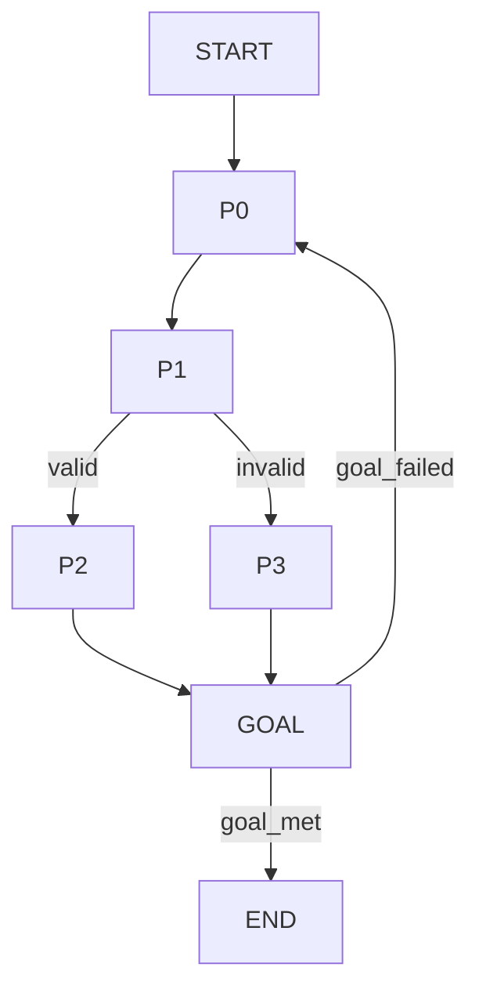
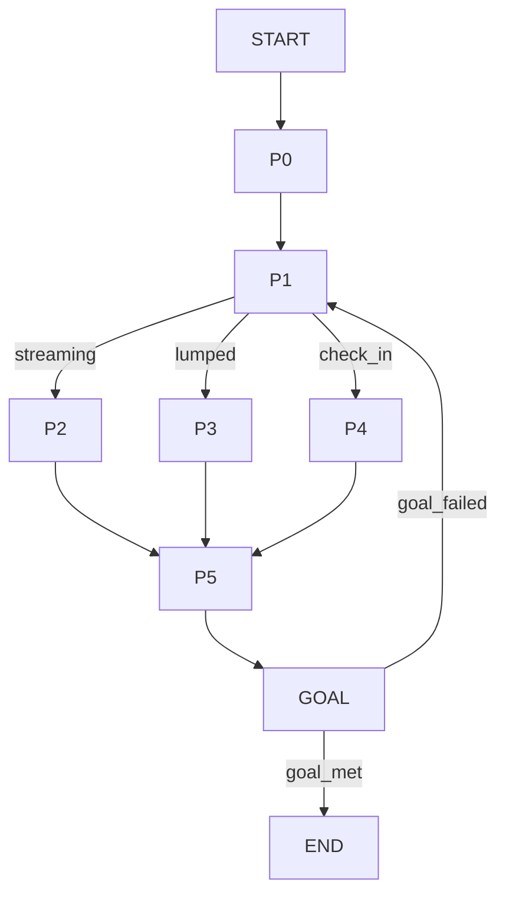
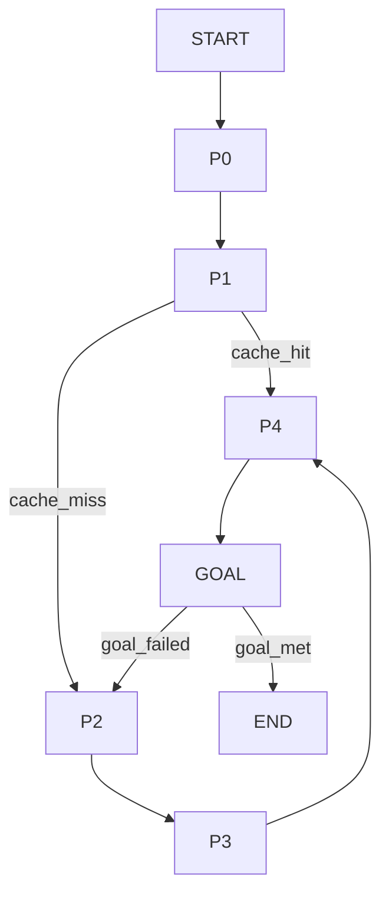
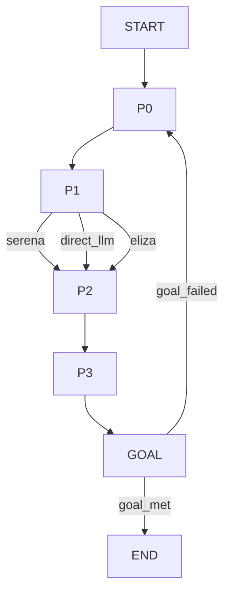
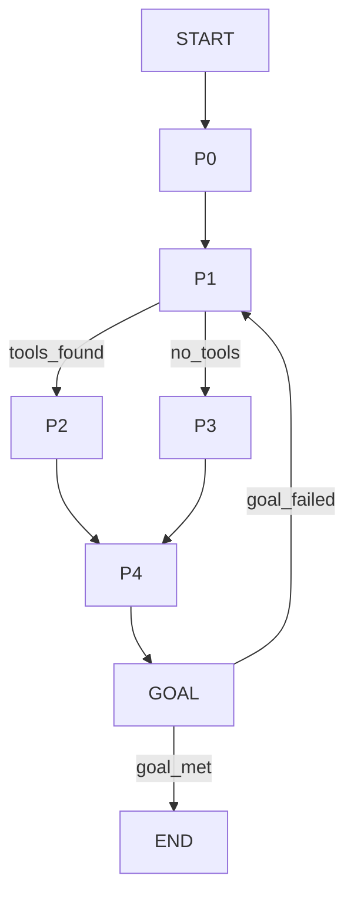
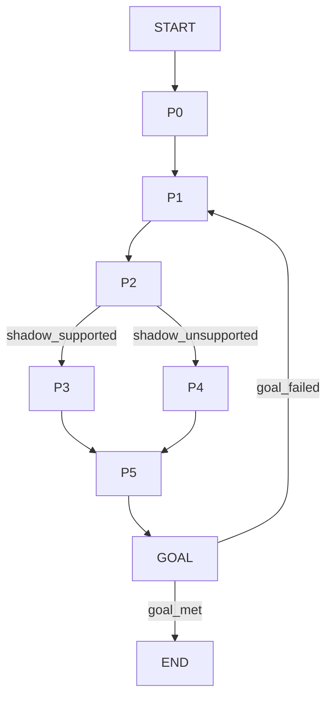

# Chrysalis Universal Adapter Refactor Report (2026-01-16)

## Executive Summary
Chrysalis already implements a Universal Adapter as a JSON-driven state machine for LLM task orchestration, built around a strict TaskSchema (goal + LLM config + registry + prompts + Mermaid flow) executed by a FlowExecutor. This layer is suitable as a reusable abstraction for complex procedural workflows found elsewhere in the codebase (bridge/orchestrator translation pipelines, ExperienceSyncManager protocol branching, MCP server dispatch, agent bridge routing, converter/morphing). The primary opportunity is to externalize multi-branch logic into declarative task definitions to reduce coupling, clarify intent, and enable more systematic validation and iteration.

This report documents architectural patterns, module interactions, and coupling characteristics, then proposes six refactor candidates with concrete Task JSON definitions and Mermaid flows. It also includes citations for adapter-based architectures and Mermaid syntax, a capability self-assessment, Socratic inquiry prompts, and an adaptive learning approach per AGENT.md.

---

## 1) Architecture Analysis

### 1.1 Universal Adapter System (Core Abstraction)
**Observed implementation**:
- **TaskSchema** (src/universal_adapter/schema.py) enforces goal + LLM config + registry + prompts + Mermaid flow.
- **MermaidParser** → **FlowGraph** → **FlowExecutor** implements a deterministic state machine with conditional edges and loop handling (src/universal_adapter/flow/*).
- **Categorizer** maps responses to edge labels for branching (src/universal_adapter/evaluator/categorizer.py).
- **GoalVerifier** checks completion against target conditions (src/universal_adapter/verifier/goal_verifier.py).

**Pattern**: Declarative workflow DSL + state machine execution + goal gating.

### 1.2 Module Interaction Flows
Key interactions from inspected modules:
- **Bridge Orchestrator** (src/bridge/orchestrator/bridge-orchestrator.ts): validates translation requests, resolves adapters, caches canonical translations, and persists snapshots.
- **Converter** (src/converter/Converter.ts): sequential validation → universal transform → target mapping → optional shadow encryption → restore path.
- **ExperienceSyncManager** (src/sync/ExperienceSyncManager.ts): protocol selection (streaming/lumped/check-in), transport resolution, merge and event emission.
- **MCP Server** (src/mcp-server/mcp-server.ts): JSON-RPC parsing, capability gating, tool/resource/prompt dispatch.
- **Agent Bridges** (src/agents/bridges/AgentRegistry.ts, SerenaBridge.ts): bridge selection and command parsing with branching logic.

These areas already resemble orchestrated state machines but are implemented as imperative branching. The Universal Adapter provides a natural abstraction boundary for such flows.

### 1.3 Design Patterns Observed
| Area | Pattern | Evidence |
|---|---|---|
| Universal Adapter | **State Machine**, **Interpreter/DSL** | FlowGraph + FlowExecutor parsing Mermaid and transitions |
| Bridge Orchestrator | **Registry**, **Cache**, **Validation Pipeline** | AdapterRegistry, CacheManager, validation.ts |
| BaseUnifiedAdapter | **Template Method**, **Strategy** | abstract conversion + health utilities |
| PatternResolver | **Strategy**, **Circuit Breaker**, **Cache** | Adaptive resolver with circuit breaker and source selection |
| InstanceStateMachine / AdaIntegrationService | **State Machine** | explicit state transitions with events |
| Converter | **Pipeline** | sequential phases with branching on support |

### 1.4 Coupling Characteristics
- **Tight coupling** between procedural branching and operational side-effects (e.g., translation caching + validation + persistence in one method).
- **Conditional depth**: multi-stage flows with numerous guards (MCP server request routing, ExperienceSyncManager protocol selection).
- **Hard-coded branching**: in SerenaBridge natural language parsing and AgentRegistry type selection.

The Universal Adapter abstraction can decouple intent from execution by centralizing decision logic in task definitions with explicit goal checks and controlled transitions.

---

## 2) Documentation Research & Citations

### 2.1 Adapter Architecture References
- **Ports and Adapters (Hexagonal Architecture)**: emphasizes small, testable adapters and stable ports. *Marcin Tryka, “Ports and adapters pattern in software architecture.”* Architecture Stack (2023). https://architecturestack.com/index.php/2023/04/22/ports-and-adapters/
- **Scalable Adapter Design Pattern**: interoperability between tools noted in IEEE Xplore (limited metadata available from public page). *“The Scalable Adapter Design Pattern: Enabling Interoperability Between Educational Software Tools.”* https://ieeexplore.ieee.org/document/4685888
- **Adapter maintainability study (title only accessible)**: *“Empirical Investigation of the Impact of the Adapter Design Pattern on Software Maintainability.”* https://ieeexplore.ieee.org/document/9491719/

### 2.2 Mermaid Syntax Reference
Mermaid flowchart and state diagram syntax references used for documentation and diagramming:
- Flowcharts: https://mermaid.ai/open-source/syntax/flowchart.html
- State Diagrams: https://mermaid.ai/open-source/syntax/stateDiagram.html

**Key syntax for this project** (note: Universal Adapter supports a strict subset):
- Flowchart declaration: `graph TD` / `flowchart TD`
- Nodes: `A[Text]` (rectangle), `A{Text}` (diamond), `A((Text))` (circle), `A([Text])` (stadium)
- Edge labels: `A -->|condition| B`
- State diagrams: `[*] --> StateA`, `StateA --> StateB : Event`

---

## 3) Capability Self‑Assessment
- **AI Engineering**: strong in LLM orchestration, evaluation loops, and state machine design.
- **Prompt Engineering**: capable of structured multi-step prompts, templating, and verification patterns.
- **Systems Architecture**: strong in modular boundaries, registry abstractions, and orchestration flows.
- **Refactoring**: strong in extracting decision logic into declarative flows and improving testability.

---

## 4) Socratic Inquiry (Hidden Assumptions)
1. Are we assuming stable LLM availability and latency for all flows now encoded as tasks?
2. Which flows require determinism vs. LLM discretion? Should any decision nodes be pure rules?
3. Are registry references stable enough to embed in task definitions? What if spec URLs change?
4. Are existing error handling branches equivalent to task goal checks, or will we need richer evaluation types?
5. Is the state machine subset (no subgraphs, limited edges) sufficient to model complex pipelines, or should the parser expand?

---

## 5) Adaptive Learning (AGENT.md Approach)
**Discovery → Investigation → Synthesis → Reporting** was followed by mapping the Universal Adapter internals, then tracing pipeline-heavy modules. The **Five Whys** was applied to conditional branching hot spots, leading to the conclusion that declarative tasks can stabilize intent and isolate decisions from code paths.

---

## 6) Refactor Candidates & Task Designs
Below are six candidates across the requested mix. Each will be implemented as a Task JSON in `src/universal_adapter/examples/` and registered in `TaskLibrary`.

> **Note:** Mermaid flows adhere to the adapter’s supported subset (no subgraphs, no advanced edge types).

### 6.1 MCP Request Dispatch Task
- **Target Module**: `src/mcp-server/mcp-server.ts`
- **Intent**: Extract JSON-RPC validation + method routing into declarative flow.
- **Goal Conditions**: Valid request classification and correct dispatch or error response.
- **Task file**: `mcp_request_dispatch_task.json`

### 6.2 Experience Sync Protocol Task
- **Target Module**: `src/sync/ExperienceSyncManager.ts`
- **Intent**: Declarative protocol selection and merge steps.
- **Goal Conditions**: Sync protocol chosen, transport resolved, merge completed.
- **Task file**: `experience_sync_protocol_task.json`

### 6.3 Bridge Translation Pipeline Task
- **Target Module**: `src/bridge/orchestrator/bridge-orchestrator.ts`
- **Intent**: Validate → cache → canonicalize → translate → persist pipeline.
- **Goal Conditions**: Fidelity threshold met and result validated.
- **Task file**: `bridge_translation_pipeline_task.json`

### 6.4 Agent Registry Bootstrap Task
- **Target Module**: `src/agents/bridges/AgentRegistry.ts`
- **Intent**: declarative registry type selection & connection logic.
- **Goal Conditions**: Bridge registered and connection attempted.
- **Task file**: `agent_registry_bootstrap_task.json`

### 6.5 Serena Natural Language Tool Router Task
- **Target Module**: `src/agents/bridges/SerenaBridge.ts`
- **Intent**: Convert NL requests into tool plans and fallback responses.
- **Goal Conditions**: Tool plan produced or fallback response issued.
- **Task file**: `serena_tool_router_task.json`

### 6.6 Converter Pipeline Task
- **Target Module**: `src/converter/Converter.ts`
- **Intent**: Externalize conversion pipeline with shadow support branching.
- **Goal Conditions**: Converted agent with correct metadata and optional shadow.
- **Task file**: `converter_pipeline_task.json`

---

## 7) Implementation Notes
- New task JSONs are created under `src/universal_adapter/examples/`.
- `src/universal_adapter/task_library.py` is updated to register new task names.
- Each task includes registry entries pointing to relevant Chrysalis docs or specs.
- Validation commands will be executed via `python -m universal_adapter validate` for each task.

---

## 8) Testing & Metrics
Validation executed via: `python3 -m src.universal_adapter validate <task>`.

Results:
- `mcp_request_dispatch`: 4 prompts, 7 flow nodes, 2 registry entries, 2 conditions.
- `experience_sync_protocol`: 6 prompts, 9 flow nodes, 2 registry entries, 2 conditions.
- `bridge_translation_pipeline`: 5 prompts, 8 flow nodes, 2 registry entries, 2 conditions.
- `agent_registry_bootstrap`: 4 prompts, 7 flow nodes, 1 registry entry, 2 conditions.
- `serena_tool_router`: 5 prompts, 8 flow nodes, 1 registry entry, 2 conditions.
- `converter_pipeline`: 6 prompts, 9 flow nodes, 1 registry entry, 2 conditions.

---

## 9) Next Steps
1. Integrate task references into calling code where appropriate (optional, if needed).
2. Extend Mermaid parser subset if richer diagrams are required.
3. Add unit tests for FlowGraph validation paths (goal check gate, branch conditions).
