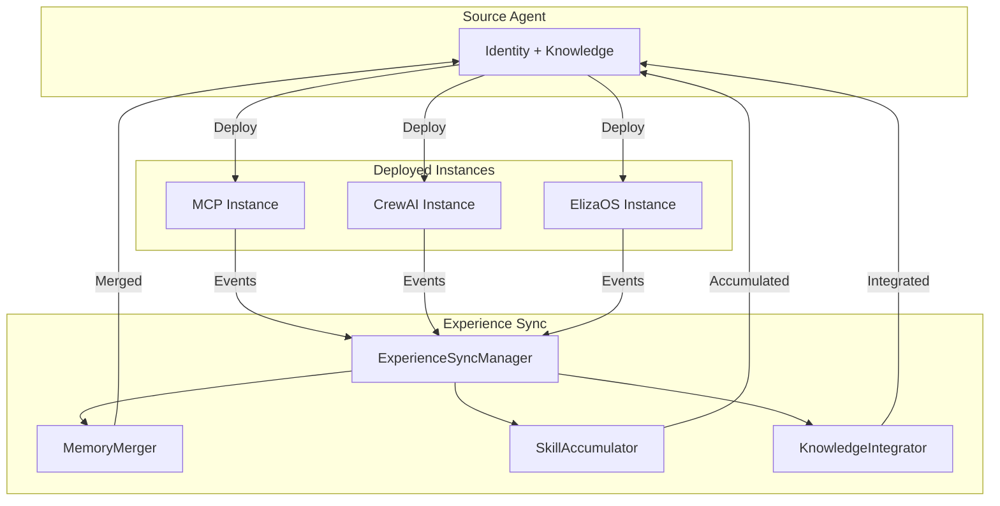
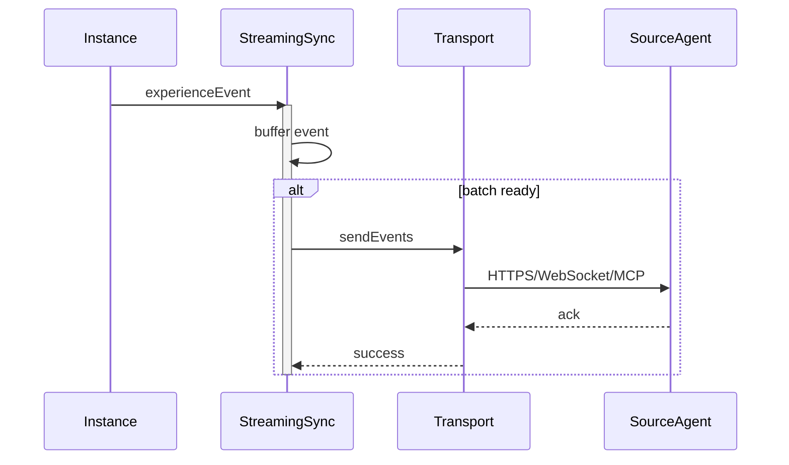
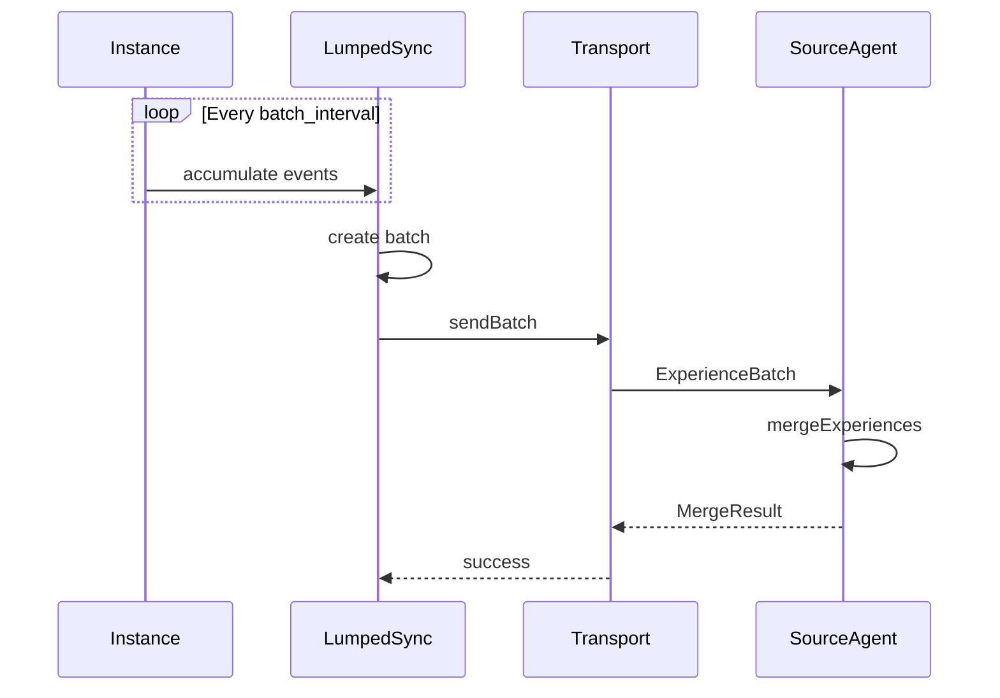
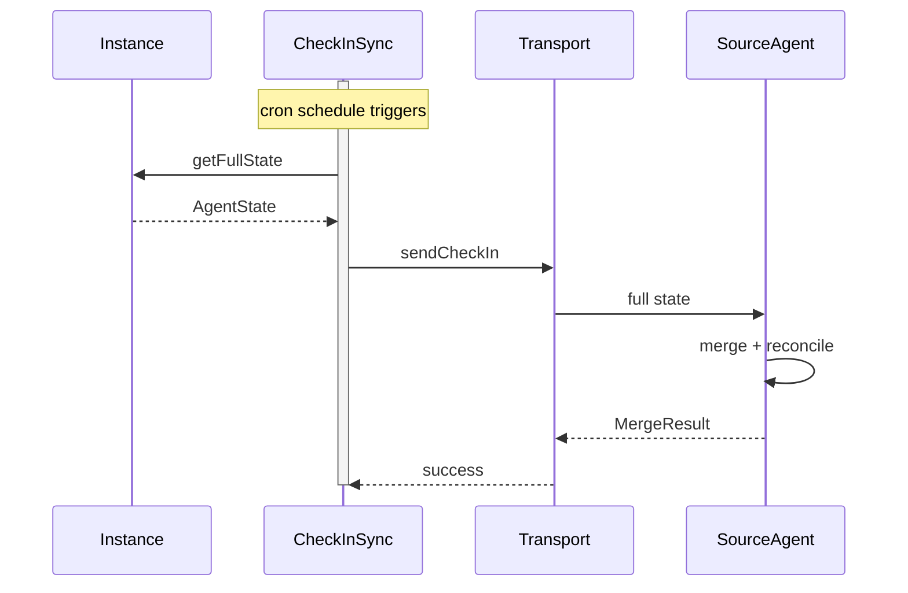
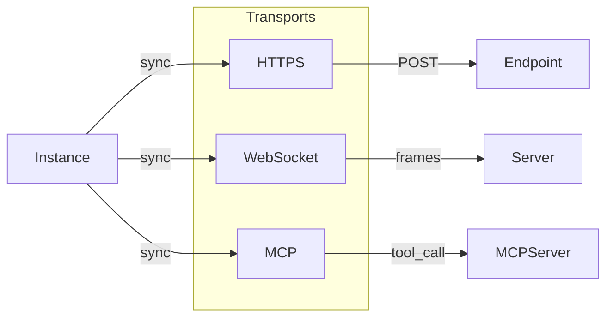
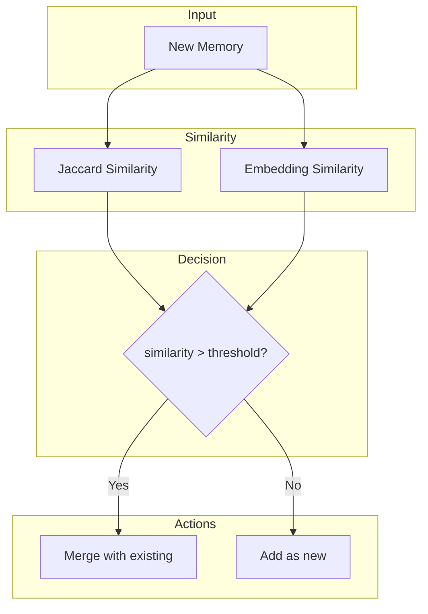
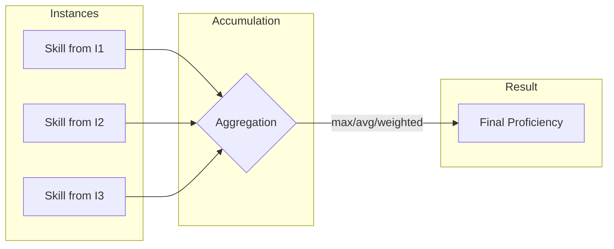
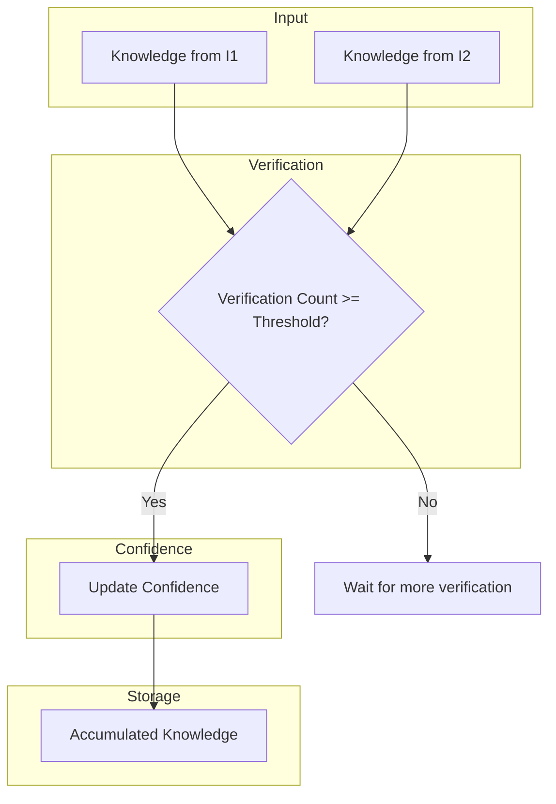

# Experience Synchronization

> **Source:** [`src/sync/ExperienceSyncManager.ts`](../../src/sync/ExperienceSyncManager.ts)  
> **Status:** ✅ Implemented

## Overview

Experience Synchronization enables deployed agent instances to continuously learn and share experiences back to a coordinating source agent. This creates a feedback loop where:

1. Instances run in various deployment contexts
2. They accumulate memories, skills, and knowledge
3. Experiences sync back to the source agent
4. The source agent evolves with combined learning



---

## Three Sync Protocols

| Protocol | Latency | Use Case | Source |
|----------|---------|----------|--------|
| **Streaming** | Real-time | High-value interactions | [`StreamingSync.ts`](../../src/sync/StreamingSync.ts) |
| **Lumped** | Batch | Periodic bulk sync | [`LumpedSync.ts`](../../src/sync/LumpedSync.ts) |
| **Check-in** | Scheduled | Low-bandwidth environments | [`CheckInSync.ts`](../../src/sync/CheckInSync.ts) |

### Protocol Selection

```typescript
// From src/core/UniformSemanticAgentV2.ts:18
export type SyncProtocol = 'streaming' | 'lumped' | 'check_in';
```

---

## Streaming Sync

Real-time event streaming for high-priority experiences.



### Configuration

```typescript
// From src/core/UniformSemanticAgentV2.ts:211
streaming?: {
  enabled: boolean;
  interval_ms: number;        // Batch interval
  batch_size: number;         // Max events per batch
  priority_threshold: number; // Min priority to stream
};
```

---

## Lumped Sync

Batch synchronization at regular intervals.



### Configuration

```typescript
// From src/core/UniformSemanticAgentV2.ts:218
lumped?: {
  enabled: boolean;
  batch_interval: string;    // e.g., "1h", "6h", "24h"
  max_batch_size: number;
  compression: boolean;
};
```

---

## Check-in Sync

Scheduled full-state synchronization.



### Configuration

```typescript
// From src/core/UniformSemanticAgentV2.ts:225
check_in?: {
  enabled: boolean;
  schedule: string;          // cron expression
  include_full_state: boolean;
};
```

---

## Transport Types

Three transport mechanisms for experience delivery:



### Transport Configuration

```typescript
// From src/core/UniformSemanticAgentV2.ts:23
export type ExperienceTransportType = 'https' | 'websocket' | 'mcp';

export interface ExperienceTransportConfig {
  type: ExperienceTransportType;
  
  https?: {
    endpoint: string;
    auth_token?: string;
    headers?: Record<string, string>;
    verify_tls?: boolean;  // Default: true
  };
  
  websocket?: {
    url: string;
    protocols?: string[];
  };
  
  mcp?: {
    server?: string;
    tool_name?: string;
  };
}
```

---

## Memory Merging

The [`MemoryMerger`](../../src/experience/MemoryMerger.ts) handles intelligent deduplication:



### Similarity Methods

| Method | Speed | Accuracy | Source |
|--------|-------|----------|--------|
| **Jaccard** | O(n) | Lexical only | [`MemoryMerger.ts:352`](../../src/experience/MemoryMerger.ts:352) |
| **Embedding** | O(n) + API | Semantic | [`MemoryMerger.ts:366`](../../src/experience/MemoryMerger.ts:366) |

### Merge Strategy

```typescript
// From src/core/UniformSemanticAgentV2.ts:231
merge_strategy: {
  conflict_resolution: 'latest_wins' | 'weighted_merge' | 'manual_review';
  memory_deduplication: boolean;
  skill_aggregation: 'max' | 'average' | 'weighted';
  knowledge_verification_threshold: number;
};
```

---

## Skill Accumulation

The [`SkillAccumulator`](../../src/experience/SkillAccumulator.ts) tracks skill development:



### Skill Structure

```typescript
// From src/core/UniformSemanticAgentV2.ts:141
export interface Skill {
  skill_id: string;
  name: string;
  category: string;
  proficiency: number;       // 0.0 - 1.0
  acquired: string;
  source_instances: string[];
  
  learning_curve: {
    timestamp: string;
    proficiency: number;
    event: string;
  }[];
  
  usage: {
    total_invocations: number;
    success_rate: number;
    contexts: string[];
    last_used: string;
  };
}
```

---

## Knowledge Integration

The [`KnowledgeIntegrator`](../../src/experience/KnowledgeIntegrator.ts) verifies and incorporates knowledge:



---

## Observability Integration

Experience sync emits VoyeurEvents for monitoring:

```typescript
// Event types emitted during sync
'sync.init'      // Sync initialized for instance
'sync.event'     // Streaming event sent
'sync.batch'     // Lumped batch sent
'sync.check_in'  // Check-in completed
'merge.memories' // Memories merged
'merge.skills'   // Skills accumulated
'merge.knowledge'// Knowledge integrated
```

See [`VoyeurEvents.ts`](../../src/observability/VoyeurEvents.ts) for full event schema.

---

## Usage Example

```typescript
import { ExperienceSyncManager } from './src/sync/ExperienceSyncManager';
import type { UniformSemanticAgentV2, ExperienceSyncConfig } from './src/core/UniformSemanticAgentV2';

// Create sync manager
const syncManager = new ExperienceSyncManager();

// Configure sync
const syncConfig: ExperienceSyncConfig = {
  enabled: true,
  default_protocol: 'streaming',
  transport: {
    type: 'https',
    https: {
      endpoint: 'https://api.example.com/sync',
      auth_token: process.env.SYNC_TOKEN
    }
  },
  streaming: {
    enabled: true,
    interval_ms: 500,
    batch_size: 10,
    priority_threshold: 0.5
  },
  merge_strategy: {
    conflict_resolution: 'latest_wins',
    memory_deduplication: true,
    skill_aggregation: 'max',
    knowledge_verification_threshold: 0.8
  }
};

// Initialize sync for an instance
await syncManager.initializeSync(
  'instance-123',
  'streaming',
  syncConfig,
  sourceAgent,
  'https://api.example.com/sync'
);

// Stream an experience event
await syncManager.streamEvent('instance-123', {
  event_id: 'evt-1',
  timestamp: new Date().toISOString(),
  source_instance: 'instance-123',
  event_type: 'memory',
  priority: 0.8,
  data: { content: 'User prefers concise responses' },
  context: { trigger: 'conversation', environment: {} }
});
```

---

## Related Documentation

- [Architecture Overview](./overview.md)
- [Memory System](./memory-system.md)
- [Universal Patterns](./universal-patterns.md) - CRDT, Gossip patterns