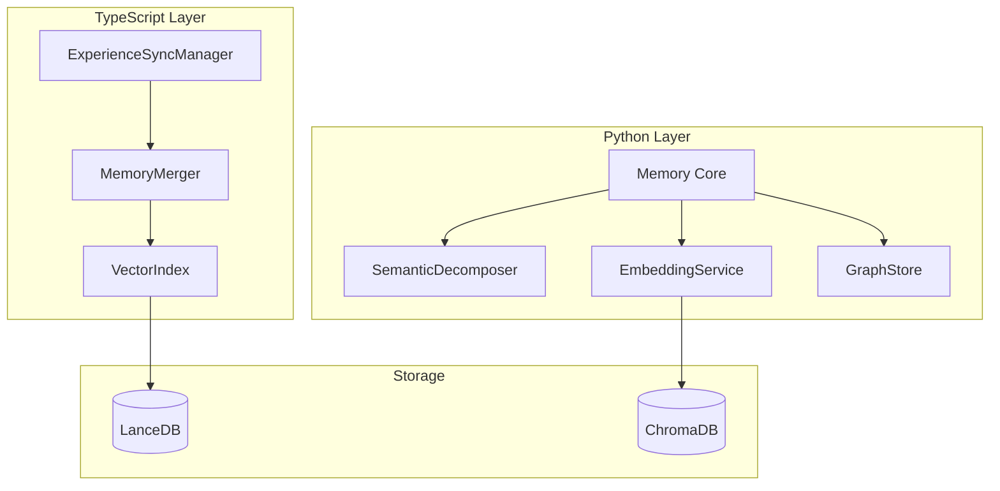
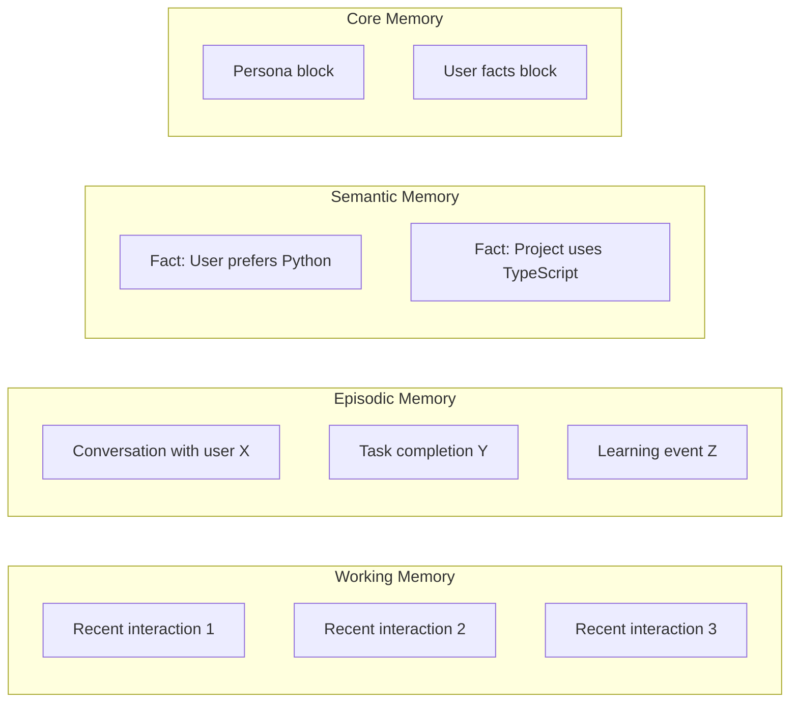
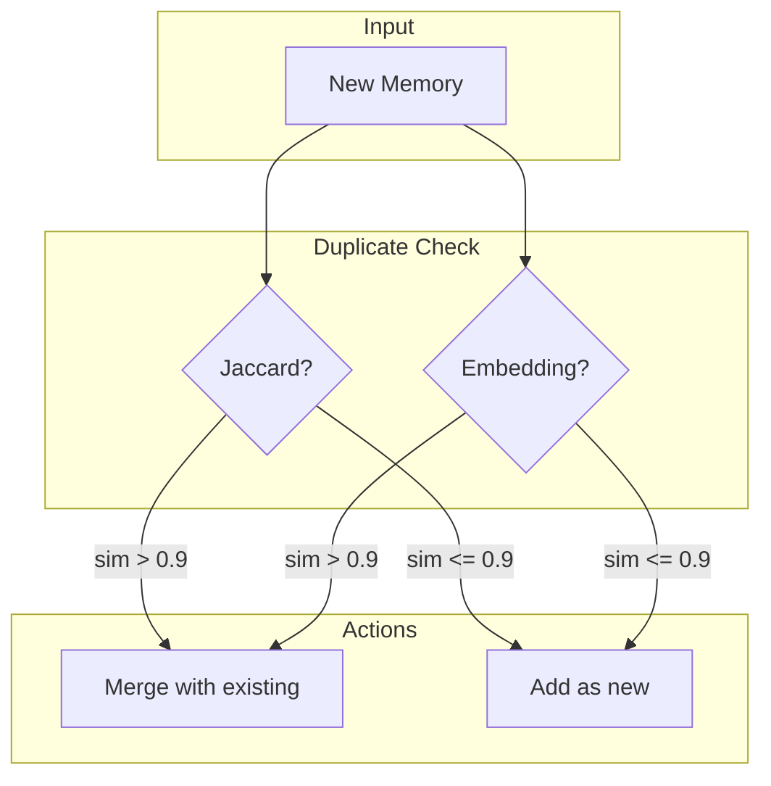
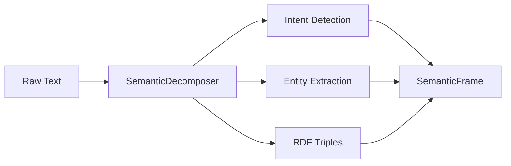
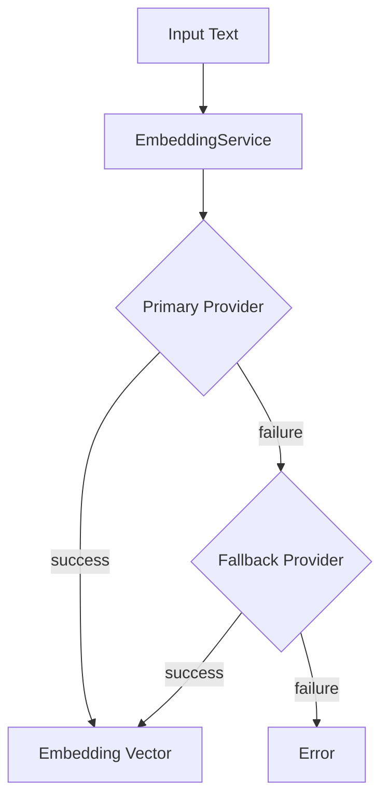
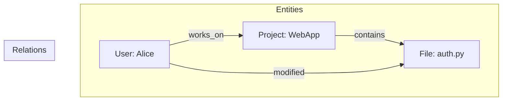
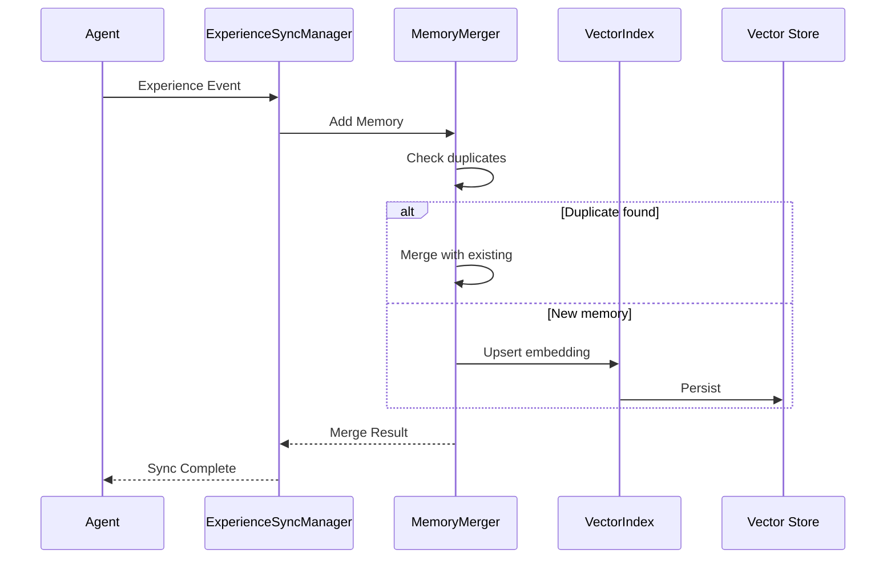

# Memory System Architecture

> **TypeScript Source:** [`src/memory/`](../../memory_system/) | [`src/experience/`](../../src/experience/)  
> **Python Source:** [`memory_system/`](../../memory_system/)  
> **Status:** ✅ Implemented (dual-language)

## Overview

Chrysalis implements a **dual-coding memory architecture** spanning TypeScript and Python:

- **TypeScript**: Memory merging, vector indexing, experience sync
- **Python**: Semantic decomposition, embeddings, knowledge graphs



---

## Memory Types

Four memory categories following cognitive science principles:

| Type | Retention | Storage | Purpose |
|------|-----------|---------|---------|
| **Working** | Temporary | In-memory buffer | Recent context |
| **Episodic** | Long-term | Vector store | Past experiences |
| **Semantic** | Long-term | Vector store | Facts and knowledge |
| **Core** | Persistent | Structured blocks | Identity and persona |



---

## TypeScript Memory Components

### VectorIndex

> **Source:** [`src/memory/VectorIndex.ts`](../../memory_system/VectorIndex.ts)

Abstract interface for vector similarity search:

```typescript
// From src/memory/VectorIndex.ts:13
export interface VectorIndex {
  upsert(id: string, vector: number[]): Promise<void>;
  findSimilar(vector: number[], topK: number, minScore: number): Promise<VectorMatch[]>;
  size(): number;
}
```

### Implementations

| Implementation | Complexity | Use Case |
|----------------|------------|----------|
| **BruteForceVectorIndex** | O(n) | Small datasets, testing |
| **HNSWIndex** (planned) | O(log n) | Production |
| **LanceIndex** (planned) | O(log n) | Persistent storage |

### MemoryMerger

> **Source:** [`src/experience/MemoryMerger.ts`](../../src/experience/MemoryMerger.ts)

Intelligent memory deduplication and merging:



#### Configuration

```typescript
// From src/experience/MemoryMerger.ts:23
export interface MemoryMergerConfig {
  similarity_method: 'jaccard' | 'embedding';
  similarity_threshold: number;  // Default: 0.9
  embedding_service?: any;
  use_vector_index: boolean;
  vector_index_type?: 'hnsw' | 'lance' | 'brute';
  voyeur?: VoyeurSink;           // Observability
  metrics_sink?: MetricsSink;    // Prometheus/OTel
  sanitize?: (content: string, sourceInstance: string) => { ok: boolean; content: string };
  rate_limit?: { windowMs: number; max: number };
}
```

---

## Python Memory System

### Memory Core

> **Source:** [`memory_system/core.py`](../../memory_system/core.py)

Unified memory interface:

```python
# From memory_system/core.py:88
class Memory:
    """
    Main memory interface for agents
    
    Memory Types:
    - Working Memory: Recent context (in-memory buffer)
    - Episodic Memory: Past experiences (vector store)
    - Semantic Memory: Knowledge/facts (vector store)
    - Core Memory: Persistent context (structured blocks)
    """
```

### Memory Entry Structure

```python
# From memory_system/core.py:12
@dataclass
class MemoryEntry:
    id: str
    content: str
    memory_type: str  # "working", "episodic", "semantic", "core"
    timestamp: datetime
    metadata: Dict[str, Any]
    embedding: Optional[List[float]]
```

### Usage

```python
from memory_system.core import Memory, MemoryConfig

# Configure memory system
config = MemoryConfig(
    embedding_model="openai/text-embedding-3-small",
    vector_store_type="chroma",
    storage_path="./memory_data",
    working_memory_size=10,
    similarity_threshold=0.7
)

# Initialize
memory = Memory(config)
memory.initialize()

# Working memory (temporary context)
memory.add_to_working_memory("User asked about Python")

# Episodic memory (experiences)
memory.add_episodic("Successfully helped user debug auth.py", 
                    metadata={"task": "debugging"})

# Semantic memory (facts)
memory.add_semantic("User prefers concise responses",
                    metadata={"confidence": 0.9})

# Core memory (persistent)
memory.set_core_memory("persona", "I am a helpful coding assistant")
memory.set_core_memory("user_facts", "User works on web applications")

# Search across memories
results = memory.search("debugging authentication", 
                       memory_types=["episodic", "semantic"],
                       limit=5)

# Get assembled context for LLM
context = memory.get_context(query="auth error", include_working=True)
```

---

## Semantic Decomposition

> **Source:** [`memory_system/semantic/`](../../memory_system/semantic/)

Breaks down text into semantic components:



### Strategies

| Strategy | Speed | Quality | Dependencies |
|----------|-------|---------|--------------|
| **HeuristicStrategy** | Fast | Basic | None |
| **SpacyStrategy** | Medium | Good | spaCy |
| **AnthropicStrategy** | Slow | Best | API key |
| **OllamaStrategy** | Medium | Good | Local LLM |

### Example

```python
from memory_system.semantic import HeuristicStrategy

strategy = HeuristicStrategy()
frame = await strategy.decompose("fix the login bug in auth.py")

print(frame.intent)      # Intent.DEBUG
print(frame.entities)    # ["auth.py", "login"]
print(frame.confidence)  # 0.85
```

---

## Embedding Service

> **Source:** [`memory_system/embedding/service.py`](../../memory_system/embedding/service.py)

Vector embeddings with fallback chain:



### Providers

| Provider | Model | Dimensions | API |
|----------|-------|------------|-----|
| **Voyage AI** | voyage-3 | 1024 | Cloud |
| **OpenAI** | text-embedding-3-small | 1536 | Cloud |
| **Local** | all-MiniLM-L6-v2 | 384 | None |

### Configuration

```python
from memory_system.embedding import EmbeddingService

service = EmbeddingService(
    model="voyage-3",
    fallback_model="openai/text-embedding-3-small"
)

# Single embedding
vector = service.embed("Hello world")

# Batch embedding
vectors = service.embed_batch(["Hello", "World"])
```

---

## Graph Store

> **Source:** [`memory_system/graph/store.py`](../../memory_system/graph/store.py)

Knowledge graph for entity relationships:



---

## Data Flow

Complete memory flow from experience to storage:



---

## Configuration Reference

### TypeScript

```typescript
// Memory merger config
{
  similarity_method: 'jaccard' | 'embedding',
  similarity_threshold: 0.9,
  use_vector_index: true,
  vector_index_type: 'lance'  // or 'hnsw', 'brute'
}
```

### Python

```python
# Memory config
MemoryConfig(
    embedding_model="openai/text-embedding-3-small",
    embedding_dimensions=1536,
    vector_store_type="chroma",  # or "faiss"
    storage_path="./memory_data",
    working_memory_size=10,
    default_retrieval_limit=5,
    similarity_threshold=0.7
)
```

---

## Environment Variables

| Variable | Purpose | Default |
|----------|---------|---------|
| `VECTOR_INDEX_TYPE` | Index backend | `brute` |
| `VOYAGE_API_KEY` | Voyage embeddings | - |
| `OPENAI_API_KEY` | OpenAI embeddings | - |
| `METRICS_PROMETHEUS` | Enable Prometheus | `false` |

---

## Related Documentation

- [Architecture Overview](./overview.md)
- [Experience Sync](./experience-sync.md)
- [Universal Patterns](./universal-patterns.md) - CRDT for conflict-free merge