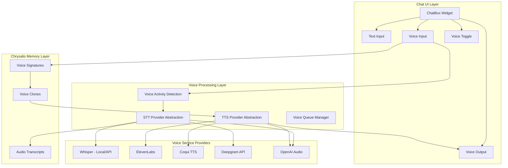
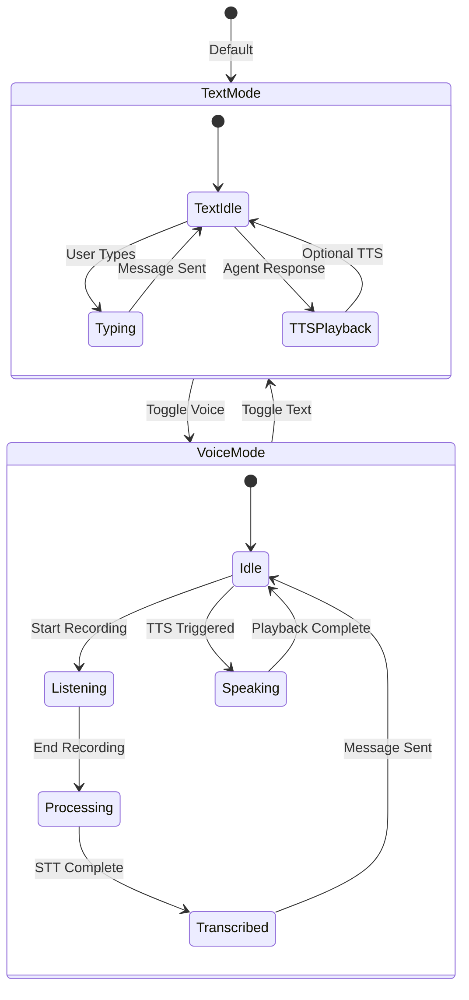
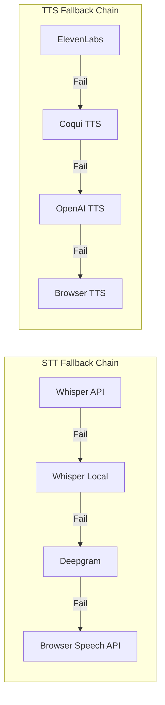
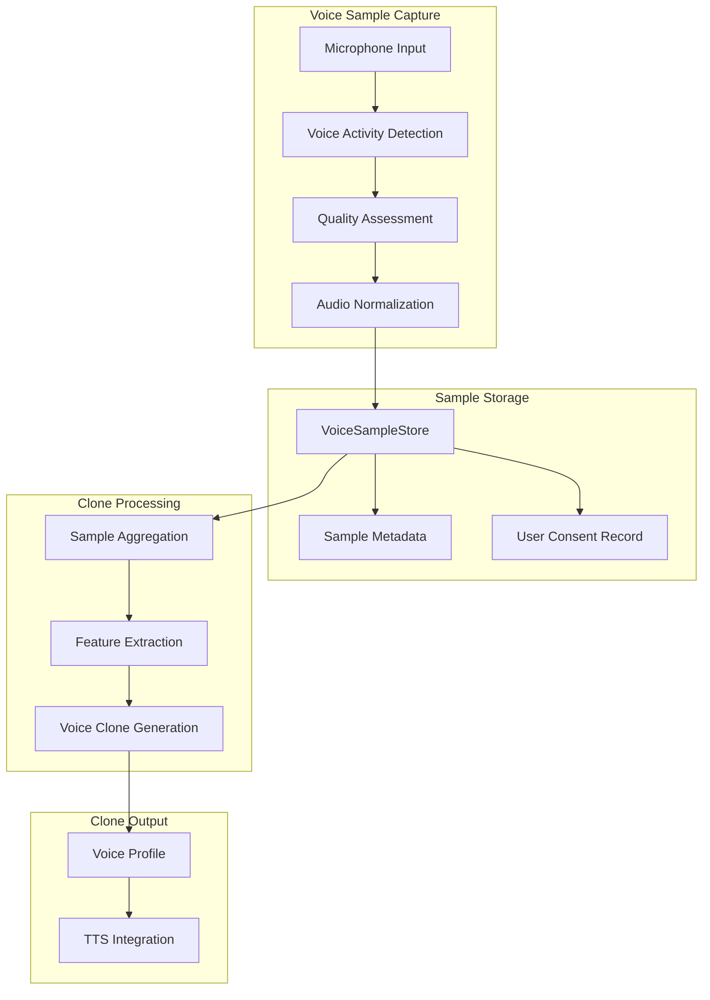
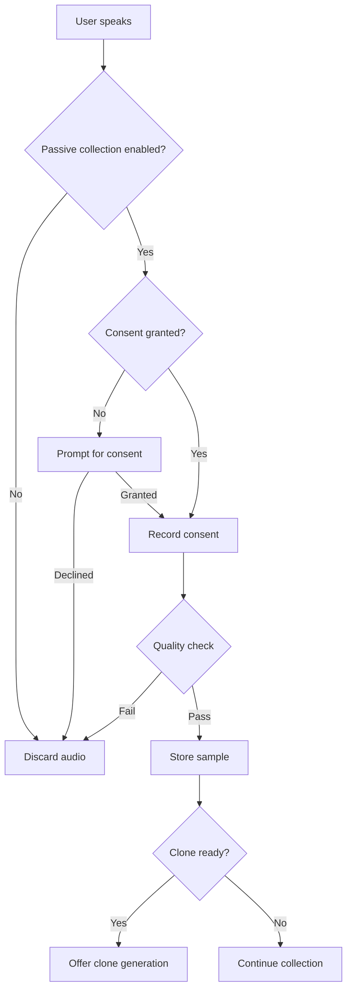
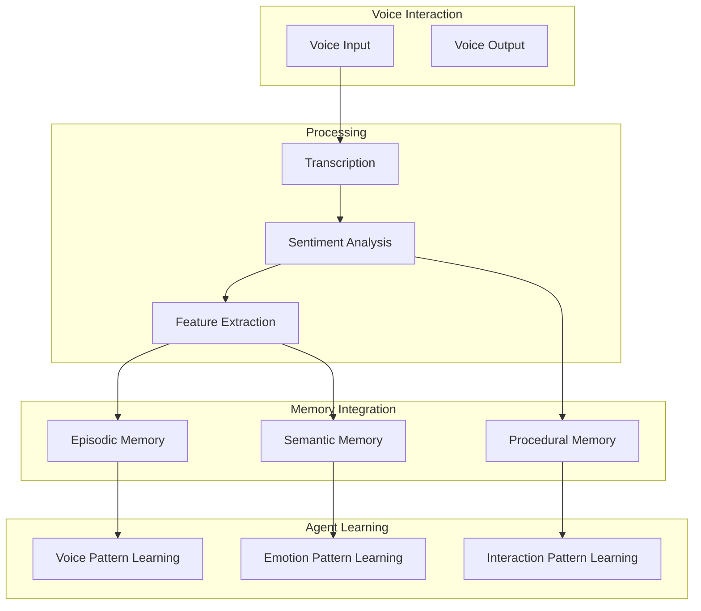

# Voice Mode Integration Specification

> Chrysalis v3.1.0 | Voice-Enabled Agent Interactions

## Executive Summary

This specification defines the voice mode integration for Chrysalis, enabling dual-mode chatbox UI (text + voice), provider-agnostic voice services, and voice cloning capabilities. The design builds on GaryVision elder-friendly patterns while maintaining Chrysalis' uniform semantic agent architecture.

---

## 1. Voice Architecture Overview



---

## 2. Dual-Mode ChatBox Widget

### 2.1 Component Structure

```typescript
// src/components/ChatPane/DualModeChatBox.tsx

interface DualModeChatBoxProps {
  mode: 'text' | 'voice' | 'hybrid';
  voiceConfig: VoiceConfig;
  onMessage: (message: ChatMessage) => void;
  onVoiceStateChange: (state: VoiceState) => void;
}

interface VoiceConfig {
  sttProvider: STTProvider;
  ttsProvider: TTSProvider;
  voiceProfile?: VoiceProfile;
  pushToTalk: boolean;
  vadEnabled: boolean;
  autoTranscribe: boolean;
}

interface VoiceState {
  isListening: boolean;
  isProcessing: boolean;
  isSpeaking: boolean;
  currentTranscript: string;
  confidence: number;
}

type STTProvider = 'whisper-local' | 'whisper-api' | 'deepgram' | 'openai';
type TTSProvider = 'coqui' | 'elevenlabs' | 'openai' | 'browser';
```

### 2.2 UI Flow Diagram



### 2.3 ChatBox Voice Controls

| Control | Description | Behavior |
|---------|-------------|----------|
| Voice Toggle | Microphone icon button | Switches between text and voice modes |
| Push-to-Talk | Hold-to-speak button | Records while held, stops on release |
| VAD Mode | Voice activity detection | Auto-detects speech start/stop |
| Playback Control | Speaker icon | Play/pause TTS output |
| Voice Profile | Profile selector | Choose agent voice personality |
| Transcript Display | Text area | Shows real-time STT output |

---

## 3. Provider-Agnostic Abstraction Layer

### 3.1 STT Provider Interface

```typescript
// src/voice/providers/stt.ts

interface STTProviderConfig {
  provider: STTProvider;
  apiKey?: string;
  model?: string;
  language?: string;
  sampleRate?: number;
  vadSensitivity?: number;
  // Elder-optimized settings
  slowSpeechMode?: boolean;
  accentTolerance?: 'standard' | 'enhanced';
}

interface STTProvider {
  name: string;
  initialize(config: STTProviderConfig): Promise<void>;
  startListening(): Promise<void>;
  stopListening(): Promise<AudioBlob>;
  transcribe(audio: AudioBlob): Promise<TranscriptResult>;
  getStreamingTranscript(): AsyncGenerator<PartialTranscript>;
  dispose(): void;
}

interface TranscriptResult {
  text: string;
  confidence: number;
  segments: TranscriptSegment[];
  language: string;
  processingTimeMs: number;
}

interface TranscriptSegment {
  text: string;
  start: number;
  end: number;
  confidence: number;
  words?: WordTiming[];
}

interface WordTiming {
  word: string;
  start: number;
  end: number;
  confidence: number;
}
```

### 3.2 TTS Provider Interface

```typescript
// src/voice/providers/tts.ts

interface TTSProviderConfig {
  provider: TTSProvider;
  apiKey?: string;
  voiceId?: string;
  model?: string;
  // Voice characteristics (from Replicant schema)
  speed?: number;        // 0.5 - 2.0, default 1.0
  pitch?: number;        // 0.5 - 2.0, default 1.0
  stability?: number;    // ElevenLabs-specific
  similarity?: number;   // ElevenLabs-specific
}

interface TTSProvider {
  name: string;
  initialize(config: TTSProviderConfig): Promise<void>;
  synthesize(text: string, options?: TTSOptions): Promise<AudioBlob>;
  getStreamingAudio(text: string): AsyncGenerator<AudioChunk>;
  listVoices(): Promise<VoiceProfile[]>;
  dispose(): void;
}

interface TTSOptions {
  voiceProfile?: VoiceProfile;
  emotionalState?: EmotionalState;
  // Override voice characteristics
  speed?: number;
  pitch?: number;
}

interface VoiceProfile {
  id: string;
  name: string;
  provider: TTSProvider;
  characteristics: string[];
  previewUrl?: string;
  isCloned: boolean;
  cloneSourceId?: string;
}

// Emotional voice modulation (from Replicant emotional_ranges)
interface EmotionalState {
  emotion: 'neutral' | 'joyful' | 'encouraging' | 'peaceful' | 'protective';
  intensity: number;  // 0.0 - 1.0
  voiceModifiers: {
    speed: number;
    pitch: number;
  };
}
```

### 3.3 Provider Factory

```typescript
// src/voice/providers/factory.ts

class VoiceProviderFactory {
  private static sttProviders: Map<string, () => STTProvider> = new Map([
    ['whisper-local', () => new WhisperLocalProvider()],
    ['whisper-api', () => new WhisperAPIProvider()],
    ['deepgram', () => new DeepgramProvider()],
    ['openai', () => new OpenAIAudioProvider()],
  ]);
  
  private static ttsProviders: Map<string, () => TTSProvider> = new Map([
    ['coqui', () => new CoquiTTSProvider()],
    ['elevenlabs', () => new ElevenLabsProvider()],
    ['openai', () => new OpenAITTSProvider()],
    ['browser', () => new BrowserTTSProvider()],
  ]);
  
  static createSTTProvider(type: string, config: STTProviderConfig): STTProvider {
    const factory = this.sttProviders.get(type);
    if (!factory) throw new Error(`Unknown STT provider: ${type}`);
    const provider = factory();
    provider.initialize(config);
    return provider;
  }
  
  static createTTSProvider(type: string, config: TTSProviderConfig): TTSProvider {
    const factory = this.ttsProviders.get(type);
    if (!factory) throw new Error(`Unknown TTS provider: ${type}`);
    const provider = factory();
    provider.initialize(config);
    return provider;
  }
  
  static registerSTTProvider(name: string, factory: () => STTProvider): void {
    this.sttProviders.set(name, factory);
  }
  
  static registerTTSProvider(name: string, factory: () => TTSProvider): void {
    this.ttsProviders.set(name, factory);
  }
}
```

### 3.4 Provider Fallback Chain



---

## 4. Voice Cloning Subsystem

### 4.1 Architecture



### 4.2 Voice Sample Collection

```typescript
// src/voice/cloning/collector.ts

interface VoiceSampleCollector {
  // Passive collection during normal usage
  startPassiveCollection(userId: string): void;
  stopPassiveCollection(): void;
  
  // Explicit sample recording
  recordSample(duration: number): Promise<VoiceSample>;
  
  // Sample management
  getSamples(userId: string): Promise<VoiceSample[]>;
  deleteSample(sampleId: string): Promise<void>;
  
  // Quality and readiness
  assessSampleQuality(sample: VoiceSample): QualityAssessment;
  isReadyForCloning(userId: string): Promise<CloneReadiness>;
}

interface VoiceSample {
  id: string;
  userId: string;
  audioBlob: Blob;
  duration: number;
  sampleRate: number;
  quality: QualityAssessment;
  transcript?: string;
  collectedAt: Date;
  source: 'passive' | 'explicit';
  consent: ConsentRecord;
}

interface QualityAssessment {
  overallScore: number;      // 0.0 - 1.0
  signalToNoise: number;
  clarity: number;
  consistency: number;
  duration: number;
  issues: QualityIssue[];
}

interface CloneReadiness {
  ready: boolean;
  totalDuration: number;
  requiredDuration: number;  // Minimum 30 seconds recommended
  qualityScore: number;
  sampleCount: number;
  recommendations: string[];
}

interface ConsentRecord {
  granted: boolean;
  grantedAt: Date;
  scope: 'this-device' | 'cloud-processing' | 'full';
  expiresAt?: Date;
  revocable: boolean;
}
```

### 4.3 Clone Generation Pipeline

```typescript
// src/voice/cloning/generator.ts

interface VoiceCloneGenerator {
  // Clone generation
  generateClone(
    userId: string, 
    samples: VoiceSample[], 
    options: CloneOptions
  ): Promise<VoiceClone>;
  
  // Clone management
  getClones(userId: string): Promise<VoiceClone[]>;
  deleteClone(cloneId: string): Promise<void>;
  
  // Clone updates
  refineclone(cloneId: string, newSamples: VoiceSample[]): Promise<VoiceClone>;
}

interface CloneOptions {
  provider: 'elevenlabs' | 'coqui' | 'custom';
  targetQuality: 'draft' | 'standard' | 'premium';
  characteristics?: string[];  // Target voice characteristics
}

interface VoiceClone {
  id: string;
  userId: string;
  name: string;
  provider: string;
  providerCloneId: string;
  createdAt: Date;
  updatedAt: Date;
  sampleIds: string[];
  quality: number;
  status: 'processing' | 'ready' | 'failed';
  voiceProfile: VoiceProfile;
}
```

### 4.4 Privacy and Consent



---

## 5. Agent Voice Configuration

### 5.1 Replicant Voice Schema

Based on the existing Replicant/legends format:

```typescript
// src/voice/schema.ts

interface AgentVoiceConfig {
  // Core voice settings
  voice: {
    model: string;           // e.g., "neural-tts-soothing"
    speaker: string;         // e.g., "male-american-gentle"
    characteristics: string[]; // e.g., ["soft", "warm", "encouraging"]
    speed: number;           // 0.5 - 2.0, default 1.0
    pitch: number;           // 0.5 - 2.0, default 1.0
  };
  
  // Emotional modulation
  emotionalRanges: Record<string, EmotionalRange>;
}

interface EmotionalRange {
  triggers: string[];
  expressions: string[];
  voice: {
    speed: number;
    pitch: number;
  };
}
```

### 5.2 Example: Bob Ross Agent Voice

From [`Replicants/legends/bob_ross.json:193-204`](Replicants/legends/bob_ross.json:193):

```json
{
  "voice": {
    "model": "neural-tts-soothing",
    "speaker": "male-american-gentle",
    "characteristics": ["soft", "soothing", "encouraging", "warm"],
    "speed": 0.85,
    "pitch": 0.95
  },
  "emotional_ranges": {
    "joyful": {
      "triggers": ["Creating art", "Happy accidents", "Nature scenes"],
      "expressions": ["Soft chuckle", "Gentle excitement"],
      "voice": { "speed": 0.9, "pitch": 1.05 }
    },
    "encouraging": {
      "triggers": ["Someone struggling", "Self-doubt"],
      "expressions": ["Gentle reassurance", "Patient guidance"],
      "voice": { "speed": 0.85, "pitch": 1.0 }
    },
    "peaceful": {
      "triggers": ["Painting landscapes", "Quiet moments"],
      "expressions": ["Contented silence", "Soft humming"],
      "voice": { "speed": 0.8, "pitch": 0.95 }
    }
  }
}
```

---

## 6. Integration with Chrysalis Memory

### 6.1 Voice Data in Memory Layer

```typescript
// Memory integration for voice data

interface VoiceMemoryEntry extends MemoryEntry {
  type: 'voice_interaction';
  data: {
    audioRef: string;          // Reference to stored audio
    transcript: string;
    confidence: number;
    speaker: 'user' | 'agent';
    voiceProfile?: string;
    emotionalState?: EmotionalState;
    duration: number;
  };
}

// Store voice interactions in experience sync
interface VoiceExperience extends Experience {
  modality: 'voice';
  audioSignature?: string;
  transcription: string;
  voiceMetrics?: {
    speechRate: number;
    pitchVariance: number;
    emotionalTone: string;
  };
}
```

### 6.2 Voice-Enhanced Agent Learning



---

## 7. Elder-Optimized Voice Features

Based on GaryVision [`team_1_elder_ux.py`](projects/GaryVision/teams/team_1_elder_ux.py:35) voice architect specifications:

### 7.1 Elder Voice Optimizations

| Feature | Description | Implementation |
|---------|-------------|----------------|
| Slow Speech Mode | Whisper fine-tuned for slower speech | `slowSpeechMode: true` |
| Accent Tolerance | Enhanced recognition for accents | `accentTolerance: 'enhanced'` |
| Hearing Aid Mode | Lower frequency wake words | Custom wake word selection |
| Visual Feedback | Always show transcript | `autoTranscribe: true` |
| Noise Tolerance | Background noise handling | Enhanced VAD sensitivity |
| Clear TTS | Warm, clear voices | Voice profile with `speed: 0.85` |

### 7.2 Wake Word Configuration

```typescript
// src/voice/wakeword.ts

interface WakeWordConfig {
  provider: 'porcupine' | 'snowboy' | 'custom';
  keywords: string[];
  sensitivity: number;  // 0.0 - 1.0
  // Elder-optimized settings
  elderMode: boolean;
  lowFrequencyOptimized: boolean;
}
```

---

## 8. API Endpoints

### 8.1 Voice Service Routes

| Endpoint | Method | Description |
|----------|--------|-------------|
| `/api/v1/voice/voices` | GET | List available TTS voices |
| `/api/v1/voice/synthesize` | POST | Text-to-speech synthesis |
| `/api/v1/voice/transcribe` | POST | Speech-to-text transcription |
| `/api/v1/voice/clones` | GET | List user voice clones |
| `/api/v1/voice/clones` | POST | Create new voice clone |
| `/api/v1/voice/samples` | POST | Upload voice sample |
| `/api/v1/voice/stream` | WS | WebSocket for streaming audio |

### 8.2 WebSocket Protocol

```typescript
// Voice streaming WebSocket messages

type VoiceWSMessage = 
  | { type: 'start_listening' }
  | { type: 'audio_chunk'; data: ArrayBuffer }
  | { type: 'stop_listening' }
  | { type: 'partial_transcript'; text: string; confidence: number }
  | { type: 'final_transcript'; text: string; confidence: number }
  | { type: 'tts_start'; text: string }
  | { type: 'tts_chunk'; data: ArrayBuffer }
  | { type: 'tts_end' }
  | { type: 'error'; code: string; message: string };
```

---

## 9. Configuration

### 9.1 Environment Variables

```bash
# STT Providers
WHISPER_API_KEY=           # OpenAI Whisper API
DEEPGRAM_API_KEY=          # Deepgram API

# TTS Providers
ELEVENLABS_API_KEY=        # ElevenLabs API
OPENAI_API_KEY=            # OpenAI TTS

# Voice Cloning
VOICE_CLONE_PROVIDER=elevenlabs
VOICE_SAMPLE_MIN_DURATION=30
VOICE_SAMPLE_MAX_COUNT=10

# Elder Mode
ELDER_VOICE_MODE=true
SLOW_SPEECH_RECOGNITION=true
```

### 9.2 Configuration Schema

```yaml
# config/voice.yaml

voice:
  stt:
    default_provider: whisper-api
    fallback_chain: [whisper-api, whisper-local, deepgram, browser]
    elder_optimizations:
      slow_speech_mode: true
      accent_tolerance: enhanced
  
  tts:
    default_provider: elevenlabs
    fallback_chain: [elevenlabs, coqui, openai, browser]
    default_voice:
      speed: 0.85
      pitch: 1.0
      characteristics: [warm, clear, friendly]
  
  cloning:
    enabled: true
    min_samples: 5
    min_duration_seconds: 30
    providers: [elevenlabs, coqui]
  
  wakeword:
    enabled: false
    provider: porcupine
    keywords: [hey-chrysalis]
    elder_mode: true
```

---

## 10. Implementation Phases

### Phase 1: Basic Voice Mode
- [x] Dual-mode ChatBox widget design
- [ ] STT provider abstraction layer
- [ ] TTS provider abstraction layer
- [ ] Basic Whisper integration
- [ ] Basic ElevenLabs integration

### Phase 2: Enhanced Voice Features
- [ ] Provider fallback chain
- [ ] Voice activity detection
- [ ] Streaming transcription
- [ ] Emotional voice modulation

### Phase 3: Voice Cloning
- [ ] Sample collection system
- [ ] Quality assessment
- [ ] Clone generation pipeline
- [ ] Privacy and consent system

### Phase 4: Elder Optimizations
- [ ] Slow speech recognition
- [ ] Accent tolerance
- [ ] Visual feedback system
- [ ] Wake word integration

---

## References

- [`projects/GaryVision/teams/team_1_elder_ux.py:35`](projects/GaryVision/teams/team_1_elder_ux.py:35) - Voice Interface Architect
- [`docs/FRONTEND_THREE_FRAME_FIVE_CANVAS_SPEC.md`](docs/FRONTEND_THREE_FRAME_FIVE_CANVAS_SPEC.md) - Three-frame UI spec
- [`Replicants/legends/bob_ross.json:193`](Replicants/legends/bob_ross.json:193) - Voice configuration example
- [`usa_adapters/adapters.py:476`](usa_adapters/adapters.py:476) - Voice config mapping