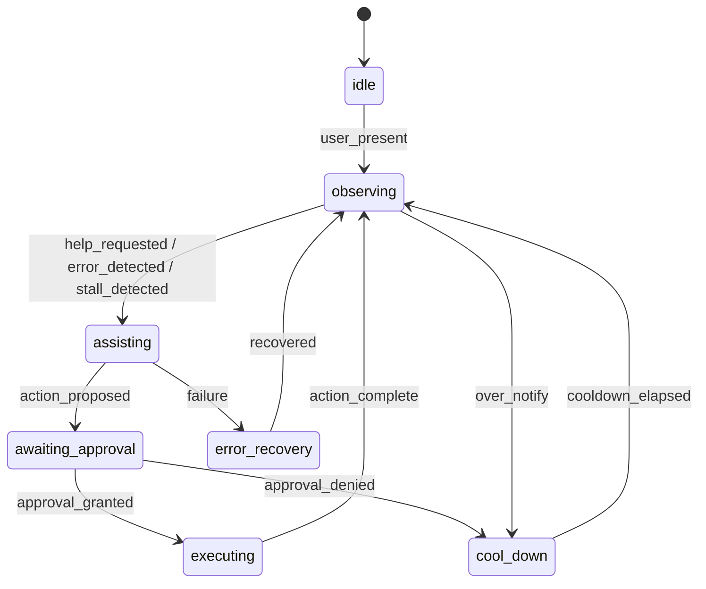
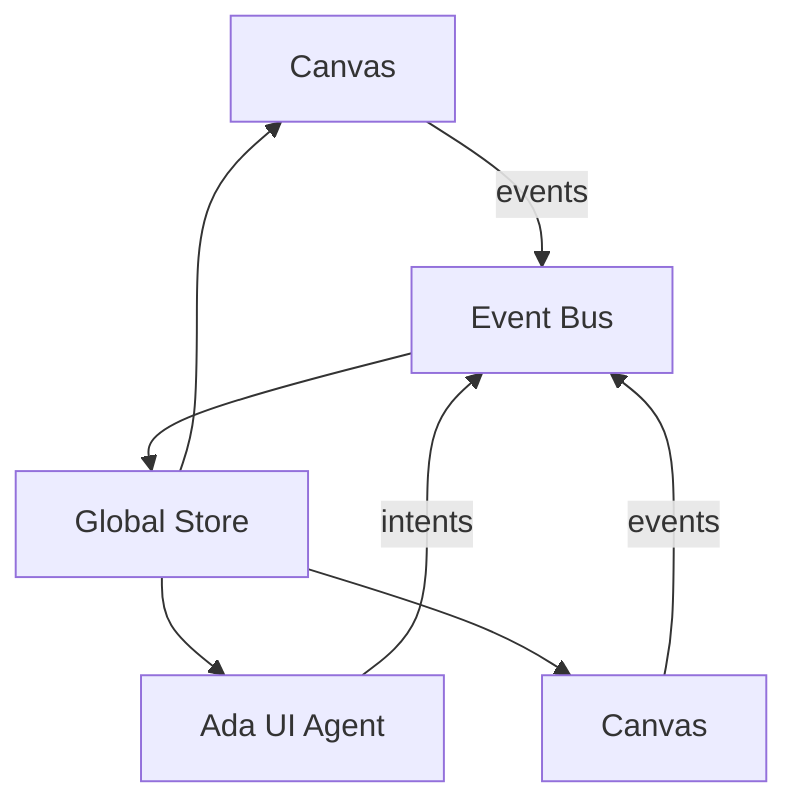

# Chrysalis Canvas Architecture

## Status and scope
- Canonical canvas count: **10 canvases** (Settings, Board, Scrapbook, Research, Wiki, Terminal, Browser, Scenarios, Curation, Media) per [`docs/STATUS.md`](docs/STATUS.md).
- Voyeur UI exposure: **Deprecated**; no client SSE consumption.
- This document specifies the modular XYFlow-based architecture, widget registries, virtualization, and Ada (system LLM) interaction model for all canvases.

## Goals
- Single, strongly typed base XYFlow React component with per-canvas widget whitelists enforced via registry.
- Horizontal + vertical infinite scroll with virtualization and resource-aware rendering.
- Secure, capability-scoped canvases for Terminal, Browser, Media, and Settings.
- Embedded Ada assistant as host of the UI “house,” guiding guests with low cognitive overhead and strict guardrails.

## Architectural principles
- **Least privilege:** Per-canvas widget whitelists; deny by default.
- **Deterministic surfaces:** Typed schemas for nodes, edges, widgets; schema validation at boundaries.
- **Resource awareness:** Viewport culling, tile-based async loading, LRU eviction, and backpressure.
- **Separation of concerns:** BaseCanvas handles canvas mechanics; widget libraries are isolated; Ada consumes state/events but does not bypass guards.
- **Security-first:** Sandbox iframes, WS origin checks, no `eval`, secret redaction, CSP guidance.

## BaseCanvas (XYFlow) contract
- Generics: `CanvasKind`, `WidgetType`, `NodeData`, `EdgeData`.
- Props (illustrative):
  - `canvasKind: CanvasKind`
  - `registry: WidgetRegistry<WidgetType>` (creation/update guards)
  - `dataSource: CanvasDataSource` (tile/segment loader)
  - `theme: CanvasTheme`
  - `a11y: A11yConfig`
  - `logging: CanvasLogger`
  - `policy: CanvasPolicy` (allow/deny, rate limits)
  - `onLifecycle: { onInit; onBeforePersist; onDestroy }`
- Behavior:
  - Renders XYFlow with controlled nodes/edges and memoized node/edge renderers.
  - Enforces whitelist on widget creation, mutation, and import; rejects disallowed types with user-safe errors and audit log.
  - Wraps children in ErrorBoundary; emits structured events (canvas_open, widget_add, widget_blocked, viewport_change, data_load_start/stop, error).
  - Theming via CSS variables; focus/keyboard support; ARIA labels on controls.

### Widget registry
- Per-canvas registry maps `WidgetType` → { renderer, schema, capability requirements }.
- Guards on create/update/import; schema validation; deny on missing capability/flag.
- Isolation: widget libraries live in separate modules per canvas to prevent cross-contamination.

### Data model (simplified)
```typescript
type CanvasKind = 'settings' | 'board' | 'scrapbook' | 'research' | 'wiki' | 'terminal' | 'browser' | 'scenarios' | 'curation' | 'media';
type WidgetType = string; // constrained per-canvas by registry

interface WidgetNodeData<WidgetType, Extra = unknown> {
  widgetType: WidgetType;
  title?: string;
  meta?: Record<string, any>;
  payload?: Extra;
}

interface CanvasPolicy {
  allowlist: WidgetType[];
  denylist?: WidgetType[];
  maxNodes?: number;
  maxEdges?: number;
}
```

## Virtualization and infinite scroll
- XYFlow `onlyRenderVisibleElements` + custom viewport culling hook.
- Tile-based loading (2D grid); prefetch neighbor tiles on pan/zoom; debounce viewport changes; throttle edge routing recompute.
- LRU eviction for offscreen tiles; skeleton placeholders while loading.
- Resource caps per canvas: max in-memory nodes, max concurrent loads, backpressure signals to data source.
- Offscreen pause for heavy widgets (terminal sessions, media players); resume on re-entry.

```mermaid
flowchart LR
  Viewport[Viewport observer] -->|pan/zoom| TileCalc[Tile index]
  TileCalc --> Prefetch[Prefetch neighbors]
  TileCalc --> Load[Load visible tiles]
  Load --> Store[Tile store (LRU)]
  Store --> Renderer[Render visible nodes/edges]
  Renderer --> Offscreen[Pause/teardown offscreen]
```

## Canvas implementations

### Terminal canvas (whitelist: TerminalSession)
- Widgets: `terminal_session` only; creation guarded by registry and policy.
- Lifecycle: mount xterm; connect to PTY WS (origin-checked); debounce resize; dispose on unmount; cap scrollback; limit concurrent sessions.
- Virtualization: keep shell node rendered; lazily attach xterm when near/in viewport; pause WS flow when offscreen; resumable sessions.
- Security: rate-limit writes; sanitize output; optional addons: fit, webgl (optional), weblinks, serialize.

### Browser canvas (whitelist: BrowserTab, optional Devtools if allowed)
- Widgets: sandboxed iframe-based tabs; toolbar (URL bar, nav buttons, tabs) with allowlist validation.
- Security: iframe `sandbox="allow-same-origin allow-scripts"`; CSP guidance; URL allow/deny lists; schema-validated postMessage command bus (navigate/back/forward/reload/screenshot request); no inline scripts, no credentialed URLs.
- Interaction constraints: block mixed content; strip credentials; per-tab origin isolation; no direct DOM injection.

### Media canvas (whitelist: AudioPlayer, VideoPlayer, Waveform, TimelineClip)
- Safety: no autoplay with sound by default; gesture-gated play; volume caps; content-type validation; CORS-safe fetch; captions/tracks required for accessibility.
- Performance: pause/teardown offscreen media; resolution-adaptive loading; GPU-friendly transforms; memory caps.

### Settings canvas (whitelist: KeyEditor, ApiEnvelope, FeatureFlag, BudgetControl, AuditLogView)
- Secrets: masked by default; no logging of secret values; copy gated; TTL for in-memory secrets; optional client-side encryption at rest (crypto.subtle with session/user key) if required; HTTPS only.
- Validation: schema validation for API envelopes; CSRF tokens on mutations; redaction in UI and logs.

## Ada: embedded UI assistant
- Role: host of the UI “house”; users are guests. Guides, never intrudes. Respects capability/approval gates.
- Presence: either chat pane and/or floating guide; reads context (active canvas, selection, viewport, recent events, focus, errors).
- Signals: mouse/focus changes, blocked widget attempts, errors, inactivity, validation failures, user help requests.
- Privacy: no secrets echoed; no PII logging; defers to settings policy.

### Ada state machine (high level)


### Ada behavioral rules
- Tone: concise, courteous, host-like; no unsolicited long replies; offer choices.
- Constraints: never auto-execute; always respect policy/whitelist; throttle prompts; a11y friendly (no motion spam).
- Escalation: short guidance → link to settings/help → fallback if LLM unavailable (plain text tips) → human handoff stub.

## Event handling and state management
- Global store (Zustand/Redux Toolkit) for frame/canvas selection, provider health, capability flags, Ada context.
- Event bus: canvas events (viewport, widget_add, widget_blocked, load_start/stop, error), Ada intents/responses; trace IDs per action; debounced updates.
- Logging: structured, redacted, no secrets/PII; client logs routed to configured sink (non-voyeur UI).



## Security and compliance
- No `eval`; sanitize URLs; CSP and sandbox for iframe widgets; WS origin checks; rate limits on terminal input.
- Secrets: redaction, masking, TTL, optional client crypto; never log secret values; HTTPS transport only.
- Dependency hygiene: lock versions; audit; forbid unsafe packages.

## Testing strategy
- Unit: registry guards, schema validation, policy enforcement, Ada state transitions, logging redaction.
- Integration: terminal WS lifecycle, browser iframe command bus, media offscreen pause, settings secret handling, registry enforcement per canvas.
- Load/soak: virtualization under large node counts; PTY fan-out; media concurrency.
- Security: CSP/sandbox verification, URL allowlist tests, secret redaction, WS origin tests.
- Accessibility: keyboard nav, ARIA on controls, focus order, captions/tracks for media.

## Research pointers (for future citation)
- XYFlow/React Flow virtualization patterns; xterm.js performance guidance; browser iframe sandbox + CSP best practices; media accessibility (WCAG 2.2 captions/transcripts); UI secret-handling patterns; in-product LLM assistant UX and host/guest interaction models.

## Mermaid legend
- Diagrams above may be embedded directly in implementation docs; keep them updated as the code evolves.

