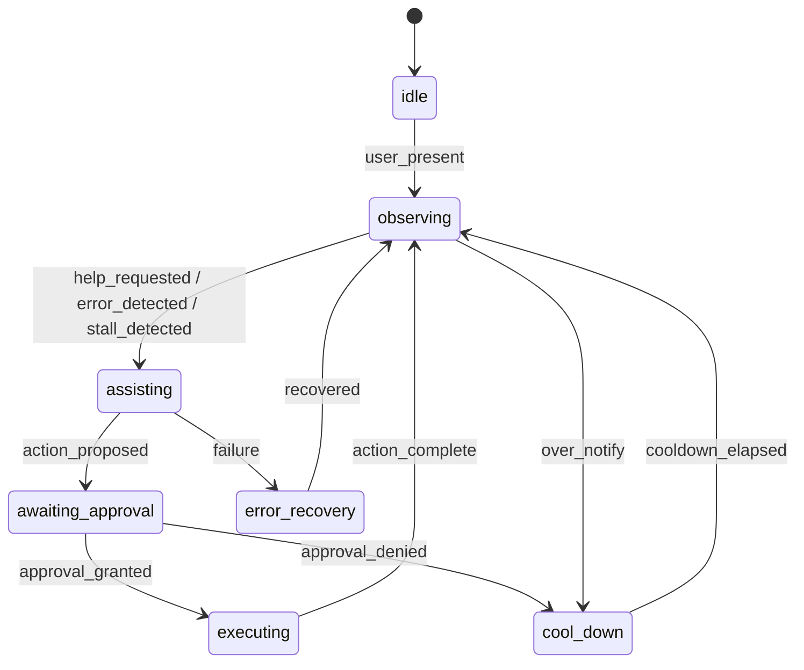
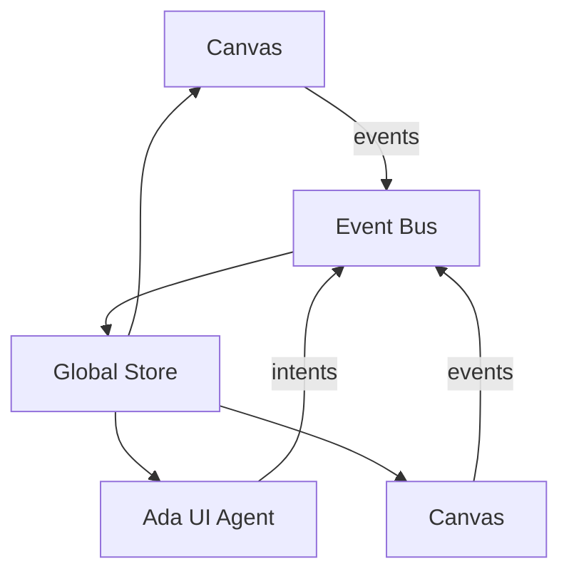

# Chrysalis Canvas Architecture

**Last Updated:** 2026-01-18  
**Implementation Status:** Foundation + Canvas Types Complete, Integration Pending

## Status and scope
- Canonical canvas types: **Settings, Agent, Scrapbook, Research, Wiki, Terminal-Browser**
- This document specifies the modular ReactFlow-based architecture, widget registries, virtualization, and Ada (system LLM) interaction model for all canvases.
- **Current:** Foundation complete with all 6 canvas types and 17 widgets implemented

## Goals
- Single, strongly typed base XYFlow React component with per-canvas widget whitelists enforced via registry.
- Horizontal + vertical infinite scroll with virtualization and resource-aware rendering.
- Secure, capability-scoped canvases for Terminal-Browser and Settings.
- Embedded Ada assistant as host of the UI "house," guiding guests with low cognitive overhead and strict guardrails.

## Architectural principles
- **Least privilege:** Per-canvas widget whitelists; deny by default.
- **Deterministic surfaces:** Typed schemas for nodes, edges, widgets; schema validation at boundaries.
- **Resource awareness:** Viewport culling, tile-based async loading, LRU eviction, and backpressure.
- **Separation of concerns:** BaseCanvas handles canvas mechanics; widget libraries are isolated; Ada consumes state/events but does not bypass guards.
- **Security-first:** Sandbox iframes, WS origin checks, no `eval`, secret redaction, CSP guidance.

## BaseCanvas (React Flow) implementation

**Actual Implementation:** [`src/canvas/BaseCanvas.tsx`](../src/canvas/BaseCanvas.tsx)

- Generic BaseCanvas component using ReactFlow
- Uses standard React `useState` for nodes/edges (NOT ReactFlow hooks per ADR-001)
- Props implemented:
  - `canvasKind: CanvasKind`
  - `registry: WidgetRegistry` (creation/update guards)
  - `policy: CanvasPolicy` (node/edge limits, rate limiting, widget allowlist)
  - `dataSource?: CanvasDataSource` (tile-based loading interface)
  - `theme?: CanvasTheme`
  - `accessibility?: AccessibilityConfig`
  - `onEvent?: (event: CanvasEvent) => void`
  - `onReady?: (instance: ReactFlowInstance) => void`

- Behavior implemented:
  - Renders ReactFlow with policy-validated nodes/edges
  - RateLimiter class enforces action rate limits
  - Widget type allowlist enforcement
  - Event emission system (canvas:loaded, node:created, edge:created, policy:violated, rate:limit:exceeded)
  - Selection tracking
  - Accessibility: ARIA labels, keyboard nav placeholders, reduced motion support
  - ReactFlowProvider wrapper (BaseCanvasWithProvider)

### Widget registry
- Per-canvas registry maps `WidgetType` → { renderer, schema, capability requirements }.
- Guards on create/update/import; schema validation; deny on missing capability/flag.
- Isolation: widget libraries live in separate modules per canvas to prevent cross-contamination.

### Data model (simplified)
```typescript
type CanvasKind = 'settings' | 'agent' | 'scrapbook' | 'research' | 'wiki' | 'terminal-browser';
type WidgetType = string; // constrained per-canvas by registry

interface WidgetNodeData<WidgetType, Extra = unknown> {
  widgetType: WidgetType;
  title?: string;
  meta?: Record<string, any>;
  payload?: Extra;
}

interface CanvasPolicy {
  allowlist: WidgetType[];
  denylist?: WidgetType[];
  maxNodes?: number;
  maxEdges?: number;
}
```

## Canvas implementations

**All 6 canvas types implemented in [`src/canvas/canvases/`](../src/canvas/canvases/):**

### Settings Canvas - [`SettingsCanvas.tsx`](../src/canvas/canvases/SettingsCanvas.tsx)
**Widgets:** ConfigWidget, ConnectionWidget
**Purpose:** System configuration interface  
**Status:** Basic structure complete, needs integration with backend storage

### Agent Canvas - [`AgentCanvas.tsx`](../src/canvas/canvases/AgentCanvas.tsx)
**Widgets:** AgentCardWidget, TeamGroupWidget
**Purpose:** Agent orchestration interface (human-in-the-loop for agent control)
**Status:** Basic structure complete, needs Hypercard pattern (on/off toggle, expandable chat, PersonaJSON editor, memory stack display)

### Scrapbook Canvas - [`ScrapbookCanvas.tsx`](../src/canvas/canvases/ScrapbookCanvas.tsx)
**Widgets:** NoteWidget, LinkWidget, ArtifactWidget
**Purpose:** Exploratory knowledge gathering interface
**Status:** Basic structure complete, needs drag-drop integration and design token migration

### Research Canvas - [`ResearchCanvas.tsx`](../src/canvas/canvases/ResearchCanvas.tsx)
**Widgets:** SourceWidget, CitationWidget, SynthesisWidget, HypothesisWidget
**Purpose:** Structured research interface with domain frameworks
**Status:** Basic structure complete, needs synthesis workflows and citation management

### Wiki Canvas - [`WikiCanvas.tsx`](../src/canvas/canvases/WikiCanvas.tsx)
**Widgets:** WikiPageWidget, WikiSectionWidget, WikiLinkWidget
**Purpose:** Knowledge base interface
**Status:** Basic structure complete, needs MediaWiki backend integration

### Terminal-Browser Canvas - [`TerminalBrowserCanvas.tsx`](../src/canvas/canvases/TerminalBrowserCanvas.tsx)
**Widgets:** TerminalSessionWidget, BrowserTabWidget, CodeEditorWidget
**Purpose:** Collaborative development workspace (study group model)
**Status:** Basic structure complete, needs xterm.js integration, sandboxed iframes, real-time CRDT collaboration

## Virtualization and infinite scroll

**Planned (not yet fully implemented):**
- XYFlow `onlyRenderVisibleElements` enabled in BaseCanvas
- DataSource interface supports tile-based loading
- Custom viewport culling hook - pending
- Tile prefetch logic - pending
- LRU eviction - pending
- Offscreen widget pause/resume - pending

```mermaid
flowchart LR
  Viewport[Viewport observer] -->|pan/zoom| TileCalc[Tile index]
  TileCalc --> Prefetch[Prefetch neighbors]
  TileCalc --> Load[Load visible tiles]
  Load --> Store[Tile store (LRU)]
  Store --> Renderer[Render visible nodes/edges]
  Renderer --> Offscreen[Pause/teardown offscreen]
```

## Combined Terminal-Browser functionality
- Widgets: sandboxed iframe-based tabs; toolbar (URL bar, nav buttons, tabs) with allowlist validation.
- Security: iframe `sandbox="allow-same-origin allow-scripts"`; CSP guidance; URL allow/deny lists; schema-validated postMessage command bus (navigate/back/forward/reload/screenshot request); no inline scripts, no credentialed URLs.
- Interaction constraints: block mixed content; strip credentials; per-tab origin isolation; no direct DOM injection.

## Settings canvas (whitelist: KeyEditor, ApiEnvelope, FeatureFlag, BudgetControl, AuditLogView)
- Secrets: masked by default; no logging of secret values; copy gated; TTL for in-memory secrets; optional client-side encryption at rest (crypto.subtle with session/user key) if required; HTTPS only.
- Validation: schema validation for API envelopes; CSRF tokens on mutations; redaction in UI and logs.

## Ada: embedded UI assistant
- Role: host of the UI "house"; users are guests. Guides, never intrudes. Respects capability/approval gates.
- Presence: either chat pane and/or floating guide; reads context (active canvas, selection, viewport, recent events, focus, errors).
- Signals: mouse/focus changes, blocked widget attempts, errors, inactivity, validation failures, user help requests.
- Privacy: no secrets echoed; no PII logging; defers to settings policy.

### Ada state machine (high level)


### Ada behavioral rules
- Tone: concise, courteous, host-like; no unsolicited long replies; offer choices.
- Constraints: never auto-execute; always respect policy/whitelist; throttle prompts; a11y friendly (no motion spam).
- Escalation: short guidance → link to settings/help → fallback if LLM unavailable (plain text tips) → human handoff stub.

## Event handling and state management
- Global store (Zustand/Redux Toolkit) for frame/canvas selection, provider health, capability flags, Ada context.
- Event bus: canvas events (viewport, widget_add, widget_blocked, load_start/stop, error), Ada intents/responses; trace IDs per action; debounced updates.
- Logging: structured, redacted, no secrets/PII; client logs routed to configured sink (non-voyeur UI).



## Security and compliance
- No `eval`; sanitize URLs; CSP and sandbox for iframe widgets; WS origin checks; rate limits on terminal input.
- Secrets: redaction, masking, TTL, optional client crypto; never log secret values; HTTPS transport only.
- Dependency hygiene: lock versions; audit; forbid unsafe packages.

## Testing strategy
- Unit: registry guards, schema validation, policy enforcement, Ada state transitions, logging redaction.
- Integration: terminal-browser WS lifecycle and iframe command bus, settings secret handling, registry enforcement per canvas.
- Load/soak: virtualization under large node counts; PTY fan-out.
- Security: CSP/sandbox verification, URL allowlist tests, secret redaction, WS origin tests.
- Accessibility: keyboard nav, ARIA on controls, focus order.

## Research pointers (for future citation)
- XYFlow/React Flow virtualization patterns; xterm.js performance guidance; browser iframe sandbox + CSP best practices; UI secret-handling patterns; in-product LLM assistant UX and host/guest interaction models.

## Virtualization and infinite scroll

**Planned (not yet fully implemented):**
- XYFlow `onlyRenderVisibleElements` enabled in BaseCanvas
- DataSource interface supports tile-based loading
- Custom viewport culling hook - pending
- Tile prefetch logic - pending
- LRU eviction - pending
- Offscreen widget pause/resume - pending

```mermaid
flowchart LR
  Viewport[Viewport observer] -->|pan/zoom| TileCalc[Tile index]
  TileCalc --> Prefetch[Prefetch neighbors]
  TileCalc --> Load[Load visible tiles]
  Load --> Store[Tile store (LRU)]
  Store --> Renderer[Render visible nodes/edges]
  Renderer --> Offscreen[Pause/teardown offscreen]
```

## Validation Status

| Task | Description | Status | User Validated |
|------|-------------|--------|----------------|
| 1 | Define 6 canonical canvas types | ✅ Complete | ✅ |
| 2 | Remove obsolete implementations | ✅ Complete | ✅ |
| 3 | Update architecture documentation | 🔄 In Progress | ⏳ |
| 4 | BaseCanvas architecture design | ✅ Complete | ✅ |
| 5 | Widget registry system | ✅ Complete | ✅ |
| 6 | Canvas type implementations | ✅ Complete | ⏳ Needs integration testing |
| 7 | Widget implementations | ✅ Complete | ⏳ Needs design token migration |
| 8 | Integration testing | ⏳ Pending | ⏳ |
| 9 | Ada integration | ⏳ Pending | ⏳ |
| 10 | Real-time collaboration | ⏳ Pending | ⏳ |

## Mermaid legend
- Diagrams above may be embedded directly in implementation docs; keep them updated as the code evolves.