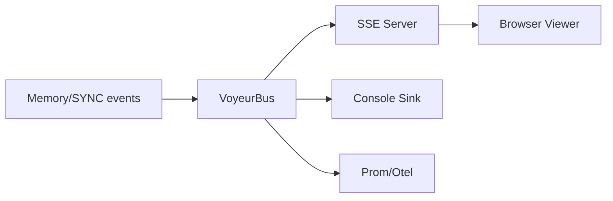

# Observability Guide (Voyeur + Metrics)

## Overview
- Voyeur: SSE-based event stream showing ingest/match/merge and sync events.
- Metrics: Optional Prometheus/OTel sinks for vector ops (latency/count).
- Privacy: Content redacted by default; sanitizer and rate limits guard ingest.

## Quick Start
1) Enable metrics (optional): `METRICS_PROMETHEUS=true METRICS_PROM_PORT=9464`  
2) Start metrics server: `node dist/cli/metrics-server.js` (after `npm run build`).  
3) Start voyeur SSE server in your app: `startVoyeurWebServer(bus, { port: 8787, redact: true })`.  
4) Open browser: `http://localhost:8787` to view live events (redacted).  
5) CLI tail: use `startVoyeurTail(bus)` or `ConsoleVoyeurSink` for terminal logs.

## Env Flags
- `METRICS_PROMETHEUS=true` (`METRICS_PROM_PORT` default 9464).  
- `METRICS_OTEL=true` to emit via @opentelemetry/api.  
- `VECTOR_INDEX_TYPE`, `VECTOR_COLLECTION`, `QDRANT_URL`, etc. (see VECTOR_INDEX_SETUP.md).  
- `ACTION_EMOJI_VARIANT` to pick emoji/text render variants.

## Privacy & Safety
- Default voyeur sink redacts details; set `redact: true` for SSE server.  
- MemoryMerger sanitizer blocks script/HTML/overlong/empty content; add custom sanitize for PII removal.  
- Rate limiting per source is supported via `rate_limit` config.  
- Log/metrics paths should avoid storing raw content; emit hashes/metadata only.

## Components
- `VoyeurBus`/`VoyeurSink`: event distribution.  
- `VoyeurWebServer`: SSE viewer (no extra deps).  
- `ConsoleVoyeurSink`: simple console output.  
- `Metrics` helpers: PrometheusMetricsSink, OtelMetricsSink, CombinedMetricsSink.

## Diagrams

