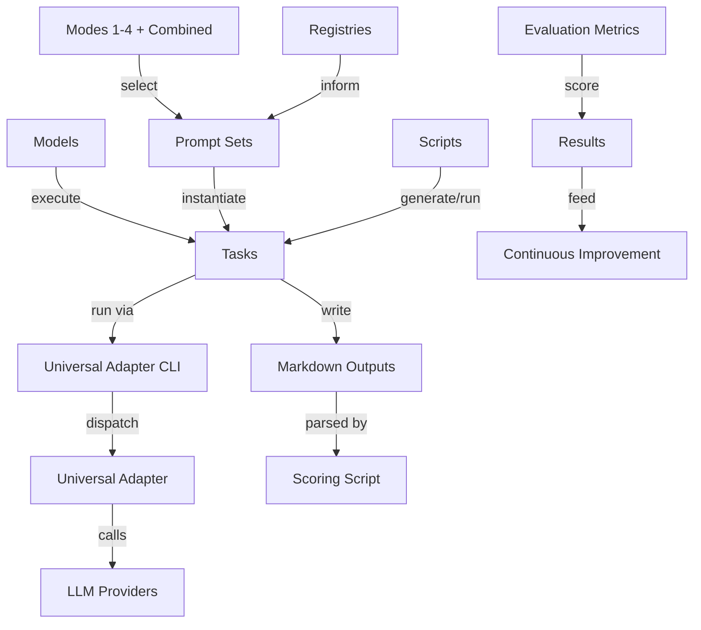
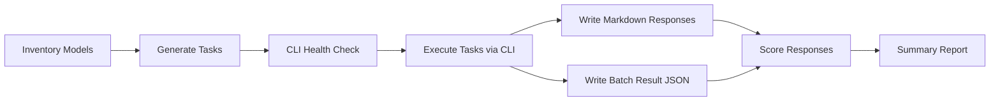

# Chrysalis Evaluation Suite (Kata Modes)

## Purpose
This evaluation suite scores small local LLMs on logical, semantic, procedural, and metacognitive performance, plus response time and functional accuracy. Each model acts as a coach/manager for a continuous improvement kata logic machine in four modes plus a combined mode.

## Domain Knowledge Graph
Entities and relations used to define the evaluation architecture:



### Architecture Derived from the Graph
- Prompt sets are the semantic contract between registries, modes, and tasks.
- Tasks are the executable unit that bind a model to a prompt with expected outputs.
- The Universal Adapter CLI is the orchestration boundary for evaluation runs.
- Outputs are first-class artifacts; scoring operates on responses + telemetry.

## Prompt Set
Prompts are stored in `eval/prompts/` and assembled by `prompt_manifest.json`.

- `eval/prompts/mode1_manager.md`: Mode 1 Manager
- `eval/prompts/mode2_process_analyst.md`: Mode 2 Process Analyst
- `eval/prompts/mode3_root_cause.md`: Mode 3 Deep Research/Root Cause Analyst
- `eval/prompts/mode4_complex_learner.md`: Mode 4 Complex Learner
- `eval/prompts/mode_combined.md`: Combined Modes 1-4

All prompts require strict JSON output for reproducibility. Concision limits and a compact Mermaid diagram field are enforced for Mode 4 and Combined.

## Evidence Basis
Prompts and scoring align with established delivery and quality frameworks. Proxy metrics are explicit in the prompt text to maintain transparency.

References:
- DORA metrics and research: https://dora.dev/
- Accelerate (DevOps Research): https://itrevolution.com/book/accelerate/
- SPACE framework: https://queue.acm.org/detail.cfm?id=3454124
- Five Whys (Lean/TPS): https://en.wikipedia.org/wiki/Five_whys
- GitHub collaboration standards: https://docs.github.com/
- OWASP SAMM v2: https://owaspsamm.org/
- ISO 9001 overview: https://www.iso.org/iso-9001-quality-management.html
- Google SRE Workbook: https://sre.google/workbook/

## Scoring Rubric
Rubric is defined in `eval/scoring/rubric.json` with a 0-5 scale for each category.

- Logic: internal consistency and correct reasoning steps.
- Semantics: correct domain language and registry usage.
- Process adherence: required steps + schema adherence.
- Metacognition: self-checks and risk awareness.
- Accuracy: numeric and classification correctness.
- Response time: latency thresholds mapped to scores.

## Evaluation Workflow (Dependency-Ordered)
1) Inventory available models (local and benchmark targets).
2) Generate task JSONs for each model using prompt manifest.
3) Run the CLI suite (health check first, then model batches).
4) Capture outputs (markdown responses + batch result JSONs).
5) Evaluate results (parse JSON, compute scores, summarize).

## Process Diagram


## Output Naming Convention
Each evaluate task writes a markdown response file under:

```
results/eval-suite/responses/<model-slug>/<prompt-id>.md
```

Example: `results/eval-suite/responses/qwen3-4b/mode1_manager.md`

Batch result JSONs are stored under:

```
results/eval-suite/runs/<task-file>.result.json
```

## Scripts
- `scripts/eval/generate_eval_tasks.py`: builds task JSONs from `ollama list` and benchmark config.
- `scripts/eval/run_eval_suite.sh`: health check, run all tasks, then score.
- `scripts/eval/resolve_api_keys.py`: injects API keys from env into tasks.
- `scripts/eval/score_eval_results.py`: computes scores and writes summaries.

## OpenRouter Model Discovery
OpenRouter model IDs should be validated against the `/models` endpoint before running benchmarks.

```
curl -s https://openrouter.ai/api/v1/models \
  -H "Authorization: Bearer $OPENROUTER_API_KEY"
```

## File Layout
- `eval/prompts/`: prompt texts
- `eval/prompts/prompt_manifest.json`: prompt metadata + expected values
- `eval/benchmarks/benchmarks.json`: benchmark model list (update endpoints as needed)
- `eval/tasks/local/`: generated per-model batch tasks (local)
- `eval/tasks/benchmarks/`: generated per-model batch tasks (benchmarks)
- `eval/tasks/health/health-check.json`: CLI health task
- `eval/scoring/rubric.json`: scoring rubric
- `results/eval-suite/`: outputs, run results, summaries
